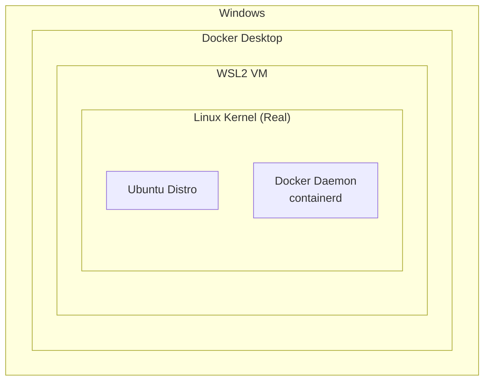

# How to Set Up Docker with WSL2 on Windows

Author: [nawazdhandala](https://github.com/nawazdhandala)

Tags: Docker, WSL2, Windows, Linux, DevOps

Description: Learn how to set up Docker with WSL2 on Windows for optimal performance, configure integration with Linux distributions, and troubleshoot common issues.

---

WSL2 (Windows Subsystem for Linux 2) provides a full Linux kernel on Windows, enabling Docker to run with near-native Linux performance. This guide covers setting up Docker with WSL2 for the best development experience.

## Architecture Overview



## Prerequisites

### Enable WSL2

```powershell
# Run PowerShell as Administrator

# Enable WSL
dism.exe /online /enable-feature /featurename:Microsoft-Windows-Subsystem-Linux /all /norestart

# Enable Virtual Machine Platform
dism.exe /online /enable-feature /featurename:VirtualMachinePlatform /all /norestart

# Restart Windows
Restart-Computer
```

### Set WSL2 as Default

```powershell
# After restart, set WSL2 as default
wsl --set-default-version 2

# Update WSL
wsl --update
```

### Install Linux Distribution

```powershell
# List available distributions
wsl --list --online

# Install Ubuntu
wsl --install -d Ubuntu

# Or from Microsoft Store
# Search for "Ubuntu" in Microsoft Store
```

## Installing Docker Desktop

### Download and Install

1. Download Docker Desktop from docker.com
2. Run installer
3. During installation, ensure "Use WSL 2 instead of Hyper-V" is selected

### Configure WSL2 Integration

```
Docker Desktop > Settings > Resources > WSL Integration

[x] Enable integration with my default WSL distro
[x] Ubuntu (enable for specific distros)
```

### Verify Installation

```bash
# In WSL2 terminal (Ubuntu)
docker version
docker run hello-world
```

## Performance Optimization

### Memory Configuration

Create or edit `%USERPROFILE%\.wslconfig`:

```ini
# .wslconfig
[wsl2]
memory=8GB
processors=4
swap=2GB
localhostForwarding=true

[experimental]
sparseVhd=true
autoMemoryReclaim=gradual
```

```powershell
# Apply changes
wsl --shutdown
# Then restart Docker Desktop
```

### Docker Desktop Settings

```
Settings > Resources > Advanced
- CPUs: 4 (adjust based on system)
- Memory: 8 GB
- Swap: 2 GB
- Disk image size: 64 GB
```

## File System Best Practices

### Store Projects in WSL2 Filesystem

```bash
# Good: Project in WSL2 filesystem (fast)
/home/user/projects/myapp

# Avoid: Project in Windows filesystem (slow)
/mnt/c/Users/user/projects/myapp
```

### Access Windows Files from WSL2

```bash
# Windows C: drive mounted at /mnt/c
ls /mnt/c/Users/username/Documents

# Copy files to WSL2 for better performance
cp -r /mnt/c/Users/user/project ~/projects/
```

### Access WSL2 Files from Windows

```
# In Windows Explorer
\\wsl$\Ubuntu\home\user\projects

# Or in VS Code
code \\wsl$\Ubuntu\home\user\projects
```

## Development Workflow

### VS Code Remote - WSL

```bash
# Install VS Code and "Remote - WSL" extension

# Open project from WSL2 terminal
cd ~/projects/myapp
code .

# This opens VS Code connected to WSL2
```

### Docker Compose in WSL2

```yaml
# ~/projects/myapp/docker-compose.yml
version: '3.8'

services:
  app:
    build: .
    volumes:
      # Use WSL2 paths (not Windows paths)
      - .:/app
    ports:
      - "3000:3000"

  db:
    image: postgres:15
    volumes:
      - pgdata:/var/lib/postgresql/data

volumes:
  pgdata:
```

```bash
# Run from WSL2 terminal
cd ~/projects/myapp
docker-compose up -d
```

### Git Configuration

```bash
# Configure Git in WSL2
git config --global user.name "Your Name"
git config --global user.email "your@email.com"

# Use Windows credential manager
git config --global credential.helper "/mnt/c/Program\ Files/Git/mingw64/bin/git-credential-manager.exe"
```

## Networking

### Access Containers from Windows

```bash
# Containers are accessible at localhost
# In WSL2
docker run -p 8080:80 nginx

# In Windows browser
http://localhost:8080
```

### Access Windows Services from Container

```yaml
services:
  app:
    extra_hosts:
      - "host.docker.internal:host-gateway"
    environment:
      - DATABASE_URL=postgresql://host.docker.internal:5432/db
```

### Port Forwarding

```bash
# WSL2 ports are automatically forwarded to Windows
# No additional configuration needed for localhost access
```

## GPU Support (CUDA)

### Enable NVIDIA GPU

```bash
# Install NVIDIA drivers on Windows (not in WSL2)

# In WSL2 Ubuntu, install NVIDIA Container Toolkit
distribution=$(. /etc/os-release;echo $ID$VERSION_ID)
curl -s -L https://nvidia.github.io/nvidia-docker/gpgkey | sudo apt-key add -
curl -s -L https://nvidia.github.io/nvidia-docker/$distribution/nvidia-docker.list | sudo tee /etc/apt/sources.list.d/nvidia-docker.list

sudo apt-get update
sudo apt-get install -y nvidia-docker2

# Test GPU access
docker run --rm --gpus all nvidia/cuda:12.0-base nvidia-smi
```

## Troubleshooting

### Docker Desktop Not Starting

```powershell
# Reset WSL2
wsl --shutdown
wsl --unregister docker-desktop
wsl --unregister docker-desktop-data

# Restart Docker Desktop
```

### Slow File Operations

```bash
# Move project to WSL2 filesystem
mv /mnt/c/Users/user/project ~/projects/

# Use named volumes for dependencies
docker run -v node_modules:/app/node_modules myapp
```

### Memory Issues

```ini
# .wslconfig
[wsl2]
memory=4GB  # Limit WSL2 memory

[experimental]
autoMemoryReclaim=dropcache
```

```powershell
# Apply and restart
wsl --shutdown
```

### Network Issues

```bash
# Reset networking
wsl --shutdown

# In PowerShell as Admin
netsh winsock reset
netsh int ip reset

# Restart computer
```

### Permission Issues

```bash
# Fix file permissions
sudo chown -R $USER:$USER ~/projects

# For Docker socket
sudo usermod -aG docker $USER
newgrp docker
```

## Alternative: Docker in WSL2 (Without Desktop)

### Install Docker Engine Directly

```bash
# In WSL2 Ubuntu

# Remove old versions
sudo apt-get remove docker docker-engine docker.io containerd runc

# Install dependencies
sudo apt-get update
sudo apt-get install ca-certificates curl gnupg

# Add Docker repository
sudo install -m 0755 -d /etc/apt/keyrings
curl -fsSL https://download.docker.com/linux/ubuntu/gpg | sudo gpg --dearmor -o /etc/apt/keyrings/docker.gpg
sudo chmod a+r /etc/apt/keyrings/docker.gpg

echo \
  "deb [arch=$(dpkg --print-architecture) signed-by=/etc/apt/keyrings/docker.gpg] https://download.docker.com/linux/ubuntu \
  $(. /etc/os-release && echo "$VERSION_CODENAME") stable" | \
  sudo tee /etc/apt/sources.list.d/docker.list > /dev/null

# Install Docker
sudo apt-get update
sudo apt-get install docker-ce docker-ce-cli containerd.io docker-buildx-plugin docker-compose-plugin

# Start Docker
sudo service docker start

# Add user to docker group
sudo usermod -aG docker $USER
newgrp docker
```

### Auto-Start Docker

```bash
# Add to ~/.bashrc or ~/.zshrc
if service docker status 2>&1 | grep -q "is not running"; then
    sudo service docker start
fi
```

## Complete Setup Script

```bash
#!/bin/bash
# setup-docker-wsl2.sh

# Update system
sudo apt-get update && sudo apt-get upgrade -y

# Install Docker
curl -fsSL https://get.docker.com -o get-docker.sh
sudo sh get-docker.sh

# Add user to docker group
sudo usermod -aG docker $USER

# Install Docker Compose
sudo apt-get install docker-compose-plugin -y

# Configure Git
git config --global core.autocrlf input
git config --global credential.helper "/mnt/c/Program\ Files/Git/mingw64/bin/git-credential-manager.exe"

# Create projects directory
mkdir -p ~/projects

echo "Setup complete. Please log out and back in for group changes to take effect."
```

## Summary

| Aspect | Recommendation |
|--------|---------------|
| File location | Store projects in WSL2 filesystem |
| Memory | 8GB for WSL2, configure in .wslconfig |
| Editor | VS Code with Remote - WSL extension |
| Docker | Docker Desktop or native Docker Engine |
| Networking | Use localhost for container access |
| Git | Configure credential helper for Windows |

WSL2 provides excellent Docker performance on Windows when properly configured. Keep projects in the WSL2 filesystem, use VS Code Remote - WSL, and configure memory limits to prevent resource exhaustion. For alternative Docker runtimes, see our post on [Docker Desktop Alternatives](https://oneuptime.com/blog/post/2026-01-16-docker-desktop-alternatives/view).

