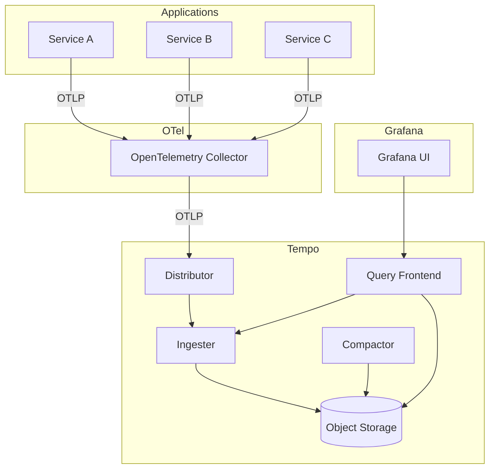

# How to Configure Tempo for Distributed Tracing in Grafana

Author: [nawazdhandala](https://www.github.com/nawazdhandala)

Tags: Grafana, Tempo, Distributed Tracing, OpenTelemetry, Observability, Jaeger, Zipkin

Description: Deploy Grafana Tempo for distributed tracing, configure trace ingestion from OpenTelemetry, and integrate with Grafana for full observability across metrics, logs, and traces.

---

Distributed tracing lets you follow a request through microservices. When something is slow or broken, traces show exactly where time is spent. Grafana Tempo provides scalable trace storage that integrates with the Grafana ecosystem. This guide covers deploying Tempo and instrumenting applications to send traces.

## Why Tempo?

Tempo offers several advantages over alternatives like Jaeger:

- **No indexing required**: Traces are stored by trace ID only
- **Cost-effective**: Uses object storage (S3, GCS, Azure Blob)
- **Native Grafana integration**: Links traces to metrics and logs
- **Protocol flexibility**: Accepts OTLP, Jaeger, Zipkin, and OpenCensus formats

## Tempo Architecture



## Deploying Tempo on Kubernetes

Use the Tempo Helm chart:

```bash
# Add Grafana Helm repo
helm repo add grafana https://grafana.github.io/helm-charts
helm repo update

# Create namespace
kubectl create namespace tracing

# Install Tempo
helm install tempo grafana/tempo \
  --namespace tracing
```

For production, use distributed mode with object storage:

```yaml
# tempo-values.yaml
tempo:
  storage:
    trace:
      backend: s3
      s3:
        bucket: company-tempo-traces
        endpoint: s3.us-east-1.amazonaws.com
        region: us-east-1
        access_key: ${AWS_ACCESS_KEY_ID}
        secret_key: ${AWS_SECRET_ACCESS_KEY}

  retention: 72h

  receivers:
    otlp:
      protocols:
        grpc:
          endpoint: 0.0.0.0:4317
        http:
          endpoint: 0.0.0.0:4318
    jaeger:
      protocols:
        thrift_http:
          endpoint: 0.0.0.0:14268
        grpc:
          endpoint: 0.0.0.0:14250
    zipkin:
      endpoint: 0.0.0.0:9411

  overrides:
    defaults:
      search:
        duration_slo: 5s
      ingestion:
        max_traces_per_user: 10000

gateway:
  enabled: true
  replicas: 2

distributor:
  replicas: 2
  config:
    log_received_spans:
      enabled: true

ingester:
  replicas: 3
  config:
    max_block_duration: 30m

querier:
  replicas: 2

queryFrontend:
  replicas: 2

compactor:
  replicas: 1
```

Install with custom values:

```bash
helm install tempo grafana/tempo-distributed \
  --namespace tracing \
  -f tempo-values.yaml
```

## Configuring Grafana Data Source

Add Tempo as a data source:

```yaml
# tempo-datasource.yaml
apiVersion: 1
datasources:
  - name: Tempo
    type: tempo
    access: proxy
    url: http://tempo-query-frontend.tracing.svc:3100
    uid: tempo
    jsonData:
      tracesToLogs:
        datasourceUid: loki
        tags: ['service.name', 'pod']
        mappedTags: [{ key: 'service.name', value: 'app' }]
        mapTagNamesEnabled: true
        spanStartTimeShift: '-1h'
        spanEndTimeShift: '1h'
        filterByTraceID: true
        filterBySpanID: false

      tracesToMetrics:
        datasourceUid: prometheus
        tags: [{ key: 'service.name', value: 'service' }]
        queries:
          - name: Request rate
            query: 'sum(rate(http_server_request_duration_seconds_count{$$__tags}[5m]))'
          - name: Error rate
            query: 'sum(rate(http_server_request_duration_seconds_count{$$__tags, status_code=~"5.."}[5m]))'

      serviceMap:
        datasourceUid: prometheus

      search:
        hide: false

      nodeGraph:
        enabled: true
```

## Instrumenting Applications

### Node.js with OpenTelemetry

```javascript
// tracing.js
const { NodeSDK } = require('@opentelemetry/sdk-node');
const { OTLPTraceExporter } = require('@opentelemetry/exporter-trace-otlp-grpc');
const { getNodeAutoInstrumentations } = require('@opentelemetry/auto-instrumentations-node');
const { Resource } = require('@opentelemetry/resources');
const { SemanticResourceAttributes } = require('@opentelemetry/semantic-conventions');

// Configure the exporter to send traces to Tempo
const traceExporter = new OTLPTraceExporter({
  url: process.env.OTEL_EXPORTER_OTLP_ENDPOINT || 'http://tempo:4317',
});

// Configure the SDK
const sdk = new NodeSDK({
  resource: new Resource({
    [SemanticResourceAttributes.SERVICE_NAME]: process.env.SERVICE_NAME || 'my-service',
    [SemanticResourceAttributes.SERVICE_VERSION]: process.env.SERVICE_VERSION || '1.0.0',
    [SemanticResourceAttributes.DEPLOYMENT_ENVIRONMENT]: process.env.ENVIRONMENT || 'production',
  }),
  traceExporter,
  instrumentations: [getNodeAutoInstrumentations()],
});

// Start the SDK before the application
sdk.start();

// Graceful shutdown
process.on('SIGTERM', () => {
  sdk.shutdown()
    .then(() => console.log('Tracing terminated'))
    .catch((error) => console.error('Error terminating tracing', error))
    .finally(() => process.exit(0));
});

module.exports = sdk;
```

```javascript
// app.js - require tracing first
require('./tracing');

const express = require('express');
const app = express();

app.get('/api/users', async (req, res) => {
  // Traces are captured automatically
  const users = await fetchUsers();
  res.json(users);
});

app.listen(3000);
```

### Python with OpenTelemetry

```python
# tracing.py
from opentelemetry import trace
from opentelemetry.sdk.trace import TracerProvider
from opentelemetry.sdk.trace.export import BatchSpanProcessor
from opentelemetry.exporter.otlp.proto.grpc.trace_exporter import OTLPSpanExporter
from opentelemetry.sdk.resources import Resource, SERVICE_NAME
from opentelemetry.instrumentation.flask import FlaskInstrumentor
from opentelemetry.instrumentation.requests import RequestsInstrumentor
import os

def configure_tracing(app):
    # Configure resource with service name
    resource = Resource(attributes={
        SERVICE_NAME: os.getenv("SERVICE_NAME", "python-service")
    })

    # Create tracer provider
    provider = TracerProvider(resource=resource)

    # Configure exporter to send traces to Tempo
    exporter = OTLPSpanExporter(
        endpoint=os.getenv("OTEL_EXPORTER_OTLP_ENDPOINT", "http://tempo:4317"),
        insecure=True
    )

    # Add span processor
    provider.add_span_processor(BatchSpanProcessor(exporter))

    # Set as global provider
    trace.set_tracer_provider(provider)

    # Auto-instrument Flask
    FlaskInstrumentor().instrument_app(app)

    # Auto-instrument outgoing requests
    RequestsInstrumentor().instrument()

    return provider
```

```python
# app.py
from flask import Flask, jsonify
from tracing import configure_tracing

app = Flask(__name__)
configure_tracing(app)

@app.route('/api/data')
def get_data():
    # Traces captured automatically
    return jsonify({"status": "ok"})

if __name__ == '__main__':
    app.run(port=5000)
```

### Go with OpenTelemetry

```go
// tracing.go
package main

import (
    "context"
    "os"

    "go.opentelemetry.io/otel"
    "go.opentelemetry.io/otel/exporters/otlp/otlptrace/otlptracegrpc"
    "go.opentelemetry.io/otel/sdk/resource"
    sdktrace "go.opentelemetry.io/otel/sdk/trace"
    semconv "go.opentelemetry.io/otel/semconv/v1.17.0"
)

func initTracer() (*sdktrace.TracerProvider, error) {
    ctx := context.Background()

    // Configure exporter
    endpoint := os.Getenv("OTEL_EXPORTER_OTLP_ENDPOINT")
    if endpoint == "" {
        endpoint = "tempo:4317"
    }

    exporter, err := otlptracegrpc.New(ctx,
        otlptracegrpc.WithEndpoint(endpoint),
        otlptracegrpc.WithInsecure(),
    )
    if err != nil {
        return nil, err
    }

    // Configure resource
    res, err := resource.New(ctx,
        resource.WithAttributes(
            semconv.ServiceName(os.Getenv("SERVICE_NAME")),
            semconv.ServiceVersion("1.0.0"),
        ),
    )
    if err != nil {
        return nil, err
    }

    // Create tracer provider
    tp := sdktrace.NewTracerProvider(
        sdktrace.WithBatcher(exporter),
        sdktrace.WithResource(res),
        sdktrace.WithSampler(sdktrace.AlwaysSample()),
    )

    otel.SetTracerProvider(tp)

    return tp, nil
}
```

## OpenTelemetry Collector Configuration

Deploy the collector to receive and forward traces:

```yaml
# otel-collector-config.yaml
receivers:
  otlp:
    protocols:
      grpc:
        endpoint: 0.0.0.0:4317
      http:
        endpoint: 0.0.0.0:4318

processors:
  batch:
    timeout: 5s
    send_batch_size: 1000

  memory_limiter:
    check_interval: 1s
    limit_mib: 2000
    spike_limit_mib: 400

  # Add resource attributes
  resource:
    attributes:
      - key: cluster
        value: production
        action: upsert

exporters:
  otlp:
    endpoint: tempo-distributor.tracing.svc:4317
    tls:
      insecure: true

service:
  pipelines:
    traces:
      receivers: [otlp]
      processors: [memory_limiter, batch, resource]
      exporters: [otlp]
```

## Searching and Viewing Traces

### Finding Traces by Service

In Grafana Explore, select the Tempo data source:

1. Select **Search** query type
2. Set filters:
   - Service Name: `api-gateway`
   - Status: `error`
   - Min Duration: `500ms`
3. Click **Run query**

### TraceQL Queries

TraceQL enables expressive trace searches:

```traceql
// Find slow database spans
{ span.db.system = "postgresql" && duration > 100ms }

// Find errors in specific service
{ resource.service.name = "payment-service" && status = error }

// Find traces with specific attribute
{ span.http.route = "/api/checkout" }

// Complex query with multiple conditions
{ span.http.status_code >= 500 } && { span.http.method = "POST" }
```

### Trace to Logs Workflow

With trace-to-logs configured:
1. Open a trace
2. Click on a span
3. Click "Logs for this span"
4. View correlated logs in Loki

## Building Trace Dashboards

### Trace Volume Panel

```promql
# Trace count by service
sum by (service_name) (
  rate(tempo_distributor_spans_received_total[5m])
)
```

### Error Rate from Traces

```promql
# Error rate by service (requires metrics generator)
sum by (service) (
  rate(traces_spanmetrics_calls_total{status_code="STATUS_CODE_ERROR"}[5m])
)
/
sum by (service) (
  rate(traces_spanmetrics_calls_total[5m])
)
```

### Service Map

Enable the service map in Grafana:

1. Create a new panel
2. Select visualization: Node Graph
3. Data source: Tempo
4. Query type: Service Map

The service map shows dependencies between services discovered from traces.

## Sampling Strategies

Control trace volume with sampling:

```yaml
# Head-based sampling (at application)
processors:
  probabilistic_sampler:
    sampling_percentage: 10

# Tail-based sampling (at collector)
processors:
  tail_sampling:
    decision_wait: 10s
    policies:
      # Always sample errors
      - name: errors
        type: status_code
        status_code:
          status_codes: [ERROR]
      # Sample slow requests
      - name: slow-requests
        type: latency
        latency:
          threshold_ms: 500
      # Sample 10% of everything else
      - name: probabilistic
        type: probabilistic
        probabilistic:
          sampling_percentage: 10
```

## Retention and Compaction

Configure trace retention:

```yaml
tempo:
  storage:
    trace:
      backend: s3
      block:
        max_block_duration: 1h
      wal:
        path: /var/tempo/wal
      pool:
        max_workers: 100

  compactor:
    compaction:
      block_retention: 72h
```

## Performance Tuning

### Ingester Configuration

```yaml
ingester:
  config:
    lifecycler:
      ring:
        replication_factor: 3
    max_block_duration: 30m
    max_block_bytes: 1073741824
    complete_block_timeout: 15m
```

### Query Performance

```yaml
querier:
  config:
    search:
      external_backend: true
      external_endpoints:
        - tempo-query-frontend.tracing.svc:3100

queryFrontend:
  config:
    search:
      concurrent_jobs: 1000
      max_duration: 168h
```

Tempo provides scalable, cost-effective distributed tracing that integrates seamlessly with Grafana. Start with single-node deployment for development, graduate to distributed mode for production, and leverage TraceQL for powerful trace analysis.
