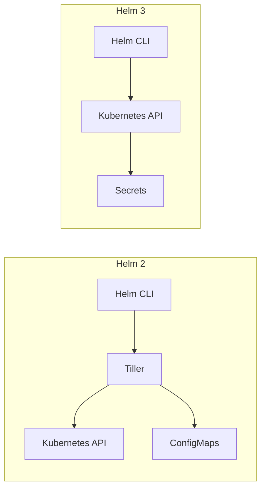
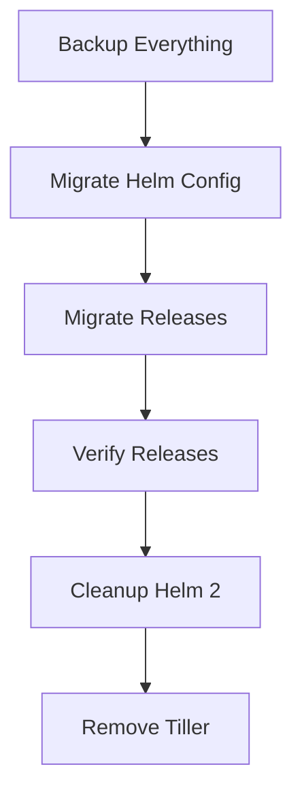

# Migrating from Helm 2 to Helm 3

Author: [nawazdhandala](https://www.github.com/nawazdhandala)

Tags: Helm, Kubernetes, DevOps, Migration, Upgrade

Description: Step-by-step guide to migrating your Helm 2 releases and workflows to Helm 3, including the official 2to3 plugin and handling Tiller removal.

> Helm 3 introduced significant changes including the removal of Tiller, improved security, and a simplified architecture. This guide walks you through migrating existing Helm 2 releases to Helm 3 safely and efficiently.

## Helm 2 vs Helm 3 Architecture



## Key Differences

| Feature | Helm 2 | Helm 3 |
|---------|--------|--------|
| Server Component | Tiller (in-cluster) | None |
| Release Storage | ConfigMaps | Secrets |
| Release Namespace | Tiller's namespace | Release's namespace |
| CRD Handling | crd-install hook | crds/ directory |
| Three-way Merge | No | Yes |
| Chart apiVersion | v1 | v2 |
| Requirements.yaml | Separate file | In Chart.yaml |

## Prerequisites

Before migrating, ensure:

```bash
# Check Helm 2 version
helm version --client

# Check Helm 3 is installed
helm3 version

# You may need both installed during migration
# Install Helm 3 alongside Helm 2
curl https://raw.githubusercontent.com/helm/helm/main/scripts/get-helm-3 | bash

# Rename to avoid conflicts
sudo mv /usr/local/bin/helm /usr/local/bin/helm3
```

## Install the 2to3 Plugin

```bash
# Install the migration plugin for Helm 3
helm3 plugin install https://github.com/helm/helm-2to3

# Verify installation
helm3 plugin list
```

## Migration Steps



### Step 1: Backup Everything

```bash
# Backup Helm 2 home directory
cp -r ~/.helm ~/.helm-backup

# Backup Tiller deployment
kubectl get deployment tiller-deploy -n kube-system -o yaml > tiller-backup.yaml

# List all Helm 2 releases
helm list --all-namespaces > helm2-releases.txt

# Export release values
for release in $(helm list -q); do
  helm get values $release > values-$release.yaml
done
```

### Step 2: Migrate Helm Configuration

Migrate your repositories, plugins, and configuration:

```bash
# Dry run first
helm3 2to3 move config --dry-run

# Migrate configuration
helm3 2to3 move config

# This migrates:
# - Repositories from ~/.helm/repository
# - Plugins from ~/.helm/plugins
# - Starters from ~/.helm/starters
```

Verify migration:

```bash
# Check repositories
helm3 repo list

# Update repositories
helm3 repo update
```

### Step 3: Migrate Releases

Migrate each release individually:

```bash
# List Helm 2 releases
helm list --all-namespaces

# Dry run migration for a release
helm3 2to3 convert my-release --dry-run

# Migrate the release
helm3 2to3 convert my-release

# Migrate with Tiller in different namespace
helm3 2to3 convert my-release --tiller-ns custom-tiller-ns

# Migrate release in specific namespace
helm3 2to3 convert my-release --release-versions-max 5
```

### Step 4: Migrate All Releases

Script to migrate all releases:

```bash
#!/bin/bash

# Get all Helm 2 releases
releases=$(helm list -q)

for release in $releases; do
  echo "Migrating $release..."
  
  # Dry run first
  helm3 2to3 convert $release --dry-run
  
  if [ $? -eq 0 ]; then
    # Actually migrate
    helm3 2to3 convert $release
    echo "✓ $release migrated"
  else
    echo "✗ Failed to migrate $release"
  fi
done
```

### Step 5: Verify Migrations

```bash
# List Helm 3 releases
helm3 list --all-namespaces

# Check release status
helm3 status my-release

# Verify release history
helm3 history my-release

# Test an upgrade
helm3 upgrade my-release my-chart --dry-run
```

### Step 6: Cleanup Helm 2 Data

After verifying migrations:

```bash
# Dry run cleanup
helm3 2to3 cleanup --dry-run

# Clean up Helm 2 configuration
helm3 2to3 cleanup

# This removes:
# - Helm 2 home folder
# - Helm 2 release data (ConfigMaps)
# - Tiller deployment
```

To clean up specific releases:

```bash
# Delete Helm 2 release data for a specific release
helm3 2to3 cleanup --name my-release --dry-run
helm3 2to3 cleanup --name my-release
```

### Step 7: Remove Tiller

If cleanup didn't remove Tiller:

```bash
# Delete Tiller deployment
kubectl delete deployment tiller-deploy -n kube-system

# Delete Tiller service
kubectl delete service tiller-deploy -n kube-system

# Delete Tiller service account
kubectl delete serviceaccount tiller -n kube-system

# Delete Tiller cluster role binding
kubectl delete clusterrolebinding tiller
```

## Updating Charts for Helm 3

### Update Chart.yaml

```yaml
# Helm 2 Chart.yaml
apiVersion: v1
name: mychart
version: 1.0.0

# Helm 3 Chart.yaml
apiVersion: v2
name: mychart
version: 1.0.0
type: application
```

### Move Dependencies to Chart.yaml

```yaml
# Old: requirements.yaml (Helm 2)
dependencies:
  - name: postgresql
    version: "10.x.x"
    repository: https://charts.bitnami.com/bitnami

# New: Chart.yaml (Helm 3)
apiVersion: v2
name: mychart
version: 1.0.0
dependencies:
  - name: postgresql
    version: "13.x.x"
    repository: https://charts.bitnami.com/bitnami
```

### Update CRD Handling

```yaml
# Helm 2: Used crd-install hook
apiVersion: apiextensions.k8s.io/v1
kind: CustomResourceDefinition
metadata:
  name: myresources.example.com
  annotations:
    "helm.sh/hook": crd-install
```

```yaml
# Helm 3: Move CRDs to crds/ directory
mychart/
├── Chart.yaml
├── crds/
│   └── myresource-crd.yaml    # CRDs here
├── templates/
│   └── deployment.yaml
└── values.yaml
```

### Update Template Functions

Some template functions changed:

```yaml
# Helm 2
{{ .Release.Time }}

# Helm 3 - .Release.Time removed
# Use current date if needed
{{ now | date "2006-01-02" }}

# Helm 2 - .Capabilities.KubeVersion.Major is int
{{ if ge .Capabilities.KubeVersion.Major 1 }}

# Helm 3 - .Capabilities.KubeVersion returns proper semver
{{ if semverCompare ">=1.20" .Capabilities.KubeVersion.Version }}
```

## Handling Common Migration Issues

### Issue: Release Already Exists

```bash
Error: release "my-release" already exists in Helm 3
```

**Solution:**
```bash
# Check if already migrated
helm3 list | grep my-release

# If duplicate, skip migration
# Or delete the Helm 3 release and re-migrate
helm3 uninstall my-release
helm3 2to3 convert my-release
```

### Issue: ConfigMap Not Found

```bash
Error: could not find tiller release "my-release"
```

**Solution:**
```bash
# Check ConfigMaps in Tiller namespace
kubectl get configmaps -n kube-system -l OWNER=TILLER

# Verify Tiller namespace
helm3 2to3 convert my-release --tiller-ns <tiller-namespace>
```

### Issue: Chart Version Mismatch

After migration, ensure charts are compatible:

```bash
# Check chart version
helm3 show chart my-repo/my-chart

# Update repository
helm3 repo update

# Upgrade with compatible version
helm3 upgrade my-release my-repo/my-chart --version <compatible-version>
```

## Release Storage Migration

Understand how release data is stored:

```bash
# Helm 2 stores releases as ConfigMaps
kubectl get configmaps -n kube-system -l OWNER=TILLER

# Helm 3 stores releases as Secrets
kubectl get secrets -l owner=helm

# View a Helm 3 release secret
kubectl get secret sh.helm.release.v1.my-release.v1 -o yaml
```

## Namespace-Scoped Releases

Helm 3 stores releases in the release namespace:

```bash
# Helm 2 - All releases in Tiller namespace
kubectl get configmaps -n kube-system -l OWNER=TILLER

# Helm 3 - Releases in their own namespace
kubectl get secrets -n my-namespace -l owner=helm

# Specify namespace when managing releases
helm3 list -n my-namespace
helm3 status my-release -n my-namespace
helm3 upgrade my-release ./mychart -n my-namespace
```

## CI/CD Pipeline Updates

Update your CI/CD pipelines for Helm 3:

### Before (Helm 2)

```yaml
# .gitlab-ci.yml - Helm 2
deploy:
  script:
    - helm init --client-only
    - helm upgrade --install my-release ./mychart --tiller-namespace kube-system
```

### After (Helm 3)

```yaml
# .gitlab-ci.yml - Helm 3
deploy:
  script:
    - helm repo add myrepo https://charts.example.com
    - helm repo update
    - helm upgrade --install my-release ./mychart -n my-namespace --create-namespace
```

### GitHub Actions (Helm 3)

```yaml
# .github/workflows/deploy.yml
jobs:
  deploy:
    runs-on: ubuntu-latest
    steps:
      - uses: actions/checkout@v4
      
      - name: Install Helm
        uses: azure/setup-helm@v3
        with:
          version: 'v3.13.0'
          
      - name: Deploy
        run: |
          helm upgrade --install my-release ./mychart \
            --namespace my-namespace \
            --create-namespace \
            --wait
```

## Migration Checklist

| Task | Status |
|------|--------|
| Backup Helm 2 config | ☐ |
| Install Helm 3 | ☐ |
| Install 2to3 plugin | ☐ |
| Migrate config | ☐ |
| Test migrate one release | ☐ |
| Migrate all releases | ☐ |
| Verify releases work | ☐ |
| Update charts for Helm 3 | ☐ |
| Update CI/CD pipelines | ☐ |
| Cleanup Helm 2 data | ☐ |
| Remove Tiller | ☐ |
| Remove Helm 2 binary | ☐ |

## Complete Migration Script

```bash
#!/bin/bash
set -e

# Migration script from Helm 2 to Helm 3

echo "=== Helm 2 to Helm 3 Migration ==="

# Step 1: Backup
echo "Step 1: Backing up..."
cp -r ~/.helm ~/.helm-backup-$(date +%Y%m%d)
helm list --all-namespaces > helm2-releases-backup.txt

# Step 2: Install 2to3 plugin
echo "Step 2: Installing 2to3 plugin..."
helm3 plugin install https://github.com/helm/helm-2to3 || true

# Step 3: Migrate config
echo "Step 3: Migrating config..."
helm3 2to3 move config --dry-run
read -p "Proceed with config migration? (y/n) " -n 1 -r
echo
if [[ $REPLY =~ ^[Yy]$ ]]; then
  helm3 2to3 move config
fi

# Step 4: Migrate releases
echo "Step 4: Migrating releases..."
releases=$(helm list -q)

for release in $releases; do
  echo "Processing $release..."
  helm3 2to3 convert $release --dry-run
  
  read -p "Migrate $release? (y/n) " -n 1 -r
  echo
  if [[ $REPLY =~ ^[Yy]$ ]]; then
    helm3 2to3 convert $release
    echo "✓ $release migrated"
  fi
done

# Step 5: Verify
echo "Step 5: Verifying..."
echo "Helm 3 releases:"
helm3 list --all-namespaces

# Step 6: Cleanup (optional)
read -p "Clean up Helm 2 data? (y/n) " -n 1 -r
echo
if [[ $REPLY =~ ^[Yy]$ ]]; then
  helm3 2to3 cleanup --dry-run
  read -p "Confirm cleanup? (y/n) " -n 1 -r
  echo
  if [[ $REPLY =~ ^[Yy]$ ]]; then
    helm3 2to3 cleanup
  fi
fi

echo "=== Migration Complete ==="
```

## Wrap-up

Migrating from Helm 2 to Helm 3 is straightforward with the 2to3 plugin. Always backup first, migrate config, then releases one by one. Verify each release works before cleaning up Helm 2 data. Update your charts to use apiVersion v2, move dependencies to Chart.yaml, and move CRDs to the crds/ directory. Don't forget to update CI/CD pipelines to remove Tiller references and use namespace-scoped commands.
