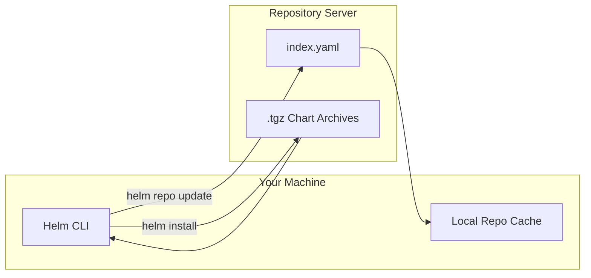

# How to Add and Manage Helm Repositories

Author: [nawazdhandala](https://www.github.com/nawazdhandala)

Tags: Helm, Kubernetes, DevOps, Charts, Repositories

Description: Learn how to add, update, search, and remove Helm repositories to discover and install charts from public and private sources.

> Helm repositories are the app stores of Kubernetes. Understanding how to manage them unlocks access to thousands of ready-to-deploy applications and keeps your charts current.

## What Are Helm Repositories?

A Helm repository is an HTTP server that hosts packaged charts and an index file (`index.yaml`) describing available versions. When you run `helm install`, Helm fetches the chart from a repository, processes your values, and applies the rendered manifests to your cluster.



## Adding Helm Repositories

### Add a Public Repository

Most charts live in public repositories. Here's how to add popular ones.

The `helm repo add` command registers a repository URL with a local name. You'll use this name in all subsequent commands to reference charts from that source.

```bash
# Add the official Bitnami repository (largest collection of production charts)
helm repo add bitnami https://charts.bitnami.com/bitnami

# Add the ingress-nginx repository for NGINX Ingress Controller
helm repo add ingress-nginx https://kubernetes.github.io/ingress-nginx

# Add the Prometheus community charts
helm repo add prometheus-community https://prometheus-community.github.io/helm-charts

# Add the Grafana charts repository
helm repo add grafana https://grafana.github.io/helm-charts

# Add cert-manager for TLS certificate automation
helm repo add jetstack https://charts.jetstack.io
```

### Add a Repository with Authentication

Private repositories often require credentials. Helm supports basic auth, token auth, and certificate-based authentication.

```bash
# Add a private repository with username/password authentication
helm repo add mycompany https://charts.mycompany.com \
  --username myuser \
  --password mypassword

# Add a repository with a bearer token (common for cloud registries)
helm repo add private-charts https://charts.example.com \
  --pass-credentials

# Add a repository with TLS client certificate authentication
helm repo add secure-charts https://charts.secure.example.com \
  --cert-file /path/to/client.crt \
  --key-file /path/to/client.key \
  --ca-file /path/to/ca.crt
```

### Add an OCI-Based Repository

Helm 3.8+ supports OCI registries (Docker Hub, GHCR, ECR, etc.) as chart repositories. OCI registries don't require `helm repo add`- you pull directly.

```bash
# Login to an OCI registry first
helm registry login ghcr.io -u USERNAME

# Pull a chart from an OCI registry (no repo add needed)
helm pull oci://ghcr.io/myorg/mychart --version 1.0.0

# Install directly from OCI
helm install myrelease oci://ghcr.io/myorg/mychart --version 1.0.0
```

## Updating Repository Indexes

Repositories publish new chart versions regularly. Update your local cache to see the latest.

```bash
# Update all repository indexes (run this before searching or installing)
helm repo update

# Expected output:
# Hang tight while we grab the latest from your chart repositories...
# ...Successfully got an update from the "bitnami" chart repository
# ...Successfully got an update from the "prometheus-community" chart repository
# Update Complete. ⎈Happy Helming!⎈
```

**Best Practice:** Run `helm repo update` before every install or upgrade to ensure you're seeing the latest versions.

## Searching Repositories

Find charts across all your configured repositories or within specific ones.

### Search All Repositories

This command searches the local cache of all added repositories. Run `helm repo update` first to ensure results are current.

```bash
# Search for PostgreSQL charts across all repositories
helm search repo postgresql

# Example output:
# NAME                              CHART VERSION   APP VERSION   DESCRIPTION
# bitnami/postgresql                13.2.0          16.1.0        PostgreSQL is an object-relational database...
# bitnami/postgresql-ha             12.1.0          16.1.0        PostgreSQL with High Availability...
```

### Search with Filters

Refine your search to find exactly what you need.

```bash
# Search for charts containing "nginx" (case-insensitive)
helm search repo nginx

# Show all versions of a specific chart (not just latest)
helm search repo bitnami/nginx --versions

# Search with a minimum version constraint
helm search repo bitnami/postgresql --version ">=12.0.0"

# Search including development/pre-release versions
helm search repo prometheus --devel
```

### Search the Artifact Hub

Artifact Hub indexes charts from hundreds of repositories. Search it to discover new sources.

```bash
# Search Artifact Hub for monitoring solutions (requires internet)
helm search hub monitoring

# The output includes charts from repositories you haven't added yet
```

## Listing Repositories

View all repositories configured on your system.

```bash
# List all configured repositories
helm repo list

# Example output:
# NAME                URL
# bitnami             https://charts.bitnami.com/bitnami
# ingress-nginx       https://kubernetes.github.io/ingress-nginx
# prometheus-community https://prometheus-community.github.io/helm-charts
```

## Removing Repositories

Remove repositories you no longer need to keep your configuration clean.

```bash
# Remove a repository by name
helm repo remove bitnami

# Verify it's gone
helm repo list
```

**Note:** Removing a repository doesn't uninstall releases deployed from its charts. Those continue running until you explicitly delete them.

## Managing Repository Credentials

### Update Credentials for Existing Repository

If credentials change, remove and re-add the repository.

```bash
# Remove the old entry
helm repo remove private-charts

# Add it back with new credentials
helm repo add private-charts https://charts.example.com \
  --username newuser \
  --password newpassword
```

### Store Credentials Securely

Avoid passing credentials on the command line in scripts. Use environment variables or config files.

```bash
# Using environment variables (credentials not visible in process list)
export HELM_REPO_USERNAME="myuser"
export HELM_REPO_PASSWORD="mypassword"

helm repo add private https://charts.example.com \
  --username "$HELM_REPO_USERNAME" \
  --password "$HELM_REPO_PASSWORD"
```

## Repository Best Practices

| Practice | Why |
| --- | --- |
| Run `helm repo update` before installs | Ensures you see latest chart versions |
| Use semantic versioning constraints | Prevents unexpected breaking changes |
| Add only repositories you trust | Charts run with cluster privileges |
| Prefer official repositories | Better maintained, faster security patches |
| Document repository sources | Team members can reproduce your setup |
| Regularly audit repository list | Remove unused repos, update URLs if moved |

## Common Repository Commands Reference

This table summarizes the most frequently used repository management commands for quick reference.

| Command | Description |
| --- | --- |
| `helm repo add NAME URL` | Add a new repository |
| `helm repo list` | List all repositories |
| `helm repo update` | Update local cache of all repos |
| `helm repo remove NAME` | Remove a repository |
| `helm search repo KEYWORD` | Search local cache |
| `helm search hub KEYWORD` | Search Artifact Hub |
| `helm search repo CHART --versions` | Show all versions |

## Troubleshooting Repository Issues

| Issue | Cause | Solution |
| --- | --- | --- |
| `Error: repo not found` | Repository not added or typo in name | Run `helm repo list` to verify |
| `looks like not a valid chart repository` | URL doesn't host valid index.yaml | Verify URL is correct, check network |
| `401 Unauthorized` | Invalid or missing credentials | Re-add repo with correct credentials |
| `no chart version found` | Version constraint too strict | Relax version constraint or update repo |
| Stale search results | Local cache outdated | Run `helm repo update` |

## Wrap-up

Helm repositories are your gateway to thousands of Kubernetes applications. Master `helm repo add`, `update`, and `search` to quickly find and install charts. Keep your repository list lean, update indexes before installing, and use version constraints to avoid surprises. With repositories properly configured, you're ready to deploy applications with confidence.
