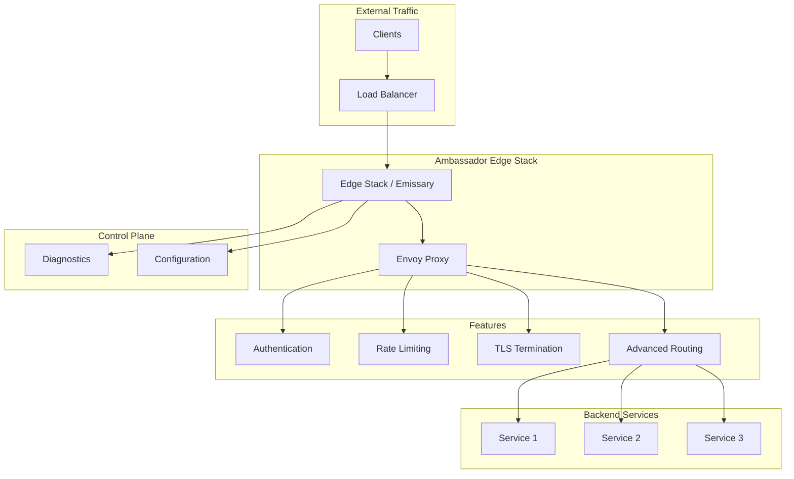

# Deploying Ambassador API Gateway with Helm

Author: [nawazdhandala](https://www.github.com/nawazdhandala)

Tags: Helm, Kubernetes, DevOps, Ambassador, Emissary, API Gateway, Edge Stack

Description: Complete guide to deploying Ambassador (Emissary-ingress) API Gateway on Kubernetes using Helm charts for edge routing, authentication, and traffic management.

> Ambassador, now known as Emissary-ingress, is a Kubernetes-native API gateway built on Envoy Proxy. This guide covers deploying Ambassador using Helm charts with production configurations for edge routing and API management.

## Ambassador Architecture



## Prerequisites

```bash
# Add Ambassador Helm repository
helm repo add datawire https://app.getambassador.io
helm repo update

# Search available versions
helm search repo datawire --versions

# Install Ambassador CLI (edgectl)
curl -fL https://metriton.datawire.io/downloads/linux/edgectl | sudo install /dev/stdin /usr/local/bin/edgectl
```

## Deploy Emissary-ingress (OSS)

### Basic Installation

```yaml
# emissary-values.yaml
replicaCount: 3

image:
  repository: docker.io/emissaryingress/emissary
  tag: 3.9.0

service:
  type: LoadBalancer
  annotations:
    service.beta.kubernetes.io/aws-load-balancer-type: nlb
    service.beta.kubernetes.io/aws-load-balancer-cross-zone-load-balancing-enabled: "true"

resources:
  requests:
    cpu: 200m
    memory: 256Mi
  limits:
    cpu: 1000m
    memory: 1Gi

# Enable CRDs
createDefaultListeners: true

# Admin service
adminService:
  create: true
  type: ClusterIP
  port: 8877

# Ambassador module configuration
env:
  AMBASSADOR_ID: default
  AES_LOG_LEVEL: info
```

```bash
# Install CRDs first
kubectl apply -f https://app.getambassador.io/yaml/emissary/3.9.0/emissary-crds.yaml

# Wait for CRDs
kubectl wait --timeout=90s --for=condition=available deployment emissary-apiext -n emissary-system

# Install Emissary
helm install emissary-ingress datawire/emissary-ingress \
  --namespace emissary \
  --create-namespace \
  -f emissary-values.yaml
```

## Deploy Ambassador Edge Stack (Enterprise)

### Edge Stack Installation

```yaml
# edge-stack-values.yaml
replicaCount: 3

image:
  repository: docker.io/datawire/aes
  tag: 3.9.0

licenseKey:
  value: ""  # Your license key
  # Or from secret
  # secretName: ambassador-license-key

service:
  type: LoadBalancer
  
  annotations:
    service.beta.kubernetes.io/aws-load-balancer-type: nlb
    
  ports:
    - name: http
      port: 80
      targetPort: 8080
    - name: https
      port: 443
      targetPort: 8443

# Redis for rate limiting
redis:
  create: true
  
# Authentication service
authService:
  create: true

resources:
  requests:
    cpu: 500m
    memory: 512Mi
  limits:
    cpu: 2000m
    memory: 2Gi

# High availability
affinity:
  podAntiAffinity:
    preferredDuringSchedulingIgnoredDuringExecution:
      - weight: 100
        podAffinityTerm:
          labelSelector:
            matchLabels:
              app.kubernetes.io/name: edge-stack
          topologyKey: kubernetes.io/hostname

autoscaling:
  enabled: true
  minReplicas: 3
  maxReplicas: 10
  targetCPUUtilizationPercentage: 70
```

```bash
helm install edge-stack datawire/edge-stack \
  --namespace ambassador \
  --create-namespace \
  -f edge-stack-values.yaml
```

## Configure Listeners

### HTTPS Listener

```yaml
# listener.yaml
apiVersion: getambassador.io/v3alpha1
kind: Listener
metadata:
  name: https-listener
  namespace: ambassador
spec:
  port: 8443
  protocol: HTTPS
  securityModel: XFP
  hostBinding:
    namespace:
      from: ALL

---
apiVersion: getambassador.io/v3alpha1
kind: Listener
metadata:
  name: http-listener
  namespace: ambassador
spec:
  port: 8080
  protocol: HTTP
  securityModel: XFP
  hostBinding:
    namespace:
      from: ALL
```

## Host Configuration

### Basic Host

```yaml
# host.yaml
apiVersion: getambassador.io/v3alpha1
kind: Host
metadata:
  name: api-host
  namespace: ambassador
spec:
  hostname: api.example.com
  
  # TLS configuration
  tlsSecret:
    name: api-tls-secret
    
  # Request policy
  requestPolicy:
    insecure:
      action: Redirect
      additionalPort: 8080
      
  # ACME (Let's Encrypt)
  acmeProvider:
    authority: https://acme-v02.api.letsencrypt.org/directory
    email: admin@example.com
    privateKeySecret:
      name: acme-private-key
```

### Multiple Hosts

```yaml
# multi-host.yaml
apiVersion: getambassador.io/v3alpha1
kind: Host
metadata:
  name: api-host
spec:
  hostname: api.example.com
  tlsSecret:
    name: api-tls

---
apiVersion: getambassador.io/v3alpha1
kind: Host
metadata:
  name: admin-host
spec:
  hostname: admin.example.com
  tlsSecret:
    name: admin-tls
  requestPolicy:
    insecure:
      action: Reject
```

## Mapping Resources

### Basic Mapping

```yaml
# mapping.yaml
apiVersion: getambassador.io/v3alpha1
kind: Mapping
metadata:
  name: users-mapping
  namespace: default
spec:
  hostname: api.example.com
  prefix: /users/
  service: users-service:80
  
  # Timeout configuration
  timeout_ms: 30000
  connect_timeout_ms: 3000
  
  # Retry configuration
  retry_policy:
    retry_on: "5xx"
    num_retries: 3
```

### Advanced Mapping

```yaml
# advanced-mapping.yaml
apiVersion: getambassador.io/v3alpha1
kind: Mapping
metadata:
  name: api-v2-mapping
spec:
  hostname: api.example.com
  prefix: /v2/
  service: api-v2:80
  
  # Rewrite prefix
  rewrite: /
  
  # Add headers
  add_request_headers:
    X-Gateway: "ambassador"
    X-Request-ID: "%REQ(X-REQUEST-ID)%"
    
  add_response_headers:
    X-Frame-Options: "DENY"
    X-Content-Type-Options: "nosniff"
    
  # Remove headers
  remove_request_headers:
    - X-Debug
    
  # CORS
  cors:
    origins:
      - https://example.com
      - https://*.example.com
    methods:
      - GET
      - POST
      - PUT
      - DELETE
      - OPTIONS
    headers:
      - Content-Type
      - Authorization
    credentials: true
    max_age: "86400"
```

### Regex Mapping

```yaml
# regex-mapping.yaml
apiVersion: getambassador.io/v3alpha1
kind: Mapping
metadata:
  name: user-by-id
spec:
  hostname: api.example.com
  prefix: /users/
  prefix_regex: true
  prefix_regex_rewrite: "/api/users/"
  regex_rewrite:
    pattern: "/users/([0-9]+)"
    substitution: "/api/v1/users/\\1"
  service: users-service:80
```

## Authentication

### External Auth Filter

```yaml
# auth-filter.yaml
apiVersion: getambassador.io/v3alpha1
kind: Filter
metadata:
  name: auth-filter
  namespace: ambassador
spec:
  External:
    auth_service: "auth-service.auth:3000"
    proto: http
    timeout_ms: 5000
    
    path_prefix: /auth
    
    allowed_request_headers:
      - Authorization
      - Cookie
      - X-API-Key
      
    allowed_authorization_headers:
      - X-User-ID
      - X-User-Roles
      
    include_body:
      max_bytes: 4096
      allow_partial: true

---
# Apply filter globally
apiVersion: getambassador.io/v3alpha1
kind: FilterPolicy
metadata:
  name: auth-policy
  namespace: ambassador
spec:
  rules:
    - host: api.example.com
      path: /api/*
      filters:
        - name: auth-filter
          namespace: ambassador
```

### JWT Filter (Edge Stack)

```yaml
# jwt-filter.yaml
apiVersion: getambassador.io/v3alpha1
kind: Filter
metadata:
  name: jwt-filter
spec:
  JWT:
    jwksURI: https://auth.example.com/.well-known/jwks.json
    validAlgorithms:
      - RS256
    audience: api.example.com
    issuer: https://auth.example.com/
    requireAudience: true
    requireIssuer: true
    injectRequestHeaders:
      - name: X-User-ID
        value: "{{ .token.Claims.sub }}"
      - name: X-User-Email
        value: "{{ .token.Claims.email }}"
```

### OAuth2 Filter (Edge Stack)

```yaml
# oauth2-filter.yaml
apiVersion: getambassador.io/v3alpha1
kind: Filter
metadata:
  name: oauth2-filter
spec:
  OAuth2:
    authorizationURL: https://auth.example.com/oauth2/authorize
    tokenURL: https://auth.example.com/oauth2/token
    clientID: ambassador-client
    clientSecret: ambassador-secret
    
    grantType: AuthorizationCode
    
    protectedOrigins:
      - origin: https://api.example.com
      
    extraAuthorizationParameters:
      scope: openid profile email
      
    allowMalformedAccessToken: false
    accessTokenValidation: auto
```

## Rate Limiting

### RateLimit Service

```yaml
# ratelimit.yaml
apiVersion: getambassador.io/v3alpha1
kind: RateLimitService
metadata:
  name: ratelimit
  namespace: ambassador
spec:
  service: "ratelimit.ambassador:8081"
  protocol_version: v3
  timeout_ms: 2000
  failure_mode_deny: false
```

### Rate Limit Configuration

```yaml
# rate-limit-mapping.yaml
apiVersion: getambassador.io/v3alpha1
kind: Mapping
metadata:
  name: api-mapping
spec:
  hostname: api.example.com
  prefix: /api/
  service: api-service:80
  
  labels:
    ambassador:
      - request_label_group:
          - generic_key:
              value: api-requests
          - remote_address:
              key: client_ip

---
# Rate limit labels
apiVersion: getambassador.io/v3alpha1
kind: RateLimit
metadata:
  name: api-rate-limit
spec:
  domain: ambassador
  limits:
    - pattern:
        - generic_key: "api-requests"
      rate: 100
      unit: minute
      
    - pattern:
        - generic_key: "api-requests"
        - remote_address: "*"
      rate: 10
      unit: second
```

## Circuit Breaking

```yaml
# circuit-breaker.yaml
apiVersion: getambassador.io/v3alpha1
kind: Mapping
metadata:
  name: api-with-circuit-breaker
spec:
  hostname: api.example.com
  prefix: /api/
  service: api-service:80
  
  circuit_breakers:
    - max_connections: 1024
      max_pending_requests: 1024
      max_requests: 1024
      max_retries: 3
```

## Traffic Shadowing (Mirroring)

```yaml
# traffic-shadow.yaml
apiVersion: getambassador.io/v3alpha1
kind: Mapping
metadata:
  name: production-api
spec:
  hostname: api.example.com
  prefix: /api/
  service: api-service-v1:80
  
  # Shadow traffic to v2
  shadow: true
  shadow_service: api-service-v2:80
```

## Canary Deployments

```yaml
# canary-mapping.yaml
apiVersion: getambassador.io/v3alpha1
kind: Mapping
metadata:
  name: api-stable
spec:
  hostname: api.example.com
  prefix: /api/
  service: api-service-v1:80
  weight: 90

---
apiVersion: getambassador.io/v3alpha1
kind: Mapping
metadata:
  name: api-canary
spec:
  hostname: api.example.com
  prefix: /api/
  service: api-service-v2:80
  weight: 10
```

### Header-Based Routing

```yaml
# header-routing.yaml
apiVersion: getambassador.io/v3alpha1
kind: Mapping
metadata:
  name: api-beta-users
spec:
  hostname: api.example.com
  prefix: /api/
  service: api-service-v2:80
  headers:
    X-Beta-User: "true"
  precedence: 1

---
apiVersion: getambassador.io/v3alpha1
kind: Mapping
metadata:
  name: api-default
spec:
  hostname: api.example.com
  prefix: /api/
  service: api-service-v1:80
  precedence: 0
```

## TLS Configuration

### TLSContext

```yaml
# tls-context.yaml
apiVersion: getambassador.io/v3alpha1
kind: TLSContext
metadata:
  name: tls-context
  namespace: ambassador
spec:
  hosts:
    - api.example.com
  secret: api-tls-secret
  
  min_tls_version: v1.2
  max_tls_version: v1.3
  
  cipher_suites:
    - ECDHE-ECDSA-AES128-GCM-SHA256
    - ECDHE-RSA-AES128-GCM-SHA256
    - ECDHE-ECDSA-AES256-GCM-SHA384
    - ECDHE-RSA-AES256-GCM-SHA384
    
  alpn_protocols: h2,http/1.1
```

### Mutual TLS

```yaml
# mtls-context.yaml
apiVersion: getambassador.io/v3alpha1
kind: TLSContext
metadata:
  name: mtls-context
spec:
  hosts:
    - secure-api.example.com
  secret: server-tls-secret
  
  # Require client certificates
  ca_secret: client-ca-secret
  cert_required: true
```

## Module Configuration

### Ambassador Module

```yaml
# ambassador-module.yaml
apiVersion: getambassador.io/v3alpha1
kind: Module
metadata:
  name: ambassador
  namespace: ambassador
spec:
  config:
    # Logging
    loglevel: info
    diagnostics:
      enabled: true
      
    # Timeouts
    cluster_idle_timeout_ms: 3600000
    
    # Routing
    use_remote_address: true
    xff_num_trusted_hops: 1
    
    # Headers
    server_name: ambassador
    
    # gRPC
    enable_grpc_http11_bridge: true
    
    # Statistics
    enable_ipv6: false
    
    # Load balancing
    load_balancer:
      policy: round_robin
```

## Monitoring

### ServiceMonitor

```yaml
# ambassador-servicemonitor.yaml
apiVersion: monitoring.coreos.com/v1
kind: ServiceMonitor
metadata:
  name: ambassador
  namespace: monitoring
spec:
  selector:
    matchLabels:
      app.kubernetes.io/name: ambassador
  namespaceSelector:
    matchNames:
      - ambassador
  endpoints:
    - port: admin
      path: /metrics
      interval: 30s
```

### Prometheus Alerts

```yaml
# ambassador-alerts.yaml
apiVersion: monitoring.coreos.com/v1
kind: PrometheusRule
metadata:
  name: ambassador-alerts
spec:
  groups:
    - name: ambassador
      rules:
        - alert: AmbassadorHighLatency
          expr: |
            histogram_quantile(0.99, 
              sum(rate(envoy_http_downstream_rq_time_bucket[5m])) by (le)
            ) > 5000
          for: 5m
          labels:
            severity: warning
          annotations:
            summary: "Ambassador high latency"
            
        - alert: AmbassadorHighErrorRate
          expr: |
            sum(rate(envoy_http_downstream_rq_xx{envoy_response_code_class="5"}[5m]))
            / sum(rate(envoy_http_downstream_rq_xx[5m])) > 0.05
          for: 5m
          labels:
            severity: critical
          annotations:
            summary: "Ambassador high error rate"
```

## Troubleshooting

```bash
# Check Ambassador pods
kubectl get pods -n ambassador

# Check Ambassador logs
kubectl logs -n ambassador -l app.kubernetes.io/name=ambassador

# Access diagnostics UI
kubectl port-forward -n ambassador svc/ambassador-admin 8877:8877
# Open http://localhost:8877/ambassador/v0/diag/

# Check mappings
kubectl get mappings -A

# Describe mapping
kubectl describe mapping <mapping-name>

# Check hosts
kubectl get hosts -A

# Validate configuration
edgectl config view

# Check Envoy config
kubectl exec -n ambassador deploy/ambassador -- envoy-config-dump

# Check endpoints
kubectl exec -n ambassador deploy/ambassador -- wget -qO- http://localhost:8001/clusters
```

## Wrap-up

Ambassador (Emissary-ingress) provides a Kubernetes-native API gateway built on Envoy Proxy with powerful routing, authentication, and traffic management capabilities. Use Mappings for flexible routing, Filters for authentication and rate limiting, and Hosts for multi-tenant configurations. Monitor your gateway with Prometheus metrics and leverage the diagnostics UI for debugging routing issues.
