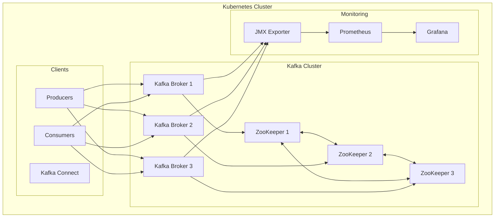

# How to Deploy Apache Kafka with Helm on Kubernetes

Author: [nawazdhandala](https://www.github.com/nawazdhandala)

Tags: Helm, Kubernetes, Kafka, Streaming, Event-Driven, DevOps, Messaging

Description: Complete guide to deploying Apache Kafka using Helm including Strimzi operator, Bitnami charts, high availability configuration, and monitoring setup.

> Apache Kafka provides distributed event streaming for real-time data pipelines. This guide covers deploying Kafka on Kubernetes using Helm charts from Strimzi and Bitnami with production configurations.

## Kafka Architecture on Kubernetes



## Installation Options

### Option 1: Strimzi Operator (Recommended)

```bash
# Add Strimzi repository
helm repo add strimzi https://strimzi.io/charts/
helm repo update

# Install Strimzi operator
helm install strimzi-cluster-operator strimzi/strimzi-kafka-operator \
  --namespace kafka \
  --create-namespace \
  --set watchAnyNamespace=true
```

### Option 2: Bitnami Chart

```bash
# Add Bitnami repository
helm repo add bitnami https://charts.bitnami.com/bitnami
helm repo update

# Install Kafka
helm install kafka bitnami/kafka \
  --namespace kafka \
  --create-namespace
```

## Strimzi Configuration

### Kafka Cluster CRD

```yaml
# kafka-cluster.yaml
apiVersion: kafka.strimzi.io/v1beta2
kind: Kafka
metadata:
  name: my-cluster
  namespace: kafka
spec:
  kafka:
    version: 3.6.0
    replicas: 3
    
    listeners:
      - name: plain
        port: 9092
        type: internal
        tls: false
      - name: tls
        port: 9093
        type: internal
        tls: true
      - name: external
        port: 9094
        type: loadbalancer
        tls: true
        authentication:
          type: tls
    
    config:
      offsets.topic.replication.factor: 3
      transaction.state.log.replication.factor: 3
      transaction.state.log.min.isr: 2
      default.replication.factor: 3
      min.insync.replicas: 2
      inter.broker.protocol.version: "3.6"
      log.retention.hours: 168
      log.retention.bytes: 10737418240
      num.partitions: 3
    
    storage:
      type: jbod
      volumes:
        - id: 0
          type: persistent-claim
          size: 100Gi
          deleteClaim: false
          class: fast-storage
    
    resources:
      requests:
        memory: 2Gi
        cpu: "500m"
      limits:
        memory: 4Gi
        cpu: "2"
    
    metricsConfig:
      type: jmxPrometheusExporter
      valueFrom:
        configMapKeyRef:
          name: kafka-metrics
          key: kafka-metrics-config.yml
    
    rack:
      topologyKey: topology.kubernetes.io/zone
    
    template:
      pod:
        affinity:
          podAntiAffinity:
            requiredDuringSchedulingIgnoredDuringExecution:
              - labelSelector:
                  matchLabels:
                    strimzi.io/cluster: my-cluster
                    strimzi.io/kind: Kafka
                topologyKey: kubernetes.io/hostname
  
  zookeeper:
    replicas: 3
    storage:
      type: persistent-claim
      size: 20Gi
      deleteClaim: false
      class: fast-storage
    resources:
      requests:
        memory: 512Mi
        cpu: "250m"
      limits:
        memory: 1Gi
        cpu: "500m"
    metricsConfig:
      type: jmxPrometheusExporter
      valueFrom:
        configMapKeyRef:
          name: kafka-metrics
          key: zookeeper-metrics-config.yml
  
  entityOperator:
    topicOperator:
      resources:
        requests:
          memory: 256Mi
          cpu: "100m"
        limits:
          memory: 512Mi
          cpu: "500m"
    userOperator:
      resources:
        requests:
          memory: 256Mi
          cpu: "100m"
        limits:
          memory: 512Mi
          cpu: "500m"
```

### Metrics Configuration

```yaml
# kafka-metrics-configmap.yaml
apiVersion: v1
kind: ConfigMap
metadata:
  name: kafka-metrics
  namespace: kafka
data:
  kafka-metrics-config.yml: |
    lowercaseOutputName: true
    rules:
      - pattern: kafka.server<type=(.+), name=(.+), clientId=(.+), topic=(.+), partition=(.*)><>Value
        name: kafka_server_$1_$2
        type: GAUGE
        labels:
          clientId: "$3"
          topic: "$4"
          partition: "$5"
      - pattern: kafka.server<type=(.+), name=(.+), clientId=(.+), brokerHost=(.+), brokerPort=(.+)><>Value
        name: kafka_server_$1_$2
        type: GAUGE
        labels:
          clientId: "$3"
          broker: "$4:$5"
      - pattern: kafka.server<type=(.+), name=(.+)><>Value
        name: kafka_server_$1_$2
        type: GAUGE
      - pattern: kafka.controller<type=(.+), name=(.+)><>Value
        name: kafka_controller_$1_$2
        type: GAUGE
        
  zookeeper-metrics-config.yml: |
    lowercaseOutputName: true
    rules:
      - pattern: "org.apache.ZooKeeperService<name0=(.+)><>(\\w+)"
        name: zookeeper_$2
        type: GAUGE
```

### Apply Kafka Cluster

```bash
# Apply metrics config first
kubectl apply -f kafka-metrics-configmap.yaml

# Create Kafka cluster
kubectl apply -f kafka-cluster.yaml

# Watch deployment
kubectl -n kafka get kafka -w
kubectl -n kafka get pods -w
```

## Bitnami Configuration

### Values File

```yaml
# kafka-bitnami-values.yaml

# Kafka configuration
replicaCount: 3

# ZooKeeper configuration (or use KRaft)
zookeeper:
  enabled: true
  replicaCount: 3
  persistence:
    enabled: true
    storageClass: fast-storage
    size: 20Gi

# Kraft mode (ZooKeeper-less) - Kafka 3.3+
kraft:
  enabled: false

# Persistence
persistence:
  enabled: true
  storageClass: fast-storage
  size: 100Gi

# Resources
resources:
  requests:
    cpu: 500m
    memory: 1Gi
  limits:
    cpu: 2
    memory: 4Gi

# Kafka configuration
config: |
  offsets.topic.replication.factor=3
  transaction.state.log.replication.factor=3
  transaction.state.log.min.isr=2
  default.replication.factor=3
  min.insync.replicas=2
  num.partitions=3
  log.retention.hours=168

# External access
externalAccess:
  enabled: true
  service:
    type: LoadBalancer
    ports:
      external: 9094
  autoDiscovery:
    enabled: true

# SASL authentication
auth:
  clientProtocol: sasl
  interBrokerProtocol: sasl
  sasl:
    mechanisms: scram-sha-512
    interBrokerMechanism: scram-sha-512

# Metrics
metrics:
  kafka:
    enabled: true
  jmx:
    enabled: true
  serviceMonitor:
    enabled: true
    namespace: monitoring
```

### Deploy with Bitnami

```bash
helm install kafka bitnami/kafka \
  -f kafka-bitnami-values.yaml \
  --namespace kafka \
  --create-namespace
```

## Topic Management

### Strimzi KafkaTopic

```yaml
# kafka-topics.yaml
apiVersion: kafka.strimzi.io/v1beta2
kind: KafkaTopic
metadata:
  name: orders
  namespace: kafka
  labels:
    strimzi.io/cluster: my-cluster
spec:
  partitions: 10
  replicas: 3
  config:
    retention.ms: 604800000
    segment.bytes: 1073741824
    cleanup.policy: delete
---
apiVersion: kafka.strimzi.io/v1beta2
kind: KafkaTopic
metadata:
  name: events
  namespace: kafka
  labels:
    strimzi.io/cluster: my-cluster
spec:
  partitions: 20
  replicas: 3
  config:
    retention.ms: 259200000
    compression.type: lz4
    cleanup.policy: compact,delete
```

### Create Topic via CLI

```bash
# Get into Kafka pod
kubectl -n kafka exec -it my-cluster-kafka-0 -- /bin/bash

# Create topic
kafka-topics.sh --bootstrap-server localhost:9092 \
  --create --topic my-topic \
  --partitions 10 \
  --replication-factor 3

# List topics
kafka-topics.sh --bootstrap-server localhost:9092 --list

# Describe topic
kafka-topics.sh --bootstrap-server localhost:9092 \
  --describe --topic my-topic
```

## User Management

### Strimzi KafkaUser

```yaml
# kafka-user.yaml
apiVersion: kafka.strimzi.io/v1beta2
kind: KafkaUser
metadata:
  name: app-producer
  namespace: kafka
  labels:
    strimzi.io/cluster: my-cluster
spec:
  authentication:
    type: tls
  authorization:
    type: simple
    acls:
      - resource:
          type: topic
          name: orders
          patternType: literal
        operations:
          - Write
          - Create
          - Describe
      - resource:
          type: group
          name: app-producer-group
          patternType: literal
        operations:
          - Read
---
apiVersion: kafka.strimzi.io/v1beta2
kind: KafkaUser
metadata:
  name: app-consumer
  namespace: kafka
  labels:
    strimzi.io/cluster: my-cluster
spec:
  authentication:
    type: tls
  authorization:
    type: simple
    acls:
      - resource:
          type: topic
          name: orders
          patternType: literal
        operations:
          - Read
          - Describe
      - resource:
          type: group
          name: app-consumer-group
          patternType: literal
        operations:
          - Read
```

## Client Configuration

### Producer Application

```yaml
# producer-deployment.yaml
apiVersion: apps/v1
kind: Deployment
metadata:
  name: kafka-producer
  namespace: default
spec:
  replicas: 1
  selector:
    matchLabels:
      app: kafka-producer
  template:
    metadata:
      labels:
        app: kafka-producer
    spec:
      containers:
        - name: producer
          image: myapp:producer
          env:
            - name: KAFKA_BOOTSTRAP_SERVERS
              value: "my-cluster-kafka-bootstrap.kafka.svc.cluster.local:9093"
            - name: KAFKA_SECURITY_PROTOCOL
              value: "SSL"
            - name: KAFKA_SSL_TRUSTSTORE_LOCATION
              value: "/certs/ca.crt"
            - name: KAFKA_SSL_KEYSTORE_LOCATION
              value: "/certs/user.p12"
            - name: KAFKA_SSL_KEYSTORE_PASSWORD
              valueFrom:
                secretKeyRef:
                  name: app-producer
                  key: user.password
          volumeMounts:
            - name: kafka-certs
              mountPath: /certs
              readOnly: true
      volumes:
        - name: kafka-certs
          secret:
            secretName: app-producer
```

### Consumer Application

```yaml
# consumer-deployment.yaml
apiVersion: apps/v1
kind: Deployment
metadata:
  name: kafka-consumer
  namespace: default
spec:
  replicas: 3
  selector:
    matchLabels:
      app: kafka-consumer
  template:
    metadata:
      labels:
        app: kafka-consumer
    spec:
      containers:
        - name: consumer
          image: myapp:consumer
          env:
            - name: KAFKA_BOOTSTRAP_SERVERS
              value: "my-cluster-kafka-bootstrap.kafka.svc.cluster.local:9093"
            - name: KAFKA_GROUP_ID
              value: "app-consumer-group"
            - name: KAFKA_SECURITY_PROTOCOL
              value: "SSL"
          volumeMounts:
            - name: kafka-certs
              mountPath: /certs
              readOnly: true
      volumes:
        - name: kafka-certs
          secret:
            secretName: app-consumer
```

## Kafka Connect

### KafkaConnect Cluster

```yaml
# kafka-connect.yaml
apiVersion: kafka.strimzi.io/v1beta2
kind: KafkaConnect
metadata:
  name: my-connect
  namespace: kafka
  annotations:
    strimzi.io/use-connector-resources: "true"
spec:
  version: 3.6.0
  replicas: 3
  bootstrapServers: my-cluster-kafka-bootstrap:9093
  tls:
    trustedCertificates:
      - secretName: my-cluster-cluster-ca-cert
        certificate: ca.crt
  config:
    group.id: connect-cluster
    offset.storage.topic: connect-offsets
    config.storage.topic: connect-configs
    status.storage.topic: connect-status
    config.storage.replication.factor: 3
    offset.storage.replication.factor: 3
    status.storage.replication.factor: 3
  build:
    output:
      type: docker
      image: registry.example.com/kafka-connect:latest
      pushSecret: registry-credentials
    plugins:
      - name: debezium-postgres
        artifacts:
          - type: tgz
            url: https://repo1.maven.org/maven2/io/debezium/debezium-connector-postgres/2.4.0.Final/debezium-connector-postgres-2.4.0.Final-plugin.tar.gz
      - name: jdbc-sink
        artifacts:
          - type: jar
            url: https://packages.confluent.io/maven/io/confluent/kafka-connect-jdbc/10.7.4/kafka-connect-jdbc-10.7.4.jar
```

### Connector Configuration

```yaml
# kafka-connector.yaml
apiVersion: kafka.strimzi.io/v1beta2
kind: KafkaConnector
metadata:
  name: postgres-source
  namespace: kafka
  labels:
    strimzi.io/cluster: my-connect
spec:
  class: io.debezium.connector.postgresql.PostgresConnector
  tasksMax: 1
  config:
    database.hostname: postgres.database.svc.cluster.local
    database.port: "5432"
    database.user: "${file:/opt/kafka/external-configuration/postgres-credentials/username}"
    database.password: "${file:/opt/kafka/external-configuration/postgres-credentials/password}"
    database.dbname: mydb
    topic.prefix: cdc
    table.include.list: public.orders,public.customers
    plugin.name: pgoutput
```

## Monitoring

### ServiceMonitor

```yaml
# kafka-servicemonitor.yaml
apiVersion: monitoring.coreos.com/v1
kind: ServiceMonitor
metadata:
  name: kafka
  namespace: monitoring
spec:
  selector:
    matchLabels:
      strimzi.io/cluster: my-cluster
      strimzi.io/kind: Kafka
  namespaceSelector:
    matchNames:
      - kafka
  endpoints:
    - port: tcp-prometheus
      interval: 30s
```

### Key Metrics

```promql
# Messages per second
sum(rate(kafka_server_brokertopicmetrics_messagesin_total[5m])) by (topic)

# Bytes in/out per second
sum(rate(kafka_server_brokertopicmetrics_bytesin_total[5m]))

# Under-replicated partitions
kafka_server_replicamanager_underreplicatedpartitions

# Consumer lag
kafka_consumergroup_lag

# Active controller count (should be 1)
kafka_controller_kafkacontroller_activecontrollercount
```

## Troubleshooting

```bash
# Check Kafka pods
kubectl -n kafka get pods -l strimzi.io/cluster=my-cluster

# View Kafka logs
kubectl -n kafka logs my-cluster-kafka-0 -f

# Check topic status
kubectl -n kafka get kafkatopics

# Check user status
kubectl -n kafka get kafkausers

# Test connectivity
kubectl -n kafka exec -it my-cluster-kafka-0 -- \
  kafka-broker-api-versions.sh --bootstrap-server localhost:9092

# Consumer group info
kubectl -n kafka exec -it my-cluster-kafka-0 -- \
  kafka-consumer-groups.sh --bootstrap-server localhost:9092 \
  --describe --group my-consumer-group
```

## Best Practices

| Practice | Description |
|----------|-------------|
| Use Strimzi Operator | Better Kafka lifecycle management |
| 3+ Brokers | High availability |
| Replication Factor 3 | Data durability |
| ISR 2 | Balance availability and consistency |
| Anti-Affinity | Spread across nodes |
| Monitor Lag | Alert on consumer lag |

## Wrap-up

Deploying Kafka on Kubernetes with Helm and Strimzi provides a powerful event streaming platform. Use the Strimzi operator for CRD-based management of clusters, topics, and users. Configure appropriate replication factors and ISR settings for data durability, and enable metrics for comprehensive monitoring.
