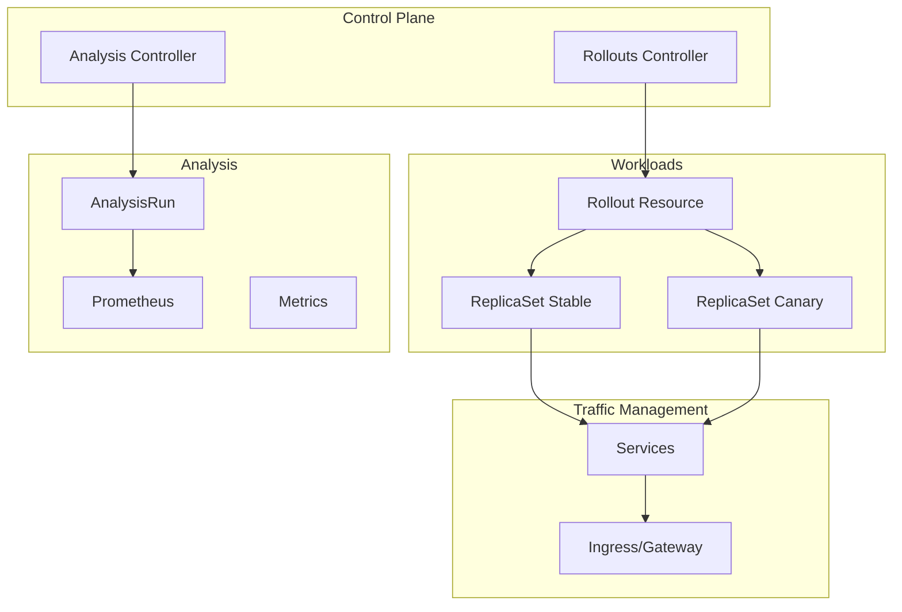

# How to Deploy Argo Rollouts for Progressive Delivery with Helm

Author: [nawazdhandala](https://www.github.com/nawazdhandala)

Tags: Helm, Kubernetes, DevOps, Argo, Rollouts, Canary, Blue-Green

Description: Complete guide to deploying Argo Rollouts with Helm for progressive delivery including canary deployments, blue-green deployments, and automated rollbacks.

> Argo Rollouts provides advanced deployment capabilities beyond standard Kubernetes deployments. This guide covers deploying and configuring Argo Rollouts with Helm for progressive delivery strategies.

## Argo Rollouts Architecture



## Prerequisites

```bash
# Add Argo repository
helm repo add argo https://argoproj.github.io/argo-helm
helm repo update

# Create namespace
kubectl create namespace argo-rollouts
```

## Install Argo Rollouts

### Values Configuration

```yaml
# argo-rollouts-values.yaml

# Controller configuration
controller:
  # Replicas for HA
  replicas: 2
  
  # Resources
  resources:
    requests:
      cpu: 100m
      memory: 128Mi
    limits:
      cpu: 500m
      memory: 512Mi
  
  # Metrics
  metrics:
    enabled: true
    serviceMonitor:
      enabled: true
      namespace: monitoring
      additionalLabels:
        release: prometheus
  
  # Node selector
  nodeSelector: {}
  
  # Tolerations
  tolerations: []
  
  # Pod affinity
  affinity:
    podAntiAffinity:
      preferredDuringSchedulingIgnoredDuringExecution:
        - weight: 100
          podAffinityTerm:
            labelSelector:
              matchLabels:
                app.kubernetes.io/name: argo-rollouts
            topologyKey: kubernetes.io/hostname

# Dashboard
dashboard:
  enabled: true
  replicas: 1
  
  resources:
    requests:
      cpu: 50m
      memory: 64Mi
    limits:
      cpu: 200m
      memory: 128Mi
  
  # Ingress for dashboard
  ingress:
    enabled: true
    ingressClassName: nginx
    hosts:
      - rollouts.example.com
    annotations:
      cert-manager.io/cluster-issuer: "letsencrypt-prod"
    tls:
      - secretName: rollouts-dashboard-tls
        hosts:
          - rollouts.example.com

# Install CRDs
installCRDs: true

# Keep CRDs on uninstall
keepCRDs: true

# Notifications controller
notifications:
  enabled: true
  
  resources:
    requests:
      cpu: 50m
      memory: 64Mi
    limits:
      cpu: 200m
      memory: 128Mi
  
  # Notification templates
  notifiers:
    service.slack: |
      token: $slack-token
    service.webhook.deployment: |
      url: https://hooks.example.com/rollouts
      headers:
        - name: Authorization
          value: Bearer $webhook-token
  
  templates:
    template.rollout-completed: |
      message: |
        Rollout {{.rollout.metadata.name}} completed successfully!
        Version: {{.rollout.status.currentPodHash}}
    
    template.rollout-failed: |
      message: |
        ⚠️ Rollout {{.rollout.metadata.name}} failed!
        Error: {{.rollout.status.message}}
  
  triggers:
    trigger.on-rollout-completed: |
      - send: [rollout-completed]
        when: rollout.status.phase == 'Healthy'
    
    trigger.on-rollout-failed: |
      - send: [rollout-failed]
        when: rollout.status.phase == 'Degraded'
```

### Install Chart

```bash
# Install Argo Rollouts
helm install argo-rollouts argo/argo-rollouts \
  --namespace argo-rollouts \
  --values argo-rollouts-values.yaml \
  --wait

# Install kubectl plugin
brew install argoproj/tap/kubectl-argo-rollouts
# Or download from releases
```

## Canary Deployment

### Rollout Resource

```yaml
# canary-rollout.yaml
apiVersion: argoproj.io/v1alpha1
kind: Rollout
metadata:
  name: myapp
  namespace: default
spec:
  replicas: 10
  
  selector:
    matchLabels:
      app: myapp
  
  template:
    metadata:
      labels:
        app: myapp
    spec:
      containers:
        - name: myapp
          image: myapp:v1.0.0
          ports:
            - containerPort: 8080
          resources:
            requests:
              cpu: 100m
              memory: 128Mi
            limits:
              cpu: 500m
              memory: 512Mi
          readinessProbe:
            httpGet:
              path: /health
              port: 8080
            initialDelaySeconds: 5
            periodSeconds: 10
  
  strategy:
    canary:
      # Canary steps
      steps:
        - setWeight: 5
        - pause: { duration: 1m }
        - setWeight: 10
        - pause: { duration: 2m }
        - setWeight: 20
        - pause: { duration: 2m }
        - setWeight: 40
        - pause: { duration: 5m }
        - setWeight: 60
        - pause: { duration: 5m }
        - setWeight: 80
        - pause: { duration: 5m }
      
      # Traffic routing
      canaryService: myapp-canary
      stableService: myapp-stable
      
      # Traffic management with Nginx
      trafficRouting:
        nginx:
          stableIngress: myapp-ingress
          additionalIngressAnnotations:
            canary-by-header: X-Canary
      
      # Analysis during rollout
      analysis:
        templates:
          - templateName: success-rate
          - templateName: latency-check
        startingStep: 2
        args:
          - name: service-name
            value: myapp-canary
      
      # Anti-affinity between canary and stable
      antiAffinity:
        preferredDuringSchedulingIgnoredDuringExecution:
          weight: 100
      
      # Max surge and unavailable
      maxSurge: "25%"
      maxUnavailable: 0
      
      # Scale down delay
      scaleDownDelaySeconds: 30
      
      # Abort scale down delay
      abortScaleDownDelaySeconds: 30

---
# Services
apiVersion: v1
kind: Service
metadata:
  name: myapp-stable
  namespace: default
spec:
  selector:
    app: myapp
  ports:
    - port: 80
      targetPort: 8080

---
apiVersion: v1
kind: Service
metadata:
  name: myapp-canary
  namespace: default
spec:
  selector:
    app: myapp
  ports:
    - port: 80
      targetPort: 8080
```

### Analysis Templates

```yaml
# analysis-templates.yaml
apiVersion: argoproj.io/v1alpha1
kind: AnalysisTemplate
metadata:
  name: success-rate
  namespace: default
spec:
  args:
    - name: service-name
  metrics:
    - name: success-rate
      interval: 1m
      count: 5
      successCondition: result[0] >= 0.95
      failureLimit: 3
      provider:
        prometheus:
          address: http://prometheus.monitoring:9090
          query: |
            sum(rate(
              http_requests_total{
                service="{{args.service-name}}",
                status=~"2.."
              }[5m]
            )) /
            sum(rate(
              http_requests_total{
                service="{{args.service-name}}"
              }[5m]
            ))

---
apiVersion: argoproj.io/v1alpha1
kind: AnalysisTemplate
metadata:
  name: latency-check
  namespace: default
spec:
  args:
    - name: service-name
  metrics:
    - name: p99-latency
      interval: 1m
      count: 5
      successCondition: result[0] <= 500
      failureLimit: 3
      provider:
        prometheus:
          address: http://prometheus.monitoring:9090
          query: |
            histogram_quantile(0.99,
              sum(rate(
                http_request_duration_seconds_bucket{
                  service="{{args.service-name}}"
                }[5m]
              )) by (le)
            ) * 1000

---
apiVersion: argoproj.io/v1alpha1
kind: AnalysisTemplate
metadata:
  name: error-rate
  namespace: default
spec:
  args:
    - name: service-name
  metrics:
    - name: error-rate
      interval: 1m
      count: 5
      successCondition: result[0] < 0.05
      failureLimit: 2
      provider:
        prometheus:
          address: http://prometheus.monitoring:9090
          query: |
            sum(rate(
              http_requests_total{
                service="{{args.service-name}}",
                status=~"5.."
              }[5m]
            )) /
            sum(rate(
              http_requests_total{
                service="{{args.service-name}}"
              }[5m]
            ))
```

## Blue-Green Deployment

```yaml
# blue-green-rollout.yaml
apiVersion: argoproj.io/v1alpha1
kind: Rollout
metadata:
  name: myapp-bluegreen
  namespace: default
spec:
  replicas: 5
  
  selector:
    matchLabels:
      app: myapp-bluegreen
  
  template:
    metadata:
      labels:
        app: myapp-bluegreen
    spec:
      containers:
        - name: myapp
          image: myapp:v1.0.0
          ports:
            - containerPort: 8080
          resources:
            requests:
              cpu: 100m
              memory: 128Mi
  
  strategy:
    blueGreen:
      # Active service receives production traffic
      activeService: myapp-active
      
      # Preview service for testing new version
      previewService: myapp-preview
      
      # Auto-promotion after delay
      autoPromotionEnabled: true
      autoPromotionSeconds: 300
      
      # Scale down delay for old version
      scaleDownDelaySeconds: 30
      
      # Pre-promotion analysis
      prePromotionAnalysis:
        templates:
          - templateName: smoke-test
        args:
          - name: service-name
            value: myapp-preview
      
      # Post-promotion analysis
      postPromotionAnalysis:
        templates:
          - templateName: success-rate
        args:
          - name: service-name
            value: myapp-active
      
      # Preview replicas (if different from main)
      previewReplicaCount: 3

---
apiVersion: v1
kind: Service
metadata:
  name: myapp-active
  namespace: default
spec:
  selector:
    app: myapp-bluegreen
  ports:
    - port: 80
      targetPort: 8080

---
apiVersion: v1
kind: Service
metadata:
  name: myapp-preview
  namespace: default
spec:
  selector:
    app: myapp-bluegreen
  ports:
    - port: 80
      targetPort: 8080
```

### Smoke Test Template

```yaml
# smoke-test-template.yaml
apiVersion: argoproj.io/v1alpha1
kind: AnalysisTemplate
metadata:
  name: smoke-test
  namespace: default
spec:
  args:
    - name: service-name
  metrics:
    - name: smoke-test
      count: 1
      interval: 30s
      failureLimit: 1
      provider:
        job:
          spec:
            backoffLimit: 1
            template:
              spec:
                containers:
                  - name: smoke-test
                    image: curlimages/curl:8.1.0
                    command:
                      - /bin/sh
                      - -c
                      - |
                        set -e
                        # Test health endpoint
                        curl -sf http://{{args.service-name}}/health
                        
                        # Test API endpoint
                        response=$(curl -sf http://{{args.service-name}}/api/status)
                        
                        # Validate response
                        echo "$response" | grep -q '"status":"ok"'
                        
                        echo "Smoke tests passed!"
                restartPolicy: Never
```

## Traffic Management with Istio

```yaml
# istio-rollout.yaml
apiVersion: argoproj.io/v1alpha1
kind: Rollout
metadata:
  name: myapp-istio
  namespace: default
spec:
  replicas: 10
  
  selector:
    matchLabels:
      app: myapp-istio
  
  template:
    metadata:
      labels:
        app: myapp-istio
    spec:
      containers:
        - name: myapp
          image: myapp:v1.0.0
          ports:
            - containerPort: 8080
  
  strategy:
    canary:
      steps:
        - setWeight: 10
        - pause: { duration: 2m }
        - setWeight: 30
        - pause: { duration: 5m }
        - setWeight: 50
        - pause: { duration: 5m }
      
      canaryService: myapp-canary
      stableService: myapp-stable
      
      trafficRouting:
        istio:
          virtualServices:
            - name: myapp-vsvc
              routes:
                - primary
          destinationRule:
            name: myapp-destrule
            canarySubsetName: canary
            stableSubsetName: stable

---
apiVersion: networking.istio.io/v1beta1
kind: VirtualService
metadata:
  name: myapp-vsvc
  namespace: default
spec:
  hosts:
    - myapp.example.com
  http:
    - name: primary
      route:
        - destination:
            host: myapp-stable
            subset: stable
          weight: 100
        - destination:
            host: myapp-canary
            subset: canary
          weight: 0

---
apiVersion: networking.istio.io/v1beta1
kind: DestinationRule
metadata:
  name: myapp-destrule
  namespace: default
spec:
  host: myapp
  subsets:
    - name: stable
      labels:
        app: myapp-istio
    - name: canary
      labels:
        app: myapp-istio
```

## CLI Commands

```bash
# Get rollout status
kubectl argo rollouts get rollout myapp -n default

# Watch rollout progress
kubectl argo rollouts get rollout myapp -n default -w

# Promote rollout
kubectl argo rollouts promote myapp -n default

# Abort rollout
kubectl argo rollouts abort myapp -n default

# Retry aborted rollout
kubectl argo rollouts retry rollout myapp -n default

# Rollback to previous version
kubectl argo rollouts undo myapp -n default

# Set image
kubectl argo rollouts set image myapp myapp=myapp:v2.0.0 -n default

# Pause rollout
kubectl argo rollouts pause myapp -n default

# Resume rollout
kubectl argo rollouts resume myapp -n default
```

## Best Practices

| Practice | Description |
|----------|-------------|
| Start Small | Begin with low traffic percentages |
| Automated Analysis | Use metrics-based analysis |
| Gradual Steps | Include pauses between weight changes |
| Rollback Strategy | Configure automatic rollback thresholds |
| Testing Preview | Use preview service for manual testing |
| Notifications | Configure alerts for rollout events |

## Troubleshooting

```bash
# Check controller logs
kubectl logs -f deployment/argo-rollouts -n argo-rollouts

# Describe rollout
kubectl describe rollout myapp -n default

# Check analysis runs
kubectl get analysisrun -n default

# Describe failed analysis
kubectl describe analysisrun myapp-abcd1234 -n default

# View rollout events
kubectl get events --field-selector involvedObject.name=myapp -n default
```

## Wrap-up

Argo Rollouts extends Kubernetes with advanced deployment strategies. Deploy with Helm, configure canary or blue-green strategies, and implement automated analysis for safe progressive delivery. The built-in traffic management integrations enable sophisticated rollout patterns with automatic rollback capabilities.
