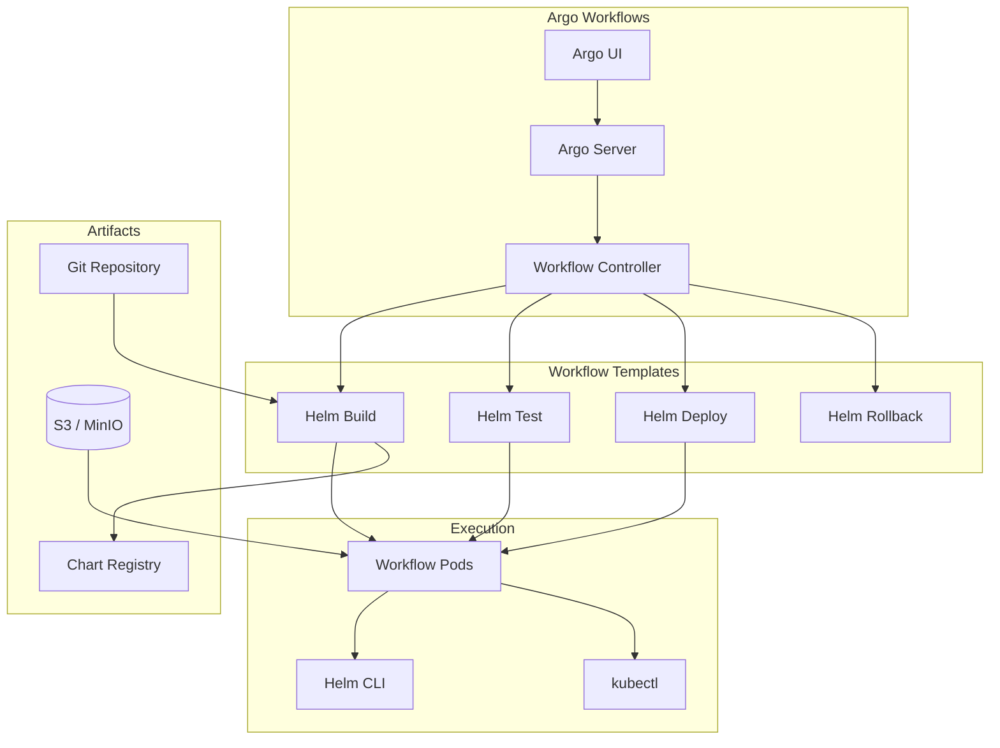

# Automating Helm Workflows with Argo Workflows

Author: [nawazdhandala](https://www.github.com/nawazdhandala)

Tags: Helm, Kubernetes, DevOps, Argo Workflows, Automation, CI/CD, GitOps

Description: Complete guide to automating Helm chart deployments and workflows using Argo Workflows for complex deployment pipelines and orchestration.

> Argo Workflows provides powerful workflow automation for Kubernetes. This guide covers using Argo Workflows to automate Helm chart testing, building, and deployment pipelines.

## Argo Workflows Architecture



## Prerequisites

### Install Argo Workflows

```bash
# Add Argo Helm repository
helm repo add argo https://argoproj.github.io/argo-helm
helm repo update

# Install Argo Workflows
helm install argo-workflows argo/argo-workflows \
  --namespace argo \
  --create-namespace \
  --set server.serviceType=LoadBalancer
```

### Install Argo CLI

```bash
# macOS
brew install argo

# Linux
curl -sLO https://github.com/argoproj/argo-workflows/releases/download/v3.5.0/argo-linux-amd64.gz
gunzip argo-linux-amd64.gz
chmod +x argo-linux-amd64
mv ./argo-linux-amd64 /usr/local/bin/argo
```

## Helm Workflow Templates

### Base Helm Template

```yaml
# helm-workflow-template.yaml
apiVersion: argoproj.io/v1alpha1
kind: WorkflowTemplate
metadata:
  name: helm-operations
  namespace: argo
spec:
  entrypoint: helm-operation
  
  arguments:
    parameters:
      - name: chart-name
      - name: chart-version
        default: ""
      - name: namespace
        default: "default"
      - name: release-name
      - name: values-file
        default: ""
      - name: operation
        default: "upgrade"
        
  templates:
    - name: helm-operation
      inputs:
        parameters:
          - name: chart-name
          - name: chart-version
          - name: namespace
          - name: release-name
          - name: values-file
          - name: operation
      container:
        image: alpine/helm:3.13.0
        command: ["/bin/sh", "-c"]
        args:
          - |
            # Add Helm repositories
            helm repo add bitnami https://charts.bitnami.com/bitnami
            helm repo add stable https://charts.helm.sh/stable
            helm repo update
            
            # Prepare values file
            VALUES_ARGS=""
            if [ -n "{{inputs.parameters.values-file}}" ]; then
              VALUES_ARGS="-f {{inputs.parameters.values-file}}"
            fi
            
            # Prepare version
            VERSION_ARGS=""
            if [ -n "{{inputs.parameters.chart-version}}" ]; then
              VERSION_ARGS="--version {{inputs.parameters.chart-version}}"
            fi
            
            # Execute operation
            case "{{inputs.parameters.operation}}" in
              install)
                helm install {{inputs.parameters.release-name}} \
                  {{inputs.parameters.chart-name}} \
                  --namespace {{inputs.parameters.namespace}} \
                  --create-namespace \
                  $VERSION_ARGS $VALUES_ARGS
                ;;
              upgrade)
                helm upgrade --install {{inputs.parameters.release-name}} \
                  {{inputs.parameters.chart-name}} \
                  --namespace {{inputs.parameters.namespace}} \
                  --create-namespace \
                  $VERSION_ARGS $VALUES_ARGS
                ;;
              uninstall)
                helm uninstall {{inputs.parameters.release-name}} \
                  --namespace {{inputs.parameters.namespace}}
                ;;
              rollback)
                helm rollback {{inputs.parameters.release-name}} \
                  --namespace {{inputs.parameters.namespace}}
                ;;
              *)
                echo "Unknown operation: {{inputs.parameters.operation}}"
                exit 1
                ;;
            esac
        volumeMounts:
          - name: kubeconfig
            mountPath: /root/.kube
      volumes:
        - name: kubeconfig
          secret:
            secretName: kubeconfig-secret
```

### Helm CI/CD Pipeline Template

```yaml
# helm-cicd-template.yaml
apiVersion: argoproj.io/v1alpha1
kind: WorkflowTemplate
metadata:
  name: helm-cicd-pipeline
  namespace: argo
spec:
  entrypoint: helm-pipeline
  
  arguments:
    parameters:
      - name: git-repo
      - name: git-branch
        default: "main"
      - name: chart-path
        default: "charts/myapp"
      - name: registry
        default: "ghcr.io/myorg"
      - name: namespace
        default: "production"
        
  volumeClaimTemplates:
    - metadata:
        name: workspace
      spec:
        accessModes: ["ReadWriteOnce"]
        resources:
          requests:
            storage: 1Gi
            
  templates:
    - name: helm-pipeline
      dag:
        tasks:
          - name: checkout
            template: git-checkout
            arguments:
              parameters:
                - name: repo
                  value: "{{workflow.parameters.git-repo}}"
                - name: branch
                  value: "{{workflow.parameters.git-branch}}"
                  
          - name: lint
            template: helm-lint
            dependencies: [checkout]
            arguments:
              parameters:
                - name: chart-path
                  value: "{{workflow.parameters.chart-path}}"
                  
          - name: test
            template: helm-test
            dependencies: [lint]
            arguments:
              parameters:
                - name: chart-path
                  value: "{{workflow.parameters.chart-path}}"
                  
          - name: package
            template: helm-package
            dependencies: [test]
            arguments:
              parameters:
                - name: chart-path
                  value: "{{workflow.parameters.chart-path}}"
                  
          - name: push
            template: helm-push
            dependencies: [package]
            arguments:
              parameters:
                - name: registry
                  value: "{{workflow.parameters.registry}}"
                  
          - name: deploy
            template: helm-deploy
            dependencies: [push]
            arguments:
              parameters:
                - name: namespace
                  value: "{{workflow.parameters.namespace}}"
                  
    - name: git-checkout
      inputs:
        parameters:
          - name: repo
          - name: branch
      container:
        image: alpine/git
        command: ["/bin/sh", "-c"]
        args:
          - |
            git clone --branch {{inputs.parameters.branch}} \
              {{inputs.parameters.repo}} /workspace
        volumeMounts:
          - name: workspace
            mountPath: /workspace
            
    - name: helm-lint
      inputs:
        parameters:
          - name: chart-path
      container:
        image: alpine/helm:3.13.0
        command: ["/bin/sh", "-c"]
        args:
          - |
            cd /workspace
            helm lint {{inputs.parameters.chart-path}}
            helm lint {{inputs.parameters.chart-path}} --strict
        volumeMounts:
          - name: workspace
            mountPath: /workspace
            
    - name: helm-test
      inputs:
        parameters:
          - name: chart-path
      container:
        image: alpine/helm:3.13.0
        command: ["/bin/sh", "-c"]
        args:
          - |
            cd /workspace
            
            # Template and validate
            helm template test {{inputs.parameters.chart-path}} > /tmp/rendered.yaml
            
            # Run helm unittest if available
            helm plugin install https://github.com/helm-unittest/helm-unittest || true
            helm unittest {{inputs.parameters.chart-path}}
            
            # Validate with kubeconform
            wget -qO /tmp/kubeconform.tar.gz \
              https://github.com/yannh/kubeconform/releases/download/v0.6.0/kubeconform-linux-amd64.tar.gz
            tar -xzf /tmp/kubeconform.tar.gz -C /usr/local/bin
            
            kubeconform -summary -strict /tmp/rendered.yaml
        volumeMounts:
          - name: workspace
            mountPath: /workspace
            
    - name: helm-package
      inputs:
        parameters:
          - name: chart-path
      outputs:
        artifacts:
          - name: chart-package
            path: /workspace/*.tgz
      container:
        image: alpine/helm:3.13.0
        command: ["/bin/sh", "-c"]
        args:
          - |
            cd /workspace
            
            # Update dependencies
            helm dependency update {{inputs.parameters.chart-path}}
            
            # Package chart
            helm package {{inputs.parameters.chart-path}} -d /workspace
        volumeMounts:
          - name: workspace
            mountPath: /workspace
            
    - name: helm-push
      inputs:
        parameters:
          - name: registry
        artifacts:
          - name: chart-package
            path: /workspace
      container:
        image: alpine/helm:3.13.0
        command: ["/bin/sh", "-c"]
        args:
          - |
            # Login to registry
            echo "$REGISTRY_PASSWORD" | helm registry login {{inputs.parameters.registry}} \
              --username "$REGISTRY_USERNAME" --password-stdin
            
            # Push chart
            for chart in /workspace/*.tgz; do
              helm push $chart oci://{{inputs.parameters.registry}}/charts
            done
        env:
          - name: REGISTRY_USERNAME
            valueFrom:
              secretKeyRef:
                name: registry-credentials
                key: username
          - name: REGISTRY_PASSWORD
            valueFrom:
              secretKeyRef:
                name: registry-credentials
                key: password
        volumeMounts:
          - name: workspace
            mountPath: /workspace
            
    - name: helm-deploy
      inputs:
        parameters:
          - name: namespace
      container:
        image: alpine/helm:3.13.0
        command: ["/bin/sh", "-c"]
        args:
          - |
            cd /workspace
            
            # Get chart info
            CHART_NAME=$(ls *.tgz | head -1 | sed 's/-[0-9].*//g')
            CHART_VERSION=$(ls *.tgz | head -1 | sed 's/.*-\([0-9].*\)\.tgz/\1/')
            
            # Deploy
            helm upgrade --install $CHART_NAME \
              /workspace/*.tgz \
              --namespace {{inputs.parameters.namespace}} \
              --create-namespace \
              --wait \
              --timeout 10m
        volumeMounts:
          - name: workspace
            mountPath: /workspace
          - name: kubeconfig
            mountPath: /root/.kube
      volumes:
        - name: kubeconfig
          secret:
            secretName: kubeconfig-secret
```

## Multi-Environment Deployment

### Environment Promotion Workflow

```yaml
# helm-promotion-workflow.yaml
apiVersion: argoproj.io/v1alpha1
kind: WorkflowTemplate
metadata:
  name: helm-environment-promotion
  namespace: argo
spec:
  entrypoint: promote-environments
  
  arguments:
    parameters:
      - name: chart-name
      - name: chart-version
      - name: values-repo
      - name: approve-production
        default: "true"
        
  templates:
    - name: promote-environments
      steps:
        - - name: deploy-dev
            template: deploy-to-env
            arguments:
              parameters:
                - name: environment
                  value: "dev"
                - name: chart-name
                  value: "{{workflow.parameters.chart-name}}"
                - name: chart-version
                  value: "{{workflow.parameters.chart-version}}"
                  
        - - name: test-dev
            template: run-tests
            arguments:
              parameters:
                - name: environment
                  value: "dev"
                  
        - - name: deploy-staging
            template: deploy-to-env
            arguments:
              parameters:
                - name: environment
                  value: "staging"
                - name: chart-name
                  value: "{{workflow.parameters.chart-name}}"
                - name: chart-version
                  value: "{{workflow.parameters.chart-version}}"
                  
        - - name: test-staging
            template: run-tests
            arguments:
              parameters:
                - name: environment
                  value: "staging"
                  
        - - name: approve-production
            template: approval
            when: "{{workflow.parameters.approve-production}} == true"
            
        - - name: deploy-production
            template: deploy-to-env
            arguments:
              parameters:
                - name: environment
                  value: "production"
                - name: chart-name
                  value: "{{workflow.parameters.chart-name}}"
                - name: chart-version
                  value: "{{workflow.parameters.chart-version}}"
                  
    - name: deploy-to-env
      inputs:
        parameters:
          - name: environment
          - name: chart-name
          - name: chart-version
      container:
        image: alpine/helm:3.13.0
        command: ["/bin/sh", "-c"]
        args:
          - |
            # Clone values repo
            git clone {{workflow.parameters.values-repo}} /tmp/values
            
            # Deploy to environment
            helm upgrade --install {{inputs.parameters.chart-name}} \
              oci://registry.example.com/charts/{{inputs.parameters.chart-name}} \
              --version {{inputs.parameters.chart-version}} \
              --namespace {{inputs.parameters.environment}} \
              --create-namespace \
              -f /tmp/values/{{inputs.parameters.environment}}/values.yaml \
              --wait
              
    - name: run-tests
      inputs:
        parameters:
          - name: environment
      container:
        image: curlimages/curl:latest
        command: ["/bin/sh", "-c"]
        args:
          - |
            # Run smoke tests
            ENDPOINT="http://myapp.{{inputs.parameters.environment}}.svc.cluster.local"
            
            # Health check
            curl -f $ENDPOINT/health || exit 1
            
            # Basic functionality
            curl -f $ENDPOINT/api/status || exit 1
            
            echo "Tests passed for {{inputs.parameters.environment}}"
            
    - name: approval
      suspend: {}
```

## Canary Deployment Workflow

```yaml
# helm-canary-workflow.yaml
apiVersion: argoproj.io/v1alpha1
kind: WorkflowTemplate
metadata:
  name: helm-canary-deployment
  namespace: argo
spec:
  entrypoint: canary-deploy
  
  arguments:
    parameters:
      - name: release-name
      - name: chart-name
      - name: new-version
      - name: namespace
      - name: canary-weight
        default: "10"
      - name: canary-duration
        default: "10m"
        
  templates:
    - name: canary-deploy
      steps:
        - - name: deploy-canary
            template: deploy-canary-version
            
        - - name: monitor-canary
            template: monitor-metrics
            
        - - name: evaluate
            template: evaluate-canary
            
        - - name: promote-or-rollback
            template: promotion-decision
            arguments:
              parameters:
                - name: success
                  value: "{{steps.evaluate.outputs.parameters.success}}"
                  
    - name: deploy-canary-version
      script:
        image: alpine/helm:3.13.0
        command: ["/bin/sh"]
        source: |
          # Deploy canary release
          helm upgrade --install {{workflow.parameters.release-name}}-canary \
            oci://registry.example.com/charts/{{workflow.parameters.chart-name}} \
            --version {{workflow.parameters.new-version}} \
            --namespace {{workflow.parameters.namespace}} \
            --set replicaCount=1 \
            --set canary.enabled=true \
            --set canary.weight={{workflow.parameters.canary-weight}} \
            --wait
            
    - name: monitor-metrics
      container:
        image: curlimages/curl:latest
        command: ["/bin/sh", "-c"]
        args:
          - |
            echo "Monitoring canary for {{workflow.parameters.canary-duration}}"
            sleep {{workflow.parameters.canary-duration}}
            
    - name: evaluate-canary
      outputs:
        parameters:
          - name: success
            valueFrom:
              path: /tmp/result
      script:
        image: curlimages/curl:latest
        command: ["/bin/sh"]
        source: |
          # Query Prometheus for error rate
          ERROR_RATE=$(curl -s "http://prometheus:9090/api/v1/query" \
            --data-urlencode 'query=sum(rate(http_requests_total{status=~"5.*",release="canary"}[5m])) / sum(rate(http_requests_total{release="canary"}[5m]))' \
            | jq -r '.data.result[0].value[1]')
          
          if [ $(echo "$ERROR_RATE < 0.01" | bc -l) -eq 1 ]; then
            echo "true" > /tmp/result
          else
            echo "false" > /tmp/result
          fi
          
    - name: promotion-decision
      inputs:
        parameters:
          - name: success
      steps:
        - - name: promote
            template: promote-canary
            when: "{{inputs.parameters.success}} == true"
          - name: rollback
            template: rollback-canary
            when: "{{inputs.parameters.success}} == false"
            
    - name: promote-canary
      container:
        image: alpine/helm:3.13.0
        command: ["/bin/sh", "-c"]
        args:
          - |
            # Upgrade main release
            helm upgrade --install {{workflow.parameters.release-name}} \
              oci://registry.example.com/charts/{{workflow.parameters.chart-name}} \
              --version {{workflow.parameters.new-version}} \
              --namespace {{workflow.parameters.namespace}} \
              --wait
            
            # Remove canary
            helm uninstall {{workflow.parameters.release-name}}-canary \
              --namespace {{workflow.parameters.namespace}}
              
    - name: rollback-canary
      container:
        image: alpine/helm:3.13.0
        command: ["/bin/sh", "-c"]
        args:
          - |
            # Remove failed canary
            helm uninstall {{workflow.parameters.release-name}}-canary \
              --namespace {{workflow.parameters.namespace}}
            
            echo "Canary deployment failed, rolled back"
```

## Cron Workflows

### Scheduled Helm Operations

```yaml
# helm-cron-workflow.yaml
apiVersion: argoproj.io/v1alpha1
kind: CronWorkflow
metadata:
  name: helm-nightly-updates
  namespace: argo
spec:
  schedule: "0 2 * * *"  # Daily at 2 AM
  concurrencyPolicy: Replace
  startingDeadlineSeconds: 0
  
  workflowSpec:
    entrypoint: nightly-updates
    
    templates:
      - name: nightly-updates
        dag:
          tasks:
            - name: update-repos
              template: update-helm-repos
              
            - name: check-updates
              template: check-chart-updates
              dependencies: [update-repos]
              
            - name: backup
              template: backup-releases
              dependencies: [update-repos]
              
            - name: update-dev
              template: update-dev-releases
              dependencies: [backup, check-updates]
              
      - name: update-helm-repos
        container:
          image: alpine/helm:3.13.0
          command: [helm, repo, update]
          
      - name: check-chart-updates
        container:
          image: alpine/helm:3.13.0
          command: ["/bin/sh", "-c"]
          args:
            - |
              # Check for available updates
              helm list -A -o json | jq -r '.[] | "\(.name) \(.namespace) \(.chart)"' | while read name ns chart; do
                chart_name=$(echo $chart | sed 's/-[0-9].*//')
                current=$(echo $chart | grep -oE '[0-9]+\.[0-9]+\.[0-9]+')
                latest=$(helm search repo $chart_name -o json | jq -r '.[0].version')
                
                if [ "$current" != "$latest" ]; then
                  echo "Update available: $name ($chart_name) $current -> $latest"
                fi
              done
              
      - name: backup-releases
        container:
          image: alpine/helm:3.13.0
          command: ["/bin/sh", "-c"]
          args:
            - |
              # Backup all releases
              mkdir -p /tmp/backups
              
              helm list -A -o json | jq -r '.[] | "\(.name) \(.namespace)"' | while read name ns; do
                helm get values $name -n $ns > /tmp/backups/${ns}-${name}-values.yaml
                helm get manifest $name -n $ns > /tmp/backups/${ns}-${name}-manifest.yaml
              done
              
              # Upload to S3
              aws s3 sync /tmp/backups s3://helm-backups/$(date +%Y%m%d)/
              
      - name: update-dev-releases
        container:
          image: alpine/helm:3.13.0
          command: ["/bin/sh", "-c"]
          args:
            - |
              # Update releases in dev namespace to latest
              helm list -n dev -o json | jq -r '.[] | "\(.name) \(.chart)"' | while read name chart; do
                chart_name=$(echo $chart | sed 's/-[0-9].*//')
                
                helm upgrade $name $chart_name \
                  --namespace dev \
                  --reuse-values \
                  --wait || true
              done
```

## Event-Triggered Workflows

### GitHub Webhook Trigger

```yaml
# helm-webhook-trigger.yaml
apiVersion: argoproj.io/v1alpha1
kind: WorkflowEventBinding
metadata:
  name: helm-github-trigger
  namespace: argo
spec:
  event:
    selector: payload.ref == "refs/heads/main" && payload.repository.name == "helm-charts"
  submit:
    workflowTemplateRef:
      name: helm-cicd-pipeline
    arguments:
      parameters:
        - name: git-repo
          valueFrom:
            event: payload.repository.clone_url
        - name: git-branch
          value: main
```

## Monitoring Workflows

### ServiceMonitor for Argo Workflows

```yaml
# argo-servicemonitor.yaml
apiVersion: monitoring.coreos.com/v1
kind: ServiceMonitor
metadata:
  name: argo-workflows
  namespace: monitoring
spec:
  selector:
    matchLabels:
      app.kubernetes.io/name: argo-workflows-workflow-controller
  namespaceSelector:
    matchNames:
      - argo
  endpoints:
    - port: metrics
      path: /metrics
      interval: 30s
```

## Troubleshooting

```bash
# List workflows
argo list -n argo

# Get workflow details
argo get -n argo <workflow-name>

# Watch workflow
argo watch -n argo <workflow-name>

# Get workflow logs
argo logs -n argo <workflow-name>

# Retry failed workflow
argo retry -n argo <workflow-name>

# Delete workflow
argo delete -n argo <workflow-name>

# Submit workflow from template
argo submit -n argo --from workflowtemplate/helm-cicd-pipeline \
  -p git-repo=https://github.com/myorg/charts.git

# Access Argo UI
kubectl port-forward -n argo svc/argo-server 2746:2746
```

## Wrap-up

Argo Workflows provides powerful automation for Helm deployments with DAG-based pipelines, canary deployments, and multi-environment promotions. Use WorkflowTemplates for reusable pipeline components, CronWorkflows for scheduled operations, and event triggers for GitOps workflows. Integrate with your CI/CD pipeline for end-to-end automation of Helm chart lifecycles.
