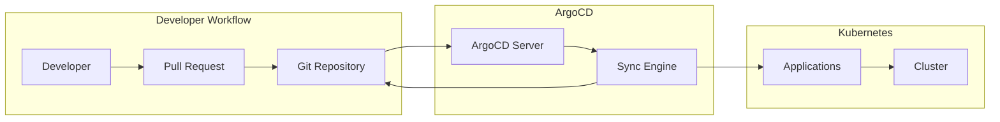

# Helm + ArgoCD GitOps Deployment Complete Guide

Author: [nawazdhandala](https://www.github.com/nawazdhandala)

Tags: Helm, Kubernetes, DevOps, ArgoCD, GitOps, Deployment

Description: Learn how to implement GitOps deployments using Helm charts with ArgoCD for automated, declarative Kubernetes application delivery.

> GitOps brings the benefits of Git workflows-pull requests, code review, and version history-to infrastructure and application deployment. ArgoCD plus Helm is the most popular combination for Kubernetes GitOps.

## What is GitOps?

GitOps uses Git as the single source of truth for declarative infrastructure. ArgoCD watches your Git repository and automatically synchronizes the cluster state to match.



## Install ArgoCD

First, install ArgoCD in your cluster. This creates the ArgoCD namespace and deploys all components.

```bash
# Create namespace
kubectl create namespace argocd

# Install ArgoCD
kubectl apply -n argocd -f https://raw.githubusercontent.com/argoproj/argo-cd/stable/manifests/install.yaml

# Wait for pods to be ready
kubectl wait --for=condition=Ready pods --all -n argocd --timeout=300s

# Get the initial admin password
kubectl -n argocd get secret argocd-initial-admin-secret -o jsonpath="{.data.password}" | base64 -d
```

### Access ArgoCD UI

Expose the ArgoCD server for UI access.

```bash
# Port-forward for local access
kubectl port-forward svc/argocd-server -n argocd 8080:443

# Or create an Ingress for production access
```

### Install ArgoCD CLI

The CLI provides command-line access to ArgoCD operations.

```bash
# macOS
brew install argocd

# Linux
curl -sSL -o argocd https://github.com/argoproj/argo-cd/releases/latest/download/argocd-linux-amd64
chmod +x argocd
sudo mv argocd /usr/local/bin/

# Login to ArgoCD
argocd login localhost:8080 --username admin --password <password> --insecure
```

## GitOps Repository Structure

Organize your GitOps repository with a clear structure separating applications, environments, and base configurations.

```
gitops-repo/
├── apps/                    # ArgoCD Application manifests
│   ├── dev/
│   │   └── my-app.yaml
│   ├── staging/
│   │   └── my-app.yaml
│   └── production/
│       └── my-app.yaml
├── charts/                  # Custom Helm charts
│   └── my-app/
│       ├── Chart.yaml
│       ├── values.yaml
│       └── templates/
├── environments/            # Environment-specific values
│   ├── dev/
│   │   └── my-app-values.yaml
│   ├── staging/
│   │   └── my-app-values.yaml
│   └── production/
│       └── my-app-values.yaml
└── projects/               # ArgoCD Projects
    └── my-team.yaml
```

## Create an ArgoCD Application

ArgoCD Applications define what to deploy, where to deploy it, and how to keep it synchronized.

### Application Using a Helm Chart

This application deploys a Helm chart from a Git repository with environment-specific values.

```yaml
# apps/dev/my-app.yaml
apiVersion: argoproj.io/v1alpha1
kind: Application
metadata:
  name: my-app-dev
  namespace: argocd
  # Finalizer ensures proper cleanup when the Application is deleted
  finalizers:
    - resources-finalizer.argocd.argoproj.io
spec:
  project: default
  
  source:
    # Git repository containing the Helm chart
    repoURL: https://github.com/myorg/gitops-repo.git
    targetRevision: main
    path: charts/my-app
    
    # Helm-specific configuration
    helm:
      # Values file path relative to the repo root
      valueFiles:
        - ../../environments/dev/my-app-values.yaml
      # Inline parameter overrides
      parameters:
        - name: image.tag
          value: "1.2.3"
      # Release name (defaults to Application name)
      releaseName: my-app
  
  destination:
    server: https://kubernetes.default.svc
    namespace: my-app-dev
  
  syncPolicy:
    automated:
      # Auto-create namespace if it doesn't exist
      prune: true
      # Automatically sync when out of sync
      selfHeal: true
    syncOptions:
      - CreateNamespace=true
      # Apply manifests on the server side
      - ServerSideApply=true
```

### Application Using External Helm Repository

Deploy charts from public or private Helm repositories.

```yaml
# apps/production/prometheus.yaml
apiVersion: argoproj.io/v1alpha1
kind: Application
metadata:
  name: prometheus-production
  namespace: argocd
spec:
  project: monitoring
  
  source:
    # External Helm repository URL
    repoURL: https://prometheus-community.github.io/helm-charts
    chart: kube-prometheus-stack
    targetRevision: 55.0.0
    
    helm:
      releaseName: prometheus
      # Values can be defined inline
      values: |
        prometheus:
          prometheusSpec:
            retention: 30d
            storageSpec:
              volumeClaimTemplate:
                spec:
                  accessModes: ["ReadWriteOnce"]
                  resources:
                    requests:
                      storage: 100Gi
        
        alertmanager:
          enabled: true
        
        grafana:
          enabled: true
          adminPassword: ${GRAFANA_PASSWORD}
  
  destination:
    server: https://kubernetes.default.svc
    namespace: monitoring
  
  syncPolicy:
    automated:
      prune: true
      selfHeal: true
    syncOptions:
      - CreateNamespace=true
```

## Environment-Specific Values

Create values files for each environment with appropriate configurations.

### Development Values

Development environments typically use minimal resources and debug settings.

```yaml
# environments/dev/my-app-values.yaml
replicaCount: 1

image:
  repository: myorg/my-app
  tag: latest
  pullPolicy: Always

resources:
  requests:
    cpu: 100m
    memory: 128Mi
  limits:
    cpu: 500m
    memory: 512Mi

config:
  logLevel: debug
  debugMode: true

# Use in-cluster database for dev
database:
  host: postgres-dev.database.svc.cluster.local
  name: myapp_dev
```

### Production Values

Production environments need higher resources, replicas, and proper configurations.

```yaml
# environments/production/my-app-values.yaml
replicaCount: 3

image:
  repository: myorg/my-app
  tag: "1.2.3"  # Pinned version
  pullPolicy: IfNotPresent

resources:
  requests:
    cpu: 500m
    memory: 512Mi
  limits:
    cpu: 2000m
    memory: 2Gi

# Pod disruption budget for high availability
podDisruptionBudget:
  enabled: true
  minAvailable: 2

# Autoscaling for production
autoscaling:
  enabled: true
  minReplicas: 3
  maxReplicas: 10
  targetCPUUtilizationPercentage: 70

config:
  logLevel: info
  debugMode: false

# External production database
database:
  host: myapp-prod.cluster-xxx.us-east-1.rds.amazonaws.com
  name: myapp_production
```

## ArgoCD Projects

Projects provide logical grouping and access control for applications.

```yaml
# projects/my-team.yaml
apiVersion: argoproj.io/v1alpha1
kind: AppProject
metadata:
  name: my-team
  namespace: argocd
spec:
  description: My Team's applications
  
  # Only allow deployments to these namespaces
  destinations:
    - namespace: 'my-team-*'
      server: https://kubernetes.default.svc
    - namespace: my-team-shared
      server: https://kubernetes.default.svc
  
  # Only allow these Git repos as sources
  sourceRepos:
    - https://github.com/myorg/gitops-repo.git
    - https://prometheus-community.github.io/helm-charts
  
  # Allowed cluster resources
  clusterResourceWhitelist:
    - group: ''
      kind: Namespace
  
  # Allowed namespace resources
  namespaceResourceWhitelist:
    - group: '*'
      kind: '*'
  
  # Roles for team access
  roles:
    - name: developer
      description: Developer access
      policies:
        - p, proj:my-team:developer, applications, get, my-team/*, allow
        - p, proj:my-team:developer, applications, sync, my-team/*, allow
      groups:
        - my-team-developers
    
    - name: admin
      description: Admin access
      policies:
        - p, proj:my-team:admin, applications, *, my-team/*, allow
      groups:
        - my-team-admins
```

## App of Apps Pattern

Deploy multiple applications with a single parent Application. This is the recommended pattern for managing many applications.

### Parent Application

The parent application points to a directory containing child Application manifests.

```yaml
# apps/app-of-apps.yaml
apiVersion: argoproj.io/v1alpha1
kind: Application
metadata:
  name: platform-apps
  namespace: argocd
spec:
  project: platform
  
  source:
    repoURL: https://github.com/myorg/gitops-repo.git
    targetRevision: main
    # Directory containing Application manifests
    path: apps/production
  
  destination:
    server: https://kubernetes.default.svc
    namespace: argocd
  
  syncPolicy:
    automated:
      prune: true
      selfHeal: true
```

### Child Applications

Each file in the `apps/production` directory is an Application manifest.

```yaml
# apps/production/nginx-ingress.yaml
apiVersion: argoproj.io/v1alpha1
kind: Application
metadata:
  name: nginx-ingress
  namespace: argocd
spec:
  project: platform
  source:
    repoURL: https://kubernetes.github.io/ingress-nginx
    chart: ingress-nginx
    targetRevision: 4.8.3
  destination:
    server: https://kubernetes.default.svc
    namespace: ingress-nginx
  syncPolicy:
    automated:
      prune: true
      selfHeal: true
    syncOptions:
      - CreateNamespace=true
---
# apps/production/cert-manager.yaml
apiVersion: argoproj.io/v1alpha1
kind: Application
metadata:
  name: cert-manager
  namespace: argocd
spec:
  project: platform
  source:
    repoURL: https://charts.jetstack.io
    chart: cert-manager
    targetRevision: v1.13.2
    helm:
      parameters:
        - name: installCRDs
          value: "true"
  destination:
    server: https://kubernetes.default.svc
    namespace: cert-manager
  syncPolicy:
    automated:
      prune: true
      selfHeal: true
    syncOptions:
      - CreateNamespace=true
```

## ApplicationSets for Multi-Environment

ApplicationSets generate Applications automatically from templates, perfect for deploying across environments.

### Git Generator

Generate applications based on directory structure.

```yaml
# applicationsets/my-app-envs.yaml
apiVersion: argoproj.io/v1alpha1
kind: ApplicationSet
metadata:
  name: my-app-environments
  namespace: argocd
spec:
  generators:
    # Generate an Application for each directory in environments/
    - git:
        repoURL: https://github.com/myorg/gitops-repo.git
        revision: main
        directories:
          - path: environments/*
  
  template:
    metadata:
      # {{path.basename}} becomes dev, staging, production
      name: 'my-app-{{path.basename}}'
    spec:
      project: default
      source:
        repoURL: https://github.com/myorg/gitops-repo.git
        targetRevision: main
        path: charts/my-app
        helm:
          valueFiles:
            - '../../{{path}}/my-app-values.yaml'
      destination:
        server: https://kubernetes.default.svc
        namespace: 'my-app-{{path.basename}}'
      syncPolicy:
        automated:
          prune: true
          selfHeal: true
        syncOptions:
          - CreateNamespace=true
```

### List Generator

Explicitly define environments with specific configurations.

```yaml
apiVersion: argoproj.io/v1alpha1
kind: ApplicationSet
metadata:
  name: my-app-clusters
  namespace: argocd
spec:
  generators:
    - list:
        elements:
          - cluster: dev
            url: https://dev.k8s.example.com
            values:
              replicas: "1"
          - cluster: staging
            url: https://staging.k8s.example.com
            values:
              replicas: "2"
          - cluster: production
            url: https://prod.k8s.example.com
            values:
              replicas: "5"
  
  template:
    metadata:
      name: 'my-app-{{cluster}}'
    spec:
      project: default
      source:
        repoURL: https://github.com/myorg/gitops-repo.git
        targetRevision: main
        path: charts/my-app
        helm:
          parameters:
            - name: replicaCount
              value: '{{values.replicas}}'
      destination:
        server: '{{url}}'
        namespace: my-app
      syncPolicy:
        automated:
          prune: true
          selfHeal: true
```

## Handling Secrets in GitOps

Never commit plain secrets to Git. Use sealed secrets or external secret management.

### Sealed Secrets

Encrypt secrets that can only be decrypted by the cluster.

```bash
# Install Sealed Secrets controller
helm repo add sealed-secrets https://bitnami-labs.github.io/sealed-secrets
helm install sealed-secrets sealed-secrets/sealed-secrets -n kube-system

# Install kubeseal CLI
brew install kubeseal

# Create a secret and seal it
kubectl create secret generic my-secret \
  --from-literal=password=supersecret \
  --dry-run=client -o yaml | \
  kubeseal --format yaml > my-sealed-secret.yaml
```

Commit the sealed secret to Git:

```yaml
# environments/production/my-sealed-secret.yaml
apiVersion: bitnami.com/v1alpha1
kind: SealedSecret
metadata:
  name: my-secret
  namespace: my-app
spec:
  encryptedData:
    password: AgBy3i...encrypted...data
```

### External Secrets Operator

Sync secrets from external providers like AWS Secrets Manager or HashiCorp Vault.

```yaml
# Install External Secrets Operator via ArgoCD
apiVersion: argoproj.io/v1alpha1
kind: Application
metadata:
  name: external-secrets
  namespace: argocd
spec:
  project: platform
  source:
    repoURL: https://charts.external-secrets.io
    chart: external-secrets
    targetRevision: 0.9.9
  destination:
    server: https://kubernetes.default.svc
    namespace: external-secrets
  syncPolicy:
    automated:
      prune: true
      selfHeal: true
    syncOptions:
      - CreateNamespace=true
```

Reference external secrets in your Application values:

```yaml
# environments/production/external-secret.yaml
apiVersion: external-secrets.io/v1beta1
kind: ExternalSecret
metadata:
  name: my-app-secrets
  namespace: my-app
spec:
  refreshInterval: 1h
  secretStoreRef:
    name: aws-secrets-manager
    kind: ClusterSecretStore
  target:
    name: my-app-secrets
  data:
    - secretKey: DATABASE_PASSWORD
      remoteRef:
        key: production/my-app
        property: database_password
```

## Sync Waves and Hooks

Control the order of resource creation with sync waves and hooks.

```yaml
# charts/my-app/templates/namespace.yaml
apiVersion: v1
kind: Namespace
metadata:
  name: {{ .Release.Namespace }}
  annotations:
    # Sync wave -1 runs before wave 0
    argocd.argoproj.io/sync-wave: "-1"
---
# charts/my-app/templates/configmap.yaml
apiVersion: v1
kind: ConfigMap
metadata:
  name: {{ .Release.Name }}-config
  annotations:
    argocd.argoproj.io/sync-wave: "0"
data:
  config.yaml: |
    {{ .Values.config | toYaml | nindent 4 }}
---
# charts/my-app/templates/deployment.yaml
apiVersion: apps/v1
kind: Deployment
metadata:
  name: {{ .Release.Name }}
  annotations:
    # Deployment runs after ConfigMap
    argocd.argoproj.io/sync-wave: "1"
```

### Pre-sync and Post-sync Hooks

Run jobs before or after synchronization.

```yaml
# charts/my-app/templates/db-migration.yaml
apiVersion: batch/v1
kind: Job
metadata:
  name: {{ .Release.Name }}-db-migrate
  annotations:
    # Run before main sync
    argocd.argoproj.io/hook: PreSync
    # Delete on success
    argocd.argoproj.io/hook-delete-policy: HookSucceeded
spec:
  template:
    spec:
      containers:
        - name: migrate
          image: {{ .Values.image.repository }}:{{ .Values.image.tag }}
          command: ["./migrate.sh"]
      restartPolicy: Never
  backoffLimit: 3
```

## ArgoCD CLI Operations

Common CLI operations for managing applications.

```bash
# List all applications
argocd app list

# Get application details
argocd app get my-app-dev

# Sync an application manually
argocd app sync my-app-dev

# Sync with specific revision
argocd app sync my-app-dev --revision main

# Diff before sync
argocd app diff my-app-dev

# Rollback to previous sync
argocd app rollback my-app-dev

# Set Helm parameters
argocd app set my-app-dev --helm-set image.tag=1.2.4

# Delete an application
argocd app delete my-app-dev --cascade
```

## Wrap-up

ArgoCD with Helm provides a powerful GitOps platform for Kubernetes deployments. Key practices include structuring your repository clearly with separate directories for apps, charts, and environment values; using Projects for access control; leveraging ApplicationSets for multi-environment deployments; and properly handling secrets with sealed secrets or external secret operators. The App of Apps pattern helps manage multiple applications as a single deployable unit. Start with simple applications and gradually adopt advanced features like sync waves and hooks as your deployment complexity grows.
