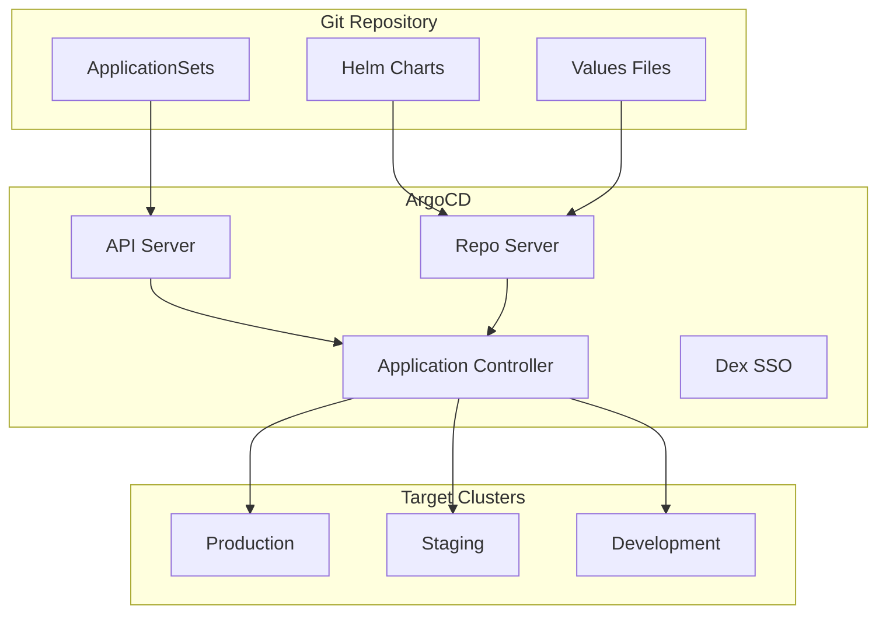

# Using Helm with ArgoCD for GitOps Deployments

Author: [nawazdhandala](https://www.github.com/nawazdhandala)

Tags: Helm, Kubernetes, DevOps, ArgoCD, GitOps, CI/CD, Automation

Description: Complete guide to integrating Helm charts with ArgoCD for declarative GitOps deployments with sync waves and automated rollouts.

> ArgoCD provides GitOps-style continuous delivery for Kubernetes. This guide covers integrating Helm charts into ArgoCD Applications, using ApplicationSets for multi-cluster deployments, and implementing sync waves for ordered deployments.

## ArgoCD and Helm Architecture



## Installing ArgoCD

### Install with Helm

```bash
helm repo add argo https://argoproj.github.io/argo-helm
helm repo update
```

### Production Configuration

```yaml
# argocd-values.yaml
global:
  domain: argocd.example.com

server:
  replicas: 2
  
  ingress:
    enabled: true
    ingressClassName: nginx
    annotations:
      cert-manager.io/cluster-issuer: letsencrypt-prod
    hosts:
      - argocd.example.com
    tls:
      - secretName: argocd-tls
        hosts:
          - argocd.example.com
          
  resources:
    requests:
      cpu: 100m
      memory: 256Mi
    limits:
      cpu: 500m
      memory: 512Mi

controller:
  replicas: 1
  resources:
    requests:
      cpu: 250m
      memory: 256Mi
    limits:
      cpu: 1000m
      memory: 1Gi

repoServer:
  replicas: 2
  resources:
    requests:
      cpu: 100m
      memory: 128Mi
    limits:
      cpu: 500m
      memory: 512Mi

dex:
  enabled: true
  
redis:
  enabled: true
  
configs:
  params:
    server.insecure: false
    
  repositories:
    private-repo:
      url: https://github.com/myorg/helm-charts.git
      password: ${GITHUB_TOKEN}
      username: git
      
  credentialTemplates:
    github-creds:
      url: https://github.com/myorg
      password: ${GITHUB_TOKEN}
      username: git
```

```bash
helm install argocd argo/argo-cd \
  --namespace argocd \
  --create-namespace \
  -f argocd-values.yaml
```

## Basic Helm Application

### Application from Helm Repository

```yaml
# application-nginx.yaml
apiVersion: argoproj.io/v1alpha1
kind: Application
metadata:
  name: nginx-ingress
  namespace: argocd
spec:
  project: default
  
  source:
    repoURL: https://kubernetes.github.io/ingress-nginx
    chart: ingress-nginx
    targetRevision: 4.8.0
    helm:
      releaseName: nginx-ingress
      values: |
        controller:
          replicaCount: 2
          service:
            type: LoadBalancer
          metrics:
            enabled: true
            
  destination:
    server: https://kubernetes.default.svc
    namespace: ingress-nginx
    
  syncPolicy:
    automated:
      prune: true
      selfHeal: true
    syncOptions:
      - CreateNamespace=true
```

### Application from Git Repository

```yaml
# application-myapp.yaml
apiVersion: argoproj.io/v1alpha1
kind: Application
metadata:
  name: myapp
  namespace: argocd
spec:
  project: default
  
  source:
    repoURL: https://github.com/myorg/helm-charts.git
    path: charts/myapp
    targetRevision: main
    helm:
      releaseName: myapp
      valueFiles:
        - values.yaml
        - values-production.yaml
      parameters:
        - name: image.tag
          value: "v1.2.3"
        - name: replicaCount
          value: "3"
          
  destination:
    server: https://kubernetes.default.svc
    namespace: myapp
    
  syncPolicy:
    automated:
      prune: true
      selfHeal: true
      allowEmpty: false
    syncOptions:
      - CreateNamespace=true
      - PrunePropagationPolicy=foreground
      - PruneLast=true
```

## Multi-Environment with ApplicationSets

### Git Directory Generator

```yaml
# applicationset-environments.yaml
apiVersion: argoproj.io/v1alpha1
kind: ApplicationSet
metadata:
  name: myapp-environments
  namespace: argocd
spec:
  generators:
    - git:
        repoURL: https://github.com/myorg/gitops-config.git
        revision: main
        directories:
          - path: environments/*
          
  template:
    metadata:
      name: 'myapp-{{path.basename}}'
    spec:
      project: default
      source:
        repoURL: https://github.com/myorg/helm-charts.git
        path: charts/myapp
        targetRevision: main
        helm:
          releaseName: myapp
          valueFiles:
            - values.yaml
            - '../../gitops-config/environments/{{path.basename}}/values.yaml'
      destination:
        server: https://kubernetes.default.svc
        namespace: 'myapp-{{path.basename}}'
      syncPolicy:
        automated:
          prune: true
          selfHeal: true
        syncOptions:
          - CreateNamespace=true
```

### List Generator for Multi-Cluster

```yaml
# applicationset-clusters.yaml
apiVersion: argoproj.io/v1alpha1
kind: ApplicationSet
metadata:
  name: myapp-clusters
  namespace: argocd
spec:
  generators:
    - list:
        elements:
          - cluster: production
            url: https://prod-cluster.example.com
            values:
              replicaCount: "5"
              environment: production
          - cluster: staging
            url: https://staging-cluster.example.com
            values:
              replicaCount: "2"
              environment: staging
          - cluster: development
            url: https://dev-cluster.example.com
            values:
              replicaCount: "1"
              environment: development
              
  template:
    metadata:
      name: 'myapp-{{cluster}}'
    spec:
      project: default
      source:
        repoURL: https://github.com/myorg/helm-charts.git
        path: charts/myapp
        targetRevision: main
        helm:
          releaseName: myapp
          parameters:
            - name: replicaCount
              value: '{{values.replicaCount}}'
            - name: environment
              value: '{{values.environment}}'
      destination:
        server: '{{url}}'
        namespace: myapp
```

### Matrix Generator

```yaml
# applicationset-matrix.yaml
apiVersion: argoproj.io/v1alpha1
kind: ApplicationSet
metadata:
  name: myapp-matrix
  namespace: argocd
spec:
  generators:
    - matrix:
        generators:
          # Clusters
          - clusters:
              selector:
                matchLabels:
                  tier: production
          # Applications
          - list:
              elements:
                - app: frontend
                  chart: frontend
                - app: backend
                  chart: backend
                - app: worker
                  chart: worker
                  
  template:
    metadata:
      name: '{{app}}-{{name}}'
    spec:
      project: default
      source:
        repoURL: https://github.com/myorg/helm-charts.git
        path: 'charts/{{chart}}'
        targetRevision: main
        helm:
          releaseName: '{{app}}'
          valueFiles:
            - values.yaml
            - 'values-{{metadata.labels.environment}}.yaml'
      destination:
        server: '{{server}}'
        namespace: '{{app}}'
```

## Sync Waves and Hooks

### Ordered Deployment with Sync Waves

```yaml
# infrastructure-app.yaml
apiVersion: argoproj.io/v1alpha1
kind: Application
metadata:
  name: infrastructure
  namespace: argocd
  annotations:
    argocd.argoproj.io/sync-wave: "-1"  # Deploy first
spec:
  project: default
  source:
    repoURL: https://github.com/myorg/helm-charts.git
    path: charts/infrastructure
    helm:
      releaseName: infrastructure
  destination:
    server: https://kubernetes.default.svc
    namespace: infrastructure

---
# database-app.yaml
apiVersion: argoproj.io/v1alpha1
kind: Application
metadata:
  name: database
  namespace: argocd
  annotations:
    argocd.argoproj.io/sync-wave: "0"  # Deploy second
spec:
  project: default
  source:
    repoURL: https://github.com/myorg/helm-charts.git
    path: charts/postgresql
    helm:
      releaseName: database
  destination:
    server: https://kubernetes.default.svc
    namespace: database

---
# application-app.yaml
apiVersion: argoproj.io/v1alpha1
kind: Application
metadata:
  name: myapp
  namespace: argocd
  annotations:
    argocd.argoproj.io/sync-wave: "1"  # Deploy last
spec:
  project: default
  source:
    repoURL: https://github.com/myorg/helm-charts.git
    path: charts/myapp
    helm:
      releaseName: myapp
  destination:
    server: https://kubernetes.default.svc
    namespace: myapp
```

### Helm Chart with Sync Waves

```yaml
# charts/myapp/templates/configmap.yaml
apiVersion: v1
kind: ConfigMap
metadata:
  name: {{ include "myapp.fullname" . }}-config
  annotations:
    argocd.argoproj.io/sync-wave: "-1"
data:
  config.yaml: |
    {{ .Values.config | toYaml | nindent 4 }}

---
# charts/myapp/templates/deployment.yaml
apiVersion: apps/v1
kind: Deployment
metadata:
  name: {{ include "myapp.fullname" . }}
  annotations:
    argocd.argoproj.io/sync-wave: "0"
spec:
  # ...

---
# charts/myapp/templates/hpa.yaml
apiVersion: autoscaling/v2
kind: HorizontalPodAutoscaler
metadata:
  name: {{ include "myapp.fullname" . }}
  annotations:
    argocd.argoproj.io/sync-wave: "1"
spec:
  # ...
```

### PreSync and PostSync Hooks

```yaml
# charts/myapp/templates/pre-sync-job.yaml
apiVersion: batch/v1
kind: Job
metadata:
  name: {{ include "myapp.fullname" . }}-db-migrate
  annotations:
    argocd.argoproj.io/hook: PreSync
    argocd.argoproj.io/hook-delete-policy: HookSucceeded
spec:
  template:
    spec:
      containers:
        - name: migrate
          image: {{ .Values.image.repository }}:{{ .Values.image.tag }}
          command: ["./migrate.sh"]
          env:
            - name: DATABASE_URL
              valueFrom:
                secretKeyRef:
                  name: database-credentials
                  key: url
      restartPolicy: Never
  backoffLimit: 3

---
# charts/myapp/templates/post-sync-job.yaml
apiVersion: batch/v1
kind: Job
metadata:
  name: {{ include "myapp.fullname" . }}-smoke-test
  annotations:
    argocd.argoproj.io/hook: PostSync
    argocd.argoproj.io/hook-delete-policy: HookSucceeded
spec:
  template:
    spec:
      containers:
        - name: smoke-test
          image: curlimages/curl:latest
          command:
            - curl
            - -sf
            - http://{{ include "myapp.fullname" . }}:{{ .Values.service.port }}/health
      restartPolicy: Never
  backoffLimit: 3
```

## Progressive Delivery

### Rollout Strategy with Argo Rollouts

```yaml
# application-with-rollout.yaml
apiVersion: argoproj.io/v1alpha1
kind: Application
metadata:
  name: myapp-canary
  namespace: argocd
spec:
  project: default
  source:
    repoURL: https://github.com/myorg/helm-charts.git
    path: charts/myapp
    targetRevision: main
    helm:
      releaseName: myapp
      values: |
        rollout:
          enabled: true
          strategy:
            canary:
              steps:
                - setWeight: 10
                - pause: {duration: 5m}
                - setWeight: 30
                - pause: {duration: 5m}
                - setWeight: 50
                - pause: {duration: 5m}
                - setWeight: 100
              analysis:
                templates:
                  - templateName: success-rate
                startingStep: 2
                args:
                  - name: service-name
                    value: myapp
  destination:
    server: https://kubernetes.default.svc
    namespace: myapp
```

### Analysis Template for Canary

```yaml
# charts/myapp/templates/analysis-template.yaml
{{- if .Values.rollout.enabled }}
apiVersion: argoproj.io/v1alpha1
kind: AnalysisTemplate
metadata:
  name: success-rate
spec:
  args:
    - name: service-name
  metrics:
    - name: success-rate
      interval: 1m
      successCondition: result[0] >= 0.95
      failureLimit: 3
      provider:
        prometheus:
          address: http://prometheus:9090
          query: |
            sum(rate(http_requests_total{service="{{args.service-name}}",status=~"2.*"}[5m])) /
            sum(rate(http_requests_total{service="{{args.service-name}}"}[5m]))
{{- end }}
```

## Image Updater

### Configure Image Updater

```yaml
# argocd-image-updater-values.yaml
config:
  registries:
    - name: DockerHub
      prefix: docker.io
      api_url: https://registry-1.docker.io
      credentials: pullsecret:argocd/dockerhub-credentials
      
    - name: GHCR
      prefix: ghcr.io
      api_url: https://ghcr.io
      credentials: pullsecret:argocd/ghcr-credentials
      
  argocd:
    grpcWeb: true
    serverAddress: argocd-server.argocd
```

### Application with Image Updates

```yaml
# application-auto-update.yaml
apiVersion: argoproj.io/v1alpha1
kind: Application
metadata:
  name: myapp
  namespace: argocd
  annotations:
    argocd-image-updater.argoproj.io/image-list: myimage=myorg/myapp
    argocd-image-updater.argoproj.io/myimage.update-strategy: semver
    argocd-image-updater.argoproj.io/myimage.allow-tags: regexp:^v[0-9]+\.[0-9]+\.[0-9]+$
    argocd-image-updater.argoproj.io/write-back-method: git
spec:
  project: default
  source:
    repoURL: https://github.com/myorg/helm-charts.git
    path: charts/myapp
    targetRevision: main
    helm:
      releaseName: myapp
      parameters:
        - name: image.repository
          value: myorg/myapp
        - name: image.tag
          value: v1.0.0  # Will be updated automatically
  destination:
    server: https://kubernetes.default.svc
    namespace: myapp
```

## Monitoring

### Prometheus Metrics

```yaml
# servicemonitor.yaml
apiVersion: monitoring.coreos.com/v1
kind: ServiceMonitor
metadata:
  name: argocd
  namespace: monitoring
spec:
  selector:
    matchLabels:
      app.kubernetes.io/part-of: argocd
  namespaceSelector:
    matchNames:
      - argocd
  endpoints:
    - port: metrics
      interval: 30s
```

### Alerts

```yaml
# alerts.yaml
apiVersion: monitoring.coreos.com/v1
kind: PrometheusRule
metadata:
  name: argocd-alerts
spec:
  groups:
    - name: argocd
      rules:
        - alert: ArgoCDAppOutOfSync
          expr: |
            argocd_app_info{sync_status="OutOfSync"} == 1
          for: 10m
          labels:
            severity: warning
          annotations:
            summary: "ArgoCD app {{ $labels.name }} is out of sync"
            
        - alert: ArgoCDAppSyncFailed
          expr: |
            argocd_app_info{health_status="Degraded"} == 1
          for: 5m
          labels:
            severity: critical
          annotations:
            summary: "ArgoCD app {{ $labels.name }} sync failed"
```

## Troubleshooting

```bash
# Check application status
argocd app get myapp

# View application logs
argocd app logs myapp

# Sync application manually
argocd app sync myapp

# Diff against live state
argocd app diff myapp

# Hard refresh
argocd app get myapp --hard-refresh

# Delete and recreate
argocd app delete myapp
argocd app create -f application.yaml

# Debug Helm rendering
argocd app manifests myapp --source helm
```

## Wrap-up

ArgoCD provides powerful GitOps capabilities for Helm deployments. Use Applications for single deployments, ApplicationSets for multi-environment and multi-cluster scenarios, and sync waves for ordered deployments. Integrate with Argo Rollouts for progressive delivery and Image Updater for automated image updates. Monitor your deployments with Prometheus metrics and alerts.
