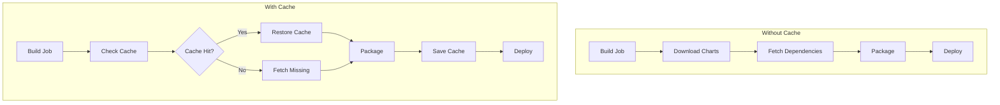

# How to Cache Helm Charts in CI/CD Pipelines for Faster Builds

Author: [nawazdhandala](https://www.github.com/nawazdhandala)

Tags: Helm, Kubernetes, DevOps, CI/CD, GitHub Actions, GitLab CI, Performance

Description: Comprehensive strategies for caching Helm charts and dependencies in CI/CD pipelines including GitHub Actions, GitLab CI, and Jenkins for faster builds.

> Downloading Helm charts and dependencies on every CI/CD run wastes time and bandwidth. This guide covers effective caching strategies for major CI/CD platforms to dramatically speed up your pipelines.

## CI/CD Caching Architecture



## GitHub Actions Caching

### Basic Chart Cache

```yaml
# .github/workflows/helm-deploy.yaml
name: Helm Deploy

on: [push]

jobs:
  deploy:
    runs-on: ubuntu-latest
    steps:
      - uses: actions/checkout@v4
      
      - name: Setup Helm
        uses: azure/setup-helm@v3
        with:
          version: v3.13.0
      
      # Cache Helm dependencies
      - name: Cache Helm Dependencies
        uses: actions/cache@v3
        with:
          path: |
            charts/*/charts
            ~/.cache/helm
          key: helm-deps-${{ hashFiles('charts/*/Chart.lock') }}
          restore-keys: |
            helm-deps-
      
      - name: Build Dependencies
        run: |
          for chart in charts/*/; do
            helm dependency build "$chart"
          done
      
      - name: Deploy
        run: helm upgrade --install myapp charts/myapp
```

### Multi-Chart Cache

```yaml
# .github/workflows/helm-multi-chart.yaml
name: Multi-Chart Pipeline

on: [push]

jobs:
  build:
    runs-on: ubuntu-latest
    strategy:
      matrix:
        chart: [frontend, backend, database]
    steps:
      - uses: actions/checkout@v4
      
      - name: Setup Helm
        uses: azure/setup-helm@v3
      
      # Per-chart cache
      - name: Cache ${{ matrix.chart }} Dependencies
        uses: actions/cache@v3
        with:
          path: charts/${{ matrix.chart }}/charts
          key: helm-${{ matrix.chart }}-${{ hashFiles(format('charts/{0}/Chart.lock', matrix.chart)) }}
          restore-keys: |
            helm-${{ matrix.chart }}-
      
      - name: Build ${{ matrix.chart }}
        run: |
          helm dependency build charts/${{ matrix.chart }}
          helm package charts/${{ matrix.chart }} -d packages/
      
      - uses: actions/upload-artifact@v3
        with:
          name: ${{ matrix.chart }}-chart
          path: packages/*.tgz
```

### Repository Cache

```yaml
# .github/workflows/helm-repo-cache.yaml
name: Helm with Repository Cache

on: [push]

jobs:
  deploy:
    runs-on: ubuntu-latest
    steps:
      - uses: actions/checkout@v4
      
      - name: Setup Helm
        uses: azure/setup-helm@v3
      
      # Cache repository indexes
      - name: Cache Helm Repositories
        uses: actions/cache@v3
        with:
          path: ~/.cache/helm/repository
          key: helm-repos-${{ hashFiles('.helm-repositories') }}
          restore-keys: |
            helm-repos-
      
      - name: Add Repositories
        run: |
          helm repo add bitnami https://charts.bitnami.com/bitnami
          helm repo add prometheus https://prometheus-community.github.io/helm-charts
          helm repo update
      
      - name: Build Dependencies
        run: helm dependency build charts/myapp
```

## GitLab CI Caching

### Basic GitLab Cache

```yaml
# .gitlab-ci.yml
variables:
  HELM_CACHE_HOME: $CI_PROJECT_DIR/.helm
  
stages:
  - build
  - deploy

cache:
  key: helm-${CI_COMMIT_REF_SLUG}
  paths:
    - .helm/
    - charts/*/charts/
  policy: pull-push

build:
  stage: build
  image: alpine/helm:3.13.0
  before_script:
    - mkdir -p $HELM_CACHE_HOME
    - export HELM_CACHE_HOME
  script:
    - helm dependency build charts/myapp
    - helm package charts/myapp -d packages/
  artifacts:
    paths:
      - packages/*.tgz
    expire_in: 1 hour

deploy:
  stage: deploy
  image: alpine/helm:3.13.0
  dependencies:
    - build
  script:
    - helm upgrade --install myapp packages/myapp-*.tgz
```

### Per-Branch Cache

```yaml
# .gitlab-ci.yml
variables:
  HELM_CACHE_HOME: $CI_PROJECT_DIR/.helm

.helm-cache:
  cache:
    key:
      files:
        - charts/*/Chart.lock
      prefix: helm
    paths:
      - .helm/
      - charts/*/charts/

build-feature:
  extends: .helm-cache
  rules:
    - if: $CI_COMMIT_BRANCH != "main"
  cache:
    policy: pull-push
  script:
    - helm dependency build charts/myapp

build-main:
  extends: .helm-cache
  rules:
    - if: $CI_COMMIT_BRANCH == "main"
  cache:
    policy: pull  # Only read from cache on main
  script:
    - helm dependency build charts/myapp
    - helm package charts/myapp
```

### Distributed Cache

```yaml
# .gitlab-ci.yml with distributed cache
variables:
  HELM_CACHE_HOME: /tmp/helm-cache

default:
  cache:
    - key: helm-deps-${CI_COMMIT_REF_SLUG}
      paths:
        - charts/*/charts/
      policy: pull-push
    - key: helm-repos
      paths:
        - .helm-repository-cache/
      policy: pull-push

stages:
  - setup
  - build
  - test
  - deploy

setup-repos:
  stage: setup
  image: alpine/helm:3.13.0
  script:
    - mkdir -p .helm-repository-cache
    - helm repo add bitnami https://charts.bitnami.com/bitnami --repository-cache .helm-repository-cache
    - helm repo add ingress-nginx https://kubernetes.github.io/ingress-nginx --repository-cache .helm-repository-cache
    - helm repo update --repository-cache .helm-repository-cache

build-charts:
  stage: build
  image: alpine/helm:3.13.0
  needs: [setup-repos]
  script:
    - helm dependency build charts/myapp --repository-cache .helm-repository-cache
    - helm package charts/myapp -d packages/
```

## Jenkins Pipeline Caching

### Declarative Pipeline

```groovy
// Jenkinsfile
pipeline {
    agent any
    
    environment {
        HELM_CACHE = "${WORKSPACE}/.helm-cache"
        CHART_CACHE = "${WORKSPACE}/chart-cache"
    }
    
    stages {
        stage('Setup Cache') {
            steps {
                script {
                    // Create cache directories
                    sh "mkdir -p ${HELM_CACHE} ${CHART_CACHE}"
                    
                    // Restore cache if exists
                    if (fileExists('chart-cache/charts.tar.gz')) {
                        sh "tar xzf chart-cache/charts.tar.gz -C charts/ || true"
                    }
                }
            }
        }
        
        stage('Build Dependencies') {
            steps {
                sh '''
                    export HELM_CACHE_HOME=${HELM_CACHE}
                    helm dependency build charts/myapp
                '''
            }
        }
        
        stage('Package') {
            steps {
                sh 'helm package charts/myapp -d packages/'
                
                // Save cache
                sh 'tar czf chart-cache/charts.tar.gz -C charts myapp/charts || true'
            }
        }
        
        stage('Deploy') {
            steps {
                sh 'helm upgrade --install myapp packages/myapp-*.tgz'
            }
        }
    }
    
    post {
        always {
            // Archive cache for next build
            archiveArtifacts artifacts: 'chart-cache/*.tar.gz', allowEmptyArchive: true
        }
    }
}
```

### Stash/Unstash Pattern

```groovy
// Jenkinsfile with stash
pipeline {
    agent none
    
    stages {
        stage('Build Charts') {
            agent { label 'helm' }
            steps {
                checkout scm
                
                // Try unstash previous cache
                script {
                    try {
                        unstash 'helm-deps'
                    } catch (Exception e) {
                        echo "No previous cache found"
                    }
                }
                
                sh 'helm dependency build charts/myapp'
                sh 'helm package charts/myapp -d packages/'
                
                // Stash dependencies for future builds
                stash name: 'helm-deps', includes: 'charts/*/charts/**'
                stash name: 'helm-packages', includes: 'packages/*.tgz'
            }
        }
        
        stage('Deploy') {
            agent { label 'kubectl' }
            steps {
                unstash 'helm-packages'
                sh 'helm upgrade --install myapp packages/myapp-*.tgz'
            }
        }
    }
}
```

## Azure DevOps Caching

### Pipeline Cache Task

```yaml
# azure-pipelines.yml
trigger:
  - main

pool:
  vmImage: ubuntu-latest

variables:
  helmVersion: 3.13.0

steps:
  - task: HelmInstaller@1
    inputs:
      helmVersionToInstall: $(helmVersion)

  # Cache Helm dependencies
  - task: Cache@2
    inputs:
      key: 'helm | "$(Agent.OS)" | charts/*/Chart.lock'
      path: charts/myapp/charts
      restoreKeys: |
        helm | "$(Agent.OS)"
    displayName: Cache Helm Dependencies

  # Cache Helm repository
  - task: Cache@2
    inputs:
      key: 'helm-repo | "$(Agent.OS)"'
      path: $(HOME)/.cache/helm
    displayName: Cache Helm Repository

  - script: |
      helm dependency build charts/myapp
      helm package charts/myapp -d $(Build.ArtifactStagingDirectory)
    displayName: Build Chart

  - task: PublishBuildArtifacts@1
    inputs:
      pathToPublish: $(Build.ArtifactStagingDirectory)
      artifactName: helm-charts
```

## CircleCI Caching

### Basic CircleCI Cache

```yaml
# .circleci/config.yml
version: 2.1

orbs:
  helm: circleci/helm@2.0.1

jobs:
  build:
    docker:
      - image: cimg/base:2023.09
    steps:
      - checkout
      
      - helm/install-helm-client:
          version: v3.13.0
      
      # Restore cache
      - restore_cache:
          keys:
            - helm-deps-v1-{{ checksum "charts/myapp/Chart.lock" }}
            - helm-deps-v1-
      
      - run:
          name: Build Dependencies
          command: helm dependency build charts/myapp
      
      # Save cache
      - save_cache:
          key: helm-deps-v1-{{ checksum "charts/myapp/Chart.lock" }}
          paths:
            - charts/myapp/charts
            - ~/.cache/helm
      
      - run:
          name: Package Chart
          command: helm package charts/myapp -d packages/
      
      - persist_to_workspace:
          root: .
          paths:
            - packages/*.tgz

  deploy:
    docker:
      - image: cimg/base:2023.09
    steps:
      - attach_workspace:
          at: .
      - helm/install-helm-client
      - run:
          name: Deploy
          command: helm upgrade --install myapp packages/myapp-*.tgz

workflows:
  build-deploy:
    jobs:
      - build
      - deploy:
          requires:
            - build
```

## Custom Cache Server

### Nginx Chart Cache

```yaml
# cache-server/values.yaml
replicaCount: 1

image:
  repository: nginx
  tag: alpine

persistence:
  enabled: true
  size: 10Gi

config: |
  server {
    listen 80;
    
    location /charts/ {
      alias /data/charts/;
      autoindex on;
      
      # Enable caching headers
      add_header Cache-Control "public, max-age=3600";
    }
    
    # Accept uploads
    location /upload {
      client_max_body_size 100M;
      dav_methods PUT;
      create_full_put_path on;
      alias /data/charts/;
    }
  }
```

### Using Cache Server in CI

```yaml
# .github/workflows/with-cache-server.yaml
name: Helm with Cache Server

env:
  CHART_CACHE_URL: https://chart-cache.internal.example.com

jobs:
  build:
    runs-on: ubuntu-latest
    steps:
      - uses: actions/checkout@v4
      
      - name: Setup Helm
        uses: azure/setup-helm@v3
      
      # Add cache server as repository
      - name: Configure Cache Repository
        run: |
          helm repo add cache ${{ env.CHART_CACHE_URL }}/charts
          helm repo update
      
      - name: Build with Cache
        run: |
          # Try cache first, fallback to upstream
          helm dependency build charts/myapp || {
            echo "Cache miss, using upstream"
            helm repo add bitnami https://charts.bitnami.com/bitnami
            helm repo update
            helm dependency build charts/myapp
          }
      
      - name: Update Cache
        if: success()
        run: |
          # Push chart to cache for future builds
          for chart in charts/myapp/charts/*.tgz; do
            curl -X PUT -T "$chart" "${{ env.CHART_CACHE_URL }}/upload/$(basename $chart)"
          done
```

## Cache Invalidation Strategies

### Lock File Based

```yaml
# Key based on Chart.lock
cache:
  key: helm-deps-${{ hashFiles('charts/*/Chart.lock') }}
```

### Version Based

```yaml
# Key based on Chart.yaml versions
cache:
  key: helm-deps-${{ hashFiles('charts/*/Chart.yaml') }}
```

### Time Based

```yaml
# Weekly cache refresh
cache:
  key: helm-deps-${{ github.run_id }}-week-${{ steps.week.outputs.number }}

steps:
  - id: week
    run: echo "number=$(date +%V)" >> $GITHUB_OUTPUT
```

## Performance Comparison

| Strategy | First Build | Cached Build | Savings |
|----------|-------------|--------------|---------|
| No cache | 5 min | 5 min | 0% |
| Deps only | 5 min | 1 min | 80% |
| Deps + repos | 5 min | 30 sec | 90% |
| Custom server | 5 min | 15 sec | 95% |

## Best Practices

| Practice | Description |
|----------|-------------|
| Use Lock Files | Generate Chart.lock for reproducibility |
| Layer Caches | Separate repo and dependency caches |
| Set Expiration | Prevent stale caches |
| Monitor Hit Rate | Track cache effectiveness |
| Parallel Builds | Cache per-chart for matrix builds |
| Fallback Logic | Handle cache misses gracefully |

## Troubleshooting

```bash
# Debug cache issues
helm dependency build charts/myapp --debug

# Verify cache contents
ls -la charts/myapp/charts/

# Force refresh
rm -rf charts/myapp/charts/*.tgz
helm dependency update charts/myapp

# Check repository cache
ls -la ~/.cache/helm/repository/
```

## Wrap-up

Caching Helm charts in CI/CD pipelines significantly reduces build times. Use platform-specific cache mechanisms with lock-file-based keys for optimal cache hits. Layer caches for repositories and dependencies separately, and consider a custom cache server for large organizations with many charts.
