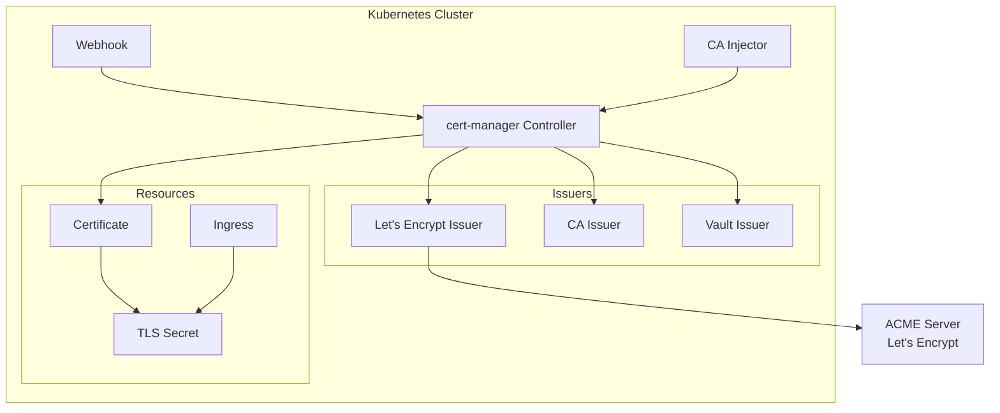
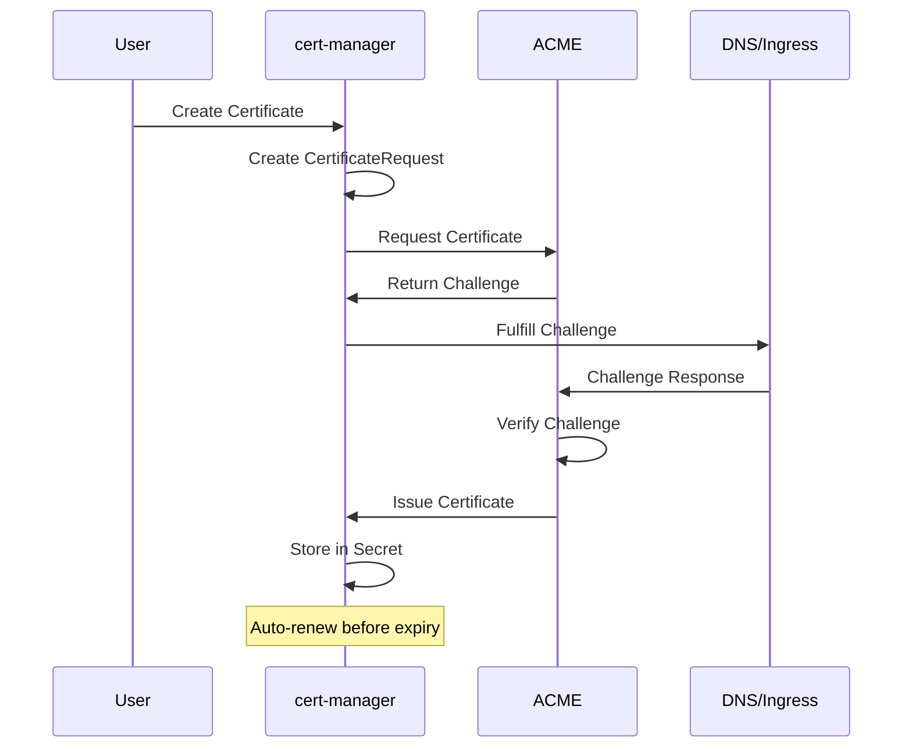

# Deploying cert-manager with Helm for Kubernetes TLS Certificates

Author: [nawazdhandala](https://www.github.com/nawazdhandala)

Tags: Helm, Kubernetes, DevOps, cert-manager, TLS, SSL, Let's Encrypt

Description: Complete guide to deploying cert-manager on Kubernetes using Helm for automated TLS certificate management with Let's Encrypt and other issuers.

> Managing TLS certificates manually is error-prone and time-consuming. cert-manager automates the creation, renewal, and management of TLS certificates in Kubernetes. This guide covers installation, configuration with various issuers, and production best practices.

## Architecture Overview



## Installation

### Add Repository

```bash
# Add the Jetstack repository
helm repo add jetstack https://charts.jetstack.io

# Update repositories
helm repo update

# Search for available versions
helm search repo cert-manager --versions
```

### Install cert-manager

```bash
# Install with CRDs
helm install cert-manager jetstack/cert-manager \
  --namespace cert-manager \
  --create-namespace \
  --set installCRDs=true
```

### Verify Installation

```bash
# Check pods
kubectl get pods -n cert-manager

# Check CRDs
kubectl get crd | grep cert-manager

# Test the installation
kubectl apply -f - <<EOF
apiVersion: v1
kind: Namespace
metadata:
  name: cert-manager-test
---
apiVersion: cert-manager.io/v1
kind: Issuer
metadata:
  name: test-selfsigned
  namespace: cert-manager-test
spec:
  selfSigned: {}
---
apiVersion: cert-manager.io/v1
kind: Certificate
metadata:
  name: selfsigned-cert
  namespace: cert-manager-test
spec:
  dnsNames:
    - example.com
  secretName: selfsigned-cert-tls
  issuerRef:
    name: test-selfsigned
EOF

# Verify certificate was issued
kubectl get certificate -n cert-manager-test
kubectl delete namespace cert-manager-test
```

## Production Configuration

### Complete Production Values

```yaml
# cert-manager-values.yaml
installCRDs: true

replicaCount: 2

resources:
  requests:
    cpu: 50m
    memory: 64Mi
  limits:
    cpu: 500m
    memory: 256Mi

# Pod disruption budget
podDisruptionBudget:
  enabled: true
  minAvailable: 1

# Prometheus metrics
prometheus:
  enabled: true
  servicemonitor:
    enabled: true
    namespace: monitoring
    labels:
      release: prometheus

# Webhook configuration
webhook:
  replicaCount: 2
  resources:
    requests:
      cpu: 25m
      memory: 32Mi
    limits:
      cpu: 250m
      memory: 128Mi

# CA Injector configuration
cainjector:
  replicaCount: 2
  resources:
    requests:
      cpu: 25m
      memory: 64Mi
    limits:
      cpu: 250m
      memory: 256Mi

# DNS settings for ACME DNS01 challenges
extraArgs:
  - --dns01-recursive-nameservers-only
  - --dns01-recursive-nameservers=8.8.8.8:53,1.1.1.1:53

# Node affinity
affinity:
  nodeAffinity:
    preferredDuringSchedulingIgnoredDuringExecution:
    - weight: 100
      preference:
        matchExpressions:
        - key: node-type
          operator: In
          values:
          - system

# Tolerations
tolerations:
  - key: "node-role.kubernetes.io/control-plane"
    operator: "Exists"
    effect: "NoSchedule"
```

### Install with Production Values

```bash
helm install cert-manager jetstack/cert-manager \
  --namespace cert-manager \
  --create-namespace \
  -f cert-manager-values.yaml
```

## Configure Let's Encrypt Issuers

### Staging Issuer (for testing)

```yaml
# letsencrypt-staging-issuer.yaml
apiVersion: cert-manager.io/v1
kind: ClusterIssuer
metadata:
  name: letsencrypt-staging
spec:
  acme:
    # Staging endpoint
    server: https://acme-staging-v02.api.letsencrypt.org/directory
    email: admin@example.com
    privateKeySecretRef:
      name: letsencrypt-staging-account-key
    solvers:
      - http01:
          ingress:
            ingressClassName: nginx
```

### Production Issuer

```yaml
# letsencrypt-prod-issuer.yaml
apiVersion: cert-manager.io/v1
kind: ClusterIssuer
metadata:
  name: letsencrypt-prod
spec:
  acme:
    # Production endpoint
    server: https://acme-v02.api.letsencrypt.org/directory
    email: admin@example.com
    privateKeySecretRef:
      name: letsencrypt-prod-account-key
    solvers:
      - http01:
          ingress:
            ingressClassName: nginx
```

Apply the issuers:

```bash
kubectl apply -f letsencrypt-staging-issuer.yaml
kubectl apply -f letsencrypt-prod-issuer.yaml

# Verify issuers
kubectl get clusterissuers
kubectl describe clusterissuer letsencrypt-prod
```

## DNS01 Challenge Configuration

### Route53 (AWS)

```yaml
# route53-issuer.yaml
apiVersion: cert-manager.io/v1
kind: ClusterIssuer
metadata:
  name: letsencrypt-dns
spec:
  acme:
    server: https://acme-v02.api.letsencrypt.org/directory
    email: admin@example.com
    privateKeySecretRef:
      name: letsencrypt-dns-account-key
    solvers:
      - dns01:
          route53:
            region: us-east-1
            # IAM role for EKS IRSA
            # role: arn:aws:iam::ACCOUNT_ID:role/cert-manager-role
            # Or use access key
            accessKeyIDSecretRef:
              name: route53-credentials
              key: access-key-id
            secretAccessKeySecretRef:
              name: route53-credentials
              key: secret-access-key
```

Create credentials secret:

```bash
kubectl create secret generic route53-credentials \
  --namespace cert-manager \
  --from-literal=access-key-id=AKIAXXXXXXXX \
  --from-literal=secret-access-key=XXXXXXXX
```

### CloudFlare

```yaml
# cloudflare-issuer.yaml
apiVersion: cert-manager.io/v1
kind: ClusterIssuer
metadata:
  name: letsencrypt-cloudflare
spec:
  acme:
    server: https://acme-v02.api.letsencrypt.org/directory
    email: admin@example.com
    privateKeySecretRef:
      name: letsencrypt-cloudflare-account-key
    solvers:
      - dns01:
          cloudflare:
            email: admin@example.com
            apiTokenSecretRef:
              name: cloudflare-api-token
              key: api-token
```

Create CloudFlare token secret:

```bash
kubectl create secret generic cloudflare-api-token \
  --namespace cert-manager \
  --from-literal=api-token=your-cloudflare-api-token
```

### Google Cloud DNS

```yaml
# google-dns-issuer.yaml
apiVersion: cert-manager.io/v1
kind: ClusterIssuer
metadata:
  name: letsencrypt-google-dns
spec:
  acme:
    server: https://acme-v02.api.letsencrypt.org/directory
    email: admin@example.com
    privateKeySecretRef:
      name: letsencrypt-google-dns-account-key
    solvers:
      - dns01:
          cloudDNS:
            project: my-gcp-project
            serviceAccountSecretRef:
              name: clouddns-credentials
              key: credentials.json
```

## Create Certificates

### Manual Certificate

```yaml
# certificate.yaml
apiVersion: cert-manager.io/v1
kind: Certificate
metadata:
  name: example-com-tls
  namespace: my-app
spec:
  secretName: example-com-tls
  duration: 2160h    # 90 days
  renewBefore: 720h  # 30 days before expiry
  privateKey:
    algorithm: RSA
    size: 2048
  usages:
    - server auth
    - client auth
  dnsNames:
    - example.com
    - www.example.com
  issuerRef:
    name: letsencrypt-prod
    kind: ClusterIssuer
```

### Wildcard Certificate (requires DNS01)

```yaml
# wildcard-certificate.yaml
apiVersion: cert-manager.io/v1
kind: Certificate
metadata:
  name: wildcard-example-com
  namespace: my-app
spec:
  secretName: wildcard-example-com-tls
  duration: 2160h
  renewBefore: 720h
  privateKey:
    algorithm: RSA
    size: 2048
  dnsNames:
    - "*.example.com"
    - example.com
  issuerRef:
    name: letsencrypt-dns
    kind: ClusterIssuer
```

## Ingress Integration

### Automatic Certificate via Annotation

```yaml
# ingress-with-cert.yaml
apiVersion: networking.k8s.io/v1
kind: Ingress
metadata:
  name: my-app-ingress
  namespace: my-app
  annotations:
    # Trigger certificate creation
    cert-manager.io/cluster-issuer: letsencrypt-prod
    # Or for namespace issuer
    # cert-manager.io/issuer: my-issuer
spec:
  ingressClassName: nginx
  tls:
    - hosts:
        - app.example.com
      secretName: app-example-com-tls
  rules:
    - host: app.example.com
      http:
        paths:
          - path: /
            pathType: Prefix
            backend:
              service:
                name: my-app
                port:
                  number: 80
```

## Self-Signed and CA Issuers

### Self-Signed Issuer

```yaml
# selfsigned-issuer.yaml
apiVersion: cert-manager.io/v1
kind: ClusterIssuer
metadata:
  name: selfsigned-issuer
spec:
  selfSigned: {}
```

### CA Issuer

First, create a CA certificate:

```yaml
# ca-certificate.yaml
apiVersion: cert-manager.io/v1
kind: Certificate
metadata:
  name: my-ca
  namespace: cert-manager
spec:
  isCA: true
  commonName: my-internal-ca
  secretName: my-ca-secret
  privateKey:
    algorithm: ECDSA
    size: 256
  issuerRef:
    name: selfsigned-issuer
    kind: ClusterIssuer
```

Then create a CA issuer:

```yaml
# ca-issuer.yaml
apiVersion: cert-manager.io/v1
kind: ClusterIssuer
metadata:
  name: my-ca-issuer
spec:
  ca:
    secretName: my-ca-secret
```

## Vault Integration

```yaml
# vault-issuer.yaml
apiVersion: cert-manager.io/v1
kind: ClusterIssuer
metadata:
  name: vault-issuer
spec:
  vault:
    server: https://vault.example.com
    path: pki/sign/my-role
    auth:
      kubernetes:
        role: cert-manager
        mountPath: /v1/auth/kubernetes
        serviceAccountRef:
          name: cert-manager
```

## Monitoring and Alerts

### PrometheusRule for cert-manager

```yaml
# cert-manager-alerts.yaml
apiVersion: monitoring.coreos.com/v1
kind: PrometheusRule
metadata:
  name: cert-manager-alerts
  namespace: monitoring
spec:
  groups:
    - name: cert-manager
      rules:
        - alert: CertificateExpiringSoon
          expr: |
            certmanager_certificate_expiration_timestamp_seconds - time() < 604800
          for: 1h
          labels:
            severity: warning
          annotations:
            summary: Certificate expiring soon
            description: Certificate {{ $labels.name }} in {{ $labels.namespace }} expires in less than 7 days

        - alert: CertificateExpired
          expr: |
            certmanager_certificate_expiration_timestamp_seconds - time() <= 0
          for: 1h
          labels:
            severity: critical
          annotations:
            summary: Certificate has expired
            description: Certificate {{ $labels.name }} in {{ $labels.namespace }} has expired

        - alert: CertificateNotReady
          expr: |
            certmanager_certificate_ready_status{condition="False"} == 1
          for: 15m
          labels:
            severity: warning
          annotations:
            summary: Certificate not ready
            description: Certificate {{ $labels.name }} in {{ $labels.namespace }} is not ready
```

## Troubleshooting

### Check Certificate Status

```bash
# List certificates
kubectl get certificates -A

# Describe certificate
kubectl describe certificate my-cert -n my-namespace

# Check certificate events
kubectl get events -n my-namespace --field-selector involvedObject.name=my-cert
```

### Check Certificate Request

```bash
# List certificate requests
kubectl get certificaterequest -A

# Describe certificate request
kubectl describe certificaterequest my-cert-xxxx -n my-namespace
```

### Check Orders and Challenges

```bash
# For ACME certificates
kubectl get orders -A
kubectl describe order my-cert-xxxx -n my-namespace

kubectl get challenges -A
kubectl describe challenge my-challenge -n my-namespace
```

### Common Issues

**HTTP01 Challenge Failing:**
```bash
# Check ingress is working
kubectl get ingress -n my-namespace

# Test challenge endpoint
curl -v http://example.com/.well-known/acme-challenge/test
```

**DNS01 Challenge Failing:**
```bash
# Check DNS propagation
dig _acme-challenge.example.com TXT

# Check cert-manager logs
kubectl logs -n cert-manager deploy/cert-manager
```

### cert-manager Logs

```bash
# Controller logs
kubectl logs -n cert-manager deploy/cert-manager -f

# Webhook logs
kubectl logs -n cert-manager deploy/cert-manager-webhook -f

# CA injector logs
kubectl logs -n cert-manager deploy/cert-manager-cainjector -f
```

## Certificate Lifecycle



## Best Practices

| Practice | Description |
|----------|-------------|
| Use staging first | Test with Let's Encrypt staging before production |
| Set renewBefore | Renew certificates well before expiry |
| Use DNS01 for wildcards | HTTP01 cannot issue wildcard certificates |
| Monitor expiration | Set up alerts for expiring certificates |
| Limit rate | Be aware of Let's Encrypt rate limits |
| Use ClusterIssuers | Centralize issuer configuration |
| Secure credentials | Use secrets for API tokens and keys |

## Wrap-up

cert-manager automates TLS certificate management in Kubernetes. Install with Helm, configure ClusterIssuers for Let's Encrypt or other providers, and let cert-manager handle certificate lifecycle. Use HTTP01 challenges for public endpoints and DNS01 for wildcards or private domains. Monitor certificate status and set up alerts for expiring certificates to ensure continuous TLS coverage across your cluster.
