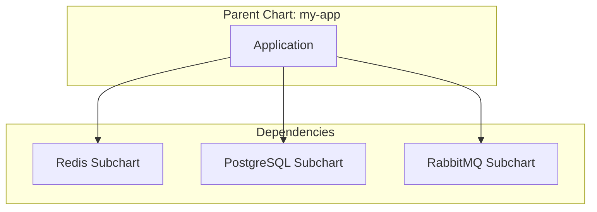

# Managing Helm Chart Dependencies and Subcharts

Author: [nawazdhandala](https://www.github.com/nawazdhandala)

Tags: Helm, Kubernetes, DevOps, Charts, Dependencies, Subcharts

Description: Learn how to manage chart dependencies, work with subcharts, and structure complex Helm deployments with proper dependency resolution.

> Real-world applications rarely stand alone. They need databases, caches, message queues, and other services. Helm's dependency management lets you bundle everything together while keeping components modular and reusable.

## Understanding Dependencies

Dependencies in Helm are subcharts that your main chart requires. When you install your chart, Helm automatically installs all dependencies.



## Declaring Dependencies

Dependencies are defined in `Chart.yaml` under the `dependencies` section.

### Basic Dependency

```yaml
# Chart.yaml
apiVersion: v2
name: my-app
version: 1.0.0
appVersion: "1.0.0"

dependencies:
  - name: redis
    version: 18.0.0
    repository: https://charts.bitnami.com/bitnami
```

### Multiple Dependencies

```yaml
# Chart.yaml
apiVersion: v2
name: my-app
version: 1.0.0
appVersion: "1.0.0"

dependencies:
  - name: redis
    version: 18.0.0
    repository: https://charts.bitnami.com/bitnami
    
  - name: postgresql
    version: 13.0.0
    repository: https://charts.bitnami.com/bitnami
    
  - name: rabbitmq
    version: 12.0.0
    repository: https://charts.bitnami.com/bitnami
```

### OCI Registry Dependencies

```yaml
dependencies:
  - name: redis
    version: 18.0.0
    repository: oci://registry-1.docker.io/bitnamicharts
```

### Local Chart Dependencies

Reference charts in your repository:

```yaml
dependencies:
  - name: common-library
    version: 1.0.0
    repository: file://../common-library
```

## Version Constraints

Use semantic versioning constraints for flexible version management.

```yaml
dependencies:
  # Exact version
  - name: redis
    version: 18.0.0
    repository: https://charts.bitnami.com/bitnami
    
  # Range - any 18.x version
  - name: postgresql
    version: ">=18.0.0 <19.0.0"
    repository: https://charts.bitnami.com/bitnami
    
  # Caret - compatible versions (same major)
  - name: rabbitmq
    version: ^12.0.0
    repository: https://charts.bitnami.com/bitnami
    
  # Tilde - patch versions only
  - name: mongodb
    version: ~14.0.0
    repository: https://charts.bitnami.com/bitnami
```

## Build and Update Dependencies

### Update Dependencies

Download and sync dependencies from repositories.

```bash
# Update dependencies (downloads to charts/ directory)
helm dependency update ./my-app

# This creates/updates:
# my-app/charts/redis-18.0.0.tgz
# my-app/charts/postgresql-13.0.0.tgz
# my-app/Chart.lock
```

### Build Dependencies

Build dependencies from Chart.lock without updating.

```bash
# Build from lock file (faster, reproducible)
helm dependency build ./my-app
```

### List Dependencies

View dependency status.

```bash
# List dependencies and status
helm dependency list ./my-app

# Output:
# NAME        VERSION   REPOSITORY                              STATUS
# redis       18.0.0    https://charts.bitnami.com/bitnami     ok
# postgresql  13.0.0    https://charts.bitnami.com/bitnami     ok
```

## Chart.lock File

`Chart.lock` pins exact versions for reproducible builds.

```yaml
# Chart.lock (auto-generated)
dependencies:
- name: redis
  repository: https://charts.bitnami.com/bitnami
  version: 18.0.4
- name: postgresql
  repository: https://charts.bitnami.com/bitnami
  version: 13.2.1
digest: sha256:abc123...
generated: "2024-01-15T10:30:00Z"
```

**Always commit Chart.lock** for reproducible builds across environments.

## Conditional Dependencies

Enable or disable dependencies based on values.

### Using Condition

```yaml
# Chart.yaml
dependencies:
  - name: redis
    version: 18.0.0
    repository: https://charts.bitnami.com/bitnami
    condition: redis.enabled
    
  - name: postgresql
    version: 13.0.0
    repository: https://charts.bitnami.com/bitnami
    condition: postgresql.enabled
```

```yaml
# values.yaml
redis:
  enabled: true

postgresql:
  enabled: false  # PostgreSQL will not be installed
```

### Using Tags

Group dependencies with tags for bulk enable/disable.

```yaml
# Chart.yaml
dependencies:
  - name: redis
    version: 18.0.0
    repository: https://charts.bitnami.com/bitnami
    tags:
      - cache
      - backend
    
  - name: memcached
    version: 6.0.0
    repository: https://charts.bitnami.com/bitnami
    tags:
      - cache
```

```yaml
# values.yaml
tags:
  cache: true    # Enables both redis and memcached
  backend: true
```

Condition takes precedence over tags.

## Configuring Dependencies

Pass values to subcharts by nesting under the dependency name.

### Override Subchart Values

```yaml
# values.yaml
# Configure the redis subchart
redis:
  enabled: true
  auth:
    enabled: true
    password: "secret"
  master:
    persistence:
      size: 10Gi
  replica:
    replicaCount: 3

# Configure the postgresql subchart
postgresql:
  enabled: true
  auth:
    postgresPassword: "secret"
    database: myapp
  primary:
    persistence:
      size: 20Gi
```

### Global Values

Share values across all charts with `global`.

```yaml
# values.yaml
global:
  # Available to all subcharts as .Values.global
  storageClass: fast-ssd
  imageRegistry: myregistry.com
  imagePullSecrets:
    - name: registry-secret

redis:
  # Redis can access .Values.global.storageClass
  master:
    persistence:
      storageClass: ""  # Uses global if not set

postgresql:
  # PostgreSQL can also access global values
  primary:
    persistence:
      storageClass: ""
```

### Access Global in Templates

```yaml
# In subchart template
{{- $storageClass := .Values.global.storageClass | default "standard" }}
storageClassName: {{ $storageClass }}
```

## Importing Values

Import values from subcharts into the parent chart.

### Import-values

```yaml
# Chart.yaml
dependencies:
  - name: redis
    version: 18.0.0
    repository: https://charts.bitnami.com/bitnami
    import-values:
      - child: master.service
        parent: redisService
```

This makes `redis.master.service.*` available as `redisService.*` in the parent.

### Export Values

Subcharts can export values for parent access.

```yaml
# Subchart's values.yaml
exports:
  connectionString: "redis://{{ .Release.Name }}-redis:6379"
```

```yaml
# Parent Chart.yaml
dependencies:
  - name: redis
    version: 18.0.0
    repository: https://charts.bitnami.com/bitnami
    import-values:
      - connectionString
```

## Aliasing Dependencies

Use the same chart multiple times with different configurations.

```yaml
# Chart.yaml
dependencies:
  - name: redis
    version: 18.0.0
    repository: https://charts.bitnami.com/bitnami
    alias: redis-cache
    
  - name: redis
    version: 18.0.0
    repository: https://charts.bitnami.com/bitnami
    alias: redis-session
```

```yaml
# values.yaml
redis-cache:
  master:
    persistence:
      size: 5Gi

redis-session:
  master:
    persistence:
      size: 2Gi
```

## Creating Local Subcharts

Bundle custom subcharts directly in your chart.

### Directory Structure

```
my-app/
├── Chart.yaml
├── values.yaml
├── templates/
│   └── deployment.yaml
└── charts/
    ├── common/              # Local subchart
    │   ├── Chart.yaml
    │   ├── values.yaml
    │   └── templates/
    │       └── _helpers.tpl
    └── worker/              # Another local subchart
        ├── Chart.yaml
        ├── values.yaml
        └── templates/
            └── deployment.yaml
```

### Subchart Chart.yaml

```yaml
# charts/worker/Chart.yaml
apiVersion: v2
name: worker
version: 1.0.0
description: Worker component subchart
```

### Reference Local Subchart

No need to declare local subcharts in dependencies; they're included automatically from `charts/`.

## Library Charts

Create reusable helper charts that don't create resources themselves.

### Library Chart Structure

```yaml
# charts/common/Chart.yaml
apiVersion: v2
name: common
version: 1.0.0
type: library  # Important: marks as library
description: Common templates and helpers
```

```yaml
# charts/common/templates/_helpers.tpl
{{/*
Common labels
*/}}
{{- define "common.labels" -}}
app.kubernetes.io/name: {{ .Chart.Name }}
app.kubernetes.io/instance: {{ .Release.Name }}
app.kubernetes.io/version: {{ .Chart.AppVersion | quote }}
helm.sh/chart: {{ printf "%s-%s" .Chart.Name .Chart.Version }}
{{- end }}

{{/*
Common selector labels
*/}}
{{- define "common.selectorLabels" -}}
app.kubernetes.io/name: {{ .Chart.Name }}
app.kubernetes.io/instance: {{ .Release.Name }}
{{- end }}

{{/*
Create a default fully qualified app name
*/}}
{{- define "common.fullname" -}}
{{- if .Values.fullnameOverride }}
{{- .Values.fullnameOverride | trunc 63 | trimSuffix "-" }}
{{- else }}
{{- $name := default .Chart.Name .Values.nameOverride }}
{{- printf "%s-%s" .Release.Name $name | trunc 63 | trimSuffix "-" }}
{{- end }}
{{- end }}
```

### Use Library in Parent

```yaml
# Chart.yaml
dependencies:
  - name: common
    version: 1.0.0
    repository: file://./charts/common
```

```yaml
# templates/deployment.yaml
apiVersion: apps/v1
kind: Deployment
metadata:
  name: {{ include "common.fullname" . }}
  labels:
    {{- include "common.labels" . | nindent 4 }}
spec:
  selector:
    matchLabels:
      {{- include "common.selectorLabels" . | nindent 6 }}
```

## Connecting to Dependency Services

Reference dependency services in your templates.

### Access Dependency Release Names

```yaml
# templates/deployment.yaml
env:
  - name: REDIS_HOST
    # Default naming convention for Bitnami Redis
    value: "{{ .Release.Name }}-redis-master"
  
  - name: POSTGRESQL_HOST
    value: "{{ .Release.Name }}-postgresql"
  
  - name: REDIS_PASSWORD
    valueFrom:
      secretKeyRef:
        # Bitnami Redis secret naming
        name: "{{ .Release.Name }}-redis"
        key: redis-password
```

### Helper for Dependency Names

```yaml
# templates/_helpers.tpl
{{- define "my-app.redisHost" -}}
{{- if .Values.redis.enabled }}
{{- printf "%s-redis-master" .Release.Name }}
{{- else }}
{{- .Values.externalRedis.host }}
{{- end }}
{{- end }}
```

### ConfigMap with Dependency Config

```yaml
# templates/configmap.yaml
apiVersion: v1
kind: ConfigMap
metadata:
  name: {{ include "my-app.fullname" . }}
data:
  config.yaml: |
    database:
      {{- if .Values.postgresql.enabled }}
      host: {{ .Release.Name }}-postgresql
      port: 5432
      name: {{ .Values.postgresql.auth.database }}
      {{- else }}
      host: {{ .Values.externalDatabase.host }}
      port: {{ .Values.externalDatabase.port }}
      name: {{ .Values.externalDatabase.database }}
      {{- end }}
    
    redis:
      {{- if .Values.redis.enabled }}
      host: {{ .Release.Name }}-redis-master
      port: 6379
      {{- else }}
      host: {{ .Values.externalRedis.host }}
      port: {{ .Values.externalRedis.port }}
      {{- end }}
```

## External Service Fallback

Support both embedded and external services.

```yaml
# values.yaml
# Embedded Redis (default)
redis:
  enabled: true
  auth:
    password: ""

# External Redis (when redis.enabled=false)
externalRedis:
  host: redis.example.com
  port: 6379
  password: ""

# Embedded PostgreSQL (default)
postgresql:
  enabled: true
  auth:
    postgresPassword: ""
    database: myapp

# External PostgreSQL (when postgresql.enabled=false)
externalDatabase:
  host: postgres.example.com
  port: 5432
  database: myapp
  user: myapp
  password: ""
```

## Umbrella Charts

Create an umbrella chart to deploy a complete platform.

```yaml
# platform/Chart.yaml
apiVersion: v2
name: my-platform
version: 1.0.0
description: Complete platform deployment

dependencies:
  - name: frontend
    version: 1.0.0
    repository: file://../frontend
    
  - name: api
    version: 1.0.0
    repository: file://../api
    
  - name: worker
    version: 1.0.0
    repository: file://../worker
    
  - name: redis
    version: 18.0.0
    repository: https://charts.bitnami.com/bitnami
    
  - name: postgresql
    version: 13.0.0
    repository: https://charts.bitnami.com/bitnami
```

```yaml
# platform/values.yaml
global:
  domain: example.com
  environment: production

frontend:
  replicaCount: 3
  
api:
  replicaCount: 5
  
worker:
  replicaCount: 10

redis:
  master:
    persistence:
      size: 20Gi

postgresql:
  primary:
    persistence:
      size: 100Gi
```

## Best Practices

| Practice | Why |
| --- | --- |
| Always commit Chart.lock | Reproducible builds |
| Use version constraints wisely | Balance stability and updates |
| Provide external service fallback | Flexibility for production |
| Use global values for shared config | DRY configuration |
| Document dependency configuration | Team clarity |
| Use aliases for multiple instances | Clean configuration |

## Troubleshooting

### Dependency Not Found

```bash
# Error: repository not found
# Solution: Add the repository
helm repo add bitnami https://charts.bitnami.com/bitnami
helm repo update
```

### Version Mismatch

```bash
# Error: Chart.lock is out of sync
# Solution: Update dependencies
helm dependency update ./my-app
```

### Subchart Values Not Applied

```bash
# Debug: Check merged values
helm install my-app ./my-app --dry-run --debug

# Ensure values are nested under subchart name
# Correct:
# redis:
#   auth:
#     password: secret
# Wrong:
# auth:
#   password: secret
```

## Wrap-up

Helm dependencies and subcharts enable modular, reusable chart design. Declare dependencies in Chart.yaml, use conditions for optional components, and leverage global values for shared configuration. Always commit Chart.lock for reproducibility, and provide fallback configurations for external services in production. With proper dependency management, you can build complex deployments from simple, maintainable components.
