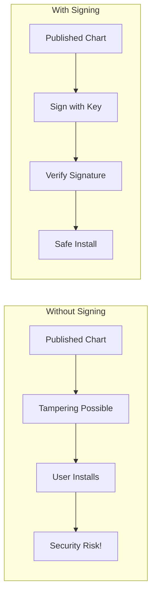

# How to Sign and Verify Helm Charts for Security

Author: [nawazdhandala](https://www.github.com/nawazdhandala)

Tags: Helm, Kubernetes, DevOps, Security, Signing, Provenance

Description: Learn how to sign Helm charts with PGP or Sigstore Cosign to ensure authenticity and integrity, protecting your supply chain.

> Supply chain attacks are real threats. Signing your Helm charts provides cryptographic proof of authenticity and integrity, ensuring users install exactly what you published without tampering.

## Why Sign Helm Charts?

Chart signing addresses critical security concerns:



## Signing Methods

Helm supports two signing methods:

| Method | Description | Best For |
| --- | --- | --- |
| PGP (Traditional) | GPG/PGP keys, .prov files | Traditional workflows |
| Sigstore Cosign | Keyless or key-based, OCI artifacts | Modern workflows |

## PGP Signing with Helm

### Generate a GPG Key

First, create a GPG key pair for signing.

```bash
# Generate a new GPG key
gpg --full-generate-key

# Choose:
# - RSA and RSA
# - 4096 bits
# - Key does not expire (or set expiration)
# - Your name and email

# List keys to get the key ID
gpg --list-secret-keys --keyid-format LONG

# Output:
# sec   rsa4096/ABCD1234EFGH5678 2024-01-15 [SC]
#       Key fingerprint = ...
# uid                 [ultimate] Your Name <email@example.com>
```

### Export Your Public Key

Share your public key so users can verify signatures.

```bash
# Export public key
gpg --armor --export ABCD1234EFGH5678 > pubkey.asc

# Upload to keyserver (optional)
gpg --keyserver keyserver.ubuntu.com --send-keys ABCD1234EFGH5678

# Or share via your website/repository
```

### Sign a Chart

Use `helm package --sign` to create a signed chart.

```bash
# Package and sign in one step
helm package ./my-chart --sign --key "Your Name" --keyring ~/.gnupg/secring.gpg

# For GPG 2.1+, use the pubring.kbx format
helm package ./my-chart --sign --key "email@example.com" --keyring ~/.gnupg/pubring.kbx

# This creates:
# my-chart-1.0.0.tgz      # The chart archive
# my-chart-1.0.0.tgz.prov # The provenance file
```

### Provenance File Contents

The `.prov` file contains the signature and metadata:

```
-----BEGIN PGP SIGNED MESSAGE-----
Hash: SHA512

apiVersion: v2
appVersion: 1.0.0
description: My Helm Chart
name: my-chart
type: application
version: 1.0.0

...
files:
  my-chart-1.0.0.tgz: sha256:abc123...
-----BEGIN PGP SIGNATURE-----

iQIzBAEBCgAdFiEE...
...
-----END PGP SIGNATURE-----
```

### Verify a Signed Chart

Users verify charts before installation.

```bash
# Verify the chart
helm verify ./my-chart-1.0.0.tgz

# Verify with specific keyring
helm verify ./my-chart-1.0.0.tgz --keyring ./pubkey.asc

# Successful output:
# Signed by: Your Name <email@example.com>
# Using Key With Fingerprint: ABCD1234EFGH5678...
# Chart Hash Verified: sha256:abc123...
```

### Install with Verification

```bash
# Install and verify in one step
helm install my-release ./my-chart-1.0.0.tgz --verify --keyring ./pubkey.asc

# Or download and verify from repository
helm repo add myrepo https://charts.example.com
helm install my-release myrepo/my-chart --verify --keyring ./pubkey.asc
```

## Sigstore Cosign Signing

Cosign is a modern signing tool from the Sigstore project, offering keyless signing and OCI artifact support.

### Install Cosign

```bash
# macOS
brew install cosign

# Linux
curl -LO https://github.com/sigstore/cosign/releases/latest/download/cosign-linux-amd64
chmod +x cosign-linux-amd64
sudo mv cosign-linux-amd64 /usr/local/bin/cosign

# Verify installation
cosign version
```

### Generate Cosign Keys

For key-based signing:

```bash
# Generate key pair
cosign generate-key-pair

# This creates:
# cosign.key (private key - keep secret!)
# cosign.pub (public key - share with users)
```

### Sign OCI Chart with Cosign

Push chart to OCI registry first, then sign it.

```bash
# Package the chart
helm package ./my-chart

# Push to OCI registry
helm push my-chart-1.0.0.tgz oci://ghcr.io/myorg/charts

# Sign the chart with Cosign
cosign sign --key cosign.key ghcr.io/myorg/charts/my-chart:1.0.0

# The signature is attached to the OCI artifact
```

### Keyless Signing with Sigstore

Cosign supports keyless signing using OIDC identity providers (GitHub, Google, Microsoft).

```bash
# Sign keylessly (opens browser for OIDC auth)
cosign sign ghcr.io/myorg/charts/my-chart:1.0.0

# Or in CI with GitHub Actions OIDC
cosign sign --yes ghcr.io/myorg/charts/my-chart:1.0.0
```

### Verify Cosign Signatures

```bash
# Verify with public key
cosign verify --key cosign.pub ghcr.io/myorg/charts/my-chart:1.0.0

# Verify keyless signature (checks Sigstore transparency log)
cosign verify \
  --certificate-identity user@example.com \
  --certificate-oidc-issuer https://github.com/login/oauth \
  ghcr.io/myorg/charts/my-chart:1.0.0

# Verify GitHub Actions signed artifacts
cosign verify \
  --certificate-identity-regexp 'https://github.com/myorg/.*/.github/workflows/.*' \
  --certificate-oidc-issuer https://token.actions.githubusercontent.com \
  ghcr.io/myorg/charts/my-chart:1.0.0
```

## CI/CD Integration

### GitHub Actions with PGP

```yaml
# .github/workflows/release-chart.yml
name: Release Helm Chart

on:
  push:
    tags:
      - 'v*'

jobs:
  release:
    runs-on: ubuntu-latest
    steps:
      - uses: actions/checkout@v4
      
      - name: Set up Helm
        uses: azure/setup-helm@v3
        
      - name: Import GPG key
        run: |
          echo "${{ secrets.GPG_PRIVATE_KEY }}" | gpg --import
          
      - name: Package and sign chart
        run: |
          helm package ./charts/my-chart \
            --sign \
            --key "${{ secrets.GPG_KEY_NAME }}" \
            --keyring ~/.gnupg/pubring.kbx
            
      - name: Upload to chart repository
        run: |
          # Upload both .tgz and .prov files
          curl -u "${{ secrets.CHART_REPO_USER }}:${{ secrets.CHART_REPO_PASS }}" \
            --data-binary "@my-chart-*.tgz" \
            https://charts.example.com/api/charts
          curl -u "${{ secrets.CHART_REPO_USER }}:${{ secrets.CHART_REPO_PASS }}" \
            --data-binary "@my-chart-*.tgz.prov" \
            https://charts.example.com/api/prov
```

### GitHub Actions with Cosign

```yaml
# .github/workflows/release-chart.yml
name: Release and Sign Helm Chart

on:
  push:
    tags:
      - 'v*'

jobs:
  release:
    runs-on: ubuntu-latest
    permissions:
      contents: read
      packages: write
      id-token: write  # Required for keyless signing
    steps:
      - uses: actions/checkout@v4
      
      - name: Set up Helm
        uses: azure/setup-helm@v3
        
      - name: Install Cosign
        uses: sigstore/cosign-installer@v3
        
      - name: Login to GHCR
        run: |
          echo "${{ secrets.GITHUB_TOKEN }}" | helm registry login ghcr.io -u ${{ github.actor }} --password-stdin
          
      - name: Extract version
        id: version
        run: echo "version=${GITHUB_REF#refs/tags/v}" >> $GITHUB_OUTPUT
        
      - name: Package chart
        run: |
          helm package ./charts/my-chart --version ${{ steps.version.outputs.version }}
          
      - name: Push chart to GHCR
        run: |
          helm push my-chart-${{ steps.version.outputs.version }}.tgz oci://ghcr.io/${{ github.repository_owner }}/charts
          
      - name: Sign chart with Cosign (keyless)
        run: |
          cosign sign --yes ghcr.io/${{ github.repository_owner }}/charts/my-chart:${{ steps.version.outputs.version }}
```

### GitLab CI with Cosign

```yaml
# .gitlab-ci.yml
stages:
  - build
  - sign

variables:
  CHART_NAME: my-chart

package:
  stage: build
  image: alpine/helm:latest
  script:
    - helm package ./charts/${CHART_NAME}
    - helm push ${CHART_NAME}-*.tgz oci://${CI_REGISTRY}/${CI_PROJECT_NAMESPACE}/charts
  only:
    - tags

sign:
  stage: sign
  image: alpine:latest
  needs: [package]
  before_script:
    - apk add --no-cache curl
    - curl -LO https://github.com/sigstore/cosign/releases/latest/download/cosign-linux-amd64
    - chmod +x cosign-linux-amd64
    - mv cosign-linux-amd64 /usr/local/bin/cosign
  script:
    - |
      VERSION=${CI_COMMIT_TAG#v}
      cosign sign --key env://COSIGN_PRIVATE_KEY \
        ${CI_REGISTRY}/${CI_PROJECT_NAMESPACE}/charts/${CHART_NAME}:${VERSION}
  only:
    - tags
```

## Verification in Deployment

### Verify Before Install Script

Create a script to verify charts before installation.

```bash
#!/bin/bash
# verify-and-install.sh

CHART=$1
RELEASE=$2
NAMESPACE=$3
KEYRING=${4:-"./pubkey.asc"}

# Verify the chart signature
echo "Verifying chart signature..."
if ! helm verify "$CHART" --keyring "$KEYRING"; then
    echo "ERROR: Chart signature verification failed!"
    exit 1
fi

echo "Signature verified. Installing chart..."
helm install "$RELEASE" "$CHART" --namespace "$NAMESPACE" --create-namespace
```

### ArgoCD with Verification

Configure ArgoCD to verify charts (requires custom configuration).

```yaml
# ConfigMap for ArgoCD repo server
apiVersion: v1
kind: ConfigMap
metadata:
  name: argocd-cm
  namespace: argocd
data:
  # Custom helm binary wrapper for verification
  helm.path: /custom-tools/helm-verify-wrapper.sh
```

### Policy Enforcement with OPA/Gatekeeper

Enforce signed charts with OPA policies.

```yaml
# ConstraintTemplate
apiVersion: templates.gatekeeper.sh/v1
kind: ConstraintTemplate
metadata:
  name: requiresignedchart
spec:
  crd:
    spec:
      names:
        kind: RequireSignedChart
  targets:
    - target: admission.k8s.gatekeeper.sh
      rego: |
        package requiresignedchart
        
        violation[{"msg": msg}] {
          input.review.object.metadata.annotations["meta.helm.sh/release-name"]
          not input.review.object.metadata.annotations["helm.sh/chart-verified"]
          msg := "Helm releases must use verified charts"
        }
```

## Key Management Best Practices

### Secure Key Storage

```bash
# Store GPG key in secure secret manager
aws secretsmanager create-secret \
  --name helm-signing-key \
  --secret-string "$(gpg --armor --export-secret-keys KEYID)"

# Retrieve in CI/CD
aws secretsmanager get-secret-value \
  --secret-id helm-signing-key \
  --query SecretString \
  --output text | gpg --import
```

### Key Rotation

```bash
# Generate new key
gpg --full-generate-key

# Sign charts with new key
# Publish both old and new public keys during transition
# Announce key rotation to users
# After transition period, revoke old key

gpg --gen-revoke OLDKEYID > revocation.cert
gpg --import revocation.cert
gpg --keyserver keyserver.ubuntu.com --send-keys OLDKEYID
```

### Multiple Signers

For team signing, use a dedicated signing key stored securely.

```bash
# Create a shared signing identity
gpg --full-generate-key
# Name: My Org Chart Signing <charts@myorg.com>

# Export for secure storage
gpg --armor --export-secret-keys charts@myorg.com > signing-key.asc

# Store in secret manager
# Grant CI/CD access only
```

## SBOM and Attestations

Add Software Bill of Materials (SBOM) attestations with Cosign.

```bash
# Generate SBOM for chart
syft dir:./charts/my-chart -o spdx-json > sbom.json

# Attach SBOM as attestation
cosign attest --key cosign.key \
  --predicate sbom.json \
  --type spdx \
  ghcr.io/myorg/charts/my-chart:1.0.0

# Verify attestation
cosign verify-attestation \
  --key cosign.pub \
  --type spdx \
  ghcr.io/myorg/charts/my-chart:1.0.0
```

## Troubleshooting

### PGP Verification Fails

```bash
# Error: chart unsigned
# Solution: Ensure .prov file is present
ls -la my-chart-1.0.0.tgz*

# Error: key not found
# Solution: Import the signing key
gpg --import pubkey.asc

# Error: Bad signature
# Solution: Chart may have been tampered with
# DO NOT INSTALL - contact chart maintainer
```

### Cosign Verification Fails

```bash
# Error: no signatures found
# Solution: Chart may not be signed, or wrong image reference
cosign triangulate ghcr.io/myorg/charts/my-chart:1.0.0

# Error: certificate identity mismatch
# Solution: Check the expected signer identity
cosign verify --certificate-identity-regexp '.*' \
  ghcr.io/myorg/charts/my-chart:1.0.0

# See who signed it, then use correct identity
```

## Best Practices Summary

| Practice | Why |
| --- | --- |
| Sign all released charts | Supply chain security |
| Use keyless signing in CI | No key management burden |
| Publish public keys prominently | Users can verify |
| Rotate keys periodically | Limit exposure |
| Automate signing in CI/CD | Consistent process |
| Verify before production install | Trust but verify |
| Add SBOM attestations | Full transparency |

## Wrap-up

Signing Helm charts is essential for supply chain security. Use PGP signing for traditional workflows with Helm's built-in `--sign` and `--verify` flags. For modern OCI-based workflows, Cosign provides keyless signing integrated with OIDC identity providers. Automate signing in CI/CD pipelines, publish public keys for verification, and consider enforcing verification through policies. Combined with SBOM attestations, signed charts provide full transparency and trust in your deployment pipeline.
