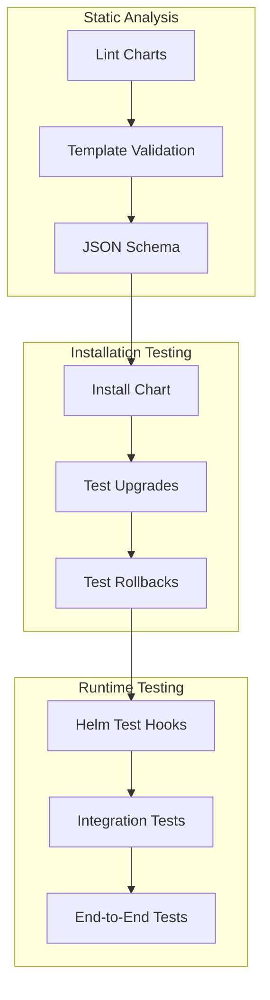

# Testing Helm Charts with Chart Testing (ct) and helm test

Author: [nawazdhandala](https://www.github.com/nawazdhandala)

Tags: Helm, Kubernetes, DevOps, Testing, CI/CD, Quality Assurance

Description: Comprehensive guide to testing Helm charts using Chart Testing (ct) for linting and installation tests, and helm test for runtime validation.

> Quality assurance for Helm charts ensures reliable deployments. This guide covers using Chart Testing (ct) for comprehensive linting and installation tests, writing helm test hooks for runtime validation, and integrating tests into CI/CD pipelines.

## Testing Strategy Overview



## Chart Testing (ct) Setup

### Install Chart Testing

```bash
# macOS
brew install chart-testing

# Linux
wget https://github.com/helm/chart-testing/releases/download/v3.10.0/chart-testing_3.10.0_linux_amd64.tar.gz
tar xzvf chart-testing_3.10.0_linux_amd64.tar.gz
mv ct /usr/local/bin/

# Verify installation
ct version
```

### Configuration File

```yaml
# ct.yaml
remote: origin
target-branch: main
chart-dirs:
  - charts
chart-repos:
  - bitnami=https://charts.bitnami.com/bitnami
  - prometheus=https://prometheus-community.github.io/helm-charts
helm-extra-args: --timeout 600s
validate-maintainers: false
validate-chart-schema: true
validate-yaml: true
check-version-increment: true
debug: false
```

### Directory Structure

```
charts/
├── myapp/
│   ├── Chart.yaml
│   ├── values.yaml
│   ├── values.schema.json
│   ├── templates/
│   │   ├── deployment.yaml
│   │   ├── service.yaml
│   │   └── tests/
│   │       └── test-connection.yaml
│   └── ci/
│       ├── test-values.yaml
│       └── test-values-ha.yaml
ct.yaml
```

## Linting Charts

### Basic Linting

```bash
# Lint all charts
ct lint --config ct.yaml

# Lint specific chart
ct lint --charts charts/myapp

# Lint with debug output
ct lint --charts charts/myapp --debug
```

### Lint Configuration

```yaml
# ct.yaml - Linting options
lint-conf: .github/lintconf.yaml
chart-yaml-schema: .github/chart_schema.yaml
```

```yaml
# .github/lintconf.yaml
rules:
  braces:
    min-spaces-inside: 0
    max-spaces-inside: 0
  brackets:
    min-spaces-inside: 0
    max-spaces-inside: 0
  colons:
    max-spaces-before: 0
    max-spaces-after: 1
  commas:
    max-spaces-before: 0
    min-spaces-after: 1
    max-spaces-after: 1
  comments:
    require-starting-space: true
    min-spaces-from-content: 1
  document-end: disable
  document-start: disable
  empty-lines:
    max: 2
    max-start: 0
    max-end: 0
  hyphens:
    max-spaces-after: 1
  indentation:
    spaces: 2
    indent-sequences: true
  key-duplicates: enable
  line-length:
    max: 200
    allow-non-breakable-words: true
    allow-non-breakable-inline-mappings: true
  new-line-at-end-of-file: enable
  new-lines:
    type: unix
  trailing-spaces: enable
  truthy:
    level: warning
```

## Values Schema Validation

### JSON Schema

```json
{
  "$schema": "https://json-schema.org/draft/2020-12/schema",
  "type": "object",
  "required": ["image", "service"],
  "properties": {
    "replicaCount": {
      "type": "integer",
      "minimum": 1,
      "maximum": 100,
      "default": 1
    },
    "image": {
      "type": "object",
      "required": ["repository"],
      "properties": {
        "repository": {
          "type": "string",
          "pattern": "^[a-z0-9.-/]+$"
        },
        "tag": {
          "type": "string",
          "default": "latest"
        },
        "pullPolicy": {
          "type": "string",
          "enum": ["Always", "IfNotPresent", "Never"],
          "default": "IfNotPresent"
        }
      }
    },
    "service": {
      "type": "object",
      "required": ["port"],
      "properties": {
        "type": {
          "type": "string",
          "enum": ["ClusterIP", "NodePort", "LoadBalancer"],
          "default": "ClusterIP"
        },
        "port": {
          "type": "integer",
          "minimum": 1,
          "maximum": 65535
        }
      }
    },
    "resources": {
      "type": "object",
      "properties": {
        "limits": {
          "type": "object",
          "properties": {
            "cpu": {"type": "string"},
            "memory": {"type": "string"}
          }
        },
        "requests": {
          "type": "object",
          "properties": {
            "cpu": {"type": "string"},
            "memory": {"type": "string"}
          }
        }
      }
    },
    "ingress": {
      "type": "object",
      "properties": {
        "enabled": {"type": "boolean", "default": false},
        "className": {"type": "string"},
        "hosts": {
          "type": "array",
          "items": {
            "type": "object",
            "required": ["host"],
            "properties": {
              "host": {"type": "string", "format": "hostname"},
              "paths": {
                "type": "array",
                "items": {
                  "type": "object",
                  "properties": {
                    "path": {"type": "string"},
                    "pathType": {
                      "type": "string",
                      "enum": ["Prefix", "Exact", "ImplementationSpecific"]
                    }
                  }
                }
              }
            }
          }
        }
      }
    }
  }
}
```

### Validate Schema

```bash
# Validate values against schema
helm lint charts/myapp --strict

# Using ct
ct lint --charts charts/myapp --validate-chart-schema
```

## Installation Testing

### Test Values Files

```yaml
# charts/myapp/ci/test-values.yaml
replicaCount: 1

image:
  repository: nginx
  tag: "1.25"
  pullPolicy: IfNotPresent

service:
  type: ClusterIP
  port: 80

resources:
  limits:
    cpu: 100m
    memory: 128Mi
  requests:
    cpu: 50m
    memory: 64Mi
```

```yaml
# charts/myapp/ci/test-values-ha.yaml
replicaCount: 3

image:
  repository: nginx
  tag: "1.25"
  pullPolicy: Always

service:
  type: LoadBalancer
  port: 80

resources:
  limits:
    cpu: 500m
    memory: 512Mi
  requests:
    cpu: 250m
    memory: 256Mi

podDisruptionBudget:
  enabled: true
  minAvailable: 2

affinity:
  podAntiAffinity:
    preferredDuringSchedulingIgnoredDuringExecution:
      - weight: 100
        podAffinityTerm:
          labelSelector:
            matchLabels:
              app: myapp
          topologyKey: kubernetes.io/hostname
```

### Run Installation Tests

```bash
# Test all changed charts
ct install --config ct.yaml

# Test specific chart
ct install --charts charts/myapp

# Test with specific values
ct install --charts charts/myapp --helm-extra-set-args "--values=charts/myapp/ci/test-values-ha.yaml"

# Test upgrade
ct install --charts charts/myapp --upgrade

# Keep namespace after test
ct install --charts charts/myapp --skip-clean-up
```

## Helm Test Hooks

### Basic Test Hook

```yaml
# charts/myapp/templates/tests/test-connection.yaml
apiVersion: v1
kind: Pod
metadata:
  name: "{{ include "myapp.fullname" . }}-test-connection"
  labels:
    {{- include "myapp.labels" . | nindent 4 }}
  annotations:
    "helm.sh/hook": test
    "helm.sh/hook-delete-policy": before-hook-creation,hook-succeeded
spec:
  containers:
    - name: wget
      image: busybox
      command: ['wget']
      args: ['{{ include "myapp.fullname" . }}:{{ .Values.service.port }}']
  restartPolicy: Never
```

### Comprehensive Test Suite

```yaml
# charts/myapp/templates/tests/test-health.yaml
apiVersion: v1
kind: Pod
metadata:
  name: "{{ include "myapp.fullname" . }}-test-health"
  annotations:
    "helm.sh/hook": test
    "helm.sh/hook-weight": "-5"
    "helm.sh/hook-delete-policy": before-hook-creation,hook-succeeded
spec:
  containers:
    - name: health-check
      image: curlimages/curl:latest
      command:
        - sh
        - -c
        - |
          echo "Testing health endpoint..."
          response=$(curl -sf http://{{ include "myapp.fullname" . }}:{{ .Values.service.port }}/health)
          if [ $? -ne 0 ]; then
            echo "Health check failed"
            exit 1
          fi
          echo "Health check passed: $response"
  restartPolicy: Never

---
# charts/myapp/templates/tests/test-api.yaml
apiVersion: v1
kind: Pod
metadata:
  name: "{{ include "myapp.fullname" . }}-test-api"
  annotations:
    "helm.sh/hook": test
    "helm.sh/hook-weight": "0"
    "helm.sh/hook-delete-policy": before-hook-creation,hook-succeeded
spec:
  containers:
    - name: api-test
      image: curlimages/curl:latest
      command:
        - sh
        - -c
        - |
          echo "Testing API endpoints..."
          
          # Test GET endpoint
          response=$(curl -sf http://{{ include "myapp.fullname" . }}:{{ .Values.service.port }}/api/v1/status)
          if [ $? -ne 0 ]; then
            echo "API GET test failed"
            exit 1
          fi
          echo "GET /api/v1/status passed"
          
          # Test POST endpoint
          response=$(curl -sf -X POST \
            -H "Content-Type: application/json" \
            -d '{"test": "data"}' \
            http://{{ include "myapp.fullname" . }}:{{ .Values.service.port }}/api/v1/echo)
          if [ $? -ne 0 ]; then
            echo "API POST test failed"
            exit 1
          fi
          echo "POST /api/v1/echo passed"
          
          echo "All API tests passed"
  restartPolicy: Never

---
# charts/myapp/templates/tests/test-database.yaml
{{- if .Values.database.enabled }}
apiVersion: v1
kind: Pod
metadata:
  name: "{{ include "myapp.fullname" . }}-test-database"
  annotations:
    "helm.sh/hook": test
    "helm.sh/hook-weight": "5"
    "helm.sh/hook-delete-policy": before-hook-creation,hook-succeeded
spec:
  containers:
    - name: db-test
      image: postgres:15
      env:
        - name: PGPASSWORD
          valueFrom:
            secretKeyRef:
              name: {{ include "myapp.fullname" . }}-db
              key: password
      command:
        - sh
        - -c
        - |
          echo "Testing database connection..."
          pg_isready -h {{ .Values.database.host }} -p {{ .Values.database.port }} -U {{ .Values.database.user }}
          if [ $? -ne 0 ]; then
            echo "Database connection failed"
            exit 1
          fi
          echo "Database connection successful"
  restartPolicy: Never
{{- end }}
```

### Run Helm Tests

```bash
# Run tests
helm test myapp

# Run tests with logs
helm test myapp --logs

# Run tests with timeout
helm test myapp --timeout 5m0s

# Run specific test
helm test myapp --filter name=myapp-test-connection
```

## CI/CD Integration

### GitHub Actions

```yaml
# .github/workflows/test-charts.yaml
name: Test Helm Charts

on:
  push:
    branches: [main]
    paths:
      - 'charts/**'
  pull_request:
    branches: [main]
    paths:
      - 'charts/**'

jobs:
  lint-test:
    runs-on: ubuntu-latest
    steps:
      - name: Checkout
        uses: actions/checkout@v4
        with:
          fetch-depth: 0

      - name: Set up Helm
        uses: azure/setup-helm@v3
        with:
          version: v3.13.0

      - name: Set up Python
        uses: actions/setup-python@v5
        with:
          python-version: '3.11'

      - name: Set up chart-testing
        uses: helm/chart-testing-action@v2.6.1

      - name: List changed charts
        id: list-changed
        run: |
          changed=$(ct list-changed --config ct.yaml)
          if [[ -n "$changed" ]]; then
            echo "changed=true" >> $GITHUB_OUTPUT
          fi

      - name: Run chart-testing lint
        if: steps.list-changed.outputs.changed == 'true'
        run: ct lint --config ct.yaml

      - name: Create kind cluster
        if: steps.list-changed.outputs.changed == 'true'
        uses: helm/kind-action@v1.8.0

      - name: Run chart-testing install
        if: steps.list-changed.outputs.changed == 'true'
        run: ct install --config ct.yaml

  unit-test:
    runs-on: ubuntu-latest
    steps:
      - name: Checkout
        uses: actions/checkout@v4

      - name: Set up Helm
        uses: azure/setup-helm@v3

      - name: Install helm-unittest
        run: helm plugin install https://github.com/helm-unittest/helm-unittest.git

      - name: Run unit tests
        run: |
          for chart in charts/*/; do
            if [ -d "$chart/tests" ]; then
              helm unittest "$chart"
            fi
          done
```

### GitLab CI

```yaml
# .gitlab-ci.yml
stages:
  - lint
  - test

variables:
  HELM_VERSION: "3.13.0"
  CT_VERSION: "3.10.0"

lint:
  stage: lint
  image: alpine/helm:${HELM_VERSION}
  before_script:
    - apk add --no-cache curl
    - curl -LO https://github.com/helm/chart-testing/releases/download/v${CT_VERSION}/chart-testing_${CT_VERSION}_linux_amd64.tar.gz
    - tar xzf chart-testing_${CT_VERSION}_linux_amd64.tar.gz
    - mv ct /usr/local/bin/
  script:
    - ct lint --config ct.yaml
  rules:
    - changes:
        - charts/**/*

test:
  stage: test
  image: docker:latest
  services:
    - docker:dind
  variables:
    DOCKER_TLS_CERTDIR: ""
  before_script:
    - apk add --no-cache curl kubectl helm
    - curl -Lo ./kind https://kind.sigs.k8s.io/dl/v0.20.0/kind-linux-amd64
    - chmod +x ./kind && mv ./kind /usr/local/bin/
    - kind create cluster --wait 60s
    - curl -LO https://github.com/helm/chart-testing/releases/download/v${CT_VERSION}/chart-testing_${CT_VERSION}_linux_amd64.tar.gz
    - tar xzf chart-testing_${CT_VERSION}_linux_amd64.tar.gz && mv ct /usr/local/bin/
  script:
    - ct install --config ct.yaml
  after_script:
    - kind delete cluster
  rules:
    - changes:
        - charts/**/*
```

## Unit Testing with helm-unittest

### Install Plugin

```bash
helm plugin install https://github.com/helm-unittest/helm-unittest.git
```

### Test Structure

```yaml
# charts/myapp/tests/deployment_test.yaml
suite: deployment tests
templates:
  - deployment.yaml
tests:
  - it: should create deployment with correct name
    set:
      nameOverride: testapp
    asserts:
      - isKind:
          of: Deployment
      - equal:
          path: metadata.name
          value: RELEASE-NAME-testapp

  - it: should set correct replica count
    set:
      replicaCount: 3
    asserts:
      - equal:
          path: spec.replicas
          value: 3

  - it: should use correct image
    set:
      image:
        repository: nginx
        tag: "1.25"
    asserts:
      - equal:
          path: spec.template.spec.containers[0].image
          value: nginx:1.25

  - it: should set resource limits
    set:
      resources:
        limits:
          cpu: 500m
          memory: 512Mi
        requests:
          cpu: 250m
          memory: 256Mi
    asserts:
      - equal:
          path: spec.template.spec.containers[0].resources.limits.cpu
          value: 500m
      - equal:
          path: spec.template.spec.containers[0].resources.limits.memory
          value: 512Mi
```

### Run Unit Tests

```bash
# Run all tests
helm unittest charts/myapp

# Run with verbose output
helm unittest charts/myapp -v

# Run specific test file
helm unittest charts/myapp -f 'tests/deployment_test.yaml'

# Generate JUnit report
helm unittest charts/myapp --output-type JUnit --output-file test-results.xml
```

## Testing Best Practices

| Practice | Description |
|----------|-------------|
| Test Multiple Values | Create ci/ directory with various test configurations |
| Schema Validation | Use JSON Schema to validate values.yaml |
| Ordered Tests | Use hook-weight for test execution order |
| Clean Up Resources | Use hook-delete-policy for test pods |
| Integration Tests | Test with real dependencies when possible |
| CI Integration | Run tests on every PR |

## Troubleshooting

```bash
# Debug template rendering
helm template myapp charts/myapp --debug

# Verify chart structure
helm lint charts/myapp --strict

# Check ct configuration
ct lint --config ct.yaml --debug

# View test pod logs
kubectl logs -n test myapp-test-connection

# List test resources
kubectl get pods -l helm.sh/hook=test
```

## Wrap-up

Testing Helm charts ensures reliable deployments across environments. Use Chart Testing (ct) for linting and installation tests, helm test hooks for runtime validation, and helm-unittest for unit testing templates. Integrate tests into CI/CD pipelines to catch issues early in the development cycle.
