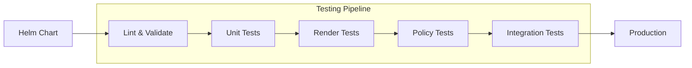

# How to Write and Run Tests for Helm Charts

Author: [nawazdhandala](https://www.github.com/nawazdhandala)

Tags: Helm, Kubernetes, DevOps, Testing, Charts, CI/CD

Description: Learn how to test Helm charts using helm test, chart-testing (ct), unittest, conftest, and integration tests to ensure reliable deployments.

> Helm charts are infrastructure as code, and like all code, they need testing. From unit tests for template logic to integration tests for deployed resources, a comprehensive testing strategy catches issues before they reach production.

## Why Test Helm Charts?

Helm charts can become complex with conditionals, loops, and computed values. Testing ensures:

- Templates render correctly for all input combinations
- Generated YAML is valid Kubernetes manifests
- Deployed resources work as expected
- Chart upgrades don't break existing deployments



## Helm Lint

Start with built-in linting to catch syntax and best practice issues.

```bash
# Basic lint
helm lint ./my-chart

# Lint with values file
helm lint ./my-chart -f values-production.yaml

# Lint with strict mode (warnings become errors)
helm lint ./my-chart --strict

# Lint with specific Kubernetes version
helm lint ./my-chart --kube-version 1.28.0
```

### Common Lint Issues

| Issue | Solution |
| --- | --- |
| Chart.yaml missing required fields | Add name, version, apiVersion |
| Invalid template syntax | Check Go template syntax |
| Values referenced but not defined | Add defaults in values.yaml |
| Icon URL invalid | Use valid URL or remove |

## Chart Testing (ct)

The chart-testing tool provides comprehensive lint and test capabilities, especially useful for CI pipelines.

### Install chart-testing

```bash
# macOS
brew install chart-testing

# Linux
curl -LO https://github.com/helm/chart-testing/releases/download/v3.10.1/chart-testing_3.10.1_linux_amd64.tar.gz
tar xzf chart-testing_3.10.1_linux_amd64.tar.gz
sudo mv ct /usr/local/bin/
```

### Configuration File

Create a configuration file for consistent testing.

```yaml
# ct.yaml
remote: origin
target-branch: main
chart-dirs:
  - charts
chart-repos:
  - bitnami=https://charts.bitnami.com/bitnami
helm-extra-args: --timeout 600s
validate-maintainers: false
check-version-increment: true
```

### Run Chart Testing

```bash
# Lint all charts that changed
ct lint --config ct.yaml

# Lint and install changed charts (requires cluster)
ct lint-and-install --config ct.yaml

# Test specific chart
ct install --charts ./charts/my-chart

# List changed charts
ct list-changed --config ct.yaml
```

## Helm Template Tests

Test template rendering without deploying to a cluster.

### Render and Validate

```bash
# Render templates
helm template my-release ./my-chart

# Render with specific values
helm template my-release ./my-chart -f values-test.yaml

# Render and validate against Kubernetes schema
helm template my-release ./my-chart | kubectl apply --dry-run=client -f -

# Render specific template
helm template my-release ./my-chart -s templates/deployment.yaml
```

### Automated Template Testing Script

Create a test script that renders charts with different value combinations.

```bash
#!/bin/bash
# test-templates.sh - Test Helm chart templates

set -e

CHART_DIR=${1:-"./my-chart"}
FAILURES=0

echo "Testing chart: $CHART_DIR"

# Test cases: pairs of description and values file
test_cases=(
  "default values:values.yaml"
  "production values:values-production.yaml"
  "minimal values:test/values-minimal.yaml"
  "full features:test/values-full.yaml"
)

for test_case in "${test_cases[@]}"; do
  desc="${test_case%%:*}"
  values="${test_case#*:}"
  
  echo -n "Testing: $desc... "
  
  if helm template test-release "$CHART_DIR" -f "$CHART_DIR/$values" > /dev/null 2>&1; then
    echo "PASS"
  else
    echo "FAIL"
    ((FAILURES++))
    helm template test-release "$CHART_DIR" -f "$CHART_DIR/$values"
  fi
done

# Validate rendered YAML
echo -n "Validating YAML syntax... "
if helm template test-release "$CHART_DIR" | kubectl apply --dry-run=client -f - > /dev/null 2>&1; then
  echo "PASS"
else
  echo "FAIL"
  ((FAILURES++))
fi

if [ $FAILURES -gt 0 ]; then
  echo "Tests failed: $FAILURES"
  exit 1
fi

echo "All tests passed!"
```

## Helm Unittest Plugin

The unittest plugin provides structured unit testing for Helm templates.

### Install the Plugin

```bash
helm plugin install https://github.com/helm-unittest/helm-unittest
```

### Create Test Files

Test files go in `my-chart/tests/` with `_test.yaml` suffix.

```yaml
# my-chart/tests/deployment_test.yaml
suite: deployment tests
templates:
  - templates/deployment.yaml
tests:
  - it: should render deployment with default values
    asserts:
      - isKind:
          of: Deployment
      - equal:
          path: metadata.name
          value: RELEASE-NAME-my-chart
      - equal:
          path: spec.replicas
          value: 1

  - it: should set replicas from values
    set:
      replicaCount: 3
    asserts:
      - equal:
          path: spec.replicas
          value: 3

  - it: should use custom image
    set:
      image.repository: custom/image
      image.tag: "2.0.0"
    asserts:
      - equal:
          path: spec.template.spec.containers[0].image
          value: custom/image:2.0.0

  - it: should set resource limits when specified
    set:
      resources.limits.cpu: "500m"
      resources.limits.memory: "512Mi"
    asserts:
      - equal:
          path: spec.template.spec.containers[0].resources.limits.cpu
          value: "500m"
      - equal:
          path: spec.template.spec.containers[0].resources.limits.memory
          value: "512Mi"

  - it: should not include resources when empty
    set:
      resources: {}
    asserts:
      - isNull:
          path: spec.template.spec.containers[0].resources
```

### Test Service Configuration

```yaml
# my-chart/tests/service_test.yaml
suite: service tests
templates:
  - templates/service.yaml
tests:
  - it: should create ClusterIP service by default
    asserts:
      - isKind:
          of: Service
      - equal:
          path: spec.type
          value: ClusterIP

  - it: should create LoadBalancer when specified
    set:
      service.type: LoadBalancer
    asserts:
      - equal:
          path: spec.type
          value: LoadBalancer

  - it: should set correct port
    set:
      service.port: 8080
    asserts:
      - equal:
          path: spec.ports[0].port
          value: 8080

  - it: should add annotations when specified
    set:
      service.annotations:
        service.beta.kubernetes.io/aws-load-balancer-type: nlb
    asserts:
      - equal:
          path: metadata.annotations["service.beta.kubernetes.io/aws-load-balancer-type"]
          value: nlb
```

### Test Conditional Resources

```yaml
# my-chart/tests/ingress_test.yaml
suite: ingress tests
templates:
  - templates/ingress.yaml
tests:
  - it: should not render when disabled
    set:
      ingress.enabled: false
    asserts:
      - hasDocuments:
          count: 0

  - it: should render when enabled
    set:
      ingress.enabled: true
      ingress.hosts:
        - host: example.com
          paths:
            - path: /
              pathType: Prefix
    asserts:
      - hasDocuments:
          count: 1
      - isKind:
          of: Ingress

  - it: should configure TLS when specified
    set:
      ingress.enabled: true
      ingress.tls:
        - secretName: my-tls
          hosts:
            - example.com
    asserts:
      - equal:
          path: spec.tls[0].secretName
          value: my-tls
```

### Run Unit Tests

```bash
# Run all tests
helm unittest ./my-chart

# Run with verbose output
helm unittest ./my-chart -v

# Run specific test file
helm unittest ./my-chart -f 'tests/deployment_test.yaml'

# Output JUnit XML for CI
helm unittest ./my-chart --output-file results.xml --output-type JUnit
```

## Conftest for Policy Testing

Conftest validates Helm output against Open Policy Agent (OPA) policies.

### Install Conftest

```bash
# macOS
brew install conftest

# Linux
curl -LO https://github.com/open-policy-agent/conftest/releases/download/v0.46.2/conftest_0.46.2_Linux_x86_64.tar.gz
tar xzf conftest_0.46.2_Linux_x86_64.tar.gz
sudo mv conftest /usr/local/bin/
```

### Create Policies

Write policies in Rego to enforce standards.

```rego
# policy/deployment.rego
package main

# Deny deployments without resource limits
deny[msg] {
  input.kind == "Deployment"
  container := input.spec.template.spec.containers[_]
  not container.resources.limits
  msg := sprintf("Container %s in Deployment %s must have resource limits", [container.name, input.metadata.name])
}

# Deny privileged containers
deny[msg] {
  input.kind == "Deployment"
  container := input.spec.template.spec.containers[_]
  container.securityContext.privileged == true
  msg := sprintf("Container %s in Deployment %s must not be privileged", [container.name, input.metadata.name])
}

# Require specific labels
deny[msg] {
  input.kind == "Deployment"
  not input.metadata.labels["app.kubernetes.io/name"]
  msg := sprintf("Deployment %s must have app.kubernetes.io/name label", [input.metadata.name])
}

# Deny latest tag
deny[msg] {
  input.kind == "Deployment"
  container := input.spec.template.spec.containers[_]
  endswith(container.image, ":latest")
  msg := sprintf("Container %s uses :latest tag which is not allowed", [container.name])
}

# Require readiness probe
warn[msg] {
  input.kind == "Deployment"
  container := input.spec.template.spec.containers[_]
  not container.readinessProbe
  msg := sprintf("Container %s should have a readiness probe", [container.name])
}
```

### Run Policy Tests

```bash
# Render and test against policies
helm template my-release ./my-chart | conftest test -

# Test with specific policy directory
helm template my-release ./my-chart | conftest test - --policy ./policy

# Output structured results
helm template my-release ./my-chart | conftest test - --output json

# Fail on warnings too
helm template my-release ./my-chart | conftest test - --fail-on-warn
```

## Helm Built-in Tests

Helm supports in-cluster tests defined in the chart.

### Create Test Pod

Define a test pod that verifies the release works.

```yaml
# my-chart/templates/tests/test-connection.yaml
apiVersion: v1
kind: Pod
metadata:
  name: "{{ include "my-chart.fullname" . }}-test-connection"
  labels:
    {{- include "my-chart.labels" . | nindent 4 }}
  annotations:
    "helm.sh/hook": test
    "helm.sh/hook-delete-policy": before-hook-creation,hook-succeeded
spec:
  containers:
    - name: wget
      image: busybox
      command: ['wget']
      args: ['{{ include "my-chart.fullname" . }}:{{ .Values.service.port }}']
  restartPolicy: Never
```

### Comprehensive Test Pod

Test multiple aspects of the deployment.

```yaml
# my-chart/templates/tests/test-comprehensive.yaml
apiVersion: v1
kind: Pod
metadata:
  name: "{{ include "my-chart.fullname" . }}-test"
  annotations:
    "helm.sh/hook": test
    "helm.sh/hook-delete-policy": before-hook-creation,hook-succeeded
    "helm.sh/hook-weight": "0"
spec:
  containers:
    - name: test
      image: curlimages/curl:8.4.0
      command: ["/bin/sh", "-c"]
      args:
        - |
          set -e
          echo "Testing HTTP endpoint..."
          curl -sf http://{{ include "my-chart.fullname" . }}:{{ .Values.service.port }}/health
          
          echo "Testing readiness..."
          curl -sf http://{{ include "my-chart.fullname" . }}:{{ .Values.service.port }}/ready
          
          echo "All tests passed!"
  restartPolicy: Never
```

### Run Helm Tests

```bash
# Run tests after install
helm install my-release ./my-chart
helm test my-release

# Run tests with logs
helm test my-release --logs

# Run tests with timeout
helm test my-release --timeout 5m
```

## Integration Testing with Kind

Use Kind (Kubernetes in Docker) for integration tests.

### Setup Kind Cluster

```bash
# Install kind
brew install kind

# Create cluster
kind create cluster --name helm-test

# Load local images (if needed)
kind load docker-image my-app:latest --name helm-test
```

### Integration Test Script

```bash
#!/bin/bash
# integration-test.sh - Full integration test

set -e

CHART_DIR=${1:-"./my-chart"}
RELEASE_NAME="test-release"
NAMESPACE="test-namespace"

cleanup() {
  echo "Cleaning up..."
  helm uninstall "$RELEASE_NAME" -n "$NAMESPACE" 2>/dev/null || true
  kubectl delete namespace "$NAMESPACE" 2>/dev/null || true
}

trap cleanup EXIT

# Create test namespace
kubectl create namespace "$NAMESPACE"

# Install chart
echo "Installing chart..."
helm install "$RELEASE_NAME" "$CHART_DIR" \
  -n "$NAMESPACE" \
  --wait \
  --timeout 5m

# Verify deployment
echo "Verifying deployment..."
kubectl rollout status deployment/"$RELEASE_NAME-my-chart" -n "$NAMESPACE" --timeout=120s

# Run helm tests
echo "Running Helm tests..."
helm test "$RELEASE_NAME" -n "$NAMESPACE" --logs

# Test upgrade
echo "Testing upgrade..."
helm upgrade "$RELEASE_NAME" "$CHART_DIR" \
  -n "$NAMESPACE" \
  --set replicaCount=2 \
  --wait \
  --timeout 5m

# Verify upgrade
kubectl rollout status deployment/"$RELEASE_NAME-my-chart" -n "$NAMESPACE" --timeout=120s

# Test rollback
echo "Testing rollback..."
helm rollback "$RELEASE_NAME" 1 -n "$NAMESPACE" --wait

echo "All integration tests passed!"
```

## CI/CD Pipeline Example

### GitHub Actions

Complete testing pipeline for Helm charts.

```yaml
# .github/workflows/helm-test.yml
name: Helm Chart Tests

on:
  push:
    paths:
      - 'charts/**'
  pull_request:
    paths:
      - 'charts/**'

jobs:
  lint:
    runs-on: ubuntu-latest
    steps:
      - uses: actions/checkout@v4
      
      - name: Set up Helm
        uses: azure/setup-helm@v3
        
      - name: Lint charts
        run: |
          for chart in charts/*/; do
            echo "Linting $chart"
            helm lint "$chart" --strict
          done

  unit-test:
    runs-on: ubuntu-latest
    steps:
      - uses: actions/checkout@v4
      
      - name: Set up Helm
        uses: azure/setup-helm@v3
        
      - name: Install unittest plugin
        run: helm plugin install https://github.com/helm-unittest/helm-unittest
        
      - name: Run unit tests
        run: |
          for chart in charts/*/; do
            echo "Testing $chart"
            helm unittest "$chart" --output-file results.xml --output-type JUnit
          done
          
      - name: Publish test results
        uses: mikepenz/action-junit-report@v4
        if: always()
        with:
          report_paths: '**/results.xml'

  policy-test:
    runs-on: ubuntu-latest
    steps:
      - uses: actions/checkout@v4
      
      - name: Set up Helm
        uses: azure/setup-helm@v3
        
      - name: Install conftest
        run: |
          curl -LO https://github.com/open-policy-agent/conftest/releases/download/v0.46.2/conftest_0.46.2_Linux_x86_64.tar.gz
          tar xzf conftest_0.46.2_Linux_x86_64.tar.gz
          sudo mv conftest /usr/local/bin/
          
      - name: Run policy tests
        run: |
          for chart in charts/*/; do
            echo "Testing policies for $chart"
            helm template test "$chart" | conftest test - --policy ./policy
          done

  integration-test:
    runs-on: ubuntu-latest
    needs: [lint, unit-test, policy-test]
    steps:
      - uses: actions/checkout@v4
      
      - name: Set up Helm
        uses: azure/setup-helm@v3
        
      - name: Create kind cluster
        uses: helm/kind-action@v1
        
      - name: Run integration tests
        run: |
          for chart in charts/*/; do
            echo "Integration testing $chart"
            ./scripts/integration-test.sh "$chart"
          done
```

## Test Coverage Best Practices

| Test Type | What It Catches | When to Run |
| --- | --- | --- |
| Lint | Syntax errors, missing fields | Every commit |
| Unit tests | Logic errors, wrong outputs | Every commit |
| Policy tests | Security violations, standards | Every commit |
| Render tests | Invalid Kubernetes YAML | Every commit |
| Integration tests | Runtime issues, dependencies | Before merge |
| Helm test | Service connectivity, health | After deploy |

## Wrap-up

A comprehensive Helm testing strategy combines multiple approaches: linting catches basic issues, unit tests verify template logic, policy tests enforce standards, and integration tests validate real deployments. Start with linting and unit tests for quick feedback, add policy tests for governance, and use integration tests for critical paths. Automate everything in CI/CD to catch issues before they reach production.
