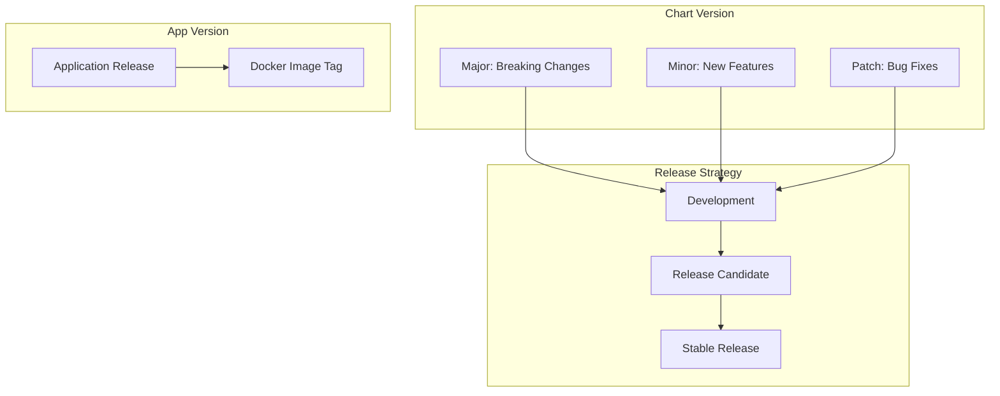

# How to Implement Helm Chart Versioning and Release Strategies

Author: [nawazdhandala](https://www.github.com/nawazdhandala)

Tags: Helm, Kubernetes, DevOps, Versioning, SemVer, Release Management

Description: Complete guide to Helm chart versioning using SemVer, managing app versions, changelog strategies, and implementing release management best practices.

> Proper versioning of Helm charts ensures reproducible deployments and clear upgrade paths. This guide covers SemVer for charts, app version management, changelog generation, and release strategies for maintaining chart quality.

## Versioning Strategy Overview



## Understanding Chart Versions

### Chart.yaml Version Fields

```yaml
# Chart.yaml
apiVersion: v2
name: myapp
description: My Application Helm Chart
type: application

# Chart version - use SemVer
version: 2.1.0

# Application version - tracks deployed app
appVersion: "1.5.3"
```

### SemVer for Charts

```bash
# Version format: MAJOR.MINOR.PATCH

# MAJOR: Breaking changes to chart interface
#   - Values schema changes
#   - Removed values/features
#   - Changed resource names

# MINOR: Backward-compatible features
#   - New optional values
#   - Additional templates
#   - New subchart dependencies

# PATCH: Backward-compatible fixes
#   - Bug fixes
#   - Documentation updates
#   - Default value changes
```

## Version Management Workflow

### Automated Version Bumping

```bash
# Using conventional commits
# feat: -> minor bump
# fix: -> patch bump
# BREAKING CHANGE: -> major bump

# Install semver tool
npm install -g semver

# Current version: 1.2.3
semver 1.2.3 -i patch  # 1.2.4
semver 1.2.3 -i minor  # 1.3.0
semver 1.2.3 -i major  # 2.0.0

# Pre-release versions
semver 1.2.3 -i prerelease --preid rc  # 1.2.4-rc.0
semver 1.2.4-rc.0 -i prerelease --preid rc  # 1.2.4-rc.1
```

### Version Bump Script

```bash
#!/bin/bash
# bump-version.sh

set -e

CHART_DIR=${1:-.}
BUMP_TYPE=${2:-patch}  # major, minor, patch

# Get current version
CURRENT_VERSION=$(yq '.version' "$CHART_DIR/Chart.yaml")

# Calculate new version
NEW_VERSION=$(semver "$CURRENT_VERSION" -i "$BUMP_TYPE")

echo "Bumping version: $CURRENT_VERSION -> $NEW_VERSION"

# Update Chart.yaml
yq -i ".version = \"$NEW_VERSION\"" "$CHART_DIR/Chart.yaml"

# Update dependencies if umbrella chart
if [ -f "$CHART_DIR/Chart.lock" ]; then
  helm dependency update "$CHART_DIR"
fi

echo "Version updated to $NEW_VERSION"
```

## Changelog Management

### CHANGELOG.md Format

```markdown
# Changelog

All notable changes to this chart will be documented in this file.

The format is based on [Keep a Changelog](https://keepachangelog.com/en/1.0.0/),
and this project adheres to [Semantic Versioning](https://semver.org/spec/v2.0.0.html).

## [Unreleased]

### Added
- New HorizontalPodAutoscaler template

### Changed
- Updated default resource limits

## [2.1.0] - 2024-01-15

### Added
- Support for external secrets with `externalSecrets.enabled`
- PodDisruptionBudget template
- ServiceMonitor for Prometheus integration

### Changed
- Default replica count increased to 2
- Updated ingress API version to networking.k8s.io/v1

### Fixed
- Fixed service selector labels
- Corrected RBAC permissions for ServiceAccount

## [2.0.0] - 2024-01-01

### BREAKING CHANGES
- Renamed `image.name` to `image.repository`
- Changed service port configuration structure
- Removed deprecated `legacyMode` option

### Added
- Multi-environment values support
- Helm test templates

### Removed
- Removed support for Kubernetes < 1.19

## [1.5.0] - 2023-12-01

### Added
- Initial release with basic deployment support
```

### Automated Changelog Generation

```yaml
# .github/workflows/changelog.yaml
name: Generate Changelog

on:
  push:
    branches: [main]
    paths:
      - 'charts/**'

jobs:
  changelog:
    runs-on: ubuntu-latest
    steps:
      - uses: actions/checkout@v4
        with:
          fetch-depth: 0
          
      - name: Generate Changelog
        uses: orhun/git-cliff-action@v3
        with:
          config: cliff.toml
          args: --verbose
        env:
          OUTPUT: charts/myapp/CHANGELOG.md
          
      - name: Commit Changelog
        uses: stefanzweifel/git-auto-commit-action@v5
        with:
          commit_message: 'docs: update changelog'
          file_pattern: charts/*/CHANGELOG.md
```

### git-cliff Configuration

```toml
# cliff.toml
[changelog]
header = """
# Changelog\n
All notable changes to this chart will be documented in this file.\n
"""
body = """
\
    ## [{{ version | trim_start_matches(pat="v") }}] - {{ timestamp | date(format="%Y-%m-%d") }}
\
    ## [Unreleased]
\

    ### {{ group | upper_first }}
    
        - {{ commit.message | upper_first }}\
    
\n
"""
footer = ""
trim = true

[git]
conventional_commits = true
filter_unconventional = true
commit_parsers = [
    { message = "^feat", group = "Added" },
    { message = "^fix", group = "Fixed" },
    { message = "^doc", group = "Documentation" },
    { message = "^perf", group = "Performance" },
    { message = "^refactor", group = "Changed" },
    { message = "^style", group = "Styling" },
    { message = "^test", group = "Testing" },
    { message = "^chore", skip = true },
]
filter_commits = false
```

## Release Channels

### Multiple Release Tracks

```yaml
# Chart.yaml for stable release
apiVersion: v2
name: myapp
version: 2.1.0
appVersion: "1.5.3"

# Chart.yaml for development release
apiVersion: v2
name: myapp
version: 2.2.0-dev.1
appVersion: "1.6.0-dev"

# Chart.yaml for release candidate
apiVersion: v2
name: myapp
version: 2.2.0-rc.1
appVersion: "1.6.0-rc.1"
```

### Repository Organization

```bash
charts/
├── stable/
│   └── myapp/
│       ├── Chart.yaml  # version: 2.1.0
│       └── ...
├── staging/
│   └── myapp/
│       ├── Chart.yaml  # version: 2.2.0-rc.1
│       └── ...
└── dev/
    └── myapp/
        ├── Chart.yaml  # version: 2.2.0-dev.1
        └── ...
```

### Channel-based Helm Repo

```bash
# Add different channels
helm repo add myapp-stable https://charts.example.com/stable
helm repo add myapp-staging https://charts.example.com/staging
helm repo add myapp-dev https://charts.example.com/dev

# Install from specific channel
helm install myapp myapp-stable/myapp --version 2.1.0
helm install myapp-rc myapp-staging/myapp --version 2.2.0-rc.1
```

## CI/CD Version Management

### GitHub Actions Release Workflow

```yaml
# .github/workflows/release.yaml
name: Release Charts

on:
  push:
    tags:
      - 'v*'

jobs:
  release:
    runs-on: ubuntu-latest
    steps:
      - uses: actions/checkout@v4
        with:
          fetch-depth: 0
          
      - name: Setup Helm
        uses: azure/setup-helm@v3
        
      - name: Extract Version
        id: version
        run: |
          VERSION=${GITHUB_REF#refs/tags/v}
          echo "version=$VERSION" >> $GITHUB_OUTPUT
          
      - name: Update Chart Version
        run: |
          yq -i ".version = \"${{ steps.version.outputs.version }}\"" charts/myapp/Chart.yaml
          
      - name: Package Chart
        run: |
          helm package charts/myapp
          
      - name: Push to OCI Registry
        run: |
          helm push myapp-${{ steps.version.outputs.version }}.tgz \
            oci://ghcr.io/${{ github.repository_owner }}/charts
        env:
          HELM_REGISTRY_CONFIG: ~/.docker/config.json
          
      - name: Create GitHub Release
        uses: softprops/action-gh-release@v1
        with:
          files: myapp-${{ steps.version.outputs.version }}.tgz
          generate_release_notes: true
```

### Automated Version Check

```yaml
# .github/workflows/version-check.yaml
name: Version Check

on:
  pull_request:
    paths:
      - 'charts/**'

jobs:
  check-version:
    runs-on: ubuntu-latest
    steps:
      - uses: actions/checkout@v4
        with:
          fetch-depth: 0
          
      - name: Check Version Bump
        run: |
          # Get version from main branch
          git fetch origin main
          MAIN_VERSION=$(git show origin/main:charts/myapp/Chart.yaml | yq '.version')
          PR_VERSION=$(yq '.version' charts/myapp/Chart.yaml)
          
          if [ "$MAIN_VERSION" = "$PR_VERSION" ]; then
            echo "::error::Chart version must be bumped"
            exit 1
          fi
          
          echo "Version change: $MAIN_VERSION -> $PR_VERSION"
```

## Dependency Version Management

### Subchart Versioning

```yaml
# Chart.yaml
apiVersion: v2
name: myapp
version: 2.1.0
dependencies:
  - name: postgresql
    version: "~12.0.0"  # Accept 12.0.x
    repository: https://charts.bitnami.com/bitnami
    condition: postgresql.enabled
  - name: redis
    version: "^17.0.0"  # Accept 17.x.x
    repository: https://charts.bitnami.com/bitnami
    condition: redis.enabled
```

### Lock File Management

```bash
# Update dependencies
helm dependency update charts/myapp

# Chart.lock is generated
# dependencies:
# - name: postgresql
#   repository: https://charts.bitnami.com/bitnami
#   version: 12.0.5
# - name: redis
#   repository: https://charts.bitnami.com/bitnami
#   version: 17.3.2
# digest: sha256:...
# generated: "2024-01-15T10:00:00Z"

# Verify dependencies
helm dependency list charts/myapp
```

## Release Documentation

### RELEASE-NOTES.md Template

```markdown
# Release Notes - v2.1.0

## Highlights

This release adds support for external secrets integration and improves
monitoring capabilities with native Prometheus ServiceMonitor.

## What's New

### External Secrets Support
Configure external secrets providers:
```yaml
externalSecrets:
  enabled: true
  provider: aws-secrets-manager
  secretRef: my-secret
```

### Prometheus ServiceMonitor
Enable metrics scraping:
```yaml
metrics:
  serviceMonitor:
    enabled: true
    interval: 30s
```

## Upgrade Notes

### From v2.0.x
No breaking changes. Direct upgrade supported.

### From v1.x.x
See [Migration Guide](./MIGRATION.md) for breaking changes.

## Known Issues

- HPA may require manual adjustment after upgrade (#123)

## Contributors

Thanks to all contributors who made this release possible!
```

## Best Practices

| Practice | Description |
|----------|-------------|
| SemVer Strictly | Follow semantic versioning rules |
| Document Changes | Maintain detailed changelog |
| Test Upgrades | Verify upgrade paths |
| Lock Dependencies | Use Chart.lock for reproducibility |
| Pre-release Tags | Use -rc, -beta for testing |
| Automate Releases | Use CI/CD for consistency |

## Troubleshooting

```bash
# Check installed chart version
helm list -A --output json | jq '.[] | {name, chart, app_version}'

# Compare versions
helm search repo myapp --versions

# Verify chart version
helm show chart myapp/myapp --version 2.1.0

# Debug version constraints
helm dependency list charts/myapp
```

## Wrap-up

Proper versioning and release strategies ensure reliable Helm chart deployments. Use SemVer for clear upgrade paths, maintain comprehensive changelogs, and automate version management through CI/CD pipelines. Implement multiple release channels for development, staging, and production to support different deployment needs.
