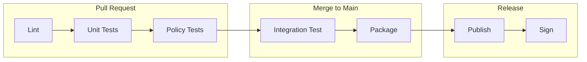

# Helm Chart CI/CD with GitHub Actions

Author: [nawazdhandala](https://www.github.com/nawazdhandala)

Tags: Helm, Kubernetes, DevOps, GitHub Actions, CI/CD, Automation

Description: Learn how to automate Helm chart linting, testing, and publishing with GitHub Actions for reliable, consistent deployments.

> Manual chart publishing is error-prone and time-consuming. GitHub Actions automates linting, testing, packaging, and publishing, ensuring every chart release is consistent and validated.

## CI/CD Pipeline Overview

A complete Helm chart CI/CD pipeline includes multiple stages:



## Repository Structure

Organize your chart repository for GitHub Actions.

```
helm-charts/
├── .github/
│   └── workflows/
│       ├── lint-test.yml
│       ├── release.yml
│       └── security-scan.yml
├── charts/
│   ├── my-app/
│   │   ├── Chart.yaml
│   │   ├── values.yaml
│   │   ├── values.schema.json
│   │   ├── templates/
│   │   └── tests/
│   └── another-app/
├── policy/
│   └── deployment.rego
└── ct.yaml
```

## Lint and Test Workflow

Create a workflow that runs on every push and pull request.

```yaml
# .github/workflows/lint-test.yml
name: Lint and Test Charts

on:
  push:
    branches:
      - main
    paths:
      - 'charts/**'
      - '.github/workflows/lint-test.yml'
  pull_request:
    paths:
      - 'charts/**'
      - '.github/workflows/lint-test.yml'

jobs:
  lint:
    name: Lint Charts
    runs-on: ubuntu-latest
    steps:
      - name: Checkout
        uses: actions/checkout@v4
        with:
          fetch-depth: 0

      - name: Set up Helm
        uses: azure/setup-helm@v3
        with:
          version: v3.13.0

      - name: Set up Python
        uses: actions/setup-python@v5
        with:
          python-version: '3.11'

      - name: Set up chart-testing
        uses: helm/chart-testing-action@v2

      - name: List changed charts
        id: list-changed
        run: |
          changed=$(ct list-changed --config ct.yaml)
          if [[ -n "$changed" ]]; then
            echo "changed=true" >> $GITHUB_OUTPUT
            echo "Changed charts: $changed"
          fi

      - name: Lint charts
        if: steps.list-changed.outputs.changed == 'true'
        run: ct lint --config ct.yaml

  unit-test:
    name: Unit Tests
    runs-on: ubuntu-latest
    needs: lint
    steps:
      - name: Checkout
        uses: actions/checkout@v4

      - name: Set up Helm
        uses: azure/setup-helm@v3
        with:
          version: v3.13.0

      - name: Install helm-unittest
        run: helm plugin install https://github.com/helm-unittest/helm-unittest

      - name: Run unit tests
        run: |
          for chart in charts/*/; do
            if [ -d "$chart/tests" ]; then
              echo "Testing $chart"
              helm unittest "$chart" --output-file results.xml --output-type JUnit
            fi
          done

      - name: Publish test results
        uses: mikepenz/action-junit-report@v4
        if: always()
        with:
          report_paths: '**/results.xml'

  policy-test:
    name: Policy Tests
    runs-on: ubuntu-latest
    needs: lint
    steps:
      - name: Checkout
        uses: actions/checkout@v4

      - name: Set up Helm
        uses: azure/setup-helm@v3

      - name: Install conftest
        run: |
          curl -LO https://github.com/open-policy-agent/conftest/releases/download/v0.46.2/conftest_0.46.2_Linux_x86_64.tar.gz
          tar xzf conftest_0.46.2_Linux_x86_64.tar.gz
          sudo mv conftest /usr/local/bin/

      - name: Run policy tests
        run: |
          for chart in charts/*/; do
            echo "Testing policies for $chart"
            helm template test "$chart" | conftest test - --policy ./policy
          done

  integration-test:
    name: Integration Tests
    runs-on: ubuntu-latest
    needs: [unit-test, policy-test]
    steps:
      - name: Checkout
        uses: actions/checkout@v4
        with:
          fetch-depth: 0

      - name: Set up Helm
        uses: azure/setup-helm@v3

      - name: Set up chart-testing
        uses: helm/chart-testing-action@v2

      - name: Create kind cluster
        uses: helm/kind-action@v1

      - name: List changed charts
        id: list-changed
        run: |
          changed=$(ct list-changed --config ct.yaml)
          if [[ -n "$changed" ]]; then
            echo "changed=true" >> $GITHUB_OUTPUT
          fi

      - name: Install and test charts
        if: steps.list-changed.outputs.changed == 'true'
        run: ct install --config ct.yaml
```

## Chart-Testing Configuration

Configure chart-testing with `ct.yaml`:

```yaml
# ct.yaml
remote: origin
target-branch: main
chart-dirs:
  - charts
chart-repos:
  - bitnami=https://charts.bitnami.com/bitnami
  - prometheus-community=https://prometheus-community.github.io/helm-charts
helm-extra-args: --timeout 600s
validate-maintainers: false
check-version-increment: true
validate-chart-schema: true
```

## Release Workflow

Publish charts when changes are merged to main or on tag.

### GitHub Pages Release

```yaml
# .github/workflows/release.yml
name: Release Charts

on:
  push:
    branches:
      - main
    paths:
      - 'charts/**'

jobs:
  release:
    runs-on: ubuntu-latest
    permissions:
      contents: write
      pages: write
    steps:
      - name: Checkout
        uses: actions/checkout@v4
        with:
          fetch-depth: 0

      - name: Configure Git
        run: |
          git config user.name "$GITHUB_ACTOR"
          git config user.email "$GITHUB_ACTOR@users.noreply.github.com"

      - name: Set up Helm
        uses: azure/setup-helm@v3

      - name: Add dependency repos
        run: |
          helm repo add bitnami https://charts.bitnami.com/bitnami
          helm repo update

      - name: Run chart-releaser
        uses: helm/chart-releaser-action@v1
        env:
          CR_TOKEN: "${{ secrets.GITHUB_TOKEN }}"
```

### OCI Registry Release (GHCR)

```yaml
# .github/workflows/release-oci.yml
name: Release to OCI Registry

on:
  push:
    tags:
      - 'charts/*-v*'

jobs:
  release:
    runs-on: ubuntu-latest
    permissions:
      contents: read
      packages: write
      id-token: write
    steps:
      - name: Checkout
        uses: actions/checkout@v4

      - name: Set up Helm
        uses: azure/setup-helm@v3

      - name: Install Cosign
        uses: sigstore/cosign-installer@v3

      - name: Parse chart and version from tag
        id: parse
        run: |
          # Tag format: charts/my-app-v1.0.0
          TAG=${GITHUB_REF#refs/tags/}
          CHART=$(echo $TAG | sed 's/charts\///' | sed 's/-v[0-9].*//')
          VERSION=$(echo $TAG | grep -oP 'v\K[0-9]+\.[0-9]+\.[0-9]+')
          echo "chart=$CHART" >> $GITHUB_OUTPUT
          echo "version=$VERSION" >> $GITHUB_OUTPUT

      - name: Login to GHCR
        run: |
          echo "${{ secrets.GITHUB_TOKEN }}" | helm registry login ghcr.io -u ${{ github.actor }} --password-stdin

      - name: Add dependencies
        run: |
          helm repo add bitnami https://charts.bitnami.com/bitnami
          helm dependency build charts/${{ steps.parse.outputs.chart }}

      - name: Package chart
        run: |
          helm package charts/${{ steps.parse.outputs.chart }} \
            --version ${{ steps.parse.outputs.version }}

      - name: Push to GHCR
        run: |
          helm push ${{ steps.parse.outputs.chart }}-${{ steps.parse.outputs.version }}.tgz \
            oci://ghcr.io/${{ github.repository_owner }}/charts

      - name: Sign with Cosign
        run: |
          cosign sign --yes \
            ghcr.io/${{ github.repository_owner }}/charts/${{ steps.parse.outputs.chart }}:${{ steps.parse.outputs.version }}
```

### Multi-Chart Release

Release all changed charts:

```yaml
# .github/workflows/release-all.yml
name: Release All Changed Charts

on:
  push:
    branches:
      - main
    paths:
      - 'charts/**'

jobs:
  detect-changes:
    runs-on: ubuntu-latest
    outputs:
      charts: ${{ steps.changes.outputs.charts }}
    steps:
      - uses: actions/checkout@v4
        with:
          fetch-depth: 0

      - name: Detect changed charts
        id: changes
        run: |
          CHANGED_CHARTS=$(git diff --name-only ${{ github.event.before }} ${{ github.sha }} | \
            grep '^charts/' | \
            cut -d'/' -f2 | \
            sort -u | \
            jq -R -s -c 'split("\n") | map(select(. != ""))')
          echo "charts=$CHANGED_CHARTS" >> $GITHUB_OUTPUT

  release:
    needs: detect-changes
    if: needs.detect-changes.outputs.charts != '[]'
    runs-on: ubuntu-latest
    permissions:
      contents: read
      packages: write
    strategy:
      matrix:
        chart: ${{ fromJson(needs.detect-changes.outputs.charts) }}
    steps:
      - uses: actions/checkout@v4

      - name: Set up Helm
        uses: azure/setup-helm@v3

      - name: Login to GHCR
        run: |
          echo "${{ secrets.GITHUB_TOKEN }}" | helm registry login ghcr.io -u ${{ github.actor }} --password-stdin

      - name: Get chart version
        id: version
        run: |
          VERSION=$(grep '^version:' charts/${{ matrix.chart }}/Chart.yaml | awk '{print $2}')
          echo "version=$VERSION" >> $GITHUB_OUTPUT

      - name: Build dependencies
        run: |
          helm repo add bitnami https://charts.bitnami.com/bitnami
          helm dependency build charts/${{ matrix.chart }}

      - name: Package and push
        run: |
          helm package charts/${{ matrix.chart }}
          helm push ${{ matrix.chart }}-${{ steps.version.outputs.version }}.tgz \
            oci://ghcr.io/${{ github.repository_owner }}/charts
```

## Security Scanning Workflow

Scan charts for security issues:

```yaml
# .github/workflows/security-scan.yml
name: Security Scan

on:
  push:
    paths:
      - 'charts/**'
  pull_request:
    paths:
      - 'charts/**'
  schedule:
    - cron: '0 0 * * 0'  # Weekly

jobs:
  kubesec:
    name: Kubesec Scan
    runs-on: ubuntu-latest
    steps:
      - uses: actions/checkout@v4

      - name: Set up Helm
        uses: azure/setup-helm@v3

      - name: Install kubesec
        run: |
          curl -LO https://github.com/controlplaneio/kubesec/releases/download/v2.13.0/kubesec_linux_amd64.tar.gz
          tar xzf kubesec_linux_amd64.tar.gz
          sudo mv kubesec /usr/local/bin/

      - name: Scan charts
        run: |
          for chart in charts/*/; do
            echo "Scanning $chart"
            helm template test "$chart" | kubesec scan -
          done

  trivy:
    name: Trivy Scan
    runs-on: ubuntu-latest
    steps:
      - uses: actions/checkout@v4

      - name: Set up Helm
        uses: azure/setup-helm@v3

      - name: Run Trivy
        uses: aquasecurity/trivy-action@master
        with:
          scan-type: 'config'
          scan-ref: 'charts/'
          format: 'sarif'
          output: 'trivy-results.sarif'

      - name: Upload Trivy scan results
        uses: github/codeql-action/upload-sarif@v2
        with:
          sarif_file: 'trivy-results.sarif'

  checkov:
    name: Checkov Scan
    runs-on: ubuntu-latest
    steps:
      - uses: actions/checkout@v4

      - name: Set up Helm
        uses: azure/setup-helm@v3

      - name: Template charts
        run: |
          mkdir -p rendered
          for chart in charts/*/; do
            name=$(basename "$chart")
            helm template test "$chart" > rendered/${name}.yaml
          done

      - name: Run Checkov
        uses: bridgecrewio/checkov-action@master
        with:
          directory: rendered/
          framework: kubernetes
          output_format: sarif
          output_file_path: checkov-results.sarif

      - name: Upload Checkov results
        uses: github/codeql-action/upload-sarif@v2
        if: always()
        with:
          sarif_file: checkov-results.sarif
```

## Dependabot Configuration

Keep chart dependencies updated:

```yaml
# .github/dependabot.yml
version: 2
updates:
  # Update GitHub Actions
  - package-ecosystem: "github-actions"
    directory: "/"
    schedule:
      interval: "weekly"

  # Custom configuration for Helm dependencies
  # Note: Dependabot doesn't natively support Helm,
  # so use Renovate or custom workflows instead
```

## Renovate Configuration

Use Renovate for Helm dependency updates:

```json
{
  "$schema": "https://docs.renovatebot.com/renovate-schema.json",
  "extends": [
    "config:base"
  ],
  "helm-values": {
    "fileMatch": ["charts/.+/values\\.yaml$"]
  },
  "helmv3": {
    "fileMatch": ["charts/.+/Chart\\.yaml$"]
  },
  "regexManagers": [
    {
      "fileMatch": ["charts/.+/Chart\\.yaml$"],
      "matchStrings": [
        "repository: (?<depName>[^\\s]+)\\n\\s+tag: (?<currentValue>[^\\s]+)"
      ],
      "datasourceTemplate": "docker"
    }
  ]
}
```

## Pull Request Automation

Comment with chart diff on PRs:

```yaml
# .github/workflows/pr-comment.yml
name: PR Chart Diff

on:
  pull_request:
    paths:
      - 'charts/**'

jobs:
  diff:
    runs-on: ubuntu-latest
    permissions:
      pull-requests: write
    steps:
      - uses: actions/checkout@v4
        with:
          fetch-depth: 0

      - name: Set up Helm
        uses: azure/setup-helm@v3

      - name: Install helm-diff
        run: helm plugin install https://github.com/databus23/helm-diff

      - name: Generate diff
        id: diff
        run: |
          # Get changed charts
          CHANGED=$(git diff --name-only origin/main...HEAD | grep '^charts/' | cut -d'/' -f2 | sort -u)
          
          DIFF=""
          for chart in $CHANGED; do
            if [ -d "charts/$chart" ]; then
              echo "Generating diff for $chart"
              
              # Checkout main version
              git show origin/main:charts/$chart/Chart.yaml > /tmp/main-chart.yaml 2>/dev/null || continue
              
              # Generate diff
              CHART_DIFF=$(helm template test charts/$chart 2>/dev/null | head -100)
              DIFF="$DIFF\n### $chart\n\`\`\`yaml\n$CHART_DIFF\n\`\`\`\n"
            fi
          done
          
          echo "diff<<EOF" >> $GITHUB_OUTPUT
          echo -e "$DIFF" >> $GITHUB_OUTPUT
          echo "EOF" >> $GITHUB_OUTPUT

      - name: Comment on PR
        uses: actions/github-script@v7
        with:
          script: |
            const diff = `${{ steps.diff.outputs.diff }}`;
            if (diff.trim()) {
              github.rest.issues.createComment({
                issue_number: context.issue.number,
                owner: context.repo.owner,
                repo: context.repo.repo,
                body: `## Chart Template Preview\n\n${diff}`
              });
            }
```

## Version Bump Automation

Automatically bump chart versions:

```yaml
# .github/workflows/version-bump.yml
name: Version Bump

on:
  pull_request:
    types: [labeled]

jobs:
  bump:
    if: github.event.label.name == 'version:patch' || github.event.label.name == 'version:minor' || github.event.label.name == 'version:major'
    runs-on: ubuntu-latest
    permissions:
      contents: write
    steps:
      - uses: actions/checkout@v4
        with:
          ref: ${{ github.head_ref }}

      - name: Determine bump type
        id: bump
        run: |
          case "${{ github.event.label.name }}" in
            version:patch) echo "type=patch" >> $GITHUB_OUTPUT ;;
            version:minor) echo "type=minor" >> $GITHUB_OUTPUT ;;
            version:major) echo "type=major" >> $GITHUB_OUTPUT ;;
          esac

      - name: Bump versions
        run: |
          # Find changed charts
          CHANGED=$(git diff --name-only origin/main...HEAD | grep '^charts/' | cut -d'/' -f2 | sort -u)
          
          for chart in $CHANGED; do
            if [ -f "charts/$chart/Chart.yaml" ]; then
              CURRENT=$(grep '^version:' charts/$chart/Chart.yaml | awk '{print $2}')
              IFS='.' read -r major minor patch <<< "$CURRENT"
              
              case "${{ steps.bump.outputs.type }}" in
                patch) NEW="$major.$minor.$((patch + 1))" ;;
                minor) NEW="$major.$((minor + 1)).0" ;;
                major) NEW="$((major + 1)).0.0" ;;
              esac
              
              sed -i "s/^version: .*/version: $NEW/" charts/$chart/Chart.yaml
              echo "Bumped $chart from $CURRENT to $NEW"
            fi
          done

      - name: Commit changes
        run: |
          git config user.name "github-actions[bot]"
          git config user.email "github-actions[bot]@users.noreply.github.com"
          git add charts/*/Chart.yaml
          git commit -m "chore: bump chart versions [${{ steps.bump.outputs.type }}]"
          git push
```

## Complete CI/CD Summary

| Workflow | Trigger | Actions |
| --- | --- | --- |
| lint-test.yml | PR, Push | Lint, unit test, policy test, integration test |
| release.yml | Push to main | Package, publish to GitHub Pages |
| release-oci.yml | Tag | Package, push to OCI, sign with Cosign |
| security-scan.yml | PR, Push, Schedule | Kubesec, Trivy, Checkov scans |
| pr-comment.yml | PR | Generate and post template diff |
| version-bump.yml | Label added | Auto-bump chart versions |

## Wrap-up

GitHub Actions provides powerful automation for Helm chart CI/CD. Start with linting and unit tests on every PR, add integration tests with Kind clusters, and automate releases to OCI registries or GitHub Pages. Include security scanning with Trivy and Checkov, sign charts with Cosign, and use PR automation for better collaboration. A well-designed pipeline ensures every chart release is validated, secure, and consistent.
