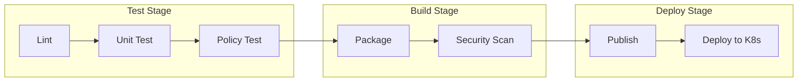

# Helm Chart CI/CD with GitLab CI

Author: [nawazdhandala](https://www.github.com/nawazdhandala)

Tags: Helm, Kubernetes, DevOps, GitLab CI, CI/CD, Automation

Description: Learn how to automate Helm chart testing, building, and publishing using GitLab CI/CD pipelines for seamless deployments.

> GitLab CI provides powerful pipeline capabilities with built-in container registry and Kubernetes integration. This guide shows you how to build a complete Helm chart CI/CD pipeline using GitLab.

## Pipeline Overview

A GitLab CI pipeline for Helm charts includes multiple stages:



## Repository Structure

```
helm-charts/
├── .gitlab-ci.yml
├── charts/
│   ├── my-app/
│   │   ├── Chart.yaml
│   │   ├── values.yaml
│   │   ├── templates/
│   │   └── tests/
│   └── another-app/
├── policy/
│   └── deployment.rego
├── scripts/
│   └── publish.sh
└── ct.yaml
```

## Complete GitLab CI Configuration

Create `.gitlab-ci.yml` in your repository root:

```yaml
# .gitlab-ci.yml
stages:
  - lint
  - test
  - build
  - security
  - publish
  - deploy

variables:
  HELM_VERSION: "3.13.0"
  CHART_DIR: charts
  
# Base template for Helm jobs
.helm-base:
  image: alpine/helm:${HELM_VERSION}
  before_script:
    - helm repo add bitnami https://charts.bitnami.com/bitnami
    - helm repo add prometheus-community https://prometheus-community.github.io/helm-charts
    - helm repo update

# Detect changed charts
.detect-changes:
  script:
    - |
      if [ "$CI_PIPELINE_SOURCE" = "merge_request_event" ]; then
        CHANGED=$(git diff --name-only $CI_MERGE_REQUEST_DIFF_BASE_SHA...$CI_COMMIT_SHA | grep "^${CHART_DIR}/" | cut -d'/' -f2 | sort -u)
      else
        CHANGED=$(git diff --name-only HEAD~1 | grep "^${CHART_DIR}/" | cut -d'/' -f2 | sort -u)
      fi
      echo "Changed charts: $CHANGED"
      echo "$CHANGED" > changed-charts.txt
  artifacts:
    paths:
      - changed-charts.txt

# ==================
# Lint Stage
# ==================

helm-lint:
  stage: lint
  extends: .helm-base
  script:
    - |
      for chart in ${CHART_DIR}/*/; do
        echo "Linting $chart"
        helm lint "$chart" --strict
      done
  rules:
    - if: $CI_PIPELINE_SOURCE == "merge_request_event"
      changes:
        - charts/**/*
    - if: $CI_COMMIT_BRANCH == $CI_DEFAULT_BRANCH
      changes:
        - charts/**/*

yaml-lint:
  stage: lint
  image: python:3.11-slim
  before_script:
    - pip install yamllint
  script:
    - yamllint ${CHART_DIR}/
  rules:
    - if: $CI_PIPELINE_SOURCE == "merge_request_event"
      changes:
        - charts/**/*
    - if: $CI_COMMIT_BRANCH == $CI_DEFAULT_BRANCH
      changes:
        - charts/**/*

# ==================
# Test Stage
# ==================

unit-test:
  stage: test
  extends: .helm-base
  before_script:
    - helm plugin install https://github.com/helm-unittest/helm-unittest
  script:
    - |
      for chart in ${CHART_DIR}/*/; do
        if [ -d "${chart}tests" ]; then
          echo "Testing $chart"
          helm unittest "$chart" --output-file results-$(basename $chart).xml --output-type JUnit
        fi
      done
  artifacts:
    reports:
      junit: results-*.xml
    when: always
  rules:
    - if: $CI_PIPELINE_SOURCE == "merge_request_event"
      changes:
        - charts/**/*
    - if: $CI_COMMIT_BRANCH == $CI_DEFAULT_BRANCH
      changes:
        - charts/**/*

template-test:
  stage: test
  extends: .helm-base
  script:
    - |
      for chart in ${CHART_DIR}/*/; do
        echo "Template testing $chart"
        helm template test "$chart" > /dev/null
        
        # Test with different values files if they exist
        if [ -d "${chart}ci" ]; then
          for values in ${chart}ci/*.yaml; do
            echo "Testing with $values"
            helm template test "$chart" -f "$values" > /dev/null
          done
        fi
      done
  rules:
    - if: $CI_PIPELINE_SOURCE == "merge_request_event"
      changes:
        - charts/**/*
    - if: $CI_COMMIT_BRANCH == $CI_DEFAULT_BRANCH
      changes:
        - charts/**/*

policy-test:
  stage: test
  image: alpine:latest
  before_script:
    - apk add --no-cache curl helm
    - |
      curl -LO https://github.com/open-policy-agent/conftest/releases/download/v0.46.2/conftest_0.46.2_Linux_x86_64.tar.gz
      tar xzf conftest_0.46.2_Linux_x86_64.tar.gz
      mv conftest /usr/local/bin/
  script:
    - |
      for chart in ${CHART_DIR}/*/; do
        echo "Policy testing $chart"
        helm template test "$chart" | conftest test - --policy ./policy
      done
  rules:
    - if: $CI_PIPELINE_SOURCE == "merge_request_event"
      changes:
        - charts/**/*
        - policy/**/*
    - if: $CI_COMMIT_BRANCH == $CI_DEFAULT_BRANCH
      changes:
        - charts/**/*
        - policy/**/*

integration-test:
  stage: test
  image: 
    name: alpine/k8s:1.28.3
    entrypoint: [""]
  services:
    - name: docker:24-dind
      alias: docker
  variables:
    DOCKER_HOST: tcp://docker:2376
    DOCKER_TLS_CERTDIR: "/certs"
    DOCKER_TLS_VERIFY: 1
    DOCKER_CERT_PATH: "$DOCKER_TLS_CERTDIR/client"
  before_script:
    - apk add --no-cache curl
    - curl -LO https://kind.sigs.k8s.io/dl/v0.20.0/kind-linux-amd64
    - chmod +x kind-linux-amd64
    - mv kind-linux-amd64 /usr/local/bin/kind
  script:
    - |
      # Create kind cluster
      kind create cluster --wait 5m
      
      # Install charts and run tests
      for chart in ${CHART_DIR}/*/; do
        CHART_NAME=$(basename "$chart")
        echo "Integration testing $CHART_NAME"
        
        helm install test-${CHART_NAME} "$chart" --wait --timeout 5m
        helm test test-${CHART_NAME}
        helm uninstall test-${CHART_NAME}
      done
  rules:
    - if: $CI_PIPELINE_SOURCE == "merge_request_event"
      changes:
        - charts/**/*
    - if: $CI_COMMIT_BRANCH == $CI_DEFAULT_BRANCH
      changes:
        - charts/**/*

# ==================
# Build Stage
# ==================

package:
  stage: build
  extends: .helm-base
  script:
    - mkdir -p packages
    - |
      for chart in ${CHART_DIR}/*/; do
        CHART_NAME=$(basename "$chart")
        VERSION=$(grep '^version:' "${chart}Chart.yaml" | awk '{print $2}')
        
        echo "Packaging $CHART_NAME version $VERSION"
        helm dependency build "$chart"
        helm package "$chart" -d packages/
      done
  artifacts:
    paths:
      - packages/
    expire_in: 1 week
  rules:
    - if: $CI_COMMIT_BRANCH == $CI_DEFAULT_BRANCH
      changes:
        - charts/**/*
    - if: $CI_COMMIT_TAG

# ==================
# Security Stage
# ==================

trivy-scan:
  stage: security
  image:
    name: aquasec/trivy:latest
    entrypoint: [""]
  script:
    - trivy config ${CHART_DIR}/ --format json --output trivy-results.json
    - trivy config ${CHART_DIR}/ --exit-code 1 --severity HIGH,CRITICAL
  artifacts:
    paths:
      - trivy-results.json
    reports:
      container_scanning: trivy-results.json
  allow_failure: true
  rules:
    - if: $CI_PIPELINE_SOURCE == "merge_request_event"
      changes:
        - charts/**/*
    - if: $CI_COMMIT_BRANCH == $CI_DEFAULT_BRANCH
      changes:
        - charts/**/*

kubesec-scan:
  stage: security
  image: alpine:latest
  before_script:
    - apk add --no-cache curl helm
    - |
      curl -LO https://github.com/controlplaneio/kubesec/releases/download/v2.13.0/kubesec_linux_amd64.tar.gz
      tar xzf kubesec_linux_amd64.tar.gz
      mv kubesec /usr/local/bin/
  script:
    - |
      for chart in ${CHART_DIR}/*/; do
        echo "Scanning $chart"
        helm template test "$chart" | kubesec scan -
      done
  allow_failure: true
  rules:
    - if: $CI_PIPELINE_SOURCE == "merge_request_event"
      changes:
        - charts/**/*
    - if: $CI_COMMIT_BRANCH == $CI_DEFAULT_BRANCH
      changes:
        - charts/**/*

# ==================
# Publish Stage
# ==================

publish-registry:
  stage: publish
  extends: .helm-base
  dependencies:
    - package
  script:
    - |
      echo "${CI_REGISTRY_PASSWORD}" | helm registry login -u ${CI_REGISTRY_USER} --password-stdin ${CI_REGISTRY}
      
      for pkg in packages/*.tgz; do
        echo "Publishing $pkg"
        helm push "$pkg" oci://${CI_REGISTRY}/${CI_PROJECT_NAMESPACE}/charts
      done
  rules:
    - if: $CI_COMMIT_BRANCH == $CI_DEFAULT_BRANCH
      changes:
        - charts/**/*

publish-pages:
  stage: publish
  extends: .helm-base
  dependencies:
    - package
  script:
    - mkdir -p public
    - cp packages/*.tgz public/
    - |
      # Download existing index if it exists
      curl -sSL "${CI_PAGES_URL}/index.yaml" -o public/index.yaml 2>/dev/null || true
      
      # Generate/update index
      helm repo index public/ --url "${CI_PAGES_URL}" --merge public/index.yaml 2>/dev/null || \
      helm repo index public/ --url "${CI_PAGES_URL}"
  artifacts:
    paths:
      - public
  rules:
    - if: $CI_COMMIT_BRANCH == $CI_DEFAULT_BRANCH
      changes:
        - charts/**/*

pages:
  stage: publish
  dependencies:
    - publish-pages
  script:
    - echo "Publishing to GitLab Pages"
  artifacts:
    paths:
      - public
  rules:
    - if: $CI_COMMIT_BRANCH == $CI_DEFAULT_BRANCH

# ==================
# Deploy Stage
# ==================

deploy-staging:
  stage: deploy
  image: alpine/k8s:1.28.3
  environment:
    name: staging
    url: https://staging.example.com
  before_script:
    - echo "${KUBECONFIG_STAGING}" | base64 -d > kubeconfig
    - export KUBECONFIG=kubeconfig
  script:
    - |
      for chart in ${CHART_DIR}/*/; do
        CHART_NAME=$(basename "$chart")
        VERSION=$(grep '^version:' "${chart}Chart.yaml" | awk '{print $2}')
        
        echo "Deploying $CHART_NAME to staging"
        helm upgrade --install ${CHART_NAME}-staging \
          oci://${CI_REGISTRY}/${CI_PROJECT_NAMESPACE}/charts/${CHART_NAME} \
          --version ${VERSION} \
          --namespace staging \
          --create-namespace \
          -f ${chart}values-staging.yaml \
          --wait
      done
  rules:
    - if: $CI_COMMIT_BRANCH == $CI_DEFAULT_BRANCH
      changes:
        - charts/**/*
      when: manual

deploy-production:
  stage: deploy
  image: alpine/k8s:1.28.3
  environment:
    name: production
    url: https://example.com
  before_script:
    - echo "${KUBECONFIG_PRODUCTION}" | base64 -d > kubeconfig
    - export KUBECONFIG=kubeconfig
  script:
    - |
      for chart in ${CHART_DIR}/*/; do
        CHART_NAME=$(basename "$chart")
        VERSION=$(grep '^version:' "${chart}Chart.yaml" | awk '{print $2}')
        
        echo "Deploying $CHART_NAME to production"
        helm upgrade --install ${CHART_NAME} \
          oci://${CI_REGISTRY}/${CI_PROJECT_NAMESPACE}/charts/${CHART_NAME} \
          --version ${VERSION} \
          --namespace production \
          --create-namespace \
          -f ${chart}values-production.yaml \
          --wait
      done
  rules:
    - if: $CI_COMMIT_BRANCH == $CI_DEFAULT_BRANCH
      changes:
        - charts/**/*
      when: manual
  needs:
    - deploy-staging
```

## Environment-Specific Values

Create values files for each environment:

```yaml
# charts/my-app/values-staging.yaml
replicaCount: 1

image:
  tag: latest

resources:
  limits:
    cpu: 500m
    memory: 256Mi

ingress:
  enabled: true
  hosts:
    - host: staging.example.com
      paths:
        - path: /
          pathType: Prefix
```

```yaml
# charts/my-app/values-production.yaml
replicaCount: 3

image:
  tag: "1.0.0"

resources:
  limits:
    cpu: 2000m
    memory: 1Gi

ingress:
  enabled: true
  hosts:
    - host: example.com
      paths:
        - path: /
          pathType: Prefix
  tls:
    - secretName: production-tls
      hosts:
        - example.com
```

## GitLab CI Variables

Configure these variables in GitLab CI/CD settings:

| Variable | Description | Protected |
| --- | --- | --- |
| `KUBECONFIG_STAGING` | Base64 kubeconfig for staging | Yes |
| `KUBECONFIG_PRODUCTION` | Base64 kubeconfig for production | Yes |
| `HELM_REPO_USERNAME` | Chart repo username | Yes |
| `HELM_REPO_PASSWORD` | Chart repo password | Yes |

## Using GitLab Container Registry

GitLab's built-in registry works seamlessly:

```yaml
publish-to-gitlab:
  stage: publish
  extends: .helm-base
  script:
    - |
      # Use CI_REGISTRY_* variables (automatic)
      helm registry login -u ${CI_REGISTRY_USER} -p ${CI_REGISTRY_PASSWORD} ${CI_REGISTRY}
      
      for chart in ${CHART_DIR}/*/; do
        helm package "$chart"
        helm push *.tgz oci://${CI_REGISTRY}/${CI_PROJECT_PATH}/charts
        rm *.tgz
      done
```

## Auto-DevOps Integration

Use GitLab Auto DevOps for automatic deployment:

```yaml
# Include Auto DevOps template
include:
  - template: Auto-DevOps.gitlab-ci.yml

# Override Helm settings
variables:
  HELM_UPGRADE_EXTRA_ARGS: "--timeout 600s"
  KUBE_NAMESPACE: my-app
```

## Merge Request Pipelines

Add MR-specific jobs:

```yaml
mr-diff:
  stage: lint
  extends: .helm-base
  before_script:
    - helm plugin install https://github.com/databus23/helm-diff
  script:
    - |
      for chart in ${CHART_DIR}/*/; do
        CHART_NAME=$(basename "$chart")
        echo "## Diff for $CHART_NAME"
        
        # Show what would change
        helm diff upgrade test-${CHART_NAME} "$chart" --allow-unreleased || true
      done
  rules:
    - if: $CI_PIPELINE_SOURCE == "merge_request_event"
      changes:
        - charts/**/*
```

## Chart Version Automation

Auto-bump versions on merge:

```yaml
version-bump:
  stage: build
  image: alpine:latest
  before_script:
    - apk add --no-cache git
    - git config user.email "ci@gitlab.com"
    - git config user.name "GitLab CI"
  script:
    - |
      # Determine version bump type from commit message
      if echo "$CI_COMMIT_MESSAGE" | grep -q "\[major\]"; then
        BUMP="major"
      elif echo "$CI_COMMIT_MESSAGE" | grep -q "\[minor\]"; then
        BUMP="minor"
      else
        BUMP="patch"
      fi
      
      for chart in ${CHART_DIR}/*/; do
        CURRENT=$(grep '^version:' "${chart}Chart.yaml" | awk '{print $2}')
        IFS='.' read -r major minor patch <<< "$CURRENT"
        
        case $BUMP in
          major) NEW="$((major + 1)).0.0" ;;
          minor) NEW="$major.$((minor + 1)).0" ;;
          patch) NEW="$major.$minor.$((patch + 1))" ;;
        esac
        
        sed -i "s/^version: .*/version: $NEW/" "${chart}Chart.yaml"
        echo "Bumped $(basename $chart) from $CURRENT to $NEW"
      done
      
      git add ${CHART_DIR}/*/Chart.yaml
      git commit -m "chore: bump chart versions [skip ci]"
      git push https://gitlab-ci-token:${CI_JOB_TOKEN}@${CI_SERVER_HOST}/${CI_PROJECT_PATH}.git HEAD:${CI_COMMIT_BRANCH}
  rules:
    - if: $CI_COMMIT_BRANCH == $CI_DEFAULT_BRANCH
      changes:
        - charts/**/*
```

## Cache Configuration

Speed up pipelines with caching:

```yaml
default:
  cache:
    key: ${CI_COMMIT_REF_SLUG}
    paths:
      - .helm/cache
      - .helm/plugins

variables:
  HELM_CACHE_HOME: ${CI_PROJECT_DIR}/.helm/cache
  HELM_CONFIG_HOME: ${CI_PROJECT_DIR}/.helm/config
  HELM_DATA_HOME: ${CI_PROJECT_DIR}/.helm/data
```

## Scheduled Pipelines

Run regular security scans:

```yaml
scheduled-security-scan:
  stage: security
  image:
    name: aquasec/trivy:latest
    entrypoint: [""]
  script:
    - trivy config ${CHART_DIR}/ --severity HIGH,CRITICAL
  rules:
    - if: $CI_PIPELINE_SOURCE == "schedule"
```

Configure in GitLab UI: CI/CD → Schedules → New Schedule

## Pipeline Badges

Add status badges to your README:

```markdown
[](https://gitlab.com/myorg/helm-charts/-/commits/main)
```

## Wrap-up

GitLab CI provides a complete platform for Helm chart CI/CD with built-in container registry, Kubernetes integration, and environment management. Use stages for lint, test, build, security, publish, and deploy. Leverage GitLab's container registry for chart storage, configure environment-specific values files, and use manual gates for production deployments. The pipeline ensures every chart change is validated, scanned, and deployed consistently.
