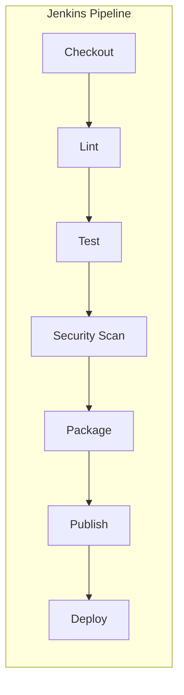

# Helm Chart CI/CD with Jenkins Pipeline

Author: [nawazdhandala](https://www.github.com/nawazdhandala)

Tags: Helm, Kubernetes, DevOps, Jenkins, CI/CD, Pipeline

Description: Learn how to build comprehensive Helm chart CI/CD pipelines using Jenkins declarative and scripted pipelines.

> Jenkins remains a popular choice for enterprise CI/CD. This guide shows you how to create robust Helm chart pipelines with Jenkins, including testing, security scanning, and multi-environment deployments.

## Pipeline Overview



## Prerequisites

Install required Jenkins plugins and tools:

- Kubernetes CLI plugin
- Docker Pipeline plugin
- Credentials Binding plugin
- Pipeline Utility Steps plugin

## Repository Structure

```
helm-charts/
├── Jenkinsfile
├── charts/
│   ├── my-app/
│   │   ├── Chart.yaml
│   │   ├── values.yaml
│   │   ├── values-staging.yaml
│   │   ├── values-production.yaml
│   │   ├── templates/
│   │   └── tests/
│   └── another-app/
├── policy/
│   └── deployment.rego
└── scripts/
    ├── lint.sh
    └── test.sh
```

## Declarative Pipeline

Create a `Jenkinsfile` in your repository root:

```groovy
// Jenkinsfile
pipeline {
    agent {
        kubernetes {
            yaml '''
                apiVersion: v1
                kind: Pod
                spec:
                  containers:
                  - name: helm
                    image: alpine/helm:3.13.0
                    command:
                    - cat
                    tty: true
                  - name: kubectl
                    image: bitnami/kubectl:1.28
                    command:
                    - cat
                    tty: true
                  - name: trivy
                    image: aquasec/trivy:latest
                    command:
                    - cat
                    tty: true
            '''
        }
    }
    
    environment {
        CHART_DIR = 'charts'
        REGISTRY = 'ghcr.io/myorg'
        REGISTRY_CREDS = credentials('ghcr-credentials')
    }
    
    options {
        buildDiscarder(logRotator(numToKeepStr: '10'))
        timeout(time: 30, unit: 'MINUTES')
        timestamps()
    }
    
    stages {
        stage('Checkout') {
            steps {
                checkout scm
                script {
                    env.GIT_COMMIT_SHORT = sh(
                        script: 'git rev-parse --short HEAD',
                        returnStdout: true
                    ).trim()
                }
            }
        }
        
        stage('Detect Changes') {
            steps {
                script {
                    def changes = []
                    def chartDirs = sh(
                        script: "ls -d ${CHART_DIR}/*/",
                        returnStdout: true
                    ).trim().split('\n')
                    
                    chartDirs.each { chart ->
                        def chartName = chart.replace("${CHART_DIR}/", '').replace('/', '')
                        changes.add(chartName)
                    }
                    env.CHANGED_CHARTS = changes.join(',')
                    echo "Charts to process: ${env.CHANGED_CHARTS}"
                }
            }
        }
        
        stage('Lint') {
            steps {
                container('helm') {
                    sh '''
                        helm repo add bitnami https://charts.bitnami.com/bitnami
                        helm repo update
                        
                        for chart in ${CHART_DIR}/*/; do
                            echo "Linting $chart"
                            helm lint "$chart" --strict
                        done
                    '''
                }
            }
        }
        
        stage('Unit Tests') {
            steps {
                container('helm') {
                    sh '''
                        helm plugin install https://github.com/helm-unittest/helm-unittest || true
                        
                        for chart in ${CHART_DIR}/*/; do
                            if [ -d "${chart}tests" ]; then
                                echo "Testing $chart"
                                helm unittest "$chart" --output-file results-$(basename $chart).xml --output-type JUnit
                            fi
                        done
                    '''
                }
            }
            post {
                always {
                    junit allowEmptyResults: true, testResults: 'results-*.xml'
                }
            }
        }
        
        stage('Template Validation') {
            steps {
                container('helm') {
                    sh '''
                        for chart in ${CHART_DIR}/*/; do
                            echo "Validating templates for $chart"
                            helm template test "$chart" > /dev/null
                            
                            # Test with CI values if they exist
                            if [ -d "${chart}ci" ]; then
                                for values in ${chart}ci/*.yaml; do
                                    echo "Testing with $values"
                                    helm template test "$chart" -f "$values" > /dev/null
                                done
                            fi
                        done
                    '''
                }
            }
        }
        
        stage('Security Scan') {
            parallel {
                stage('Trivy Scan') {
                    steps {
                        container('trivy') {
                            sh '''
                                trivy config ${CHART_DIR}/ \
                                    --format json \
                                    --output trivy-results.json
                                    
                                trivy config ${CHART_DIR}/ \
                                    --exit-code 0 \
                                    --severity HIGH,CRITICAL
                            '''
                        }
                    }
                    post {
                        always {
                            archiveArtifacts artifacts: 'trivy-results.json', allowEmptyArchive: true
                        }
                    }
                }
                
                stage('Policy Tests') {
                    steps {
                        container('helm') {
                            sh '''
                                # Install conftest
                                curl -LO https://github.com/open-policy-agent/conftest/releases/download/v0.46.2/conftest_0.46.2_Linux_x86_64.tar.gz
                                tar xzf conftest_0.46.2_Linux_x86_64.tar.gz
                                chmod +x conftest
                                
                                for chart in ${CHART_DIR}/*/; do
                                    echo "Policy testing $chart"
                                    helm template test "$chart" | ./conftest test - --policy ./policy || true
                                done
                            '''
                        }
                    }
                }
            }
        }
        
        stage('Package') {
            steps {
                container('helm') {
                    sh '''
                        mkdir -p packages
                        
                        for chart in ${CHART_DIR}/*/; do
                            CHART_NAME=$(basename "$chart")
                            echo "Packaging $CHART_NAME"
                            
                            helm dependency build "$chart"
                            helm package "$chart" -d packages/
                        done
                    '''
                }
            }
            post {
                success {
                    archiveArtifacts artifacts: 'packages/*.tgz', fingerprint: true
                }
            }
        }
        
        stage('Publish') {
            when {
                anyOf {
                    branch 'main'
                    buildingTag()
                }
            }
            steps {
                container('helm') {
                    sh '''
                        echo "${REGISTRY_CREDS_PSW}" | helm registry login ${REGISTRY} -u ${REGISTRY_CREDS_USR} --password-stdin
                        
                        for pkg in packages/*.tgz; do
                            echo "Publishing $pkg"
                            helm push "$pkg" oci://${REGISTRY}/charts
                        done
                    '''
                }
            }
        }
        
        stage('Deploy to Staging') {
            when {
                branch 'main'
            }
            steps {
                container('kubectl') {
                    withCredentials([file(credentialsId: 'kubeconfig-staging', variable: 'KUBECONFIG')]) {
                        container('helm') {
                            sh '''
                                for chart in ${CHART_DIR}/*/; do
                                    CHART_NAME=$(basename "$chart")
                                    VERSION=$(grep '^version:' "${chart}Chart.yaml" | awk '{print $2}')
                                    
                                    echo "Deploying $CHART_NAME to staging"
                                    helm upgrade --install ${CHART_NAME}-staging \
                                        oci://${REGISTRY}/charts/${CHART_NAME} \
                                        --version ${VERSION} \
                                        --namespace staging \
                                        --create-namespace \
                                        -f ${chart}values-staging.yaml \
                                        --wait \
                                        --timeout 10m
                                done
                            '''
                        }
                    }
                }
            }
        }
        
        stage('Deploy to Production') {
            when {
                branch 'main'
            }
            input {
                message 'Deploy to production?'
                ok 'Deploy'
                parameters {
                    choice(name: 'CONFIRM', choices: ['No', 'Yes'], description: 'Confirm production deployment')
                }
            }
            steps {
                script {
                    if (params.CONFIRM == 'Yes') {
                        container('kubectl') {
                            withCredentials([file(credentialsId: 'kubeconfig-production', variable: 'KUBECONFIG')]) {
                                container('helm') {
                                    sh '''
                                        for chart in ${CHART_DIR}/*/; do
                                            CHART_NAME=$(basename "$chart")
                                            VERSION=$(grep '^version:' "${chart}Chart.yaml" | awk '{print $2}')
                                            
                                            echo "Deploying $CHART_NAME to production"
                                            helm upgrade --install ${CHART_NAME} \
                                                oci://${REGISTRY}/charts/${CHART_NAME} \
                                                --version ${VERSION} \
                                                --namespace production \
                                                --create-namespace \
                                                -f ${chart}values-production.yaml \
                                                --wait \
                                                --timeout 10m
                                        done
                                    '''
                                }
                            }
                        }
                    } else {
                        echo 'Production deployment cancelled'
                    }
                }
            }
        }
    }
    
    post {
        always {
            cleanWs()
        }
        success {
            echo 'Pipeline completed successfully!'
        }
        failure {
            echo 'Pipeline failed!'
            // Add notification (Slack, email, etc.)
        }
    }
}
```

## Scripted Pipeline Alternative

For more complex logic, use a scripted pipeline:

```groovy
// Jenkinsfile (Scripted)
node('kubernetes') {
    def chartDir = 'charts'
    def registry = 'ghcr.io/myorg'
    def changedCharts = []
    
    stage('Checkout') {
        checkout scm
        
        // Detect changed charts
        def output = sh(
            script: "ls -d ${chartDir}/*/",
            returnStdout: true
        ).trim()
        
        output.split('\n').each { path ->
            def chartName = path.replace("${chartDir}/", '').replace('/', '')
            changedCharts.add(chartName)
        }
        
        echo "Processing charts: ${changedCharts}"
    }
    
    stage('Lint and Test') {
        docker.image('alpine/helm:3.13.0').inside {
            sh 'helm repo add bitnami https://charts.bitnami.com/bitnami'
            sh 'helm repo update'
            
            changedCharts.each { chart ->
                echo "Processing ${chart}"
                
                // Lint
                sh "helm lint ${chartDir}/${chart} --strict"
                
                // Template test
                sh "helm template test ${chartDir}/${chart}"
                
                // Unit tests if available
                if (fileExists("${chartDir}/${chart}/tests")) {
                    sh 'helm plugin install https://github.com/helm-unittest/helm-unittest || true'
                    sh "helm unittest ${chartDir}/${chart}"
                }
            }
        }
    }
    
    stage('Security Scan') {
        docker.image('aquasec/trivy:latest').inside('--entrypoint=""') {
            sh "trivy config ${chartDir}/ --severity HIGH,CRITICAL"
        }
    }
    
    stage('Package') {
        docker.image('alpine/helm:3.13.0').inside {
            sh 'mkdir -p packages'
            
            changedCharts.each { chart ->
                sh "helm dependency build ${chartDir}/${chart}"
                sh "helm package ${chartDir}/${chart} -d packages/"
            }
        }
        
        archiveArtifacts artifacts: 'packages/*.tgz', fingerprint: true
    }
    
    if (env.BRANCH_NAME == 'main') {
        stage('Publish') {
            withCredentials([usernamePassword(
                credentialsId: 'ghcr-credentials',
                usernameVariable: 'REGISTRY_USER',
                passwordVariable: 'REGISTRY_PASS'
            )]) {
                docker.image('alpine/helm:3.13.0').inside {
                    sh """
                        echo \${REGISTRY_PASS} | helm registry login ${registry} -u \${REGISTRY_USER} --password-stdin
                        
                        for pkg in packages/*.tgz; do
                            helm push "\$pkg" oci://${registry}/charts
                        done
                    """
                }
            }
        }
        
        stage('Deploy Staging') {
            deployToEnvironment('staging', changedCharts, chartDir, registry)
        }
        
        stage('Deploy Production') {
            input message: 'Deploy to production?', ok: 'Deploy'
            deployToEnvironment('production', changedCharts, chartDir, registry)
        }
    }
}

def deployToEnvironment(String environment, List charts, String chartDir, String registry) {
    withCredentials([file(credentialsId: "kubeconfig-${environment}", variable: 'KUBECONFIG')]) {
        docker.image('alpine/helm:3.13.0').inside {
            charts.each { chart ->
                def version = sh(
                    script: "grep '^version:' ${chartDir}/${chart}/Chart.yaml | awk '{print \$2}'",
                    returnStdout: true
                ).trim()
                
                def releaseName = environment == 'production' ? chart : "${chart}-${environment}"
                
                sh """
                    helm upgrade --install ${releaseName} \
                        oci://${registry}/charts/${chart} \
                        --version ${version} \
                        --namespace ${environment} \
                        --create-namespace \
                        -f ${chartDir}/${chart}/values-${environment}.yaml \
                        --wait \
                        --timeout 10m
                """
            }
        }
    }
}
```

## Shared Library

Create a shared library for reusable Helm functions:

```groovy
// vars/helmPipeline.groovy
def call(Map config = [:]) {
    def chartDir = config.chartDir ?: 'charts'
    def registry = config.registry ?: 'ghcr.io/myorg'
    
    pipeline {
        agent {
            kubernetes {
                yaml helmPodTemplate()
            }
        }
        
        stages {
            stage('Lint') {
                steps {
                    container('helm') {
                        script {
                            helmLint(chartDir)
                        }
                    }
                }
            }
            
            stage('Test') {
                steps {
                    container('helm') {
                        script {
                            helmTest(chartDir)
                        }
                    }
                }
            }
            
            stage('Package & Publish') {
                when {
                    branch 'main'
                }
                steps {
                    container('helm') {
                        script {
                            helmPackageAndPublish(chartDir, registry)
                        }
                    }
                }
            }
        }
    }
}

def helmPodTemplate() {
    return '''
        apiVersion: v1
        kind: Pod
        spec:
          containers:
          - name: helm
            image: alpine/helm:3.13.0
            command: [cat]
            tty: true
    '''
}

def helmLint(String chartDir) {
    sh """
        helm repo add bitnami https://charts.bitnami.com/bitnami
        helm repo update
        
        for chart in ${chartDir}/*/; do
            helm lint "\$chart" --strict
        done
    """
}

def helmTest(String chartDir) {
    sh '''
        helm plugin install https://github.com/helm-unittest/helm-unittest || true
    '''
    
    sh """
        for chart in ${chartDir}/*/; do
            if [ -d "\${chart}tests" ]; then
                helm unittest "\$chart"
            fi
        done
    """
}

def helmPackageAndPublish(String chartDir, String registry) {
    withCredentials([usernamePassword(
        credentialsId: 'registry-credentials',
        usernameVariable: 'USER',
        passwordVariable: 'PASS'
    )]) {
        sh """
            echo \${PASS} | helm registry login ${registry} -u \${USER} --password-stdin
            
            for chart in ${chartDir}/*/; do
                helm dependency build "\$chart"
                helm package "\$chart"
                helm push *.tgz oci://${registry}/charts
                rm *.tgz
            done
        """
    }
}
```

Usage in Jenkinsfile:

```groovy
@Library('helm-pipeline') _

helmPipeline(
    chartDir: 'charts',
    registry: 'ghcr.io/myorg'
)
```

## Jenkins Credentials Setup

Configure required credentials in Jenkins:

```groovy
// Example credential setup via Jenkins Configuration as Code
credentials:
  system:
    domainCredentials:
      - credentials:
          - usernamePassword:
              id: "ghcr-credentials"
              username: "myuser"
              password: "${GHCR_TOKEN}"
              scope: GLOBAL
          - file:
              id: "kubeconfig-staging"
              fileName: "kubeconfig"
              secretBytes: "${KUBECONFIG_STAGING_BASE64}"
          - file:
              id: "kubeconfig-production"
              fileName: "kubeconfig"
              secretBytes: "${KUBECONFIG_PRODUCTION_BASE64}"
```

## Multibranch Pipeline

Configure a multibranch pipeline for automatic branch detection:

```groovy
// Jenkinsfile with branch-specific behavior
pipeline {
    agent any
    
    stages {
        stage('Build') {
            steps {
                // Common build steps
            }
        }
        
        stage('Deploy Preview') {
            when {
                changeRequest()
            }
            steps {
                script {
                    def previewNamespace = "preview-${env.CHANGE_ID}"
                    // Deploy to preview environment
                }
            }
        }
        
        stage('Deploy Staging') {
            when {
                branch 'main'
            }
            steps {
                // Deploy to staging
            }
        }
        
        stage('Deploy Production') {
            when {
                buildingTag()
            }
            steps {
                // Deploy to production
            }
        }
    }
}
```

## Blue Ocean Pipeline

Jenkins Blue Ocean provides a visual pipeline editor. Create a pipeline visually and export:

```groovy
// Generated by Blue Ocean
pipeline {
    agent any
    stages {
        stage('Lint') {
            parallel {
                stage('Helm Lint') {
                    steps {
                        sh 'helm lint charts/*/'
                    }
                }
                stage('YAML Lint') {
                    steps {
                        sh 'yamllint charts/'
                    }
                }
            }
        }
        stage('Test') {
            steps {
                sh 'helm unittest charts/*/'
            }
        }
        stage('Publish') {
            when {
                branch 'main'
            }
            steps {
                sh 'helm push charts/*/ oci://registry/charts'
            }
        }
    }
}
```

## Webhook Configuration

Configure GitHub/GitLab webhooks for automatic triggers:

1. Jenkins URL: `https://jenkins.example.com/github-webhook/`
2. Content type: `application/json`
3. Events: Push, Pull Request

## Best Practices

| Practice | Why |
| --- | --- |
| Use Kubernetes agents | Dynamic, isolated build environments |
| Parallel stages | Faster pipelines |
| Archive artifacts | Debugging and audit |
| Input gates for production | Prevent accidental deployments |
| Shared libraries | DRY, maintainable pipelines |
| Credential binding | Secure secret handling |

## Wrap-up

Jenkins provides flexible Helm chart CI/CD with declarative or scripted pipelines. Use Kubernetes agents for isolated builds, parallel stages for speed, and shared libraries for reusability. Configure proper credentials, add input gates for production deployments, and integrate security scanning. Whether using classic Jenkins or Blue Ocean, a well-designed pipeline ensures consistent, validated chart releases.
