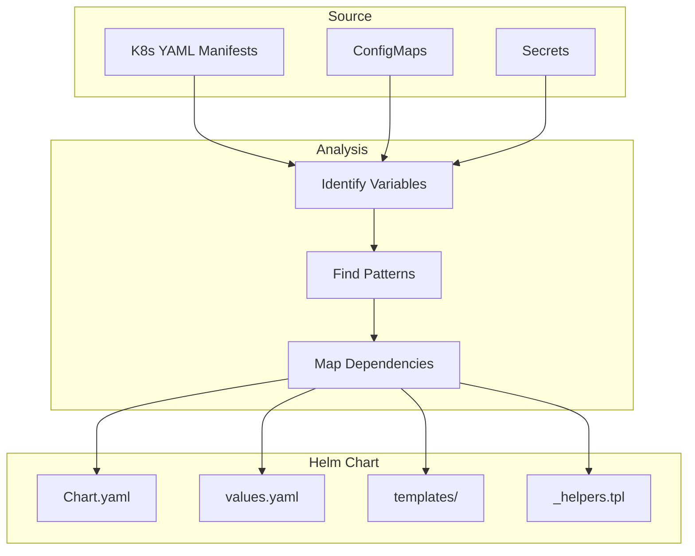

# How to Convert Kubernetes YAML Manifests to Helm Charts

Author: [nawazdhandala](https://www.github.com/nawazdhandala)

Tags: Helm, Kubernetes, DevOps, Migration, Templates, Best Practices

Description: Step-by-step guide to converting existing Kubernetes YAML manifests into reusable Helm charts with templatization strategies and best practices.

> Converting raw Kubernetes manifests to Helm charts enables configuration management and reusability. This guide covers strategies for templatizing existing manifests, creating values files, and implementing Helm best practices.

## Conversion Strategy Overview



## Step 1: Analyze Existing Manifests

### Sample Kubernetes Manifests

```yaml
# deployment.yaml
apiVersion: apps/v1
kind: Deployment
metadata:
  name: myapp
  namespace: production
  labels:
    app: myapp
    environment: production
    version: v1.2.3
spec:
  replicas: 3
  selector:
    matchLabels:
      app: myapp
  template:
    metadata:
      labels:
        app: myapp
    spec:
      containers:
        - name: myapp
          image: myorg/myapp:v1.2.3
          ports:
            - containerPort: 8080
          env:
            - name: DATABASE_URL
              value: postgresql://db.production.svc:5432/myapp
            - name: LOG_LEVEL
              value: info
          resources:
            requests:
              cpu: 100m
              memory: 128Mi
            limits:
              cpu: 500m
              memory: 512Mi

---
# service.yaml
apiVersion: v1
kind: Service
metadata:
  name: myapp
  namespace: production
spec:
  type: ClusterIP
  ports:
    - port: 80
      targetPort: 8080
  selector:
    app: myapp

---
# ingress.yaml
apiVersion: networking.k8s.io/v1
kind: Ingress
metadata:
  name: myapp
  namespace: production
  annotations:
    cert-manager.io/cluster-issuer: letsencrypt-prod
spec:
  ingressClassName: nginx
  rules:
    - host: myapp.example.com
      http:
        paths:
          - path: /
            pathType: Prefix
            backend:
              service:
                name: myapp
                port:
                  number: 80
  tls:
    - hosts:
        - myapp.example.com
      secretName: myapp-tls
```

### Identify Variable Candidates

```bash
# Variables to extract:
# - Namespace (production)
# - App name (myapp)
# - Replicas (3)
# - Image repository and tag (myorg/myapp:v1.2.3)
# - Environment variables (DATABASE_URL, LOG_LEVEL)
# - Resource limits/requests
# - Service port (80, 8080)
# - Ingress host (myapp.example.com)
# - TLS configuration
```

## Step 2: Create Chart Structure

### Initialize Chart

```bash
# Create chart scaffold
helm create myapp

# Directory structure
myapp/
├── Chart.yaml
├── values.yaml
├── charts/
├── templates/
│   ├── deployment.yaml
│   ├── service.yaml
│   ├── ingress.yaml
│   ├── hpa.yaml
│   ├── serviceaccount.yaml
│   ├── NOTES.txt
│   ├── _helpers.tpl
│   └── tests/
│       └── test-connection.yaml
└── .helmignore

# Remove unnecessary default files
rm myapp/templates/hpa.yaml
rm myapp/templates/serviceaccount.yaml
```

### Configure Chart.yaml

```yaml
# Chart.yaml
apiVersion: v2
name: myapp
description: My Application Helm Chart
type: application
version: 1.0.0
appVersion: "1.2.3"
maintainers:
  - name: Your Name
    email: you@example.com
keywords:
  - myapp
  - web
home: https://github.com/myorg/myapp
sources:
  - https://github.com/myorg/myapp
```

## Step 3: Create Values File

### Extract Configuration

```yaml
# values.yaml
# Global settings
nameOverride: ""
fullnameOverride: ""

# Replica configuration
replicaCount: 3

# Image configuration
image:
  repository: myorg/myapp
  tag: ""  # Defaults to Chart.appVersion
  pullPolicy: IfNotPresent

# Image pull secrets
imagePullSecrets: []

# Service account
serviceAccount:
  create: false
  name: ""
  annotations: {}

# Pod annotations and labels
podAnnotations: {}
podLabels: {}

# Security context
podSecurityContext: {}
securityContext: {}

# Service configuration
service:
  type: ClusterIP
  port: 80
  targetPort: 8080

# Ingress configuration
ingress:
  enabled: true
  className: nginx
  annotations:
    cert-manager.io/cluster-issuer: letsencrypt-prod
  hosts:
    - host: myapp.example.com
      paths:
        - path: /
          pathType: Prefix
  tls:
    - secretName: myapp-tls
      hosts:
        - myapp.example.com

# Resource limits
resources:
  limits:
    cpu: 500m
    memory: 512Mi
  requests:
    cpu: 100m
    memory: 128Mi

# Environment variables
env:
  DATABASE_URL: postgresql://db.production.svc:5432/myapp
  LOG_LEVEL: info

# Extra environment variables from secrets/configmaps
envFrom: []

# Node selection
nodeSelector: {}
tolerations: []
affinity: {}

# Probes
livenessProbe:
  httpGet:
    path: /health
    port: http
  initialDelaySeconds: 10
  periodSeconds: 10

readinessProbe:
  httpGet:
    path: /ready
    port: http
  initialDelaySeconds: 5
  periodSeconds: 5
```

## Step 4: Create Helper Templates

### _helpers.tpl

```yaml
{{/*
Expand the name of the chart.
*/}}
{{- define "myapp.name" -}}
{{- default .Chart.Name .Values.nameOverride | trunc 63 | trimSuffix "-" }}
{{- end }}

{{/*
Create a default fully qualified app name.
*/}}
{{- define "myapp.fullname" -}}
{{- if .Values.fullnameOverride }}
{{- .Values.fullnameOverride | trunc 63 | trimSuffix "-" }}
{{- else }}
{{- $name := default .Chart.Name .Values.nameOverride }}
{{- if contains $name .Release.Name }}
{{- .Release.Name | trunc 63 | trimSuffix "-" }}
{{- else }}
{{- printf "%s-%s" .Release.Name $name | trunc 63 | trimSuffix "-" }}
{{- end }}
{{- end }}
{{- end }}

{{/*
Create chart name and version for chart label.
*/}}
{{- define "myapp.chart" -}}
{{- printf "%s-%s" .Chart.Name .Chart.Version | replace "+" "_" | trunc 63 | trimSuffix "-" }}
{{- end }}

{{/*
Common labels
*/}}
{{- define "myapp.labels" -}}
helm.sh/chart: {{ include "myapp.chart" . }}
{{ include "myapp.selectorLabels" . }}
{{- if .Chart.AppVersion }}
app.kubernetes.io/version: {{ .Chart.AppVersion | quote }}
{{- end }}
app.kubernetes.io/managed-by: {{ .Release.Service }}
{{- end }}

{{/*
Selector labels
*/}}
{{- define "myapp.selectorLabels" -}}
app.kubernetes.io/name: {{ include "myapp.name" . }}
app.kubernetes.io/instance: {{ .Release.Name }}
{{- end }}

{{/*
Create the image tag
*/}}
{{- define "myapp.imageTag" -}}
{{- default .Chart.AppVersion .Values.image.tag }}
{{- end }}

{{/*
Create the full image name
*/}}
{{- define "myapp.image" -}}
{{- printf "%s:%s" .Values.image.repository (include "myapp.imageTag" .) }}
{{- end }}
```

## Step 5: Convert Templates

### Deployment Template

```yaml
# templates/deployment.yaml
apiVersion: apps/v1
kind: Deployment
metadata:
  name: {{ include "myapp.fullname" . }}
  labels:
    {{- include "myapp.labels" . | nindent 4 }}
spec:
  replicas: {{ .Values.replicaCount }}
  selector:
    matchLabels:
      {{- include "myapp.selectorLabels" . | nindent 6 }}
  template:
    metadata:
      {{- with .Values.podAnnotations }}
      annotations:
        {{- toYaml . | nindent 8 }}
      {{- end }}
      labels:
        {{- include "myapp.labels" . | nindent 8 }}
        {{- with .Values.podLabels }}
        {{- toYaml . | nindent 8 }}
        {{- end }}
    spec:
      {{- with .Values.imagePullSecrets }}
      imagePullSecrets:
        {{- toYaml . | nindent 8 }}
      {{- end }}
      {{- with .Values.podSecurityContext }}
      securityContext:
        {{- toYaml . | nindent 8 }}
      {{- end }}
      containers:
        - name: {{ .Chart.Name }}
          {{- with .Values.securityContext }}
          securityContext:
            {{- toYaml . | nindent 12 }}
          {{- end }}
          image: {{ include "myapp.image" . }}
          imagePullPolicy: {{ .Values.image.pullPolicy }}
          ports:
            - name: http
              containerPort: {{ .Values.service.targetPort }}
              protocol: TCP
          env:
            {{- range $key, $value := .Values.env }}
            - name: {{ $key }}
              value: {{ $value | quote }}
            {{- end }}
          {{- with .Values.envFrom }}
          envFrom:
            {{- toYaml . | nindent 12 }}
          {{- end }}
          {{- with .Values.livenessProbe }}
          livenessProbe:
            {{- toYaml . | nindent 12 }}
          {{- end }}
          {{- with .Values.readinessProbe }}
          readinessProbe:
            {{- toYaml . | nindent 12 }}
          {{- end }}
          resources:
            {{- toYaml .Values.resources | nindent 12 }}
      {{- with .Values.nodeSelector }}
      nodeSelector:
        {{- toYaml . | nindent 8 }}
      {{- end }}
      {{- with .Values.affinity }}
      affinity:
        {{- toYaml . | nindent 8 }}
      {{- end }}
      {{- with .Values.tolerations }}
      tolerations:
        {{- toYaml . | nindent 8 }}
      {{- end }}
```

### Service Template

```yaml
# templates/service.yaml
apiVersion: v1
kind: Service
metadata:
  name: {{ include "myapp.fullname" . }}
  labels:
    {{- include "myapp.labels" . | nindent 4 }}
spec:
  type: {{ .Values.service.type }}
  ports:
    - port: {{ .Values.service.port }}
      targetPort: http
      protocol: TCP
      name: http
  selector:
    {{- include "myapp.selectorLabels" . | nindent 4 }}
```

### Ingress Template

```yaml
# templates/ingress.yaml
{{- if .Values.ingress.enabled -}}
apiVersion: networking.k8s.io/v1
kind: Ingress
metadata:
  name: {{ include "myapp.fullname" . }}
  labels:
    {{- include "myapp.labels" . | nindent 4 }}
  {{- with .Values.ingress.annotations }}
  annotations:
    {{- toYaml . | nindent 4 }}
  {{- end }}
spec:
  {{- if .Values.ingress.className }}
  ingressClassName: {{ .Values.ingress.className }}
  {{- end }}
  {{- if .Values.ingress.tls }}
  tls:
    {{- range .Values.ingress.tls }}
    - hosts:
        {{- range .hosts }}
        - {{ . | quote }}
        {{- end }}
      secretName: {{ .secretName }}
    {{- end }}
  {{- end }}
  rules:
    {{- range .Values.ingress.hosts }}
    - host: {{ .host | quote }}
      http:
        paths:
          {{- range .paths }}
          - path: {{ .path }}
            pathType: {{ .pathType }}
            backend:
              service:
                name: {{ include "myapp.fullname" $ }}
                port:
                  number: {{ $.Values.service.port }}
          {{- end }}
    {{- end }}
{{- end }}
```

## Step 6: Create Environment-Specific Values

### Development Values

```yaml
# values-dev.yaml
replicaCount: 1

image:
  tag: "dev"
  pullPolicy: Always

ingress:
  enabled: true
  hosts:
    - host: myapp.dev.example.com
      paths:
        - path: /
          pathType: Prefix
  tls:
    - secretName: myapp-dev-tls
      hosts:
        - myapp.dev.example.com

env:
  DATABASE_URL: postgresql://db.dev.svc:5432/myapp
  LOG_LEVEL: debug

resources:
  limits:
    cpu: 200m
    memory: 256Mi
  requests:
    cpu: 50m
    memory: 64Mi
```

### Production Values

```yaml
# values-prod.yaml
replicaCount: 5

image:
  tag: "1.2.3"

ingress:
  enabled: true
  annotations:
    cert-manager.io/cluster-issuer: letsencrypt-prod
    nginx.ingress.kubernetes.io/rate-limit: "100"
  hosts:
    - host: myapp.example.com
      paths:
        - path: /
          pathType: Prefix
  tls:
    - secretName: myapp-prod-tls
      hosts:
        - myapp.example.com

env:
  DATABASE_URL: postgresql://db.prod.svc:5432/myapp
  LOG_LEVEL: warn

resources:
  limits:
    cpu: 1000m
    memory: 1Gi
  requests:
    cpu: 500m
    memory: 512Mi

affinity:
  podAntiAffinity:
    preferredDuringSchedulingIgnoredDuringExecution:
      - weight: 100
        podAffinityTerm:
          labelSelector:
            matchLabels:
              app.kubernetes.io/name: myapp
          topologyKey: kubernetes.io/hostname
```

## Step 7: Validate Conversion

### Compare Output

```bash
# Render original manifests
cat deployment.yaml service.yaml ingress.yaml > original.yaml

# Render Helm templates
helm template myapp ./myapp -f values-prod.yaml > rendered.yaml

# Compare (excluding dynamic fields)
diff <(cat original.yaml | yq 'del(.metadata.annotations, .metadata.labels)' -) \
     <(cat rendered.yaml | yq 'del(.metadata.annotations, .metadata.labels)' -)
```

### Lint Chart

```bash
# Lint the chart
helm lint myapp --strict

# Validate with different values
helm lint myapp -f values-dev.yaml
helm lint myapp -f values-prod.yaml

# Template validation
helm template myapp ./myapp | kubectl apply --dry-run=server -f -
```

## Automation Tools

### Helmify

```bash
# Install helmify
go install github.com/arttor/helmify/cmd/helmify@latest

# Convert manifests
cat *.yaml | helmify mychart

# Generated chart structure
mychart/
├── Chart.yaml
├── values.yaml
└── templates/
    └── ...
```

### kompose (for Docker Compose)

```bash
# Convert docker-compose to Helm
kompose convert -c -o mychart

# Options
kompose convert \
  --chart \
  --out mychart \
  --volumes hostPath
```

## Best Practices

| Practice | Description |
|----------|-------------|
| Use Helpers | Create reusable template functions |
| Default Values | Provide sensible defaults |
| Documentation | Add comments in values.yaml |
| Validation | Use values.schema.json |
| Testing | Add helm test templates |
| Versioning | Follow SemVer for charts |

## Wrap-up

Converting Kubernetes manifests to Helm charts improves configuration management and enables multi-environment deployments. Follow the systematic approach of analyzing manifests, extracting variables, creating helpers, and templatizing resources. Use tools like helmify for automation and always validate the converted chart before deployment.
