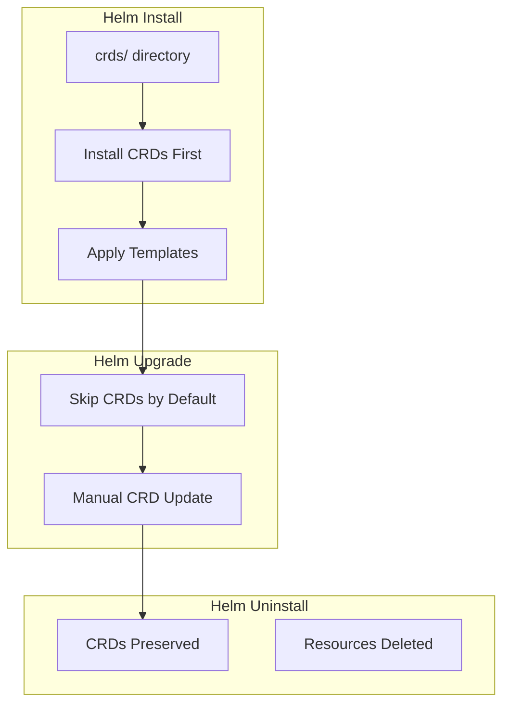

# How to Handle Helm CRD Installation and Upgrades

Author: [nawazdhandala](https://www.github.com/nawazdhandala)

Tags: Helm, Kubernetes, DevOps, CRD, Custom Resources, Best Practices

Description: Complete guide to managing Custom Resource Definitions (CRDs) lifecycle with Helm including installation, upgrades, and manual handling strategies.

> CRDs require special handling in Helm because they must exist before custom resources can be created. This guide covers CRD lifecycle management, upgrade strategies, and best practices for maintaining CRDs across Helm releases.

## CRD Lifecycle Overview



## CRD Directory Structure

### Standard CRD Location

```
charts/myapp/
├── Chart.yaml
├── values.yaml
├── crds/
│   ├── myresource-crd.yaml
│   └── myotherresource-crd.yaml
└── templates/
    ├── deployment.yaml
    ├── myresource.yaml
    └── _helpers.tpl
```

### CRD Definition Example

```yaml
# crds/myresource-crd.yaml
apiVersion: apiextensions.k8s.io/v1
kind: CustomResourceDefinition
metadata:
  name: myresources.myorg.io
  annotations:
    helm.sh/resource-policy: keep
spec:
  group: myorg.io
  versions:
    - name: v1
      served: true
      storage: true
      schema:
        openAPIV3Schema:
          type: object
          properties:
            spec:
              type: object
              required:
                - name
              properties:
                name:
                  type: string
                replicas:
                  type: integer
                  minimum: 1
                  default: 1
      subresources:
        status: {}
  scope: Namespaced
  names:
    plural: myresources
    singular: myresource
    kind: MyResource
    shortNames:
      - mr
```

## CRD Installation Behavior

### Default Behavior

```bash
# During helm install, CRDs are installed first
helm install myapp charts/myapp

# Order of operations:
# 1. CRDs from crds/ directory are applied
# 2. Templates are rendered and applied
# 3. Hooks are executed
```

### Skip CRD Installation

```bash
# Skip CRD installation
helm install myapp charts/myapp --skip-crds

# Useful when:
# - CRDs are managed separately
# - CRDs already exist from another release
# - Using external CRD management
```

### Check if CRDs Exist

```bash
# List CRDs
kubectl get crds | grep myorg.io

# Describe CRD
kubectl describe crd myresources.myorg.io

# Check CRD version
kubectl get crd myresources.myorg.io -o jsonpath='{.spec.versions[*].name}'
```

## CRD Upgrade Strategies

### Manual CRD Updates

```bash
# Extract CRDs from chart
helm template myapp charts/myapp --include-crds | kubectl apply -f - --dry-run=server

# Apply CRDs manually before upgrade
kubectl apply -f charts/myapp/crds/

# Then upgrade without CRDs
helm upgrade myapp charts/myapp --skip-crds
```

### Pre-upgrade Hook for CRDs

```yaml
# templates/crd-install-job.yaml
apiVersion: batch/v1
kind: Job
metadata:
  name: {{ include "myapp.fullname" . }}-crd-install
  annotations:
    "helm.sh/hook": pre-install,pre-upgrade
    "helm.sh/hook-weight": "-10"
    "helm.sh/hook-delete-policy": hook-succeeded,hook-failed
spec:
  template:
    spec:
      serviceAccountName: {{ include "myapp.fullname" . }}-crd-installer
      containers:
        - name: crd-installer
          image: bitnami/kubectl:latest
          command:
            - /bin/sh
            - -c
            - |
              kubectl apply -f /crds/
          volumeMounts:
            - name: crds
              mountPath: /crds
      volumes:
        - name: crds
          configMap:
            name: {{ include "myapp.fullname" . }}-crds
      restartPolicy: Never
```

### Separate CRD Chart

```yaml
# charts/myapp-crds/Chart.yaml
apiVersion: v2
name: myapp-crds
description: CRDs for MyApp
version: 1.0.0
type: application
```

```yaml
# charts/myapp-crds/templates/crds.yaml
{{- range $path, $_ := .Files.Glob "crds/*.yaml" }}
---
{{ $.Files.Get $path }}
{{- end }}
```

```bash
# Install CRDs chart first
helm install myapp-crds charts/myapp-crds

# Then install main chart
helm install myapp charts/myapp --skip-crds
```

## Handling CRD Versions

### Multi-Version CRD

```yaml
# crds/myresource-crd.yaml
apiVersion: apiextensions.k8s.io/v1
kind: CustomResourceDefinition
metadata:
  name: myresources.myorg.io
spec:
  group: myorg.io
  versions:
    - name: v1
      served: true
      storage: true
      schema:
        openAPIV3Schema:
          type: object
          properties:
            spec:
              type: object
              properties:
                name:
                  type: string
                replicas:
                  type: integer
    - name: v1beta1
      served: true
      storage: false
      deprecated: true
      deprecationWarning: "v1beta1 is deprecated, use v1"
      schema:
        openAPIV3Schema:
          type: object
          properties:
            spec:
              type: object
              properties:
                name:
                  type: string
  conversion:
    strategy: None
  scope: Namespaced
  names:
    plural: myresources
    singular: myresource
    kind: MyResource
```

### CRD Conversion Webhook

```yaml
# crds/myresource-crd.yaml
apiVersion: apiextensions.k8s.io/v1
kind: CustomResourceDefinition
metadata:
  name: myresources.myorg.io
spec:
  conversion:
    strategy: Webhook
    webhook:
      clientConfig:
        service:
          name: myapp-webhook
          namespace: {{ .Release.Namespace }}
          path: /convert
        caBundle: {{ .Values.webhook.caBundle }}
      conversionReviewVersions:
        - v1
```

## CRD Deletion Strategies

### Preserve CRDs on Uninstall

```yaml
# crds/myresource-crd.yaml
apiVersion: apiextensions.k8s.io/v1
kind: CustomResourceDefinition
metadata:
  name: myresources.myorg.io
  annotations:
    # This annotation keeps CRDs when chart is uninstalled
    helm.sh/resource-policy: keep
```

### Clean Up CRDs Manually

```bash
# List all custom resources first
kubectl get myresources --all-namespaces

# Delete all instances
kubectl delete myresources --all --all-namespaces

# Delete CRD
kubectl delete crd myresources.myorg.io

# Force delete if stuck
kubectl patch crd myresources.myorg.io -p '{"metadata":{"finalizers":[]}}' --type=merge
kubectl delete crd myresources.myorg.io
```

### Finalize CRD Deletion

```bash
# Check for finalizers
kubectl get crd myresources.myorg.io -o jsonpath='{.metadata.finalizers}'

# Remove finalizers
kubectl patch crd myresources.myorg.io \
  --type='json' \
  -p='[{"op": "remove", "path": "/metadata/finalizers"}]'

# Delete the CRD
kubectl delete crd myresources.myorg.io --force --grace-period=0
```

## CI/CD Integration

### GitHub Actions CRD Management

```yaml
# .github/workflows/deploy.yaml
name: Deploy with CRD Management

on:
  push:
    branches: [main]

jobs:
  deploy:
    runs-on: ubuntu-latest
    steps:
      - uses: actions/checkout@v4
      
      - name: Setup Helm
        uses: azure/setup-helm@v3
        
      - name: Configure Kubernetes
        uses: azure/k8s-set-context@v3
        with:
          kubeconfig: ${{ secrets.KUBECONFIG }}
          
      - name: Apply CRDs
        run: |
          # Apply CRDs before helm upgrade
          if [ -d "charts/myapp/crds" ]; then
            kubectl apply -f charts/myapp/crds/ --server-side --force-conflicts
          fi
          
      - name: Deploy Chart
        run: |
          helm upgrade --install myapp charts/myapp \
            --skip-crds \
            --wait \
            --timeout 10m
```

### ArgoCD CRD Handling

```yaml
# ArgoCD Application for CRDs
apiVersion: argoproj.io/v1alpha1
kind: Application
metadata:
  name: myapp-crds
spec:
  project: default
  source:
    repoURL: https://github.com/org/charts.git
    path: charts/myapp-crds
    targetRevision: main
  destination:
    server: https://kubernetes.default.svc
    namespace: default
  syncPolicy:
    automated:
      prune: false  # Never delete CRDs automatically
      selfHeal: true
    syncOptions:
      - ServerSideApply=true
      - Replace=false

---
# ArgoCD Application for main chart
apiVersion: argoproj.io/v1alpha1
kind: Application
metadata:
  name: myapp
  annotations:
    argocd.argoproj.io/sync-wave: "1"  # Deploy after CRDs
spec:
  project: default
  source:
    repoURL: https://github.com/org/charts.git
    path: charts/myapp
    targetRevision: main
    helm:
      skipCrds: true
  destination:
    server: https://kubernetes.default.svc
    namespace: myapp
```

## CRD Validation

### Schema Validation

```yaml
# crds/myresource-crd.yaml
spec:
  versions:
    - name: v1
      schema:
        openAPIV3Schema:
          type: object
          required:
            - spec
          properties:
            spec:
              type: object
              required:
                - name
                - image
              properties:
                name:
                  type: string
                  minLength: 1
                  maxLength: 63
                  pattern: '^[a-z0-9]([-a-z0-9]*[a-z0-9])?$'
                image:
                  type: string
                  pattern: '^[a-z0-9.-/]+:[a-zA-Z0-9.-]+$'
                replicas:
                  type: integer
                  minimum: 0
                  maximum: 100
                  default: 1
                resources:
                  type: object
                  properties:
                    cpu:
                      type: string
                      pattern: '^[0-9]+m?$'
                    memory:
                      type: string
                      pattern: '^[0-9]+(Mi|Gi)$'
```

### Admission Webhook Validation

```yaml
# templates/validating-webhook.yaml
apiVersion: admissionregistration.k8s.io/v1
kind: ValidatingWebhookConfiguration
metadata:
  name: {{ include "myapp.fullname" . }}-validation
webhooks:
  - name: myresource.myorg.io
    clientConfig:
      service:
        name: {{ include "myapp.fullname" . }}-webhook
        namespace: {{ .Release.Namespace }}
        path: /validate-myresource
      caBundle: {{ .Values.webhook.caBundle }}
    rules:
      - apiGroups: ["myorg.io"]
        apiVersions: ["v1"]
        operations: ["CREATE", "UPDATE"]
        resources: ["myresources"]
    failurePolicy: Fail
    sideEffects: None
    admissionReviewVersions: ["v1"]
```

## Best Practices

| Practice | Description |
|----------|-------------|
| Separate CRD Chart | Manage CRDs in dedicated chart |
| Resource Policy Keep | Preserve CRDs on uninstall |
| Manual Updates | Apply CRD changes manually before upgrade |
| Version Compatibility | Maintain backward compatibility |
| Schema Validation | Define strict OpenAPI schemas |
| Conversion Webhooks | Handle version conversions gracefully |

## Troubleshooting

```bash
# CRD not being applied
helm template myapp charts/myapp --include-crds | grep "kind: CustomResourceDefinition"

# Check CRD status
kubectl get crd myresources.myorg.io -o yaml

# Verify CRD conditions
kubectl get crd myresources.myorg.io -o jsonpath='{.status.conditions}'

# Debug CRD validation errors
kubectl apply -f resource.yaml --dry-run=server -v=8

# Force CRD update
kubectl apply -f crds/myresource-crd.yaml --server-side --force-conflicts
```

## Wrap-up

CRD management in Helm requires careful planning and execution. Use a separate CRD chart or manage CRDs manually to ensure reliable upgrades. Always preserve CRDs on uninstall with the `helm.sh/resource-policy: keep` annotation, and implement proper schema validation to maintain data integrity across versions.
