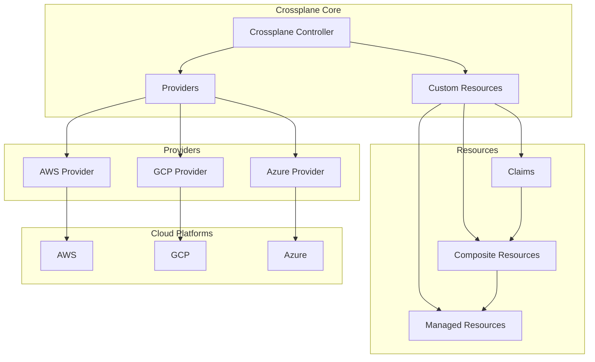

# Managing Cloud Infrastructure with Helm and Crossplane

Author: [nawazdhandala](https://www.github.com/nawazdhandala)

Tags: Helm, Kubernetes, DevOps, Crossplane, Infrastructure, IaC, Multi-Cloud

Description: Complete guide to deploying and managing cloud infrastructure using Helm and Crossplane for Kubernetes-native infrastructure as code.

> Crossplane enables Kubernetes-native infrastructure management, allowing you to provision and manage cloud resources using Helm charts. This guide covers deploying Crossplane and managing multi-cloud infrastructure declaratively.

## Crossplane Architecture



## Installing Crossplane

### Helm Installation

```bash
# Add Crossplane Helm repository
helm repo add crossplane-stable https://charts.crossplane.io/stable
helm repo update

# Create namespace
kubectl create namespace crossplane-system

# Install Crossplane
helm install crossplane crossplane-stable/crossplane \
  --namespace crossplane-system \
  --set args='{"--enable-external-secret-stores"}' \
  --wait

# Verify installation
kubectl get pods -n crossplane-system
kubectl api-resources | grep crossplane
```

### Production Configuration

```yaml
# crossplane-values.yaml
replicas: 3

args:
  - "--enable-external-secret-stores"
  - "--enable-composition-revisions"
  - "--enable-composition-functions"

resources:
  limits:
    cpu: 500m
    memory: 1Gi
  requests:
    cpu: 100m
    memory: 256Mi

# Pod disruption budget
podDisruptionBudget:
  enabled: true
  minAvailable: 1

# Security context
securityContext:
  runAsNonRoot: true
  runAsUser: 65532
  runAsGroup: 65532

# Affinity for high availability
affinity:
  podAntiAffinity:
    preferredDuringSchedulingIgnoredDuringExecution:
      - weight: 100
        podAffinityTerm:
          labelSelector:
            matchExpressions:
              - key: app
                operator: In
                values:
                  - crossplane
          topologyKey: kubernetes.io/hostname

# Metrics
metrics:
  enabled: true

# RBAC configuration
rbacManager:
  deploy: true
  replicas: 1

# Webhook configuration
webhooks:
  enabled: true
```

## Installing Providers

### AWS Provider

```yaml
# aws-provider.yaml
apiVersion: pkg.crossplane.io/v1
kind: Provider
metadata:
  name: provider-aws
spec:
  package: xpkg.upbound.io/upbound/provider-aws:v0.47.0
  controllerConfigRef:
    name: aws-config

---
apiVersion: pkg.crossplane.io/v1alpha1
kind: ControllerConfig
metadata:
  name: aws-config
spec:
  args:
    - --debug
  resources:
    limits:
      cpu: 500m
      memory: 1Gi
    requests:
      cpu: 100m
      memory: 256Mi
```

### Configure AWS Credentials

```yaml
# aws-credentials.yaml
apiVersion: v1
kind: Secret
metadata:
  name: aws-secret
  namespace: crossplane-system
type: Opaque
stringData:
  credentials: |
    [default]
    aws_access_key_id = YOUR_ACCESS_KEY
    aws_secret_access_key = YOUR_SECRET_KEY

---
apiVersion: aws.upbound.io/v1beta1
kind: ProviderConfig
metadata:
  name: default
spec:
  credentials:
    source: Secret
    secretRef:
      namespace: crossplane-system
      name: aws-secret
      key: credentials
```

### GCP Provider

```yaml
# gcp-provider.yaml
apiVersion: pkg.crossplane.io/v1
kind: Provider
metadata:
  name: provider-gcp
spec:
  package: xpkg.upbound.io/upbound/provider-gcp:v0.41.0

---
apiVersion: v1
kind: Secret
metadata:
  name: gcp-secret
  namespace: crossplane-system
type: Opaque
stringData:
  credentials: |
    {
      "type": "service_account",
      "project_id": "your-project-id",
      ...
    }

---
apiVersion: gcp.upbound.io/v1beta1
kind: ProviderConfig
metadata:
  name: default
spec:
  projectID: your-project-id
  credentials:
    source: Secret
    secretRef:
      namespace: crossplane-system
      name: gcp-secret
      key: credentials
```

### Azure Provider

```yaml
# azure-provider.yaml
apiVersion: pkg.crossplane.io/v1
kind: Provider
metadata:
  name: provider-azure
spec:
  package: xpkg.upbound.io/upbound/provider-azure:v0.42.0

---
apiVersion: v1
kind: Secret
metadata:
  name: azure-secret
  namespace: crossplane-system
type: Opaque
stringData:
  credentials: |
    {
      "clientId": "YOUR_CLIENT_ID",
      "clientSecret": "YOUR_CLIENT_SECRET",
      "subscriptionId": "YOUR_SUBSCRIPTION_ID",
      "tenantId": "YOUR_TENANT_ID"
    }

---
apiVersion: azure.upbound.io/v1beta1
kind: ProviderConfig
metadata:
  name: default
spec:
  credentials:
    source: Secret
    secretRef:
      namespace: crossplane-system
      name: azure-secret
      key: credentials
```

## Managed Resources

### AWS S3 Bucket

```yaml
# s3-bucket.yaml
apiVersion: s3.aws.upbound.io/v1beta1
kind: Bucket
metadata:
  name: my-crossplane-bucket
spec:
  forProvider:
    region: us-east-1
    tags:
      Environment: production
      ManagedBy: crossplane
  providerConfigRef:
    name: default
```

### AWS RDS Database

```yaml
# rds-instance.yaml
apiVersion: rds.aws.upbound.io/v1beta1
kind: Instance
metadata:
  name: my-database
spec:
  forProvider:
    region: us-east-1
    instanceClass: db.t3.micro
    engine: postgres
    engineVersion: "15"
    allocatedStorage: 20
    dbName: myapp
    username: admin
    passwordSecretRef:
      name: db-password
      namespace: crossplane-system
      key: password
    publiclyAccessible: false
    skipFinalSnapshot: true
    vpcSecurityGroupIdRefs:
      - name: db-security-group
    dbSubnetGroupNameRef:
      name: db-subnet-group
  providerConfigRef:
    name: default
  writeConnectionSecretToRef:
    name: db-connection
    namespace: default
```

### AWS EKS Cluster

```yaml
# eks-cluster.yaml
apiVersion: eks.aws.upbound.io/v1beta1
kind: Cluster
metadata:
  name: my-eks-cluster
spec:
  forProvider:
    region: us-east-1
    version: "1.28"
    roleArnRef:
      name: eks-cluster-role
    vpcConfig:
      - subnetIdRefs:
          - name: subnet-a
          - name: subnet-b
        endpointPrivateAccess: true
        endpointPublicAccess: true
  providerConfigRef:
    name: default
  writeConnectionSecretToRef:
    name: eks-connection
    namespace: default
```

## Composite Resources (XRs)

### Define CompositeResourceDefinition

```yaml
# database-xrd.yaml
apiVersion: apiextensions.crossplane.io/v1
kind: CompositeResourceDefinition
metadata:
  name: xdatabases.example.org
spec:
  group: example.org
  names:
    kind: XDatabase
    plural: xdatabases
  claimNames:
    kind: Database
    plural: databases
  versions:
    - name: v1alpha1
      served: true
      referenceable: true
      schema:
        openAPIV3Schema:
          type: object
          properties:
            spec:
              type: object
              properties:
                parameters:
                  type: object
                  properties:
                    size:
                      type: string
                      enum: ["small", "medium", "large"]
                      default: "small"
                    engine:
                      type: string
                      enum: ["postgres", "mysql"]
                      default: "postgres"
                    region:
                      type: string
                      default: "us-east-1"
                  required:
                    - size
              required:
                - parameters
            status:
              type: object
              properties:
                endpoint:
                  type: string
                status:
                  type: string
```

### Create Composition

```yaml
# database-composition.yaml
apiVersion: apiextensions.crossplane.io/v1
kind: Composition
metadata:
  name: xdatabases.aws.example.org
  labels:
    provider: aws
spec:
  compositeTypeRef:
    apiVersion: example.org/v1alpha1
    kind: XDatabase
    
  patchSets:
    - name: common-parameters
      patches:
        - type: FromCompositeFieldPath
          fromFieldPath: spec.parameters.region
          toFieldPath: spec.forProvider.region
          
  resources:
    - name: securitygroup
      base:
        apiVersion: ec2.aws.upbound.io/v1beta1
        kind: SecurityGroup
        spec:
          forProvider:
            name: db-security-group
            description: Security group for database
            vpcId: vpc-xxxxx
          providerConfigRef:
            name: default
      patches:
        - type: PatchSet
          patchSetName: common-parameters
          
    - name: securitygrouprule
      base:
        apiVersion: ec2.aws.upbound.io/v1beta1
        kind: SecurityGroupRule
        spec:
          forProvider:
            type: ingress
            fromPort: 5432
            toPort: 5432
            protocol: tcp
            cidrBlocks:
              - "10.0.0.0/8"
            securityGroupIdSelector:
              matchControllerRef: true
          providerConfigRef:
            name: default
            
    - name: subnetgroup
      base:
        apiVersion: rds.aws.upbound.io/v1beta1
        kind: SubnetGroup
        spec:
          forProvider:
            description: Database subnet group
            subnetIds:
              - subnet-xxxxx
              - subnet-yyyyy
          providerConfigRef:
            name: default
      patches:
        - type: PatchSet
          patchSetName: common-parameters
          
    - name: database
      base:
        apiVersion: rds.aws.upbound.io/v1beta1
        kind: Instance
        spec:
          forProvider:
            instanceClass: db.t3.micro
            allocatedStorage: 20
            engine: postgres
            engineVersion: "15"
            username: admin
            publiclyAccessible: false
            skipFinalSnapshot: true
            dbSubnetGroupNameSelector:
              matchControllerRef: true
            vpcSecurityGroupIdSelector:
              matchControllerRef: true
            passwordSecretRef:
              name: db-password
              namespace: crossplane-system
              key: password
          providerConfigRef:
            name: default
          writeConnectionSecretToRef:
            namespace: crossplane-system
      patches:
        - type: PatchSet
          patchSetName: common-parameters
        - type: FromCompositeFieldPath
          fromFieldPath: spec.parameters.engine
          toFieldPath: spec.forProvider.engine
        - type: FromCompositeFieldPath
          fromFieldPath: spec.parameters.size
          toFieldPath: spec.forProvider.instanceClass
          transforms:
            - type: map
              map:
                small: db.t3.micro
                medium: db.t3.medium
                large: db.t3.large
        - type: ToCompositeFieldPath
          fromFieldPath: status.atProvider.endpoint
          toFieldPath: status.endpoint
        - type: ToCompositeFieldPath
          fromFieldPath: status.conditions[0].status
          toFieldPath: status.status
```

### Use Claims

```yaml
# database-claim.yaml
apiVersion: example.org/v1alpha1
kind: Database
metadata:
  name: my-app-database
  namespace: default
spec:
  parameters:
    size: medium
    engine: postgres
    region: us-east-1
  compositionSelector:
    matchLabels:
      provider: aws
  writeConnectionSecretToRef:
    name: my-app-db-connection
```

## Helm Chart for Crossplane Resources

### Chart Structure

```
crossplane-infrastructure/
├── Chart.yaml
├── values.yaml
├── templates/
│   ├── _helpers.tpl
│   ├── providers.yaml
│   ├── provider-configs.yaml
│   ├── xrds.yaml
│   ├── compositions.yaml
│   └── claims.yaml
```

### Chart.yaml

```yaml
# Chart.yaml
apiVersion: v2
name: crossplane-infrastructure
description: Helm chart for Crossplane infrastructure
version: 1.0.0
appVersion: "1.0.0"
dependencies:
  - name: crossplane
    version: "1.14.x"
    repository: https://charts.crossplane.io/stable
    condition: crossplane.enabled
```

### values.yaml

```yaml
# values.yaml
crossplane:
  enabled: false  # Set to true if installing Crossplane with this chart

providers:
  aws:
    enabled: true
    version: "v0.47.0"
  gcp:
    enabled: false
    version: "v0.41.0"
  azure:
    enabled: false
    version: "v0.42.0"

databases:
  - name: production-db
    size: large
    engine: postgres
    region: us-east-1
  - name: staging-db
    size: small
    engine: postgres
    region: us-east-1

s3Buckets:
  - name: app-assets
    region: us-east-1
    versioning: true
  - name: app-backups
    region: us-east-1
    versioning: true
```

### Provider Template

```yaml
# templates/providers.yaml
{{- if .Values.providers.aws.enabled }}
apiVersion: pkg.crossplane.io/v1
kind: Provider
metadata:
  name: provider-aws
  labels:
    {{- include "crossplane-infrastructure.labels" . | nindent 4 }}
spec:
  package: xpkg.upbound.io/upbound/provider-aws:{{ .Values.providers.aws.version }}
{{- end }}

{{- if .Values.providers.gcp.enabled }}
---
apiVersion: pkg.crossplane.io/v1
kind: Provider
metadata:
  name: provider-gcp
  labels:
    {{- include "crossplane-infrastructure.labels" . | nindent 4 }}
spec:
  package: xpkg.upbound.io/upbound/provider-gcp:{{ .Values.providers.gcp.version }}
{{- end }}

{{- if .Values.providers.azure.enabled }}
---
apiVersion: pkg.crossplane.io/v1
kind: Provider
metadata:
  name: provider-azure
  labels:
    {{- include "crossplane-infrastructure.labels" . | nindent 4 }}
spec:
  package: xpkg.upbound.io/upbound/provider-azure:{{ .Values.providers.azure.version }}
{{- end }}
```

### Claims Template

```yaml
# templates/claims.yaml
{{- range .Values.databases }}
---
apiVersion: example.org/v1alpha1
kind: Database
metadata:
  name: {{ .name }}
  labels:
    {{- include "crossplane-infrastructure.labels" $ | nindent 4 }}
spec:
  parameters:
    size: {{ .size }}
    engine: {{ .engine }}
    region: {{ .region }}
  compositionSelector:
    matchLabels:
      provider: aws
  writeConnectionSecretToRef:
    name: {{ .name }}-connection
{{- end }}

{{- range .Values.s3Buckets }}
---
apiVersion: s3.aws.upbound.io/v1beta1
kind: Bucket
metadata:
  name: {{ .name }}
  labels:
    {{- include "crossplane-infrastructure.labels" $ | nindent 4 }}
spec:
  forProvider:
    region: {{ .region }}
  providerConfigRef:
    name: default
{{- end }}
```

## Monitoring

### ServiceMonitor

```yaml
# crossplane-servicemonitor.yaml
apiVersion: monitoring.coreos.com/v1
kind: ServiceMonitor
metadata:
  name: crossplane
  namespace: monitoring
spec:
  selector:
    matchLabels:
      app: crossplane
  namespaceSelector:
    matchNames:
      - crossplane-system
  endpoints:
    - port: metrics
      interval: 30s
```

### Alerts

```yaml
# crossplane-alerts.yaml
apiVersion: monitoring.coreos.com/v1
kind: PrometheusRule
metadata:
  name: crossplane-alerts
  namespace: monitoring
spec:
  groups:
    - name: crossplane
      rules:
        - alert: CrossplaneResourceNotReady
          expr: |
            crossplane_managed_resource_ready == 0
          for: 5m
          labels:
            severity: warning
          annotations:
            summary: Crossplane resource not ready
            description: Resource {{ $labels.name }} has not been ready for 5 minutes
```

## Troubleshooting

```bash
# Check Crossplane status
kubectl get crossplane

# List providers
kubectl get providers

# Check provider health
kubectl get providerrevisions

# List managed resources
kubectl get managed

# Get composite resource status
kubectl get composite

# Get claim status
kubectl get claim -A

# Describe a resource for events
kubectl describe database my-app-database

# Check Crossplane logs
kubectl logs -n crossplane-system -l app=crossplane

# Debug provider
kubectl logs -n crossplane-system -l pkg.crossplane.io/provider=provider-aws
```

## Wrap-up

Crossplane enables Kubernetes-native infrastructure management, allowing you to provision and manage cloud resources declaratively. Use Helm to deploy Crossplane, configure providers, and manage composite resources. This approach provides GitOps-friendly infrastructure as code with full Kubernetes API compatibility.
