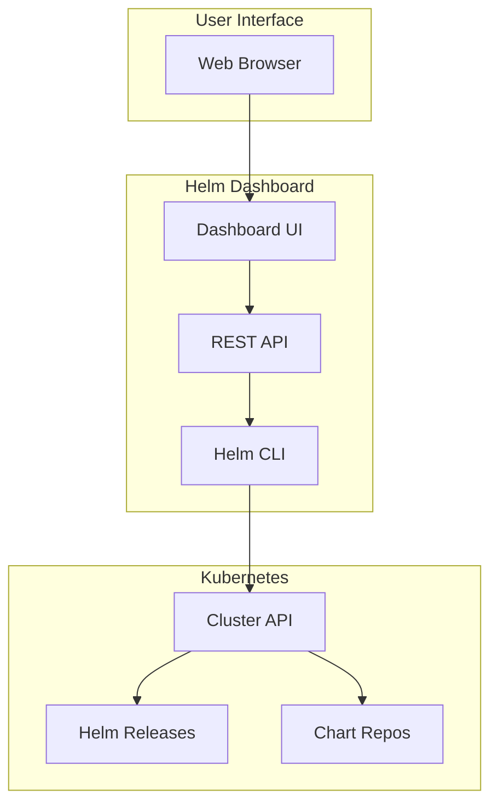
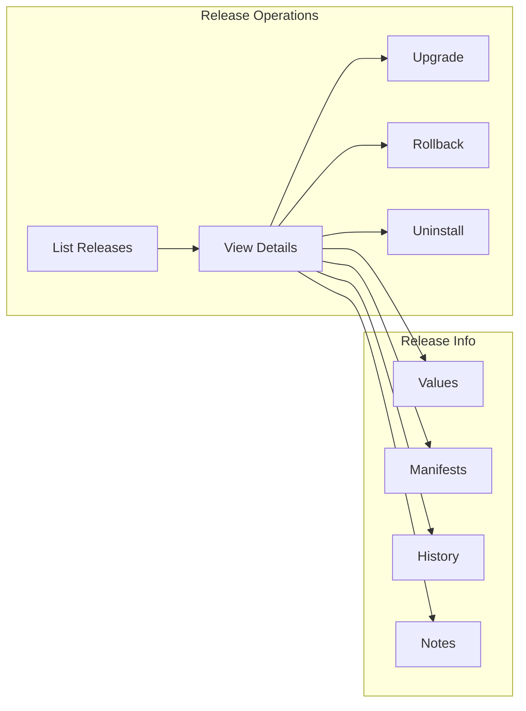
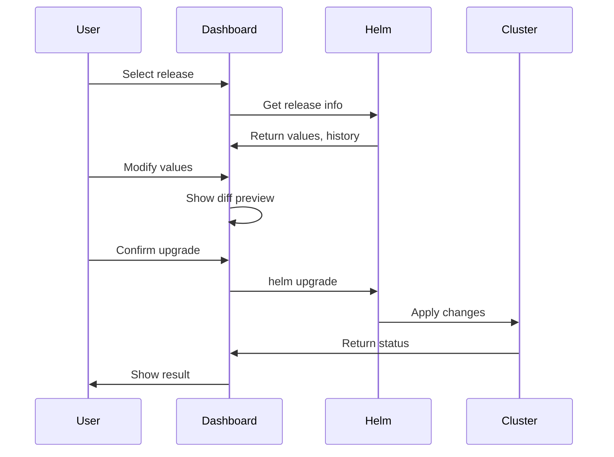

# How to Use Helm Dashboard for Visual Release Management

Author: [nawazdhandala](https://www.github.com/nawazdhandala)

Tags: Helm, Kubernetes, DevOps, Dashboard, GUI, Visualization, Management

Description: Complete guide to using Helm Dashboard for visual release management including installation, configuration, and leveraging the UI for efficient chart operations.

> Helm Dashboard provides a visual interface for managing Helm releases without memorizing CLI commands. This guide covers installing, configuring, and using Helm Dashboard for efficient Kubernetes application management.

## Helm Dashboard Overview



## Installation Options

### Helm Plugin (Recommended)

```bash
# Install as Helm plugin
helm plugin install https://github.com/komodorio/helm-dashboard.git

# Run the dashboard
helm dashboard

# Dashboard available at http://localhost:8080

# Run with custom port
helm dashboard --port 9090

# Run with specific kubeconfig
helm dashboard --kubeconfig ~/.kube/my-cluster

# Run for specific namespace
helm dashboard --namespace production
```

### Docker Installation

```bash
# Run as Docker container
docker run -d \
  --name helm-dashboard \
  -p 8080:8080 \
  -v ~/.kube:/root/.kube \
  -v ~/.helm:/root/.helm \
  komodorio/helm-dashboard

# With read-only access
docker run -d \
  --name helm-dashboard \
  -p 8080:8080 \
  -v ~/.kube:/root/.kube:ro \
  -e HELM_DASHBOARD_READONLY=true \
  komodorio/helm-dashboard
```

### Kubernetes Deployment

```yaml
# helm-dashboard-deployment.yaml
apiVersion: apps/v1
kind: Deployment
metadata:
  name: helm-dashboard
  namespace: helm-system
spec:
  replicas: 1
  selector:
    matchLabels:
      app: helm-dashboard
  template:
    metadata:
      labels:
        app: helm-dashboard
    spec:
      serviceAccountName: helm-dashboard
      containers:
        - name: helm-dashboard
          image: komodorio/helm-dashboard:latest
          ports:
            - containerPort: 8080
          env:
            - name: HELM_DASHBOARD_DEBUG
              value: "false"
          resources:
            limits:
              cpu: 500m
              memory: 256Mi
            requests:
              cpu: 100m
              memory: 128Mi
---
apiVersion: v1
kind: Service
metadata:
  name: helm-dashboard
  namespace: helm-system
spec:
  selector:
    app: helm-dashboard
  ports:
    - port: 80
      targetPort: 8080
---
apiVersion: v1
kind: ServiceAccount
metadata:
  name: helm-dashboard
  namespace: helm-system
---
apiVersion: rbac.authorization.k8s.io/v1
kind: ClusterRoleBinding
metadata:
  name: helm-dashboard
roleRef:
  apiGroup: rbac.authorization.k8s.io
  kind: ClusterRole
  name: cluster-admin  # Adjust as needed
subjects:
  - kind: ServiceAccount
    name: helm-dashboard
    namespace: helm-system
```

### Via Helm Chart

```bash
# Add repository
helm repo add komodorio https://helm-charts.komodor.io
helm repo update

# Install Helm Dashboard
helm install helm-dashboard komodorio/helm-dashboard \
  --namespace helm-system \
  --create-namespace \
  --set dashboard.persistence.enabled=true

# With Ingress
helm install helm-dashboard komodorio/helm-dashboard \
  --namespace helm-system \
  --create-namespace \
  --set ingress.enabled=true \
  --set ingress.hosts[0].host=helm.example.com \
  --set ingress.hosts[0].paths[0].path=/
```

## Dashboard Features

### Release Management



### Key Features

| Feature | Description |
|---------|-------------|
| Release List | View all releases across namespaces |
| Visual Diff | Compare values and manifests between revisions |
| One-Click Upgrade | Upgrade with modified values |
| Rollback | Visual rollback to previous revision |
| Repository Browser | Browse and install from repositories |
| History Timeline | Visual release history |
| Resource Viewer | See Kubernetes resources per release |

## Configuration Options

### Environment Variables

```bash
# Dashboard configuration
export HELM_DASHBOARD_PORT=8080
export HELM_DASHBOARD_BIND=0.0.0.0
export HELM_DASHBOARD_READONLY=false
export HELM_DASHBOARD_DEBUG=false
export HELM_DASHBOARD_NO_BROWSER=true

# Helm configuration
export HELM_NAMESPACE=default
export KUBECONFIG=/path/to/kubeconfig

# Run with configuration
helm dashboard
```

### RBAC Configuration

```yaml
# Least-privilege RBAC for Helm Dashboard
---
apiVersion: rbac.authorization.k8s.io/v1
kind: ClusterRole
metadata:
  name: helm-dashboard
rules:
  # Helm release management
  - apiGroups: [""]
    resources: ["secrets", "configmaps"]
    verbs: ["get", "list", "watch", "create", "update", "delete"]
  
  # View Kubernetes resources
  - apiGroups: ["", "apps", "batch", "networking.k8s.io"]
    resources: ["*"]
    verbs: ["get", "list", "watch"]
  
  # Namespaces
  - apiGroups: [""]
    resources: ["namespaces"]
    verbs: ["get", "list"]
---
apiVersion: rbac.authorization.k8s.io/v1
kind: ClusterRole
metadata:
  name: helm-dashboard-readonly
rules:
  # Read-only access
  - apiGroups: [""]
    resources: ["secrets", "configmaps"]
    verbs: ["get", "list", "watch"]
  
  - apiGroups: ["", "apps", "batch", "networking.k8s.io"]
    resources: ["*"]
    verbs: ["get", "list", "watch"]
```

### Read-Only Mode

```yaml
# helm-dashboard-readonly.yaml
apiVersion: apps/v1
kind: Deployment
metadata:
  name: helm-dashboard
  namespace: helm-system
spec:
  template:
    spec:
      containers:
        - name: helm-dashboard
          image: komodorio/helm-dashboard:latest
          env:
            - name: HELM_DASHBOARD_READONLY
              value: "true"
          # Read-only filesystem
          securityContext:
            readOnlyRootFilesystem: true
```

## Using the Dashboard

### Browse Releases

```
Dashboard Navigation:
1. Open http://localhost:8080
2. Select cluster context (if multiple)
3. Filter by namespace or view all
4. Click release for details
```

### Visual Upgrade Process



### Value Editing

```yaml
# Dashboard allows visual editing of values
# Original values.yaml displayed:
replicaCount: 2
image:
  repository: nginx
  tag: "1.21"
resources:
  limits:
    cpu: 100m
    memory: 128Mi

# Modify in UI and see diff:
# - replicaCount: 2
# + replicaCount: 3
# - tag: "1.21"
# + tag: "1.22"
```

## Repository Management

### Adding Repositories

```bash
# Repositories added via CLI are visible in dashboard
helm repo add bitnami https://charts.bitnami.com/bitnami
helm repo add prometheus https://prometheus-community.github.io/helm-charts
helm repo update

# Dashboard shows:
# - Available charts
# - Chart versions
# - README/documentation
```

### Installing from Dashboard

```
Installation Flow:
1. Navigate to "Repository" tab
2. Select repository (e.g., bitnami)
3. Search for chart (e.g., postgresql)
4. Select version
5. Choose namespace
6. Configure values (visual editor)
7. Review generated YAML
8. Click "Install"
```

## Advanced Features

### Multi-Cluster Support

```bash
# Configure multiple contexts in kubeconfig
kubectl config get-contexts

# Dashboard automatically detects contexts
# Switch between clusters in UI dropdown
```

### Diff View

```yaml
# Dashboard shows differences between:
# - Current vs Previous revision
# - Current vs Upgrade preview
# - Different revisions

# Example diff output:
--- revision 2
+++ revision 3
@@ -5,7 +5,7 @@
 spec:
   replicas: 3
   template:
     spec:
       containers:
-        image: myapp:v1.0
+        image: myapp:v1.1
```

### Resource Visualization

```
Release Resources View:
├── Deployment
│   └── myapp-deployment (3/3 ready)
├── Service
│   └── myapp-service (ClusterIP)
├── ConfigMap
│   └── myapp-config
├── Secret
│   └── myapp-secrets
└── Ingress
    └── myapp-ingress
```

## Security Considerations

### Securing Dashboard Access

```yaml
# Ingress with authentication
apiVersion: networking.k8s.io/v1
kind: Ingress
metadata:
  name: helm-dashboard
  namespace: helm-system
  annotations:
    nginx.ingress.kubernetes.io/auth-type: basic
    nginx.ingress.kubernetes.io/auth-secret: helm-dashboard-auth
    nginx.ingress.kubernetes.io/auth-realm: "Helm Dashboard"
spec:
  rules:
    - host: helm.example.com
      http:
        paths:
          - path: /
            pathType: Prefix
            backend:
              service:
                name: helm-dashboard
                port:
                  number: 80
---
# Create auth secret
# htpasswd -c auth admin
# kubectl create secret generic helm-dashboard-auth --from-file=auth -n helm-system
```

### OAuth2 Proxy Integration

```yaml
# oauth2-proxy sidecar
apiVersion: apps/v1
kind: Deployment
metadata:
  name: helm-dashboard
  namespace: helm-system
spec:
  template:
    spec:
      containers:
        - name: helm-dashboard
          image: komodorio/helm-dashboard:latest
          ports:
            - containerPort: 8080
        
        - name: oauth2-proxy
          image: quay.io/oauth2-proxy/oauth2-proxy:latest
          args:
            - --http-address=0.0.0.0:4180
            - --upstream=http://localhost:8080
            - --provider=github
            - --email-domain=*
            - --cookie-secret=$(COOKIE_SECRET)
          env:
            - name: OAUTH2_PROXY_CLIENT_ID
              valueFrom:
                secretKeyRef:
                  name: oauth2-config
                  key: client-id
            - name: OAUTH2_PROXY_CLIENT_SECRET
              valueFrom:
                secretKeyRef:
                  name: oauth2-config
                  key: client-secret
          ports:
            - containerPort: 4180
```

## Comparison with Alternatives

| Feature | Helm Dashboard | Kubeapps | Rancher |
|---------|---------------|----------|---------|
| Standalone | Yes | Yes | No |
| Helm-only Focus | Yes | Yes | No |
| Multi-cluster | Yes | Yes | Yes |
| SSO Support | Via proxy | Built-in | Built-in |
| Resource Cost | Low | Medium | High |
| Learning Curve | Low | Medium | High |

## Troubleshooting

```bash
# Dashboard not starting
helm dashboard --debug

# Check connectivity
helm list  # Verify Helm works

# Permission issues
kubectl auth can-i list secrets --all-namespaces

# Port already in use
helm dashboard --port 9090

# Container logs (if deployed)
kubectl logs -n helm-system -l app=helm-dashboard -f
```

## Best Practices

| Practice | Description |
|----------|-------------|
| Use Read-Only in Prod | Prevent accidental changes |
| Enable Authentication | Secure dashboard access |
| Regular Updates | Keep dashboard updated |
| RBAC Least Privilege | Minimal permissions |
| Audit Actions | Log all operations |
| Separate Clusters | Different dashboard per env |

## Wrap-up

Helm Dashboard provides an intuitive visual interface for Helm operations, making release management accessible to team members who prefer GUIs over CLI. With features like visual diffs, one-click rollbacks, and repository browsing, it streamlines day-to-day Helm operations while maintaining the power of the underlying Helm CLI.
