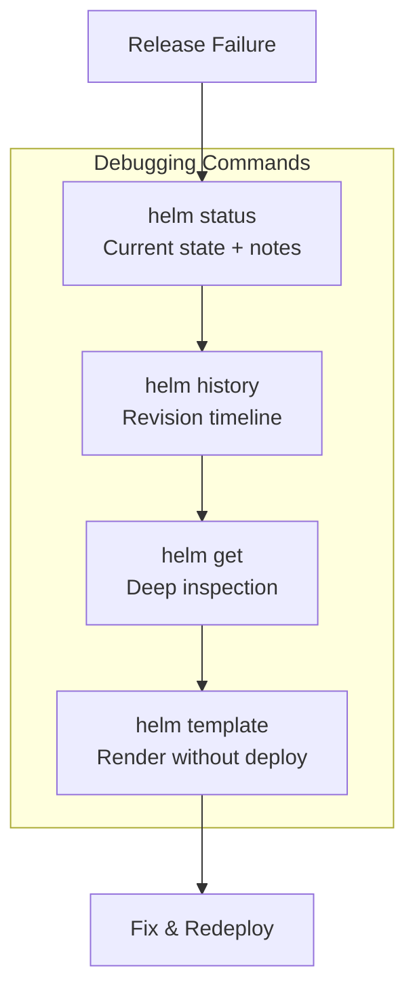

# How to Debug and Troubleshoot Failed Helm Releases

Author: [nawazdhandala](https://www.github.com/nawazdhandala)

Tags: Helm, Kubernetes, DevOps, Troubleshooting, Debugging

Description: Master Helm troubleshooting with helm status, helm history, helm get, template rendering issues, and recovering stuck releases.

> Helm deployments fail. Charts have bugs, values have typos, and clusters have issues. Knowing how to diagnose and recover from failures quickly is essential for any Kubernetes operator.

## The Helm Debugging Toolkit

Helm provides several commands for investigating releases. Understanding when to use each one saves valuable time during incidents.



## Step 1: Check Release Status

When something goes wrong, start with `helm status` to understand the current state.

```bash
# Get current release status
helm status my-app -n production

# Output shows:
# - Deployment status (deployed, failed, pending-upgrade, etc.)
# - Last deployed timestamp
# - Namespace
# - Revision number
# - Notes from the chart (often includes access instructions)
```

### Status States Explained

| Status | Meaning | Typical Cause |
| --- | --- | --- |
| `deployed` | Release is active | Normal successful state |
| `failed` | Last operation failed | Hooks failed, resources invalid |
| `pending-install` | Install in progress | Stuck during install |
| `pending-upgrade` | Upgrade in progress | Stuck during upgrade |
| `pending-rollback` | Rollback in progress | Stuck during rollback |
| `superseded` | Old revision replaced | Normal after upgrade |
| `uninstalling` | Deletion in progress | Stuck during uninstall |

## Step 2: Review Release History

The revision history shows when things changed and what happened.

```bash
# View complete release history
helm history my-app -n production

# Example output:
# REVISION  UPDATED                   STATUS      CHART         APP VERSION  DESCRIPTION
# 1         Mon Jan 15 10:00:00 2024  superseded  myapp-1.0.0   1.0.0        Install complete
# 2         Tue Jan 16 14:30:00 2024  superseded  myapp-1.1.0   1.1.0        Upgrade complete
# 3         Wed Jan 17 09:00:00 2024  failed      myapp-1.2.0   1.2.0        Upgrade "my-app" failed

# The description column shows why it failed
```

Look for patterns: Did it fail after a specific chart version? After a values change? This context guides your investigation.

## Step 3: Deep Inspection with helm get

The `helm get` family of commands lets you inspect exactly what was deployed.

### Get Deployed Values

See what values were actually used in the deployment. This catches typos and merge issues.

```bash
# Get user-supplied values for current release
helm get values my-app -n production

# Get ALL values including defaults
helm get values my-app -n production --all

# Get values from a specific revision (useful for comparing)
helm get values my-app -n production --revision 2
```

### Get Rendered Manifests

See the actual Kubernetes manifests that Helm generated and applied.

```bash
# Get all manifests from current release
helm get manifest my-app -n production

# Get manifests from a specific revision
helm get manifest my-app -n production --revision 2

# Pipe to less for easier reading
helm get manifest my-app -n production | less
```

### Get Hooks

Failed hooks often cause release failures. Inspect them specifically.

```bash
# Get hooks (pre-install, post-upgrade, etc.)
helm get hooks my-app -n production

# Hooks run as Jobs - check their status
kubectl get jobs -n production -l app.kubernetes.io/managed-by=Helm
```

### Get Everything

For comprehensive debugging, get all information at once.

```bash
# Get everything: notes, values, manifest, hooks
helm get all my-app -n production > debug-output.yaml
```

## Step 4: Template Rendering Without Deploying

Render templates locally to catch errors before they hit the cluster.

```bash
# Render templates without installing (catches template errors)
helm template my-app ./my-chart -f values.yaml

# Render and validate against Kubernetes API
helm template my-app ./my-chart -f values.yaml | kubectl apply --dry-run=client -f -

# Debug mode shows more details
helm template my-app ./my-chart -f values.yaml --debug

# Render specific templates
helm template my-app ./my-chart -f values.yaml -s templates/deployment.yaml
```

## Common Failure Scenarios and Solutions

### Scenario 1: Pods Not Starting

**Symptoms:** Release shows as deployed but pods are in CrashLoopBackOff or Pending.

```bash
# Check pod status
kubectl get pods -n production -l app.kubernetes.io/instance=my-app

# Describe failing pod for events
kubectl describe pod my-app-xxx -n production

# Check logs
kubectl logs my-app-xxx -n production

# Check previous container logs if restarting
kubectl logs my-app-xxx -n production --previous
```

**Common causes:**
- Wrong image tag or repository
- Missing ConfigMaps or Secrets referenced in the pod
- Resource limits too low (OOMKilled)
- Liveness/readiness probes failing
- Missing storage classes for PVCs

### Scenario 2: Hooks Failing

**Symptoms:** Release stuck in pending or failed status, hooks show as failed.

```bash
# List hook jobs
kubectl get jobs -n production

# Describe the failing job
kubectl describe job my-app-pre-upgrade -n production

# Get logs from the hook pod
kubectl logs job/my-app-pre-upgrade -n production
```

**Common causes:**
- Database migration script failing
- Missing permissions for the hook's ServiceAccount
- Timeout too short for the hook operation

**Fix:** Update hook configuration or fix the underlying issue, then:

```bash
# Delete the failed job so Helm can retry
kubectl delete job my-app-pre-upgrade -n production

# Retry the upgrade
helm upgrade my-app ./my-chart -f values.yaml
```

### Scenario 3: "Another Operation in Progress"

**Symptoms:** `Error: UPGRADE FAILED: another operation (install/upgrade/rollback) is in progress`

```bash
# Check for pending releases
helm list --pending -n production

# Check release status
helm status my-app -n production
```

**Solutions by state:**

For `pending-install`:

```bash
# If install never completed, uninstall and retry
helm uninstall my-app -n production
helm install my-app ./my-chart -f values.yaml -n production
```

For `pending-upgrade`:

```bash
# Rollback to the last successful revision
helm rollback my-app -n production

# Or force the upgrade to overwrite the pending state
helm upgrade my-app ./my-chart -f values.yaml --force
```

For stuck states that won't respond:

```bash
# Last resort: manually patch the release secret
# Find the secret
kubectl get secrets -n production | grep sh.helm.release.v1.my-app

# Edit the secret's status (base64 encoded)
# WARNING: This is advanced and can break things
kubectl edit secret sh.helm.release.v1.my-app.v3 -n production
```

### Scenario 4: Resource Already Exists

**Symptoms:** `Error: INSTALLATION FAILED: cannot re-use a name that is still in use`

```bash
# Check if the release exists in any state
helm list --all -n production | grep my-app

# Check for orphaned resources
kubectl get all -n production -l app.kubernetes.io/instance=my-app
```

**Solutions:**

```bash
# If release exists, upgrade instead of install
helm upgrade --install my-app ./my-chart -f values.yaml

# If you need a clean slate, uninstall first
helm uninstall my-app -n production
helm install my-app ./my-chart -f values.yaml -n production
```

### Scenario 5: Immutable Field Error

**Symptoms:** `Error: UPGRADE FAILED: cannot patch "my-app" with kind Deployment: Deployment.apps "my-app" is invalid: spec.selector: Invalid value: ... field is immutable`

**Cause:** Helm is trying to change a field that Kubernetes doesn't allow to be changed on existing resources (like Deployment selectors).

**Solutions:**

```bash
# Option 1: Force resource recreation (causes downtime)
helm upgrade my-app ./my-chart -f values.yaml --force

# Option 2: Delete the offending resource manually
kubectl delete deployment my-app -n production
helm upgrade my-app ./my-chart -f values.yaml

# Option 3: Uninstall and reinstall (most drastic)
helm uninstall my-app -n production
helm install my-app ./my-chart -f values.yaml -n production
```

### Scenario 6: Template Rendering Errors

**Symptoms:** `Error: UPGRADE FAILED: template: my-chart/templates/deployment.yaml:25:20: executing "my-chart/templates/deployment.yaml" at <.Values.missing.key>: nil pointer evaluating interface {}.key`

```bash
# Find the exact error by rendering locally
helm template my-app ./my-chart -f values.yaml --debug 2>&1 | head -50

# Check if required values are present
helm template my-app ./my-chart -f values.yaml --debug 2>&1 | grep -i error
```

**Fixes:**
- Ensure all required values are provided
- Check for typos in value names
- Verify YAML structure in values files

## Diagnostic Commands Cheat Sheet

Quick reference for common debugging scenarios.

```bash
# === Release State ===
helm status my-app -n production
helm history my-app -n production
helm list --all -n production

# === Values Inspection ===
helm get values my-app -n production
helm get values my-app -n production --all
helm get values my-app -n production --revision 2

# === Manifest Inspection ===
helm get manifest my-app -n production
helm get hooks my-app -n production

# === Template Debugging ===
helm template my-app ./my-chart -f values.yaml
helm template my-app ./my-chart -f values.yaml --debug
helm lint ./my-chart -f values.yaml

# === Kubernetes Resources ===
kubectl get all -n production -l app.kubernetes.io/instance=my-app
kubectl describe pod my-app-xxx -n production
kubectl logs my-app-xxx -n production
kubectl get events -n production --sort-by='.lastTimestamp'

# === Recovery Commands ===
helm rollback my-app -n production
helm rollback my-app 2 -n production
helm upgrade my-app ./my-chart -f values.yaml --force
helm uninstall my-app -n production
```

## Preventive Debugging: Catch Issues Before Deployment

### Use --dry-run and --debug

Always preview changes before applying them to production.

```bash
# Dry run shows what would happen without actually doing it
helm upgrade my-app ./my-chart -f values.yaml --dry-run --debug
```

### Lint Your Charts

Catch common issues in chart structure and templates.

```bash
# Lint the chart
helm lint ./my-chart

# Lint with values
helm lint ./my-chart -f values.yaml

# Lint with strict mode (treat warnings as errors)
helm lint ./my-chart --strict
```

### Validate Rendered Manifests

Use external tools to validate the generated Kubernetes resources.

```bash
# Validate with kubeval
helm template my-app ./my-chart -f values.yaml | kubeval

# Validate with kubeconform (supports newer APIs)
helm template my-app ./my-chart -f values.yaml | kubeconform -strict

# Check against OPA policies with conftest
helm template my-app ./my-chart -f values.yaml | conftest test -
```

## When to Escalate

Some issues require cluster-level investigation:

| Symptom | Investigation |
| --- | --- |
| Persistent PVC issues | Check StorageClass, CSI drivers |
| Image pull failures | Verify registry credentials, network policies |
| Scheduling failures | Check node resources, taints, affinity rules |
| Webhook timeouts | Investigate admission webhooks |
| RBAC denials | Review ServiceAccount permissions |

## Wrap-up

Debugging Helm releases follows a systematic pattern: check status, review history, inspect values and manifests, and test templates locally. Most failures stem from misconfigured values, missing dependencies, or resource conflicts. Build the habit of using `--dry-run` before deployments and you'll catch most issues before they reach your cluster. When things do fail, the helm get commands give you everything you need to understand what went wrong and how to fix it.
