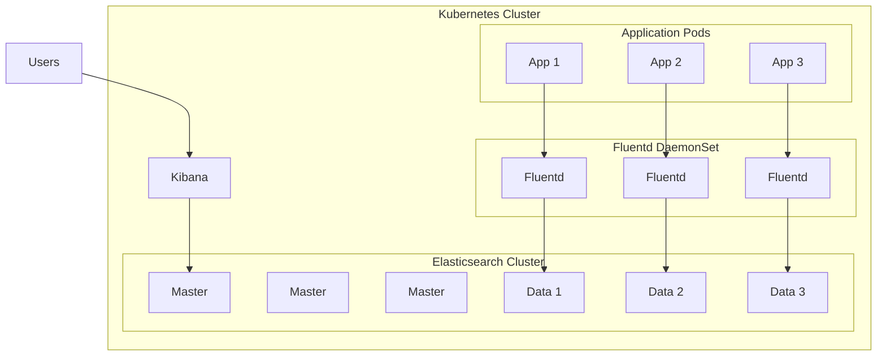

# Deploying EFK Stack (Elasticsearch, Fluentd, Kibana) with Helm

Author: [nawazdhandala](https://www.github.com/nawazdhandala)

Tags: Helm, Kubernetes, DevOps, Elasticsearch, Fluentd, Kibana, Logging, Observability

Description: Complete guide to deploying the EFK logging stack on Kubernetes using Helm for centralized log aggregation, storage, and visualization.

> Centralized logging is essential for troubleshooting and monitoring Kubernetes applications. The EFK stack combines Elasticsearch for storage, Fluentd for collection, and Kibana for visualization. This guide covers deploying a production-ready EFK stack using Helm.

## Architecture Overview



## Deploy Elasticsearch

### Add Repository

```bash
# Add Elastic repository
helm repo add elastic https://helm.elastic.co

# Update repositories
helm repo update

# Search for available versions
helm search repo elastic/elasticsearch --versions
```

### Elasticsearch Production Values

```yaml
# elasticsearch-values.yaml
replicas: 3
minimumMasterNodes: 2

# Cluster configuration
clusterName: "logging"
nodeGroup: "master-data"

# Resource allocation
resources:
  requests:
    cpu: "1000m"
    memory: "2Gi"
  limits:
    cpu: "2000m"
    memory: "4Gi"

# JVM heap size (should be ~50% of memory limit)
esJavaOpts: "-Xmx2g -Xms2g"

# Persistent storage
volumeClaimTemplate:
  accessModes: ["ReadWriteOnce"]
  storageClassName: "standard"
  resources:
    requests:
      storage: 100Gi

# Pod disruption budget
maxUnavailable: 1

# Anti-affinity for spreading across nodes
antiAffinity: "hard"

# Node selector
nodeSelector:
  node-type: logging

# Elasticsearch configuration
esConfig:
  elasticsearch.yml: |
    cluster.name: logging
    network.host: 0.0.0.0
    
    # Security settings
    xpack.security.enabled: true
    xpack.security.transport.ssl.enabled: true
    xpack.security.transport.ssl.verification_mode: certificate
    xpack.security.transport.ssl.keystore.path: /usr/share/elasticsearch/config/certs/elastic-certificates.p12
    xpack.security.transport.ssl.truststore.path: /usr/share/elasticsearch/config/certs/elastic-certificates.p12
    
    # Index lifecycle management
    xpack.ilm.enabled: true

# Enable security
secret:
  enabled: true
  password: "your-elastic-password"

# Ingress for external access
ingress:
  enabled: true
  annotations:
    kubernetes.io/ingress.class: nginx
    cert-manager.io/cluster-issuer: letsencrypt-prod
  hosts:
    - host: elasticsearch.example.com
      paths:
        - path: /
  tls:
    - secretName: elasticsearch-tls
      hosts:
        - elasticsearch.example.com

# Service
service:
  type: ClusterIP
  httpPortName: http
  transportPortName: transport

# Health checks
protocol: https
httpPort: 9200
transportPort: 9300
```

### Install Elasticsearch

```bash
# Create namespace
kubectl create namespace logging

# Install Elasticsearch
helm install elasticsearch elastic/elasticsearch \
  --namespace logging \
  -f elasticsearch-values.yaml
```

### Verify Elasticsearch

```bash
# Check pods
kubectl get pods -n logging -l app=elasticsearch-master

# Check cluster health
kubectl exec -it elasticsearch-master-0 -n logging -- curl -k -u elastic:your-elastic-password https://localhost:9200/_cluster/health?pretty
```

## Multi-Node Elasticsearch Cluster

For larger deployments, separate master and data nodes:

### Master Nodes

```yaml
# elasticsearch-master-values.yaml
clusterName: "logging"
nodeGroup: "master"

roles:
  - master

replicas: 3
minimumMasterNodes: 2

resources:
  requests:
    cpu: "500m"
    memory: "1Gi"
  limits:
    cpu: "1000m"
    memory: "2Gi"

esJavaOpts: "-Xmx1g -Xms1g"

volumeClaimTemplate:
  resources:
    requests:
      storage: 10Gi
```

### Data Nodes

```yaml
# elasticsearch-data-values.yaml
clusterName: "logging"
nodeGroup: "data"

roles:
  - data
  - ingest

replicas: 3

resources:
  requests:
    cpu: "1000m"
    memory: "4Gi"
  limits:
    cpu: "2000m"
    memory: "8Gi"

esJavaOpts: "-Xmx4g -Xms4g"

volumeClaimTemplate:
  resources:
    requests:
      storage: 500Gi
```

### Install Multi-Node Cluster

```bash
# Install master nodes first
helm install elasticsearch-master elastic/elasticsearch \
  --namespace logging \
  -f elasticsearch-master-values.yaml

# Wait for masters to be ready
kubectl rollout status statefulset/elasticsearch-master -n logging

# Install data nodes
helm install elasticsearch-data elastic/elasticsearch \
  --namespace logging \
  -f elasticsearch-data-values.yaml
```

## Deploy Kibana

### Kibana Values

```yaml
# kibana-values.yaml
elasticsearchHosts: "https://elasticsearch-master:9200"

replicas: 2

resources:
  requests:
    cpu: "500m"
    memory: "1Gi"
  limits:
    cpu: "1000m"
    memory: "2Gi"

# Kibana configuration
kibanaConfig:
  kibana.yml: |
    server.name: kibana
    server.host: "0.0.0.0"
    elasticsearch.hosts: ["https://elasticsearch-master:9200"]
    elasticsearch.username: "elastic"
    elasticsearch.password: "${ELASTICSEARCH_PASSWORD}"
    elasticsearch.ssl.verificationMode: none
    xpack.security.enabled: true
    xpack.encryptedSavedObjects.encryptionKey: "your-32-character-encryption-key!"
    xpack.reporting.encryptionKey: "your-32-character-encryption-key!"
    xpack.security.encryptionKey: "your-32-character-encryption-key!"

# Environment variables
extraEnvs:
  - name: ELASTICSEARCH_PASSWORD
    valueFrom:
      secretKeyRef:
        name: elasticsearch-master-credentials
        key: password

# Ingress
ingress:
  enabled: true
  annotations:
    kubernetes.io/ingress.class: nginx
    cert-manager.io/cluster-issuer: letsencrypt-prod
  hosts:
    - host: kibana.example.com
      paths:
        - path: /
  tls:
    - secretName: kibana-tls
      hosts:
        - kibana.example.com

# Health check path
healthCheckPath: "/api/status"

# Service
service:
  type: ClusterIP
  port: 5601
```

### Install Kibana

```bash
helm install kibana elastic/kibana \
  --namespace logging \
  -f kibana-values.yaml
```

### Access Kibana

```bash
# Port forward
kubectl port-forward svc/kibana-kibana 5601:5601 -n logging

# Open http://localhost:5601
# Login with elastic / your-elastic-password
```

## Deploy Fluentd

### Add Fluentd Repository

```bash
helm repo add fluent https://fluent.github.io/helm-charts
helm repo update
```

### Fluentd DaemonSet Values

```yaml
# fluentd-values.yaml
kind: DaemonSet

image:
  repository: fluent/fluentd-kubernetes-daemonset
  tag: v1.16-debian-elasticsearch8-1

resources:
  requests:
    cpu: "100m"
    memory: "256Mi"
  limits:
    cpu: "500m"
    memory: "512Mi"

# Environment variables
env:
  - name: FLUENT_ELASTICSEARCH_HOST
    value: "elasticsearch-master"
  - name: FLUENT_ELASTICSEARCH_PORT
    value: "9200"
  - name: FLUENT_ELASTICSEARCH_SCHEME
    value: "https"
  - name: FLUENT_ELASTICSEARCH_SSL_VERIFY
    value: "false"
  - name: FLUENT_ELASTICSEARCH_USER
    value: "elastic"
  - name: FLUENT_ELASTICSEARCH_PASSWORD
    valueFrom:
      secretKeyRef:
        name: elasticsearch-master-credentials
        key: password

# Tolerations to run on all nodes
tolerations:
  - key: node-role.kubernetes.io/control-plane
    operator: Exists
    effect: NoSchedule
  - key: node-role.kubernetes.io/master
    operator: Exists
    effect: NoSchedule

# Volume mounts for log collection
volumes:
  - name: varlog
    hostPath:
      path: /var/log
  - name: varlibdockercontainers
    hostPath:
      path: /var/lib/docker/containers
  - name: config-volume
    configMap:
      name: fluentd-config

volumeMounts:
  - name: varlog
    mountPath: /var/log
    readOnly: true
  - name: varlibdockercontainers
    mountPath: /var/lib/docker/containers
    readOnly: true
  - name: config-volume
    mountPath: /fluentd/etc/conf.d

# Fluentd configuration
fileConfigs:
  01_sources.conf: |
    <source>
      @type tail
      @id in_tail_container_logs
      path /var/log/containers/*.log
      pos_file /var/log/fluentd-containers.log.pos
      tag kubernetes.*
      read_from_head true
      <parse>
        @type json
        time_key time
        time_format %Y-%m-%dT%H:%M:%S.%NZ
      </parse>
    </source>

  02_filters.conf: |
    <filter kubernetes.**>
      @type kubernetes_metadata
      @id filter_kube_metadata
      kubernetes_url "#{ENV['FLUENT_KUBERNETES_URL'] || 'https://kubernetes.default.svc:443'}"
      verify_ssl "#{ENV['FLUENT_KUBERNETES_VERIFY_SSL'] || true}"
    </filter>
    
    <filter kubernetes.**>
      @type record_transformer
      <record>
        cluster_name "#{ENV['CLUSTER_NAME'] || 'kubernetes'}"
      </record>
    </filter>

  03_outputs.conf: |
    <match kubernetes.**>
      @type elasticsearch
      @id out_es
      host "#{ENV['FLUENT_ELASTICSEARCH_HOST']}"
      port "#{ENV['FLUENT_ELASTICSEARCH_PORT']}"
      scheme "#{ENV['FLUENT_ELASTICSEARCH_SCHEME'] || 'http'}"
      ssl_verify "#{ENV['FLUENT_ELASTICSEARCH_SSL_VERIFY'] || 'true'}"
      user "#{ENV['FLUENT_ELASTICSEARCH_USER']}"
      password "#{ENV['FLUENT_ELASTICSEARCH_PASSWORD']}"
      
      logstash_format true
      logstash_prefix kubernetes
      logstash_dateformat %Y.%m.%d
      
      include_tag_key true
      type_name _doc
      
      <buffer>
        @type file
        path /var/log/fluentd-buffers/kubernetes.buffer
        flush_mode interval
        retry_type exponential_backoff
        flush_interval 5s
        retry_forever false
        retry_max_interval 30
        chunk_limit_size 2M
        queue_limit_length 8
        overflow_action block
      </buffer>
    </match>
```

### Install Fluentd

```bash
helm install fluentd fluent/fluentd \
  --namespace logging \
  -f fluentd-values.yaml
```

## Alternative: Fluent Bit (Lighter Weight)

Fluent Bit is more lightweight than Fluentd:

```yaml
# fluent-bit-values.yaml
kind: DaemonSet

image:
  repository: fluent/fluent-bit
  tag: 2.2.0

resources:
  requests:
    cpu: "50m"
    memory: "64Mi"
  limits:
    cpu: "200m"
    memory: "256Mi"

config:
  service: |
    [SERVICE]
        Daemon Off
        Flush 5
        Log_Level info
        Parsers_File parsers.conf
        HTTP_Server On
        HTTP_Listen 0.0.0.0
        HTTP_Port 2020

  inputs: |
    [INPUT]
        Name tail
        Path /var/log/containers/*.log
        Parser docker
        Tag kube.*
        Mem_Buf_Limit 5MB
        Skip_Long_Lines On

  filters: |
    [FILTER]
        Name kubernetes
        Match kube.*
        Merge_Log On
        Keep_Log Off
        K8S-Logging.Parser On
        K8S-Logging.Exclude On

  outputs: |
    [OUTPUT]
        Name es
        Match kube.*
        Host elasticsearch-master
        Port 9200
        HTTP_User elastic
        HTTP_Passwd your-elastic-password
        tls On
        tls.verify Off
        Logstash_Format On
        Logstash_Prefix kubernetes
        Retry_Limit False
        Replace_Dots On
```

### Install Fluent Bit

```bash
helm repo add fluent https://fluent.github.io/helm-charts
helm install fluent-bit fluent/fluent-bit \
  --namespace logging \
  -f fluent-bit-values.yaml
```

## Index Lifecycle Management

Configure ILM for automatic index management:

```bash
# Create ILM policy
kubectl exec -it elasticsearch-master-0 -n logging -- curl -k -u elastic:your-elastic-password -X PUT "https://localhost:9200/_ilm/policy/kubernetes-logs" -H 'Content-Type: application/json' -d'
{
  "policy": {
    "phases": {
      "hot": {
        "min_age": "0ms",
        "actions": {
          "rollover": {
            "max_age": "1d",
            "max_size": "50gb"
          },
          "set_priority": {
            "priority": 100
          }
        }
      },
      "warm": {
        "min_age": "7d",
        "actions": {
          "shrink": {
            "number_of_shards": 1
          },
          "forcemerge": {
            "max_num_segments": 1
          },
          "set_priority": {
            "priority": 50
          }
        }
      },
      "cold": {
        "min_age": "30d",
        "actions": {
          "freeze": {},
          "set_priority": {
            "priority": 0
          }
        }
      },
      "delete": {
        "min_age": "90d",
        "actions": {
          "delete": {}
        }
      }
    }
  }
}'

# Create index template with ILM
kubectl exec -it elasticsearch-master-0 -n logging -- curl -k -u elastic:your-elastic-password -X PUT "https://localhost:9200/_index_template/kubernetes-logs" -H 'Content-Type: application/json' -d'
{
  "index_patterns": ["kubernetes-*"],
  "template": {
    "settings": {
      "number_of_shards": 2,
      "number_of_replicas": 1,
      "index.lifecycle.name": "kubernetes-logs",
      "index.lifecycle.rollover_alias": "kubernetes"
    }
  }
}'
```

## Kibana Index Patterns

Create index patterns in Kibana:

1. Go to Stack Management → Index Patterns
2. Create pattern: `kubernetes-*`
3. Select `@timestamp` as time field

## Resource Sizing Guide

| Component | Small | Medium | Large |
|-----------|-------|--------|-------|
| Elasticsearch Master | 1Gi RAM | 2Gi RAM | 4Gi RAM |
| Elasticsearch Data | 4Gi RAM, 100Gi | 8Gi RAM, 500Gi | 16Gi RAM, 1Ti |
| Kibana | 512Mi RAM | 1Gi RAM | 2Gi RAM |
| Fluentd/Fluent Bit | 256Mi RAM | 512Mi RAM | 1Gi RAM |

## Monitoring

### Prometheus Metrics

Enable Elasticsearch metrics exporter:

```yaml
# In elasticsearch-values.yaml
metrics:
  enabled: true
  serviceMonitor:
    enabled: true
```

### Useful Elasticsearch Queries

```bash
# Cluster health
curl -k -u elastic:password https://elasticsearch:9200/_cluster/health?pretty

# Node stats
curl -k -u elastic:password https://elasticsearch:9200/_nodes/stats?pretty

# Index stats
curl -k -u elastic:password https://elasticsearch:9200/_cat/indices?v

# Disk usage
curl -k -u elastic:password https://elasticsearch:9200/_cat/allocation?v
```

## Troubleshooting

### Check Fluentd Logs

```bash
kubectl logs -n logging -l app.kubernetes.io/name=fluentd -f
```

### Check Elasticsearch Logs

```bash
kubectl logs -n logging elasticsearch-master-0
```

### Common Issues

**Fluentd not sending logs:**
```bash
# Check Fluentd buffer
kubectl exec -it -n logging ds/fluentd -- ls -la /var/log/fluentd-buffers/
```

**Elasticsearch cluster red:**
```bash
# Check unassigned shards
curl -k -u elastic:password https://elasticsearch:9200/_cat/shards?v | grep UNASSIGNED
```

## Wrap-up

The EFK stack provides comprehensive logging for Kubernetes. Deploy Elasticsearch with appropriate resources and multi-node setup for production, use Fluentd or Fluent Bit for log collection, and Kibana for visualization. Configure Index Lifecycle Management for automatic data retention, and monitor the stack with Prometheus metrics. Always secure Elasticsearch with authentication and TLS in production environments.
