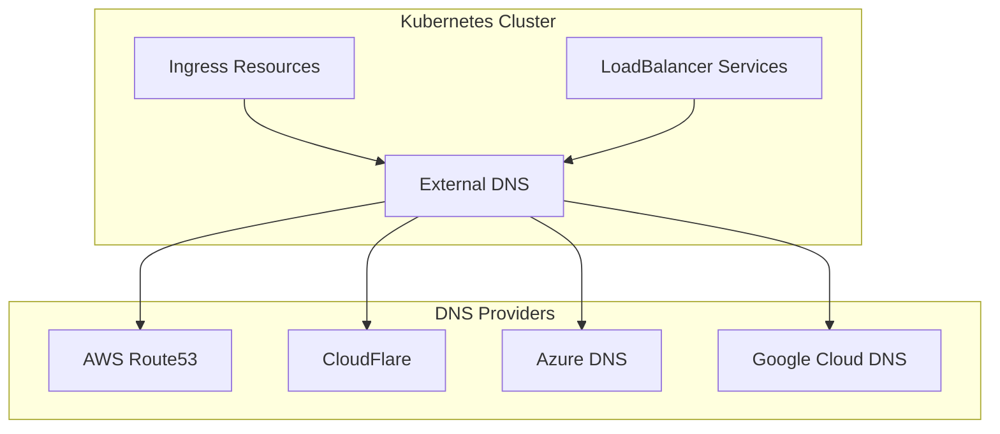

# How to Deploy External DNS with Helm for Automatic DNS Records

Author: [nawazdhandala](https://www.github.com/nawazdhandala)

Tags: Helm, Kubernetes, DNS, External DNS, AWS Route53, CloudFlare, DevOps

Description: Complete guide to deploying External DNS with Helm for automatic DNS record management with AWS Route53, CloudFlare, Azure DNS, and Google Cloud DNS.

> External DNS synchronizes Kubernetes Services and Ingresses with DNS providers automatically. This guide covers deploying External DNS via Helm for popular providers including Route53, CloudFlare, Azure DNS, and Google Cloud DNS.

## External DNS Architecture



## Installation

### Add Helm Repository

```bash
# Add external-dns repository
helm repo add external-dns https://kubernetes-sigs.github.io/external-dns/
helm repo update

# Or use Bitnami chart
helm repo add bitnami https://charts.bitnami.com/bitnami
helm repo update
```

### Basic Installation

```bash
# Install with default settings
helm install external-dns external-dns/external-dns \
  --namespace external-dns \
  --create-namespace
```

## AWS Route53 Configuration

### IAM Policy

```json
{
  "Version": "2012-10-17",
  "Statement": [
    {
      "Effect": "Allow",
      "Action": [
        "route53:ChangeResourceRecordSets"
      ],
      "Resource": [
        "arn:aws:route53:::hostedzone/HOSTED_ZONE_ID"
      ]
    },
    {
      "Effect": "Allow",
      "Action": [
        "route53:ListHostedZones",
        "route53:ListResourceRecordSets"
      ],
      "Resource": ["*"]
    }
  ]
}
```

### Helm Values for Route53

```yaml
# external-dns-route53.yaml
provider: aws

aws:
  region: us-east-1
  zoneType: public  # or private
  
# Use IRSA (IAM Roles for Service Accounts)
serviceAccount:
  create: true
  annotations:
    eks.amazonaws.com/role-arn: arn:aws:iam::ACCOUNT_ID:role/external-dns-role

# Domain filters
domainFilters:
  - example.com
  - api.example.com

# Text owner ID
txtOwnerId: my-cluster

# Policy: sync, upsert-only, or create-only
policy: sync

# Registry type
registry: txt
txtPrefix: "extdns."

# Sources to watch
sources:
  - service
  - ingress

# Logging
logLevel: info
logFormat: json

# Resources
resources:
  requests:
    cpu: 50m
    memory: 64Mi
  limits:
    cpu: 100m
    memory: 128Mi
```

### Deploy with Route53

```bash
helm install external-dns external-dns/external-dns \
  -f external-dns-route53.yaml \
  --namespace external-dns \
  --create-namespace
```

## CloudFlare Configuration

### API Token

```bash
# Create API token with:
# - Zone:DNS:Edit
# - Zone:Zone:Read

# Store in secret
kubectl create namespace external-dns
kubectl create secret generic cloudflare-api-token \
  --namespace external-dns \
  --from-literal=cloudflare_api_token=YOUR_API_TOKEN
```

### Helm Values for CloudFlare

```yaml
# external-dns-cloudflare.yaml
provider: cloudflare

cloudflare:
  proxied: false  # Set true for CloudFlare proxy
  
# API token from secret
env:
  - name: CF_API_TOKEN
    valueFrom:
      secretKeyRef:
        name: cloudflare-api-token
        key: cloudflare_api_token

# Domain filters
domainFilters:
  - example.com

# Text owner ID
txtOwnerId: my-cluster

# Policy
policy: sync

# Sources
sources:
  - service
  - ingress

# Interval
interval: 1m

# Resources
resources:
  requests:
    cpu: 50m
    memory: 64Mi
  limits:
    cpu: 100m
    memory: 128Mi
```

### Deploy with CloudFlare

```bash
helm install external-dns external-dns/external-dns \
  -f external-dns-cloudflare.yaml \
  --namespace external-dns \
  --create-namespace
```

## Azure DNS Configuration

### Azure Identity

```yaml
# external-dns-azure.yaml
provider: azure

azure:
  resourceGroup: my-dns-rg
  tenantId: TENANT_ID
  subscriptionId: SUBSCRIPTION_ID
  useManagedIdentityExtension: true
  userAssignedIdentityID: CLIENT_ID  # For user-assigned identity

# Or use service principal
# azure:
#   resourceGroup: my-dns-rg
#   tenantId: TENANT_ID
#   subscriptionId: SUBSCRIPTION_ID
#   aadClientId: CLIENT_ID
#   aadClientSecret: CLIENT_SECRET

# Domain filters
domainFilters:
  - example.com

# Sources
sources:
  - service
  - ingress

# Policy
policy: sync

# Owner ID
txtOwnerId: my-cluster
```

### Azure Service Principal Secret

```bash
# Create secret for service principal
kubectl create secret generic azure-config-file \
  --namespace external-dns \
  --from-file=azure.json=/path/to/azure.json
```

```json
{
  "tenantId": "TENANT_ID",
  "subscriptionId": "SUBSCRIPTION_ID",
  "resourceGroup": "my-dns-rg",
  "aadClientId": "CLIENT_ID",
  "aadClientSecret": "CLIENT_SECRET"
}
```

## Google Cloud DNS Configuration

### Service Account

```bash
# Create service account
gcloud iam service-accounts create external-dns \
  --display-name "External DNS"

# Grant permissions
gcloud projects add-iam-policy-binding PROJECT_ID \
  --member serviceAccount:external-dns@PROJECT_ID.iam.gserviceaccount.com \
  --role roles/dns.admin

# Create key
gcloud iam service-accounts keys create credentials.json \
  --iam-account external-dns@PROJECT_ID.iam.gserviceaccount.com

# Create Kubernetes secret
kubectl create secret generic google-credentials \
  --namespace external-dns \
  --from-file=credentials.json=credentials.json
```

### Helm Values for GCP

```yaml
# external-dns-gcp.yaml
provider: google

google:
  project: my-gcp-project
  serviceAccountSecretKey: credentials.json

extraVolumes:
  - name: google-credentials
    secret:
      secretName: google-credentials

extraVolumeMounts:
  - name: google-credentials
    mountPath: /etc/secrets/google
    readOnly: true

env:
  - name: GOOGLE_APPLICATION_CREDENTIALS
    value: /etc/secrets/google/credentials.json

# Domain filters
domainFilters:
  - example.com

# Sources
sources:
  - service
  - ingress

# Policy
policy: sync

# Owner ID
txtOwnerId: my-cluster
```

## Ingress Annotations

### Configure DNS via Annotations

```yaml
# ingress.yaml
apiVersion: networking.k8s.io/v1
kind: Ingress
metadata:
  name: myapp
  annotations:
    # Hostname for DNS record
    external-dns.alpha.kubernetes.io/hostname: myapp.example.com
    
    # TTL for DNS record
    external-dns.alpha.kubernetes.io/ttl: "300"
    
    # CloudFlare specific: enable proxy
    external-dns.alpha.kubernetes.io/cloudflare-proxied: "true"
    
    # Target (override auto-detection)
    external-dns.alpha.kubernetes.io/target: 1.2.3.4
spec:
  ingressClassName: nginx
  rules:
    - host: myapp.example.com
      http:
        paths:
          - path: /
            pathType: Prefix
            backend:
              service:
                name: myapp
                port:
                  number: 80
```

### Service Annotations

```yaml
# service.yaml
apiVersion: v1
kind: Service
metadata:
  name: myapp
  annotations:
    # Create A record
    external-dns.alpha.kubernetes.io/hostname: myapp.example.com
    
    # Multiple hostnames
    external-dns.alpha.kubernetes.io/hostname: "api.example.com,myapp.example.com"
    
    # TTL
    external-dns.alpha.kubernetes.io/ttl: "60"
spec:
  type: LoadBalancer
  selector:
    app: myapp
  ports:
    - port: 80
      targetPort: 8080
```

## Advanced Configuration

### Multiple Providers

```yaml
# Run separate instances per provider
# external-dns-aws.yaml
fullnameOverride: external-dns-aws
provider: aws
sources:
  - ingress
extraArgs:
  - --ingress-class=aws-alb

# external-dns-cloudflare.yaml  
fullnameOverride: external-dns-cloudflare
provider: cloudflare
sources:
  - ingress
extraArgs:
  - --ingress-class=nginx
```

### Zone Filtering

```yaml
# external-dns-zones.yaml
domainFilters:
  - example.com
  - staging.example.com

# Exclude zones
excludeDomains:
  - internal.example.com

# Zone ID filter (Route53)
zoneIdFilters:
  - Z1234567890
```

### Ownership and Conflict Prevention

```yaml
# Prevent conflicts between clusters
txtOwnerId: production-cluster

# Use TXT registry
registry: txt

# TXT record prefix
txtPrefix: "extdns."

# Policy options
policy: sync  # sync, upsert-only, create-only
```

## Monitoring External DNS

### Prometheus Metrics

```yaml
# Enable metrics
metrics:
  enabled: true
  
serviceMonitor:
  enabled: true
  namespace: monitoring
  interval: 30s
```

### Key Metrics

```promql
# Source records
external_dns_source_endpoints_total

# Registry records
external_dns_registry_endpoints_total

# Controller sync duration
external_dns_controller_last_sync_timestamp_seconds

# Errors
increase(external_dns_registry_errors_total[5m])
```

### Grafana Dashboard

```json
{
  "panels": [
    {
      "title": "DNS Records Managed",
      "type": "stat",
      "targets": [
        {
          "expr": "external_dns_registry_endpoints_total",
          "legendFormat": "Records"
        }
      ]
    },
    {
      "title": "Sync Status",
      "type": "timeseries",
      "targets": [
        {
          "expr": "time() - external_dns_controller_last_sync_timestamp_seconds",
          "legendFormat": "Seconds Since Last Sync"
        }
      ]
    }
  ]
}
```

## Troubleshooting

### Debug Mode

```yaml
# Enable debug logging
logLevel: debug
logFormat: text

# View logs
# kubectl logs -n external-dns -l app.kubernetes.io/name=external-dns -f
```

### Common Issues

```bash
# Check External DNS logs
kubectl logs -n external-dns deployment/external-dns -f

# Verify source detection
kubectl get ingress -A -o wide
kubectl get svc -A -l "external-dns.alpha.kubernetes.io/hostname"

# Test DNS resolution
dig myapp.example.com

# Check TXT records (ownership)
dig TXT extdns.myapp.example.com

# Verify permissions (AWS)
aws route53 list-hosted-zones
aws route53 list-resource-record-sets --hosted-zone-id ZONE_ID
```

### Dry Run Mode

```yaml
# Test without making changes
extraArgs:
  - --dry-run=true
```

## Provider Comparison

| Provider | Auth Method | Zone Types | Proxy Support |
|----------|-------------|------------|---------------|
| AWS Route53 | IRSA, IAM | Public, Private | No |
| CloudFlare | API Token | Public | Yes |
| Azure DNS | Managed Identity, SP | Public, Private | No |
| Google Cloud DNS | Service Account | Public, Private | No |

## Best Practices

| Practice | Description |
|----------|-------------|
| Use TXT Registry | Prevent record conflicts |
| Set Unique Owner ID | Different ID per cluster |
| Filter Domains | Only manage intended zones |
| Use Policy: sync | Full sync management |
| Enable Metrics | Monitor DNS operations |
| Test with Dry Run | Validate before production |

## Wrap-up

External DNS automates DNS record management for Kubernetes workloads. Configure it with your DNS provider using appropriate credentials, set domain filters to limit scope, and use TXT records to prevent conflicts. With proper setup, your Ingresses and Services automatically get DNS records without manual intervention.
