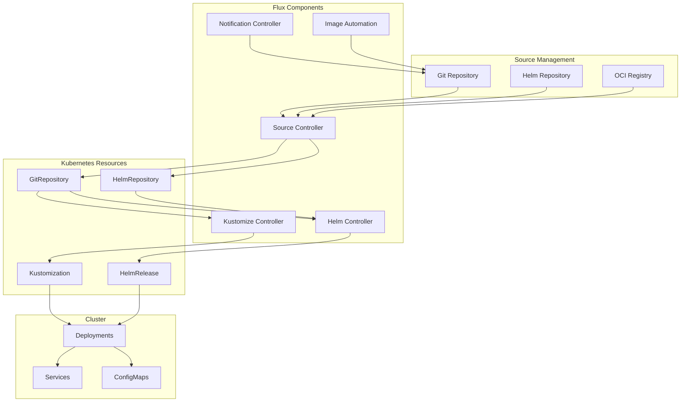

# GitOps Deployment Strategies with Helm and Flux

Author: [nawazdhandala](https://www.github.com/nawazdhandala)

Tags: Helm, Kubernetes, DevOps, GitOps, Flux, CI/CD, Automation

Description: Complete guide to implementing GitOps workflows using Flux with Helm for declarative, Git-based Kubernetes deployments.

> Flux is a GitOps operator that keeps Kubernetes clusters in sync with configuration stored in Git repositories. This guide covers deploying Flux and implementing GitOps workflows with Helm charts.

## Flux Architecture



## Installing Flux

### Bootstrap with GitHub

```bash
# Install Flux CLI
curl -s https://fluxcd.io/install.sh | sudo bash

# Verify installation
flux check --pre

# Bootstrap Flux with GitHub
export GITHUB_TOKEN=<your-token>
export GITHUB_USER=<your-username>

flux bootstrap github \
  --owner=$GITHUB_USER \
  --repository=fleet-infra \
  --branch=main \
  --path=./clusters/production \
  --personal \
  --token-auth
```

### Bootstrap with GitLab

```bash
export GITLAB_TOKEN=<your-token>

flux bootstrap gitlab \
  --owner=<group> \
  --repository=fleet-infra \
  --branch=main \
  --path=./clusters/production \
  --token-auth
```

### Install with Helm

```bash
# Add Flux Helm repository
helm repo add fluxcd https://fluxcd-community.github.io/helm-charts
helm repo update

# Create namespace
kubectl create namespace flux-system

# Install Flux
helm install flux2 fluxcd/flux2 \
  --namespace flux-system
```

### Production Configuration

```yaml
# flux-values.yaml
# Install all components
installCRDs: true

# Source controller
sourceController:
  create: true
  resources:
    requests:
      cpu: 100m
      memory: 64Mi
    limits:
      cpu: 1000m
      memory: 1Gi

# Kustomize controller
kustomizeController:
  create: true
  resources:
    requests:
      cpu: 100m
      memory: 64Mi
    limits:
      cpu: 1000m
      memory: 1Gi

# Helm controller
helmController:
  create: true
  resources:
    requests:
      cpu: 100m
      memory: 64Mi
    limits:
      cpu: 1000m
      memory: 1Gi

# Notification controller
notificationController:
  create: true
  resources:
    requests:
      cpu: 50m
      memory: 64Mi
    limits:
      cpu: 500m
      memory: 256Mi

# Image reflector controller
imageReflectorController:
  create: true
  resources:
    requests:
      cpu: 50m
      memory: 64Mi
    limits:
      cpu: 500m
      memory: 256Mi

# Image automation controller
imageAutomationController:
  create: true
  resources:
    requests:
      cpu: 50m
      memory: 64Mi
    limits:
      cpu: 500m
      memory: 256Mi

# Multi-tenancy
multitenancy:
  enabled: false
  defaultServiceAccount: ""

# Metrics
prometheus:
  enabled: true
  podMonitor:
    create: true
```

## Repository Structure

### Mono-repo Structure

```
fleet-infra/
├── clusters/
│   ├── production/
│   │   ├── flux-system/
│   │   │   ├── gotk-components.yaml
│   │   │   ├── gotk-sync.yaml
│   │   │   └── kustomization.yaml
│   │   ├── infrastructure.yaml
│   │   └── apps.yaml
│   └── staging/
│       ├── flux-system/
│       ├── infrastructure.yaml
│       └── apps.yaml
├── infrastructure/
│   ├── sources/
│   │   └── helm-repos.yaml
│   ├── controllers/
│   │   ├── ingress-nginx/
│   │   ├── cert-manager/
│   │   └── monitoring/
│   └── kustomization.yaml
└── apps/
    ├── base/
    │   └── myapp/
    │       ├── namespace.yaml
    │       ├── helmrelease.yaml
    │       └── kustomization.yaml
    ├── production/
    │   └── myapp/
    │       ├── kustomization.yaml
    │       └── values.yaml
    └── staging/
        └── myapp/
            ├── kustomization.yaml
            └── values.yaml
```

## Source Configuration

### Git Repository

```yaml
# sources/git-repo.yaml
apiVersion: source.toolkit.fluxcd.io/v1
kind: GitRepository
metadata:
  name: fleet-infra
  namespace: flux-system
spec:
  interval: 1m
  url: https://github.com/myorg/fleet-infra.git
  ref:
    branch: main
  secretRef:
    name: flux-system
```

### Helm Repository

```yaml
# sources/helm-repos.yaml
apiVersion: source.toolkit.fluxcd.io/v1beta2
kind: HelmRepository
metadata:
  name: bitnami
  namespace: flux-system
spec:
  interval: 30m
  url: https://charts.bitnami.com/bitnami
  
---
apiVersion: source.toolkit.fluxcd.io/v1beta2
kind: HelmRepository
metadata:
  name: ingress-nginx
  namespace: flux-system
spec:
  interval: 30m
  url: https://kubernetes.github.io/ingress-nginx

---
apiVersion: source.toolkit.fluxcd.io/v1beta2
kind: HelmRepository
metadata:
  name: jetstack
  namespace: flux-system
spec:
  interval: 30m
  url: https://charts.jetstack.io
```

### OCI Repository

```yaml
# sources/oci-repo.yaml
apiVersion: source.toolkit.fluxcd.io/v1beta2
kind: OCIRepository
metadata:
  name: podinfo
  namespace: flux-system
spec:
  interval: 5m
  url: oci://ghcr.io/stefanprodan/charts/podinfo
  ref:
    semver: ">=6.0.0"
```

## HelmRelease Configuration

### Basic HelmRelease

```yaml
# apps/base/myapp/helmrelease.yaml
apiVersion: helm.toolkit.fluxcd.io/v2beta1
kind: HelmRelease
metadata:
  name: myapp
  namespace: myapp
spec:
  interval: 5m
  chart:
    spec:
      chart: myapp
      version: "1.0.0"
      sourceRef:
        kind: HelmRepository
        name: myorg
        namespace: flux-system
      interval: 1m
  values:
    replicaCount: 2
    image:
      repository: myorg/myapp
      tag: latest
```

### HelmRelease with Values From

```yaml
# apps/production/myapp/helmrelease.yaml
apiVersion: helm.toolkit.fluxcd.io/v2beta1
kind: HelmRelease
metadata:
  name: myapp
  namespace: myapp
spec:
  interval: 5m
  chart:
    spec:
      chart: myapp
      version: ">=1.0.0 <2.0.0"
      sourceRef:
        kind: HelmRepository
        name: myorg
        namespace: flux-system
        
  # Upgrade settings
  upgrade:
    remediation:
      remediateLastFailure: true
      retries: 3
      
  # Rollback settings
  rollback:
    timeout: 5m
    
  # Test settings
  test:
    enable: true
    timeout: 5m
    
  # Values from ConfigMap/Secret
  valuesFrom:
    - kind: ConfigMap
      name: myapp-values
      valuesKey: values.yaml
    - kind: Secret
      name: myapp-secrets
      valuesKey: secrets.yaml
      
  # Inline values (lowest priority)
  values:
    replicaCount: 3
    resources:
      limits:
        cpu: 1000m
        memory: 1Gi
```

### HelmRelease with Dependencies

```yaml
# apps/base/myapp/helmrelease.yaml
apiVersion: helm.toolkit.fluxcd.io/v2beta1
kind: HelmRelease
metadata:
  name: myapp
  namespace: myapp
spec:
  interval: 5m
  
  # Dependencies
  dependsOn:
    - name: database
      namespace: databases
    - name: redis
      namespace: cache
      
  chart:
    spec:
      chart: myapp
      version: "1.0.0"
      sourceRef:
        kind: HelmRepository
        name: myorg
        namespace: flux-system
        
  # Post-renderers
  postRenderers:
    - kustomize:
        patches:
          - target:
              kind: Deployment
              name: myapp
            patch: |
              - op: add
                path: /spec/template/metadata/annotations/prometheus.io~1scrape
                value: "true"
```

### HelmRelease from Git

```yaml
# apps/base/myapp/helmrelease.yaml
apiVersion: helm.toolkit.fluxcd.io/v2beta1
kind: HelmRelease
metadata:
  name: myapp
  namespace: myapp
spec:
  interval: 5m
  chart:
    spec:
      chart: ./charts/myapp
      sourceRef:
        kind: GitRepository
        name: fleet-infra
        namespace: flux-system
      interval: 1m
  values:
    replicaCount: 2
```

## Kustomization Configuration

### Infrastructure Kustomization

```yaml
# clusters/production/infrastructure.yaml
apiVersion: kustomize.toolkit.fluxcd.io/v1
kind: Kustomization
metadata:
  name: infrastructure
  namespace: flux-system
spec:
  interval: 10m
  sourceRef:
    kind: GitRepository
    name: fleet-infra
  path: ./infrastructure
  prune: true
  timeout: 5m
  healthChecks:
    - apiVersion: apps/v1
      kind: Deployment
      name: ingress-nginx-controller
      namespace: ingress-nginx
```

### Apps Kustomization

```yaml
# clusters/production/apps.yaml
apiVersion: kustomize.toolkit.fluxcd.io/v1
kind: Kustomization
metadata:
  name: apps
  namespace: flux-system
spec:
  interval: 5m
  dependsOn:
    - name: infrastructure
  sourceRef:
    kind: GitRepository
    name: fleet-infra
  path: ./apps/production
  prune: true
  wait: true
  timeout: 5m
  
  # Decryption with SOPS
  decryption:
    provider: sops
    secretRef:
      name: sops-gpg
      
  # Post-build variable substitution
  postBuild:
    substitute:
      cluster_env: production
      cluster_region: us-east-1
    substituteFrom:
      - kind: ConfigMap
        name: cluster-vars
      - kind: Secret
        name: cluster-secrets
```

## Multi-Environment Setup

### Base Application

```yaml
# apps/base/myapp/kustomization.yaml
apiVersion: kustomize.config.k8s.io/v1beta1
kind: Kustomization
namespace: myapp
resources:
  - namespace.yaml
  - helmrelease.yaml
```

### Production Overlay

```yaml
# apps/production/myapp/kustomization.yaml
apiVersion: kustomize.config.k8s.io/v1beta1
kind: Kustomization
namespace: myapp
resources:
  - ../../base/myapp
patches:
  - path: helmrelease-patch.yaml
configMapGenerator:
  - name: myapp-values
    files:
      - values.yaml
```

```yaml
# apps/production/myapp/helmrelease-patch.yaml
apiVersion: helm.toolkit.fluxcd.io/v2beta1
kind: HelmRelease
metadata:
  name: myapp
spec:
  values:
    replicaCount: 5
    resources:
      limits:
        cpu: 2000m
        memory: 2Gi
```

### Staging Overlay

```yaml
# apps/staging/myapp/kustomization.yaml
apiVersion: kustomize.config.k8s.io/v1beta1
kind: Kustomization
namespace: myapp
resources:
  - ../../base/myapp
patches:
  - path: helmrelease-patch.yaml
configMapGenerator:
  - name: myapp-values
    files:
      - values.yaml
```

```yaml
# apps/staging/myapp/helmrelease-patch.yaml
apiVersion: helm.toolkit.fluxcd.io/v2beta1
kind: HelmRelease
metadata:
  name: myapp
spec:
  values:
    replicaCount: 2
    resources:
      limits:
        cpu: 500m
        memory: 512Mi
```

## Image Automation

### Image Repository

```yaml
# image-automation/image-repos.yaml
apiVersion: image.toolkit.fluxcd.io/v1beta2
kind: ImageRepository
metadata:
  name: myapp
  namespace: flux-system
spec:
  image: ghcr.io/myorg/myapp
  interval: 1m
  secretRef:
    name: ghcr-credentials
```

### Image Policy

```yaml
# image-automation/image-policies.yaml
apiVersion: image.toolkit.fluxcd.io/v1beta2
kind: ImagePolicy
metadata:
  name: myapp
  namespace: flux-system
spec:
  imageRepositoryRef:
    name: myapp
  policy:
    semver:
      range: ">=1.0.0 <2.0.0"
      
---
# Latest tag policy
apiVersion: image.toolkit.fluxcd.io/v1beta2
kind: ImagePolicy
metadata:
  name: myapp-latest
  namespace: flux-system
spec:
  imageRepositoryRef:
    name: myapp
  policy:
    alphabetical:
      order: asc
  filterTags:
    pattern: '^main-[a-f0-9]+-(?P<ts>[0-9]+)$'
    extract: '$ts'
```

### Image Update Automation

```yaml
# image-automation/image-update.yaml
apiVersion: image.toolkit.fluxcd.io/v1beta1
kind: ImageUpdateAutomation
metadata:
  name: myapp
  namespace: flux-system
spec:
  interval: 1m
  sourceRef:
    kind: GitRepository
    name: fleet-infra
  git:
    checkout:
      ref:
        branch: main
    commit:
      author:
        email: fluxbot@myorg.com
        name: Flux Bot
      messageTemplate: |
        Automated image update
        
        {{ range .Updated.Images }}
        - {{ .Repository }}: {{ .PreviousTag }} -> {{ .NewTag }}
        {{ end }}
    push:
      branch: main
  update:
    path: ./apps
    strategy: Setters
```

### Marker in HelmRelease

```yaml
# apps/base/myapp/helmrelease.yaml
apiVersion: helm.toolkit.fluxcd.io/v2beta1
kind: HelmRelease
metadata:
  name: myapp
  namespace: myapp
spec:
  values:
    image:
      repository: ghcr.io/myorg/myapp
      tag: 1.0.0 # {"$imagepolicy": "flux-system:myapp:tag"}
```

## Notifications

### Slack Provider

```yaml
# notifications/providers.yaml
apiVersion: notification.toolkit.fluxcd.io/v1beta2
kind: Provider
metadata:
  name: slack
  namespace: flux-system
spec:
  type: slack
  channel: deployments
  secretRef:
    name: slack-webhook
```

### Alert Configuration

```yaml
# notifications/alerts.yaml
apiVersion: notification.toolkit.fluxcd.io/v1beta2
kind: Alert
metadata:
  name: deployment-alerts
  namespace: flux-system
spec:
  providerRef:
    name: slack
  eventSeverity: info
  eventSources:
    - kind: HelmRelease
      name: "*"
    - kind: Kustomization
      name: "*"
  exclusionList:
    - ".*upgrade.*"
```

## Monitoring

### ServiceMonitor

```yaml
# monitoring/servicemonitor.yaml
apiVersion: monitoring.coreos.com/v1
kind: ServiceMonitor
metadata:
  name: flux
  namespace: monitoring
spec:
  selector:
    matchLabels:
      app.kubernetes.io/part-of: flux
  namespaceSelector:
    matchNames:
      - flux-system
  endpoints:
    - port: http-prom
      interval: 30s
```

### Alerts

```yaml
# monitoring/alerts.yaml
apiVersion: monitoring.coreos.com/v1
kind: PrometheusRule
metadata:
  name: flux-alerts
  namespace: monitoring
spec:
  groups:
    - name: flux
      rules:
        - alert: FluxReconciliationFailure
          expr: |
            max(gotk_reconcile_condition{status="False",type="Ready"}) by (namespace, name, kind) == 1
          for: 10m
          labels:
            severity: warning
          annotations:
            summary: Flux reconciliation failure
            description: "{{ $labels.kind }}/{{ $labels.name }} in {{ $labels.namespace }}"
```

## Troubleshooting

```bash
# Check Flux status
flux check

# List all Flux resources
flux get all -A

# Check HelmReleases
flux get helmreleases -A
kubectl describe helmrelease myapp -n myapp

# Check Kustomizations
flux get kustomizations -A
kubectl describe kustomization apps -n flux-system

# View logs
flux logs --all-namespaces

# Reconcile manually
flux reconcile source git flux-system
flux reconcile kustomization apps
flux reconcile helmrelease myapp -n myapp

# Suspend/Resume
flux suspend helmrelease myapp -n myapp
flux resume helmrelease myapp -n myapp

# Debug HelmRelease
kubectl get helmrelease myapp -n myapp -o yaml
helm history myapp -n myapp
```

## Wrap-up

Flux provides powerful GitOps capabilities for Kubernetes clusters using Helm. Use the bootstrap command to set up Flux, configure sources for your repositories, and create HelmReleases for declarative deployments. Implement multi-environment setups with Kustomize overlays and enable image automation for continuous deployment workflows.
