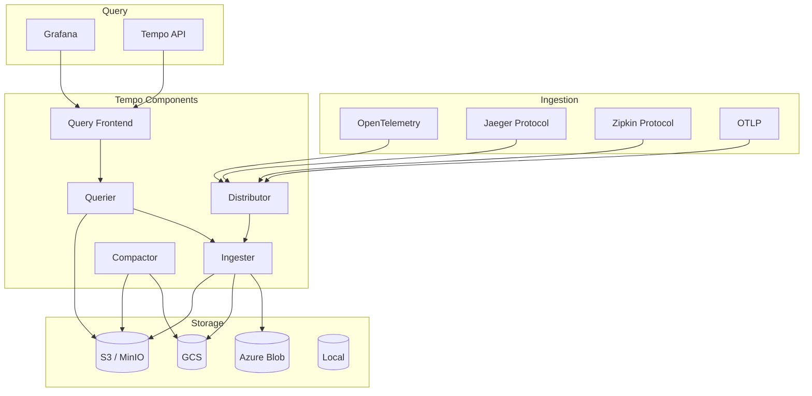

# Deploying Grafana Tempo Distributed Tracing with Helm

Author: [nawazdhandala](https://www.github.com/nawazdhandala)

Tags: Helm, Kubernetes, DevOps, Tempo, Tracing, Observability, Grafana

Description: Complete guide to deploying Grafana Tempo distributed tracing backend on Kubernetes using Helm charts for scalable, cost-effective trace storage and querying.

> Grafana Tempo is a high-scale, cost-effective distributed tracing backend that requires only object storage to operate. This guide covers deploying Tempo using Helm charts with various deployment modes for production environments.

## Tempo Architecture



## Prerequisites

```bash
# Add Grafana Helm repository
helm repo add grafana https://grafana.github.io/helm-charts
helm repo update

# Search available versions
helm search repo grafana/tempo --versions
```

## Deployment Modes

| Mode | Description | Use Case |
|------|-------------|----------|
| Monolithic | Single binary deployment | Development, small scale |
| Distributed | Microservices deployment | Production, high scale |
| Scalable Monolithic | Horizontally scaled single binary | Medium scale |

## Deploy Tempo Monolithic

### Basic Installation

```yaml
# tempo-monolithic-values.yaml
tempo:
  repository: grafana/tempo
  tag: 2.3.0
  
  # Storage configuration
  storage:
    trace:
      backend: local
      local:
        path: /var/tempo/traces
      wal:
        path: /var/tempo/wal
        
  # Retention
  retention: 168h  # 7 days
  
  # Resource limits
  resources:
    requests:
      cpu: 500m
      memory: 1Gi
    limits:
      cpu: 2000m
      memory: 4Gi

# Persistence for local storage
persistence:
  enabled: true
  size: 50Gi
  storageClassName: fast-ssd

# Receivers
receivers:
  jaeger:
    protocols:
      thrift_http:
        endpoint: 0.0.0.0:14268
      grpc:
        endpoint: 0.0.0.0:14250
  zipkin:
    endpoint: 0.0.0.0:9411
  otlp:
    protocols:
      grpc:
        endpoint: 0.0.0.0:4317
      http:
        endpoint: 0.0.0.0:4318
```

```bash
helm install tempo grafana/tempo \
  --namespace tempo \
  --create-namespace \
  -f tempo-monolithic-values.yaml
```

## Deploy Tempo Distributed (Production)

### With S3 Backend

```yaml
# tempo-distributed-values.yaml
global:
  image:
    registry: docker.io
    repository: grafana/tempo
    tag: 2.3.0

# Storage configuration
storage:
  trace:
    backend: s3
    s3:
      bucket: tempo-traces
      endpoint: s3.us-east-1.amazonaws.com
      region: us-east-1
      access_key: ""  # Use IRSA
      secret_key: ""  # Use IRSA
      insecure: false
      
# Use IRSA for authentication
serviceAccount:
  create: true
  annotations:
    eks.amazonaws.com/role-arn: arn:aws:iam::123456789:role/tempo-s3-role

# Distributor
distributor:
  replicas: 3
  
  resources:
    requests:
      cpu: 500m
      memory: 512Mi
    limits:
      cpu: 1000m
      memory: 1Gi
      
  autoscaling:
    enabled: true
    minReplicas: 3
    maxReplicas: 10
    targetCPUUtilizationPercentage: 70

# Ingester
ingester:
  replicas: 3
  
  resources:
    requests:
      cpu: 1000m
      memory: 2Gi
    limits:
      cpu: 2000m
      memory: 4Gi
      
  persistence:
    enabled: true
    size: 50Gi
    storageClassName: fast-ssd
    
  config:
    replication_factor: 3
    
  autoscaling:
    enabled: true
    minReplicas: 3
    maxReplicas: 30
    targetCPUUtilizationPercentage: 70

# Querier
querier:
  replicas: 2
  
  resources:
    requests:
      cpu: 500m
      memory: 1Gi
    limits:
      cpu: 1000m
      memory: 2Gi
      
  autoscaling:
    enabled: true
    minReplicas: 2
    maxReplicas: 10
    targetCPUUtilizationPercentage: 70

# Query Frontend
queryFrontend:
  replicas: 2
  
  resources:
    requests:
      cpu: 200m
      memory: 256Mi
    limits:
      cpu: 500m
      memory: 512Mi
      
  query:
    search:
      max_duration: 0s  # Disable max duration
      default_result_limit: 20

# Compactor
compactor:
  replicas: 1
  
  resources:
    requests:
      cpu: 500m
      memory: 1Gi
    limits:
      cpu: 1000m
      memory: 2Gi
      
  config:
    compaction:
      block_retention: 168h  # 7 days

# Metrics Generator
metricsGenerator:
  enabled: true
  replicas: 1
  
  resources:
    requests:
      cpu: 200m
      memory: 256Mi
    limits:
      cpu: 500m
      memory: 512Mi
      
  config:
    storage:
      path: /var/tempo/wal
    registry:
      external_labels:
        source: tempo
        cluster: production
    processor:
      service_graphs:
        histogram_buckets: [0.1, 0.2, 0.4, 0.8, 1.6, 3.2]
        dimensions:
          - http.method
          - http.status_code
      span_metrics:
        histogram_buckets: [0.002, 0.004, 0.008, 0.016, 0.032, 0.064, 0.128, 0.256, 0.512, 1.024, 2.048, 4.096, 8.192]
        dimensions:
          - service.name
          - http.method
          - http.status_code

# Gateway (optional nginx-based load balancer)
gateway:
  enabled: true
  replicas: 2
  
  resources:
    requests:
      cpu: 100m
      memory: 128Mi
    limits:
      cpu: 500m
      memory: 256Mi
      
  ingress:
    enabled: true
    annotations:
      kubernetes.io/ingress.class: nginx
      cert-manager.io/cluster-issuer: letsencrypt-prod
    hosts:
      - host: tempo.example.com
        paths:
          - path: /
            pathType: Prefix
    tls:
      - secretName: tempo-tls
        hosts:
          - tempo.example.com

# Memcached for caching
memcached:
  enabled: true
  replicas: 3
  
  resources:
    requests:
      cpu: 100m
      memory: 512Mi
    limits:
      cpu: 500m
      memory: 1Gi
```

```bash
helm install tempo grafana/tempo-distributed \
  --namespace tempo \
  --create-namespace \
  -f tempo-distributed-values.yaml
```

### With GCS Backend

```yaml
# tempo-gcs-values.yaml
storage:
  trace:
    backend: gcs
    gcs:
      bucket_name: tempo-traces-bucket
      # Use Workload Identity
      
serviceAccount:
  create: true
  annotations:
    iam.gke.io/gcp-service-account: tempo@project-id.iam.gserviceaccount.com
```

### With MinIO Backend

```yaml
# tempo-minio-values.yaml
storage:
  trace:
    backend: s3
    s3:
      bucket: tempo
      endpoint: minio.minio.svc:9000
      access_key: minioadmin
      secret_key: minioadmin
      insecure: true
      
minio:
  enabled: true
  mode: standalone
  persistence:
    size: 100Gi
```

## Tempo Configuration

### Complete tempo.yaml

```yaml
# tempo-config.yaml
apiVersion: v1
kind: ConfigMap
metadata:
  name: tempo-config
  namespace: tempo
data:
  tempo.yaml: |
    server:
      http_listen_port: 3200
      grpc_listen_port: 9095
      
    distributor:
      receivers:
        jaeger:
          protocols:
            thrift_http:
              endpoint: 0.0.0.0:14268
            grpc:
              endpoint: 0.0.0.0:14250
        zipkin:
          endpoint: 0.0.0.0:9411
        otlp:
          protocols:
            grpc:
              endpoint: 0.0.0.0:4317
            http:
              endpoint: 0.0.0.0:4318
              
    ingester:
      max_block_duration: 5m
      max_block_bytes: 1_000_000
      complete_block_timeout: 15m
      
    compactor:
      compaction:
        block_retention: 168h
        compacted_block_retention: 1h
        compaction_window: 1h
        max_compaction_objects: 6
        
    memberlist:
      abort_if_cluster_join_fails: false
      bind_port: 7946
      join_members:
        - tempo-distributed-gossip-ring:7946
        
    querier:
      frontend_worker:
        frontend_address: tempo-distributed-query-frontend-discovery:9095
        
    storage:
      trace:
        backend: s3
        s3:
          bucket: tempo-traces
          endpoint: s3.us-east-1.amazonaws.com
        wal:
          path: /var/tempo/wal
        block:
          bloom_filter_false_positive: 0.05
          v2_index_downsample_bytes: 1000
          v2_encoding: zstd
        pool:
          max_workers: 100
          queue_depth: 10000
          
    overrides:
      defaults:
        ingestion:
          rate_limit_bytes: 15_000_000
          burst_size_bytes: 20_000_000
          max_traces_per_user: 10_000
        global:
          max_bytes_per_trace: 5_000_000
```

## Multi-tenancy Configuration

```yaml
# tempo-multitenancy-values.yaml
multitenancyEnabled: true

distributor:
  config:
    log_received_spans:
      enabled: true
      include_all_attributes: true

overrides:
  # Per-tenant overrides
  tenant_a:
    ingestion:
      rate_limit_bytes: 30_000_000
      burst_size_bytes: 40_000_000
    global:
      max_bytes_per_trace: 10_000_000
      
  tenant_b:
    ingestion:
      rate_limit_bytes: 15_000_000
    global:
      max_bytes_per_trace: 5_000_000
```

### Sending Traces with Tenant Header

```bash
# Send traces with X-Scope-OrgID header
curl -X POST http://tempo:4318/v1/traces \
  -H "Content-Type: application/json" \
  -H "X-Scope-OrgID: tenant_a" \
  -d @traces.json
```

## OpenTelemetry Collector Integration

### OTel Collector to Tempo

```yaml
# otel-collector-config.yaml
apiVersion: v1
kind: ConfigMap
metadata:
  name: otel-collector-config
data:
  config.yaml: |
    receivers:
      otlp:
        protocols:
          grpc:
            endpoint: 0.0.0.0:4317
          http:
            endpoint: 0.0.0.0:4318
            
    processors:
      batch:
        timeout: 1s
        send_batch_size: 1024
        
      resource:
        attributes:
          - key: deployment.environment
            value: production
            action: upsert
            
    exporters:
      otlp/tempo:
        endpoint: tempo-distributor.tempo:4317
        tls:
          insecure: true
          
    service:
      pipelines:
        traces:
          receivers: [otlp]
          processors: [resource, batch]
          exporters: [otlp/tempo]
```

## Grafana Integration

### Data Source Configuration

```yaml
# grafana-datasource.yaml
apiVersion: v1
kind: ConfigMap
metadata:
  name: grafana-datasources
  labels:
    grafana_datasource: "1"
data:
  tempo.yaml: |
    apiVersion: 1
    datasources:
      - name: Tempo
        type: tempo
        access: proxy
        url: http://tempo-query-frontend.tempo:3200
        jsonData:
          httpMethod: GET
          tracesToLogs:
            datasourceUid: loki
            filterByTraceID: true
            filterBySpanID: true
            mapTagNamesEnabled: true
            mappedTags:
              - key: service.name
                value: service
          tracesToMetrics:
            datasourceUid: prometheus
            spanStartTimeShift: '-1h'
            spanEndTimeShift: '1h'
            tags:
              - key: service.name
                value: service
            queries:
              - name: 'Request rate'
                query: 'sum(rate(traces_spanmetrics_latency_count{$$__tags}[1m]))'
          serviceMap:
            datasourceUid: prometheus
          nodeGraph:
            enabled: true
          search:
            hide: false
          lokiSearch:
            datasourceUid: loki
```

### Explore Traces

```bash
# Access Grafana and navigate to Explore
# Select Tempo datasource
# Use TraceQL for querying

# Example TraceQL queries:

# Find traces by service name
{ resource.service.name = "frontend" }

# Find traces with errors
{ status = error }

# Find slow traces
{ duration > 1s }

# Find traces with specific attribute
{ span.http.method = "GET" && span.http.status_code = 500 }

# Aggregate queries
{ resource.service.name = "api" } | rate()
```

## Service Graph and Metrics

### Enable Metrics Generator

```yaml
# tempo-metrics-generator.yaml
metricsGenerator:
  enabled: true
  
  config:
    storage:
      path: /var/tempo/wal
      
    registry:
      external_labels:
        source: tempo
        
    processor:
      service_graphs:
        enabled: true
        histogram_buckets: [0.1, 0.2, 0.4, 0.8, 1.6, 3.2, 6.4, 12.8]
        dimensions:
          - http.method
          - http.target
        peer_attributes:
          - db.name
          - messaging.destination
          
      span_metrics:
        enabled: true
        histogram_buckets: [0.002, 0.004, 0.008, 0.016, 0.032, 0.064, 0.128, 0.256, 0.512, 1.024, 2.048, 4.096, 8.192, 16.384]
        dimensions:
          - service.name
          - span.name
          - http.method
          - http.status_code
          
    remote_write:
      - url: http://prometheus.monitoring:9090/api/v1/write
```

### Prometheus Rules for Service Graph

```yaml
# tempo-recording-rules.yaml
apiVersion: monitoring.coreos.com/v1
kind: PrometheusRule
metadata:
  name: tempo-service-graph
spec:
  groups:
    - name: tempo-service-graph
      rules:
        - record: tempo:service_graph_request:rate5m
          expr: |
            sum(rate(traces_service_graph_request_total[5m])) by (client, server)
            
        - record: tempo:service_graph_request_failed:rate5m
          expr: |
            sum(rate(traces_service_graph_request_failed_total[5m])) by (client, server)
```

## Monitoring Tempo

### ServiceMonitor

```yaml
# tempo-servicemonitor.yaml
apiVersion: monitoring.coreos.com/v1
kind: ServiceMonitor
metadata:
  name: tempo
  namespace: monitoring
spec:
  selector:
    matchLabels:
      app.kubernetes.io/name: tempo
  namespaceSelector:
    matchNames:
      - tempo
  endpoints:
    - port: http-metrics
      path: /metrics
      interval: 30s
```

### Prometheus Alerts

```yaml
# tempo-prometheus-rules.yaml
apiVersion: monitoring.coreos.com/v1
kind: PrometheusRule
metadata:
  name: tempo-alerts
spec:
  groups:
    - name: tempo
      rules:
        - alert: TempoDistributorFailing
          expr: |
            sum(rate(tempo_distributor_push_errors_total[5m])) 
            / sum(rate(tempo_distributor_push_total[5m])) > 0.01
          for: 5m
          labels:
            severity: warning
          annotations:
            summary: "Tempo distributor has errors"
            
        - alert: TempoIngesterFlushesFailing
          expr: |
            sum(rate(tempo_ingester_flush_failed_total[5m])) > 0
          for: 5m
          labels:
            severity: critical
          annotations:
            summary: "Tempo ingester flush failures"
            
        - alert: TempoCompactorFailing
          expr: |
            sum(rate(tempo_compactor_compaction_errors_total[5m])) > 0
          for: 5m
          labels:
            severity: warning
          annotations:
            summary: "Tempo compactor errors"
            
        - alert: TempoHighLatency
          expr: |
            histogram_quantile(0.99, 
              sum(rate(tempo_query_frontend_queries_bucket[5m])) by (le)
            ) > 30
          for: 5m
          labels:
            severity: warning
          annotations:
            summary: "Tempo query latency is high"
```

## Troubleshooting

```bash
# Check Tempo pods
kubectl get pods -n tempo

# Check distributor logs
kubectl logs -n tempo -l app.kubernetes.io/component=distributor

# Check ingester logs
kubectl logs -n tempo -l app.kubernetes.io/component=ingester

# Check compactor logs
kubectl logs -n tempo -l app.kubernetes.io/component=compactor

# Check Tempo status
kubectl exec -n tempo deploy/tempo-distributed-distributor -- wget -qO- http://localhost:3200/status

# Check ingester ring
kubectl exec -n tempo deploy/tempo-distributed-distributor -- wget -qO- http://localhost:3200/ingester/ring

# Verify trace ingestion
kubectl exec -n tempo deploy/tempo-distributed-distributor -- wget -qO- http://localhost:3200/metrics | grep tempo_distributor

# Query a trace
curl http://tempo.example.com/api/traces/<trace-id>

# Search traces
curl "http://tempo.example.com/api/search?q={service.name=\"frontend\"}&limit=10"
```

## Wrap-up

Grafana Tempo provides a cost-effective, highly scalable distributed tracing backend that integrates seamlessly with the Grafana ecosystem. Use the distributed deployment for production workloads with object storage backends like S3 or GCS. Enable the metrics generator for service graphs and span metrics, and configure proper retention policies based on your observability requirements.
