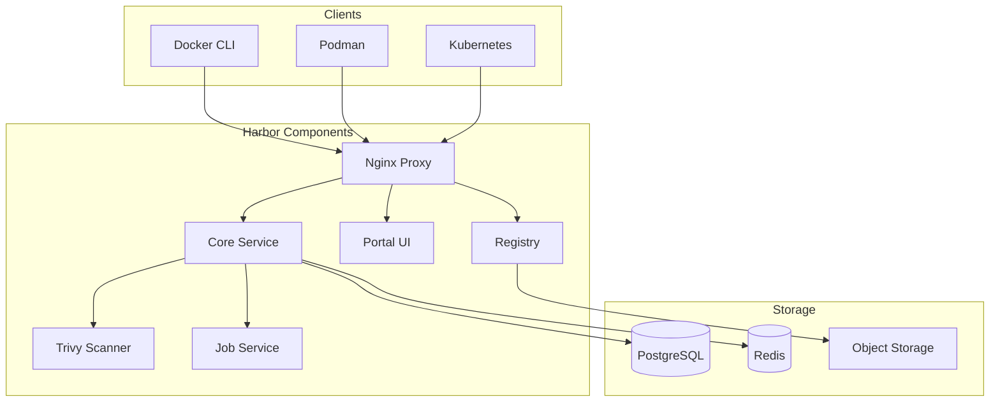

# How to Deploy Harbor Container Registry with Helm

Author: [nawazdhandala](https://www.github.com/nawazdhandala)

Tags: Helm, Kubernetes, Harbor, Container Registry, Docker, DevOps, Security

Description: Complete guide to deploying Harbor container registry using Helm including high availability configuration, image scanning, replication, and OIDC authentication.

> Harbor is an enterprise-grade container registry with security features like vulnerability scanning and RBAC. This guide covers deploying Harbor via Helm with production-ready configurations.

## Harbor Architecture



## Installation

### Add Helm Repository

```bash
# Add Harbor repository
helm repo add harbor https://helm.goharbor.io
helm repo update

# Search available versions
helm search repo harbor/harbor --versions
```

### Basic Installation

```bash
# Quick installation for testing
helm install harbor harbor/harbor \
  --namespace harbor \
  --create-namespace \
  --set expose.type=loadBalancer \
  --set externalURL=https://harbor.example.com
```

## Production Configuration

### Complete Values File

```yaml
# harbor-values.yaml

# Expose configuration
expose:
  type: ingress
  tls:
    enabled: true
    certSource: secret
    secret:
      secretName: harbor-tls
  ingress:
    hosts:
      core: harbor.example.com
    className: nginx
    annotations:
      cert-manager.io/cluster-issuer: letsencrypt-prod
      nginx.ingress.kubernetes.io/ssl-redirect: "true"
      nginx.ingress.kubernetes.io/proxy-body-size: "0"
      nginx.ingress.kubernetes.io/proxy-read-timeout: "600"
      nginx.ingress.kubernetes.io/proxy-send-timeout: "600"

# External URL
externalURL: https://harbor.example.com

# Internal TLS
internalTLS:
  enabled: true
  certSource: auto

# Persistence
persistence:
  enabled: true
  resourcePolicy: keep
  persistentVolumeClaim:
    registry:
      storageClass: fast-storage
      size: 100Gi
    jobservice:
      jobLog:
        storageClass: fast-storage
        size: 10Gi
    database:
      storageClass: fast-storage
      size: 20Gi
    redis:
      storageClass: fast-storage
      size: 5Gi
    trivy:
      storageClass: fast-storage
      size: 10Gi

# Use external database
database:
  type: external
  external:
    host: harbor-postgresql.harbor.svc.cluster.local
    port: "5432"
    username: harbor
    password: ""
    existingSecret: harbor-db-credentials
    sslmode: require
    coreDatabase: harbor_core
    
# Use external Redis
redis:
  type: external
  external:
    addr: harbor-redis-master.harbor.svc.cluster.local:6379
    password: ""
    existingSecret: harbor-redis-credentials

# Admin password
harborAdminPassword: ""
existingSecretAdminPassword: harbor-admin-credentials
existingSecretAdminPasswordKey: password

# Secret key (for encryption)
secretKey: ""
existingSecretSecretKey: harbor-secret-key

# Core configuration
core:
  replicas: 2
  resources:
    requests:
      cpu: 100m
      memory: 256Mi
    limits:
      cpu: 500m
      memory: 512Mi

# Job service
jobservice:
  replicas: 2
  resources:
    requests:
      cpu: 100m
      memory: 256Mi
    limits:
      cpu: 500m
      memory: 512Mi

# Registry
registry:
  replicas: 2
  resources:
    requests:
      cpu: 100m
      memory: 256Mi
    limits:
      cpu: 1
      memory: 1Gi

# Portal
portal:
  replicas: 2
  resources:
    requests:
      cpu: 100m
      memory: 128Mi
    limits:
      cpu: 500m
      memory: 256Mi

# Trivy scanner
trivy:
  enabled: true
  replicas: 1
  resources:
    requests:
      cpu: 200m
      memory: 512Mi
    limits:
      cpu: 1
      memory: 1Gi
  # Trivy server mode
  gitHubToken: ""
  skipUpdate: false

# Metrics
metrics:
  enabled: true
  core:
    path: /metrics
    port: 8001
  registry:
    path: /metrics
    port: 8001
  jobservice:
    path: /metrics
    port: 8001
  exporter:
    path: /metrics
    port: 8001

# Cache
cache:
  enabled: true
  expireHours: 24

# Update strategy
updateStrategy:
  type: RollingUpdate
```

### Create Secrets

```bash
# Create namespace
kubectl create namespace harbor

# Admin password
kubectl create secret generic harbor-admin-credentials \
  --namespace harbor \
  --from-literal=password=$(openssl rand -base64 24)

# Secret key (32 characters)
kubectl create secret generic harbor-secret-key \
  --namespace harbor \
  --from-literal=secretKey=$(openssl rand -hex 16)

# Database credentials
kubectl create secret generic harbor-db-credentials \
  --namespace harbor \
  --from-literal=password=$(openssl rand -base64 24)

# Redis credentials
kubectl create secret generic harbor-redis-credentials \
  --namespace harbor \
  --from-literal=password=$(openssl rand -base64 24)
```

### Deploy Harbor

```bash
helm install harbor harbor/harbor \
  -f harbor-values.yaml \
  --namespace harbor \
  --create-namespace
```

## External Database Setup

### PostgreSQL via Helm

```yaml
# postgresql-values.yaml
auth:
  postgresPassword: ""
  existingSecret: harbor-db-credentials
  secretKeys:
    adminPasswordKey: postgres-password
    userPasswordKey: password
  username: harbor
  database: harbor_core

primary:
  persistence:
    enabled: true
    storageClass: fast-storage
    size: 20Gi
  resources:
    requests:
      cpu: 250m
      memory: 512Mi
    limits:
      cpu: 1
      memory: 1Gi

readReplicas:
  replicaCount: 2
  persistence:
    enabled: true
    storageClass: fast-storage
    size: 20Gi
```

```bash
# Install PostgreSQL
helm install harbor-postgresql bitnami/postgresql \
  -f postgresql-values.yaml \
  --namespace harbor
```

## S3-Compatible Storage

### Configure for MinIO/S3

```yaml
# harbor-s3-values.yaml
persistence:
  imageChartStorage:
    type: s3
    s3:
      region: us-east-1
      bucket: harbor-registry
      accesskey: ""
      secretkey: ""
      existingSecret: harbor-s3-credentials
      regionendpoint: https://minio.example.com
      encrypt: true
      secure: true
      v4auth: true
```

### Create S3 Secret

```bash
kubectl create secret generic harbor-s3-credentials \
  --namespace harbor \
  --from-literal=REGISTRY_STORAGE_S3_ACCESSKEY=ACCESS_KEY \
  --from-literal=REGISTRY_STORAGE_S3_SECRETKEY=SECRET_KEY
```

## OIDC Authentication

### Configure OIDC

```yaml
# harbor-oidc-values.yaml
# Configure via Harbor UI or API after deployment
# Example for Keycloak integration

# In Harbor UI: Configuration > Authentication
# Auth Mode: OIDC
# OIDC Endpoint: https://keycloak.example.com/realms/harbor
# OIDC Client ID: harbor
# OIDC Client Secret: <from Keycloak>
# OIDC Scope: openid,profile,email,groups
# Group Claim Name: groups
# OIDC Admin Group: harbor-admins
# Automatic Onboarding: checked
# Username Claim: preferred_username
```

### Keycloak Client Configuration

```json
{
  "clientId": "harbor",
  "name": "Harbor Registry",
  "protocol": "openid-connect",
  "publicClient": false,
  "standardFlowEnabled": true,
  "directAccessGrantsEnabled": false,
  "redirectUris": [
    "https://harbor.example.com/c/oidc/callback"
  ],
  "webOrigins": [
    "https://harbor.example.com"
  ],
  "attributes": {
    "access.token.lifespan": "3600"
  }
}
```

## Robot Accounts and Service Accounts

### Create Robot Account

```bash
# Via Harbor API
curl -X POST "https://harbor.example.com/api/v2.0/robots" \
  -H "Authorization: Basic $(echo -n 'admin:password' | base64)" \
  -H "Content-Type: application/json" \
  -d '{
    "name": "ci-robot",
    "description": "Robot account for CI/CD",
    "duration": -1,
    "level": "system",
    "permissions": [
      {
        "namespace": "library",
        "kind": "project",
        "access": [
          {"resource": "repository", "action": "pull"},
          {"resource": "repository", "action": "push"}
        ]
      }
    ]
  }'
```

### Use in Kubernetes

```yaml
# docker-registry-secret.yaml
apiVersion: v1
kind: Secret
metadata:
  name: harbor-credentials
  namespace: default
type: kubernetes.io/dockerconfigjson
data:
  .dockerconfigjson: <base64-encoded-docker-config>

---
# Pod using Harbor credentials
apiVersion: v1
kind: Pod
metadata:
  name: test-pod
spec:
  imagePullSecrets:
    - name: harbor-credentials
  containers:
    - name: app
      image: harbor.example.com/library/myapp:v1.0
```

## Image Replication

### Configure Replication Policy

```yaml
# Replication to another Harbor instance
# Configure via UI: Administration > Replications

# Example API call
curl -X POST "https://harbor.example.com/api/v2.0/replication/policies" \
  -H "Authorization: Basic $(echo -n 'admin:password' | base64)" \
  -H "Content-Type: application/json" \
  -d '{
    "name": "replicate-to-dr",
    "description": "Replicate to DR site",
    "src_registry": null,
    "dest_registry": {
      "id": 1
    },
    "dest_namespace": "",
    "trigger": {
      "type": "event_based"
    },
    "filters": [
      {
        "type": "name",
        "value": "production/**"
      }
    ],
    "enabled": true
  }'
```

## Vulnerability Scanning

### Trivy Configuration

```yaml
# In harbor-values.yaml
trivy:
  enabled: true
  # Update Trivy DB automatically
  skipUpdate: false
  # GitHub token for higher rate limits
  gitHubToken: ""
  
  # Resources
  resources:
    requests:
      cpu: 200m
      memory: 512Mi
    limits:
      cpu: 1
      memory: 2Gi
```

### Scan Policies

```yaml
# Configure via Harbor UI
# Project Settings > Configuration

# Auto scan on push: enabled
# Prevent vulnerable images: enabled
# Severity threshold: High
```

## Monitoring

### Prometheus ServiceMonitor

```yaml
# harbor-servicemonitor.yaml
apiVersion: monitoring.coreos.com/v1
kind: ServiceMonitor
metadata:
  name: harbor
  namespace: monitoring
spec:
  selector:
    matchLabels:
      app: harbor
  namespaceSelector:
    matchNames:
      - harbor
  endpoints:
    - port: metrics
      interval: 30s
      path: /metrics
```

### Key Metrics

```promql
# Total images
harbor_project_total

# Repository count
harbor_repo_total

# Artifact count
harbor_artifact_total

# Pull/Push requests
rate(harbor_registry_http_request_duration_seconds_count[5m])

# Storage usage
harbor_project_quota_usage_byte

# Scan statistics
harbor_scanner_total
```

## Garbage Collection

### Configure GC Job

```yaml
# Via Harbor UI: Administration > Garbage Collection
# Or via API:

curl -X POST "https://harbor.example.com/api/v2.0/system/gc/schedule" \
  -H "Authorization: Basic $(echo -n 'admin:password' | base64)" \
  -H "Content-Type: application/json" \
  -d '{
    "schedule": {
      "type": "Weekly",
      "cron": "0 0 0 * * 0"
    },
    "parameters": {
      "delete_untagged": true,
      "dry_run": false
    }
  }'
```

## Troubleshooting

```bash
# Check all Harbor pods
kubectl get pods -n harbor -l app=harbor

# View core logs
kubectl logs -n harbor -l component=core -f

# View registry logs  
kubectl logs -n harbor -l component=registry -f

# Check database connectivity
kubectl exec -it -n harbor deploy/harbor-core -- \
  curl -s http://localhost:8080/api/v2.0/health

# Test registry
docker login harbor.example.com
docker pull harbor.example.com/library/nginx:latest

# Check storage
kubectl exec -it -n harbor deploy/harbor-registry -- \
  ls -la /storage

# Debug Trivy
kubectl logs -n harbor -l component=trivy -f
```

## Best Practices

| Practice | Description |
|----------|-------------|
| External Database | Use managed PostgreSQL for HA |
| S3 Storage | Scalable image storage |
| Enable TLS | Internal and external |
| OIDC Auth | Centralized authentication |
| Robot Accounts | CI/CD automation |
| Scan on Push | Automatic vulnerability detection |
| Replication | DR and multi-region |
| Garbage Collection | Regular storage cleanup |

## Wrap-up

Harbor provides enterprise container registry features including vulnerability scanning, RBAC, and replication. Deploy with external PostgreSQL and S3-compatible storage for production resilience. Configure OIDC for centralized authentication and enable Trivy scanning to catch vulnerabilities before deployment.
