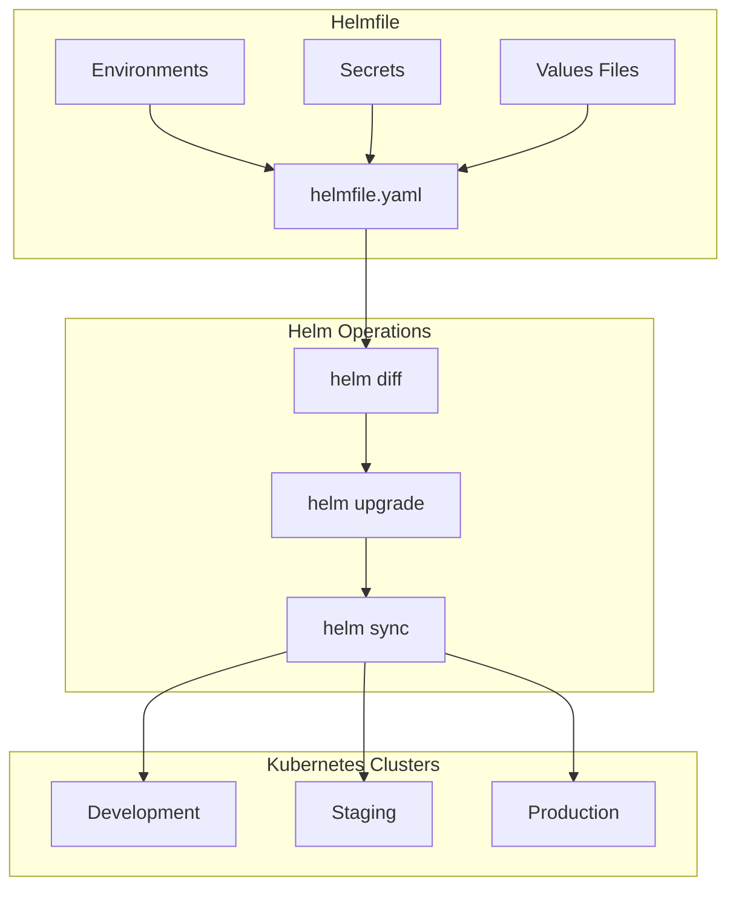

# How to Use Helmfile for Declarative Helm Release Management

Author: [nawazdhandala](https://www.github.com/nawazdhandala)

Tags: Helm, Kubernetes, Helmfile, DevOps, GitOps, Infrastructure as Code, Declarative

Description: Complete guide to using Helmfile for declarative Helm release management including environments, secrets, and advanced deployment strategies.

> Helmfile provides declarative management of Helm releases across environments. This guide covers Helmfile configuration, environment management, secrets integration, and advanced deployment patterns.

## Helmfile Architecture



## Installation

### Install Helmfile

```bash
# macOS
brew install helmfile

# Linux
wget https://github.com/helmfile/helmfile/releases/download/v0.159.0/helmfile_0.159.0_linux_amd64.tar.gz
tar xzf helmfile_0.159.0_linux_amd64.tar.gz
sudo mv helmfile /usr/local/bin/

# Install helm-diff plugin (required)
helm plugin install https://github.com/databus23/helm-diff

# Install helm-secrets plugin (optional)
helm plugin install https://github.com/jkroepke/helm-secrets
```

### Verify Installation

```bash
helmfile version
helm plugin list
```

## Basic Helmfile Structure

### Simple helmfile.yaml

```yaml
# helmfile.yaml
repositories:
  - name: bitnami
    url: https://charts.bitnami.com/bitnami
  - name: prometheus-community
    url: https://prometheus-community.github.io/helm-charts

releases:
  - name: nginx
    namespace: web
    chart: bitnami/nginx
    version: 15.0.0
    values:
      - replicaCount: 2
      - service:
          type: ClusterIP

  - name: prometheus
    namespace: monitoring
    chart: prometheus-community/kube-prometheus-stack
    version: 54.0.0
    values:
      - ./values/prometheus.yaml
```

### Run Helmfile

```bash
# Sync all releases
helmfile sync

# Preview changes (diff)
helmfile diff

# Apply changes
helmfile apply

# Destroy all releases
helmfile destroy
```

## Directory Structure

### Recommended Layout

```
helmfile/
├── helmfile.yaml           # Main helmfile
├── helmfile.d/             # Split helmfiles
│   ├── 00-namespaces.yaml
│   ├── 10-infrastructure.yaml
│   └── 20-applications.yaml
├── environments/
│   ├── default.yaml
│   ├── development.yaml
│   ├── staging.yaml
│   └── production.yaml
├── values/
│   ├── nginx/
│   │   ├── common.yaml
│   │   ├── development.yaml
│   │   ├── staging.yaml
│   │   └── production.yaml
│   └── prometheus/
│       ├── common.yaml
│       └── production.yaml
└── secrets/
    ├── development/
    ├── staging/
    └── production/
```

## Environment Management

### Environment Configuration

```yaml
# helmfile.yaml
environments:
  default:
    values:
      - environments/default.yaml
  development:
    values:
      - environments/development.yaml
  staging:
    values:
      - environments/staging.yaml
  production:
    values:
      - environments/production.yaml
    secrets:
      - secrets/production/secrets.yaml

---

releases:
  - name: myapp
    namespace: {{ .Values.namespace }}
    chart: ./charts/myapp
    values:
      - values/myapp/common.yaml
      - values/myapp/{{ .Environment.Name }}.yaml
    set:
      - name: replicaCount
        value: {{ .Values.replicaCount }}
      - name: image.tag
        value: {{ .Values.imageTag }}
```

### Environment Values Files

```yaml
# environments/default.yaml
namespace: default
replicaCount: 1
imageTag: latest

# environments/development.yaml
namespace: development
replicaCount: 1
imageTag: develop
domain: dev.example.com

# environments/staging.yaml
namespace: staging
replicaCount: 2
imageTag: staging
domain: staging.example.com

# environments/production.yaml
namespace: production
replicaCount: 5
imageTag: v1.2.3
domain: example.com
```

### Use Environment

```bash
# Deploy to specific environment
helmfile -e development sync
helmfile -e staging diff
helmfile -e production apply
```

## Advanced Configuration

### Layered Values

```yaml
# helmfile.yaml
releases:
  - name: myapp
    namespace: {{ .Values.namespace }}
    chart: ./charts/myapp
    values:
      # Base values (always applied)
      - values/myapp/base.yaml
      
      # Environment-specific values
      - values/myapp/{{ .Environment.Name }}.yaml
      
      # Optional overrides (ignored if missing)
      - values/myapp/{{ .Environment.Name }}-overrides.yaml
    
    # Inline values
    values:
      - replicaCount: {{ .Values.replicaCount }}
        image:
          repository: myregistry.io/myapp
          tag: {{ .Values.imageTag }}
    
    # Set values individually
    set:
      - name: ingress.hosts[0].host
        value: {{ .Values.domain }}
```

### Conditional Releases

```yaml
# helmfile.yaml
releases:
  - name: myapp
    namespace: {{ .Values.namespace }}
    chart: ./charts/myapp
    # Only install if condition is true
    condition: myapp.enabled
    # Or use installed flag
    installed: {{ .Values.myapp.enabled | default true }}

  - name: monitoring
    namespace: monitoring
    chart: prometheus-community/kube-prometheus-stack
    # Only in production
    installed: {{ eq .Environment.Name "production" }}

  - name: debug-tools
    namespace: default
    chart: ./charts/debug-tools
    # Not in production
    installed: {{ ne .Environment.Name "production" }}
```

### Release Dependencies

```yaml
# helmfile.yaml
releases:
  - name: cert-manager
    namespace: cert-manager
    chart: jetstack/cert-manager
    version: v1.13.0

  - name: ingress-nginx
    namespace: ingress-nginx
    chart: ingress-nginx/ingress-nginx
    needs:
      - cert-manager/cert-manager

  - name: myapp
    namespace: default
    chart: ./charts/myapp
    needs:
      - ingress-nginx/ingress-nginx
      - cert-manager/cert-manager
```

## Secrets Management

### Using helm-secrets

```yaml
# helmfile.yaml
releases:
  - name: myapp
    namespace: production
    chart: ./charts/myapp
    values:
      - values/myapp/common.yaml
    secrets:
      - secrets/production/myapp-secrets.yaml
```

### Encrypted Secrets File

```bash
# Create secrets file
cat > secrets/production/myapp-secrets.yaml << EOF
database:
  password: supersecret
apiKey: abc123
EOF

# Encrypt with SOPS
sops -e -i secrets/production/myapp-secrets.yaml

# Or use age encryption
sops --age $(cat ~/.sops/age.txt) -e -i secrets/production/myapp-secrets.yaml
```

### SOPS Configuration

```yaml
# .sops.yaml
creation_rules:
  - path_regex: secrets/development/.*
    age: age1development...
  - path_regex: secrets/staging/.*
    age: age1staging...
  - path_regex: secrets/production/.*
    age: age1production...
    # Or use AWS KMS
    kms: arn:aws:kms:us-east-1:123456789:key/abc-123
```

## Hooks and Events

### Helmfile Hooks

```yaml
# helmfile.yaml
releases:
  - name: myapp
    namespace: production
    chart: ./charts/myapp
    hooks:
      - events: ["presync"]
        showlogs: true
        command: "/bin/sh"
        args:
          - "-c"
          - "kubectl create namespace production --dry-run=client -o yaml | kubectl apply -f -"
      
      - events: ["postsync"]
        showlogs: true
        command: "/bin/sh"
        args:
          - "-c"
          - "kubectl rollout status deployment/myapp -n production --timeout=300s"
      
      - events: ["cleanup"]
        command: "/bin/sh"
        args:
          - "-c"
          - "echo 'Cleaning up...'"
```

### Custom Scripts

```yaml
# helmfile.yaml
releases:
  - name: myapp
    chart: ./charts/myapp
    hooks:
      - events: ["prepare"]
        command: "./scripts/prepare.sh"
        args:
          - "{{ .Environment.Name }}"
      
      - events: ["postsync"]
        command: "./scripts/post-deploy.sh"
        args:
          - "{{ .Release.Name }}"
          - "{{ .Release.Namespace }}"
```

## Helmfile Commands

### Common Operations

```bash
# Initialize (download charts)
helmfile repos
helmfile deps

# Preview changes
helmfile diff
helmfile -e production diff

# Apply changes
helmfile apply
helmfile -e production apply

# Sync (force reconciliation)
helmfile sync
helmfile -e production sync

# List releases
helmfile list

# Status of releases
helmfile status

# Destroy releases
helmfile destroy

# Template (render locally)
helmfile template

# Lint charts
helmfile lint
```

### Selective Operations

```bash
# Only specific releases
helmfile -l name=myapp sync
helmfile -l namespace=production sync
helmfile -l app=frontend diff

# Multiple selectors
helmfile -l "name=myapp,namespace=production" apply

# Using regex
helmfile -l "name=~myapp-.*" diff
```

## Multi-Cluster Deployment

### Cluster Configuration

```yaml
# helmfile.yaml
environments:
  development:
    kubeContext: dev-cluster
    values:
      - environments/development.yaml
  staging:
    kubeContext: staging-cluster
    values:
      - environments/staging.yaml
  production-us:
    kubeContext: prod-us-cluster
    values:
      - environments/production.yaml
      - environments/production-us.yaml
  production-eu:
    kubeContext: prod-eu-cluster
    values:
      - environments/production.yaml
      - environments/production-eu.yaml

---

helmDefaults:
  kubeContext: {{ .Environment.Values.kubeContext | default "default" }}

releases:
  - name: myapp
    namespace: {{ .Values.namespace }}
    chart: ./charts/myapp
```

### Deploy to Multiple Clusters

```bash
# Deploy to all production clusters
helmfile -e production-us apply
helmfile -e production-eu apply

# Or use a script
for env in production-us production-eu; do
  helmfile -e $env apply
done
```

## GitOps Integration

### CI/CD Pipeline

```yaml
# .github/workflows/helmfile.yaml
name: Helmfile Deploy

on:
  push:
    branches: [main]
    paths:
      - 'helmfile/**'

jobs:
  deploy:
    runs-on: ubuntu-latest
    strategy:
      matrix:
        environment: [development, staging]
    
    steps:
      - uses: actions/checkout@v4
      
      - name: Setup Helm
        uses: azure/setup-helm@v3
      
      - name: Setup Helmfile
        run: |
          wget -q https://github.com/helmfile/helmfile/releases/download/v0.159.0/helmfile_0.159.0_linux_amd64.tar.gz
          tar xzf helmfile_0.159.0_linux_amd64.tar.gz
          sudo mv helmfile /usr/local/bin/
          helm plugin install https://github.com/databus23/helm-diff
      
      - name: Configure kubectl
        uses: azure/k8s-set-context@v3
        with:
          kubeconfig: ${{ secrets[format('KUBECONFIG_{0}', matrix.environment)] }}
      
      - name: Helmfile Diff
        run: |
          cd helmfile
          helmfile -e ${{ matrix.environment }} diff
      
      - name: Helmfile Apply
        run: |
          cd helmfile
          helmfile -e ${{ matrix.environment }} apply
```

## Troubleshooting

```bash
# Debug mode
helmfile --debug diff

# Show raw values
helmfile -e production write-values

# Check generated manifests
helmfile -e production template > manifests.yaml

# Verify helmfile syntax
helmfile lint

# Check environment values
helmfile -e production build

# Force re-download charts
helmfile deps --force
```

## Best Practices

| Practice | Description |
|----------|-------------|
| Use Environments | Separate configs per environment |
| Layer Values | Base + environment-specific |
| Encrypt Secrets | Use helm-secrets with SOPS |
| Define Dependencies | Explicit release ordering |
| Version Charts | Pin chart versions |
| Use Selectors | Label releases for filtering |

## Wrap-up

Helmfile provides powerful declarative management for Helm releases across environments. Use environment-specific values, encrypt secrets with SOPS, define release dependencies, and integrate with CI/CD for GitOps workflows. The ability to diff before applying changes makes deployment safer and more predictable.
