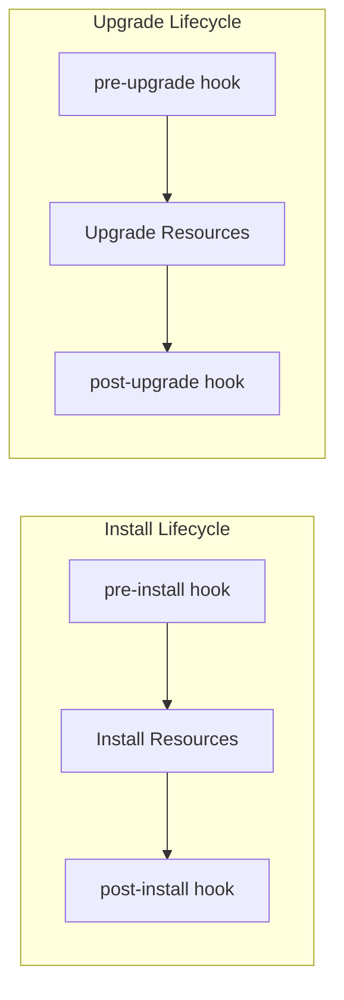

# How to Use Helm Hooks for Pre/Post Install and Upgrade Jobs

Author: [nawazdhandala](https://www.github.com/nawazdhandala)

Tags: Helm, Kubernetes, DevOps, Hooks, Automation

Description: Learn to use Helm hooks for database migrations, backup jobs, health checks, and other lifecycle operations with practical examples.

> Helm hooks let you run operations at specific points in a release lifecycle- before installing, after upgrading, or before deleting. They're essential for database migrations, cache warming, and validation jobs.

## Understanding Helm Hooks

Hooks are Kubernetes resources with special annotations that tell Helm when to deploy them. They run as Jobs (or other resources) at defined lifecycle points.



## Hook Annotations Reference

Define hooks using annotations on your Kubernetes resources.

| Annotation | Values | Description |
| --- | --- | --- |
| `helm.sh/hook` | See hook types below | When the hook runs |
| `helm.sh/hook-weight` | Integer (e.g., "-5", "0", "10") | Execution order (lower runs first) |
| `helm.sh/hook-delete-policy` | `before-hook-creation`, `hook-succeeded`, `hook-failed` | When to delete the hook resource |

### Hook Types

| Hook | When It Runs |
| --- | --- |
| `pre-install` | Before any release resources are installed |
| `post-install` | After all release resources are installed |
| `pre-delete` | Before any release resources are deleted |
| `post-delete` | After all release resources are deleted |
| `pre-upgrade` | Before any release resources are upgraded |
| `post-upgrade` | After all release resources are upgraded |
| `pre-rollback` | Before any release resources are rolled back |
| `post-rollback` | After all release resources are rolled back |
| `test` | When `helm test` is executed |

## Database Migration Hook

The most common use case: run database migrations before deploying new application code.

```yaml
# templates/db-migration-hook.yaml
apiVersion: batch/v1
kind: Job
metadata:
  name: {{ include "myapp.fullname" . }}-db-migrate
  labels:
    {{- include "myapp.labels" . | nindent 4 }}
  annotations:
    # Run before the upgrade starts
    "helm.sh/hook": pre-upgrade,pre-install
    # Run this hook first (before other hooks)
    "helm.sh/hook-weight": "-5"
    # Delete successful jobs to keep things clean
    "helm.sh/hook-delete-policy": before-hook-creation,hook-succeeded
spec:
  # Don't retry failed migrations - require human intervention
  backoffLimit: 0
  template:
    metadata:
      labels:
        {{- include "myapp.selectorLabels" . | nindent 8 }}
    spec:
      restartPolicy: Never
      containers:
        - name: migrate
          # Use the same image as the main app
          image: "{{ .Values.image.repository }}:{{ .Values.image.tag }}"
          # Run the migration command
          command: ["./manage.py", "migrate", "--no-input"]
          env:
            - name: DATABASE_URL
              valueFrom:
                secretKeyRef:
                  name: {{ include "myapp.fullname" . }}-db
                  key: url
          resources:
            requests:
              cpu: 100m
              memory: 256Mi
            limits:
              cpu: 500m
              memory: 512Mi
```

## Pre-Upgrade Backup Hook

Backup critical data before upgrades in case something goes wrong.

```yaml
# templates/backup-hook.yaml
apiVersion: batch/v1
kind: Job
metadata:
  name: {{ include "myapp.fullname" . }}-pre-upgrade-backup
  annotations:
    "helm.sh/hook": pre-upgrade
    # Run after migrations but before deployment
    "helm.sh/hook-weight": "0"
    "helm.sh/hook-delete-policy": before-hook-creation,hook-succeeded
spec:
  backoffLimit: 1
  template:
    spec:
      restartPolicy: Never
      containers:
        - name: backup
          image: postgres:15
          command:
            - /bin/sh
            - -c
            - |
              # Create timestamped backup
              TIMESTAMP=$(date +%Y%m%d_%H%M%S)
              pg_dump $DATABASE_URL > /backups/backup_$TIMESTAMP.sql
              
              # Upload to S3 (if configured)
              if [ -n "$S3_BUCKET" ]; then
                aws s3 cp /backups/backup_$TIMESTAMP.sql s3://$S3_BUCKET/backups/
              fi
              
              echo "Backup completed: backup_$TIMESTAMP.sql"
          env:
            - name: DATABASE_URL
              valueFrom:
                secretKeyRef:
                  name: {{ include "myapp.fullname" . }}-db
                  key: url
            - name: S3_BUCKET
              value: {{ .Values.backup.s3Bucket | quote }}
          volumeMounts:
            - name: backup-storage
              mountPath: /backups
      volumes:
        - name: backup-storage
          persistentVolumeClaim:
            claimName: {{ include "myapp.fullname" . }}-backups
```

## Post-Install Configuration Hook

Run configuration tasks after the main resources are deployed.

```yaml
# templates/post-install-config.yaml
apiVersion: batch/v1
kind: Job
metadata:
  name: {{ include "myapp.fullname" . }}-post-config
  annotations:
    "helm.sh/hook": post-install,post-upgrade
    "helm.sh/hook-weight": "5"
    "helm.sh/hook-delete-policy": before-hook-creation,hook-succeeded
spec:
  backoffLimit: 3
  template:
    spec:
      restartPolicy: OnFailure
      containers:
        - name: configure
          image: "{{ .Values.image.repository }}:{{ .Values.image.tag }}"
          command:
            - /bin/sh
            - -c
            - |
              # Wait for the main service to be ready
              echo "Waiting for service to be ready..."
              until curl -sf http://{{ include "myapp.fullname" . }}:{{ .Values.service.port }}/health; do
                sleep 2
              done
              
              # Run post-deployment configuration
              echo "Running post-deployment tasks..."
              ./scripts/seed-cache.sh
              ./scripts/warm-indexes.sh
              ./scripts/notify-deployment.sh
              
              echo "Post-deployment configuration complete"
```

## Health Check Hook

Validate the deployment before considering it successful.

```yaml
# templates/health-check-hook.yaml
apiVersion: batch/v1
kind: Job
metadata:
  name: {{ include "myapp.fullname" . }}-health-check
  annotations:
    "helm.sh/hook": post-install,post-upgrade
    # Run after config but with high weight to be last
    "helm.sh/hook-weight": "10"
    "helm.sh/hook-delete-policy": before-hook-creation,hook-succeeded
spec:
  backoffLimit: 3
  activeDeadlineSeconds: 300  # Timeout after 5 minutes
  template:
    spec:
      restartPolicy: OnFailure
      containers:
        - name: health-check
          image: curlimages/curl:latest
          command:
            - /bin/sh
            - -c
            - |
              # Run comprehensive health checks
              echo "Running deployment health checks..."
              
              # Check API health endpoint
              if ! curl -sf http://{{ include "myapp.fullname" . }}:{{ .Values.service.port }}/health; then
                echo "FAILED: Health endpoint not responding"
                exit 1
              fi
              
              # Check database connectivity
              if ! curl -sf http://{{ include "myapp.fullname" . }}:{{ .Values.service.port }}/health/db; then
                echo "FAILED: Database health check failed"
                exit 1
              fi
              
              # Check critical dependency
              if ! curl -sf http://{{ include "myapp.fullname" . }}:{{ .Values.service.port }}/health/redis; then
                echo "FAILED: Redis health check failed"
                exit 1
              fi
              
              echo "All health checks passed!"
```

## Pre-Delete Cleanup Hook

Clean up external resources before deleting the release.

```yaml
# templates/pre-delete-cleanup.yaml
apiVersion: batch/v1
kind: Job
metadata:
  name: {{ include "myapp.fullname" . }}-cleanup
  annotations:
    "helm.sh/hook": pre-delete
    "helm.sh/hook-weight": "0"
    # Keep failed jobs for debugging
    "helm.sh/hook-delete-policy": hook-succeeded
spec:
  backoffLimit: 1
  template:
    spec:
      restartPolicy: Never
      containers:
        - name: cleanup
          image: amazon/aws-cli:latest
          command:
            - /bin/sh
            - -c
            - |
              echo "Cleaning up external resources..."
              
              # Remove DNS records
              aws route53 change-resource-record-sets \
                --hosted-zone-id {{ .Values.dns.hostedZoneId }} \
                --change-batch '{"Changes":[{"Action":"DELETE","ResourceRecordSet":{"Name":"{{ .Values.ingress.host }}","Type":"A"}}]}'
              
              # Clean up S3 artifacts
              aws s3 rm s3://{{ .Values.storage.bucket }}/{{ .Release.Name }}/ --recursive
              
              # Notify monitoring to remove dashboards
              curl -X DELETE "{{ .Values.monitoring.apiUrl }}/dashboards/{{ .Release.Name }}"
              
              echo "Cleanup complete"
```

## Hook Weights for Execution Order

Use hook weights to control the order when multiple hooks run at the same lifecycle point.

```yaml
# templates/hooks/01-backup.yaml
apiVersion: batch/v1
kind: Job
metadata:
  name: {{ include "myapp.fullname" . }}-backup
  annotations:
    "helm.sh/hook": pre-upgrade
    "helm.sh/hook-weight": "-10"  # Runs first
# ...

# templates/hooks/02-maintenance-mode.yaml
apiVersion: batch/v1
kind: Job
metadata:
  name: {{ include "myapp.fullname" . }}-maintenance-on
  annotations:
    "helm.sh/hook": pre-upgrade
    "helm.sh/hook-weight": "-5"  # Runs second
# ...

# templates/hooks/03-migrate.yaml
apiVersion: batch/v1
kind: Job
metadata:
  name: {{ include "myapp.fullname" . }}-migrate
  annotations:
    "helm.sh/hook": pre-upgrade
    "helm.sh/hook-weight": "0"  # Runs third
# ...
```

The execution order for pre-upgrade hooks:
1. backup (weight: -10)
2. maintenance-on (weight: -5)
3. migrate (weight: 0)

## Hook Delete Policies

Control when hook resources are cleaned up.

```yaml
# Delete before creating a new hook (prevents "already exists" errors)
"helm.sh/hook-delete-policy": before-hook-creation

# Delete only if the hook succeeded (keep failed for debugging)
"helm.sh/hook-delete-policy": hook-succeeded

# Delete only if the hook failed (keep successful for auditing)
"helm.sh/hook-delete-policy": hook-failed

# Combine policies (most common pattern)
"helm.sh/hook-delete-policy": before-hook-creation,hook-succeeded
```

## Testing Hooks with helm test

The `test` hook type runs when you execute `helm test`.

```yaml
# templates/tests/test-connection.yaml
apiVersion: v1
kind: Pod
metadata:
  name: {{ include "myapp.fullname" . }}-test-connection
  annotations:
    "helm.sh/hook": test
spec:
  restartPolicy: Never
  containers:
    - name: test
      image: busybox
      command: ['wget']
      args: ['{{ include "myapp.fullname" . }}:{{ .Values.service.port }}']
```

Run tests after deployment:

```bash
# Run all test hooks
helm test my-release -n production

# Run tests with timeout
helm test my-release -n production --timeout 5m

# Show test logs
helm test my-release -n production --logs
```

## Common Hook Patterns

### Pattern 1: Skip Hooks During Development

Make hooks conditional for faster development iteration.

```yaml
{{- if .Values.hooks.enabled }}
apiVersion: batch/v1
kind: Job
metadata:
  name: {{ include "myapp.fullname" . }}-migrate
  annotations:
    "helm.sh/hook": pre-upgrade
# ... rest of hook
{{- end }}
```

Values configuration:

```yaml
# values-dev.yaml (skip hooks for speed)
hooks:
  enabled: false

# values-prod.yaml (always run hooks)
hooks:
  enabled: true
```

### Pattern 2: Timeout and Retry Configuration

Configure robust hook behavior with timeouts and retries.

```yaml
apiVersion: batch/v1
kind: Job
metadata:
  name: {{ include "myapp.fullname" . }}-hook
  annotations:
    "helm.sh/hook": pre-upgrade
spec:
  # Retry up to 3 times
  backoffLimit: {{ .Values.hooks.backoffLimit | default 3 }}
  # Total timeout for all attempts
  activeDeadlineSeconds: {{ .Values.hooks.timeoutSeconds | default 600 }}
  template:
    spec:
      restartPolicy: OnFailure
      # ...
```

### Pattern 3: Shared Hook Configuration

Use a helper template for common hook settings.

```yaml
# templates/_hooks.tpl
{{- define "myapp.hookLabels" -}}
app.kubernetes.io/managed-by: Helm
app.kubernetes.io/instance: {{ .Release.Name }}
app.kubernetes.io/component: hook
{{- end -}}

{{- define "myapp.hookPodSpec" -}}
restartPolicy: Never
serviceAccountName: {{ include "myapp.serviceAccountName" . }}
securityContext:
  runAsNonRoot: true
  runAsUser: 1000
{{- end -}}
```

## Troubleshooting Hooks

### Hook Stuck in Running State

```bash
# Find hook jobs
kubectl get jobs -n production -l app.kubernetes.io/managed-by=Helm

# Check hook pod logs
kubectl logs job/myapp-migrate -n production

# If stuck, delete the job manually
kubectl delete job myapp-migrate -n production

# Then retry the upgrade
helm upgrade myapp ./my-chart -f values.yaml
```

### Hook Fails but Release Continues

By default, failed hooks stop the release. If they're not stopping:

```bash
# Check if hook has correct annotations
kubectl get job myapp-migrate -n production -o yaml | grep helm.sh/hook

# Ensure backoffLimit isn't set too high
# Helm waits for the job to fail completely before stopping
```

### Skipping Hooks

For emergency situations, skip hooks entirely:

```bash
# Skip all hooks during upgrade
helm upgrade myapp ./my-chart -f values.yaml --no-hooks

# Skip hooks during uninstall
helm uninstall myapp -n production --no-hooks
```

## Hook Best Practices

| Practice | Why |
| --- | --- |
| Use `before-hook-creation` delete policy | Prevents "already exists" errors |
| Set `activeDeadlineSeconds` | Prevents indefinitely running hooks |
| Use idempotent operations | Safe to retry on failure |
| Log verbosely | Easier debugging when things fail |
| Test hooks in staging first | Catch issues before production |
| Keep hooks fast | Slow hooks delay deployments |
| Use separate images for hooks | Don't bloat main app image |

## Wrap-up

Helm hooks extend your deployment capabilities beyond simple resource management. Use pre-install hooks for database migrations, pre-upgrade hooks for backups, and post-install hooks for validation. Control execution order with weights, and configure delete policies to balance debugging needs with cleanup. With well-designed hooks, your deployments become fully automated, reliable pipelines that handle all the operational tasks that used to require manual intervention.
