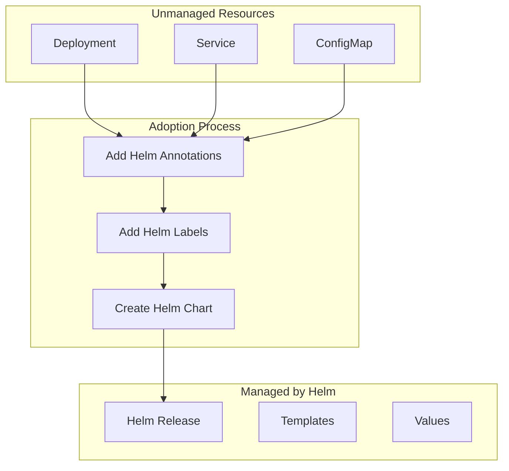

# How to Import Existing Kubernetes Resources into Helm

Author: [nawazdhandala](https://www.github.com/nawazdhandala)

Tags: Helm, Kubernetes, DevOps, Migration, Resource Adoption, GitOps

Description: Guide to adopting unmanaged Kubernetes resources into Helm releases using annotation-based adoption and resource import strategies.

> Adopting existing Kubernetes resources into Helm management enables unified release management. This guide covers annotation-based adoption, using helm adopt plugin, and strategies for migrating unmanaged resources to Helm.

## Resource Adoption Overview



## Prerequisites

### Check Existing Resources

```bash
# List resources without Helm management
kubectl get all -l '!app.kubernetes.io/managed-by'

# Check specific resource labels
kubectl get deployment myapp -o jsonpath='{.metadata.labels}'

# Check annotations
kubectl get deployment myapp -o jsonpath='{.metadata.annotations}'
```

### Identify Resources to Adopt

```bash
# List all resources in namespace
kubectl get all -n production

# Export resources to YAML
kubectl get deployment,service,configmap,secret,ingress \
  -n production \
  -o yaml > existing-resources.yaml
```

## Manual Annotation-Based Adoption

### Add Required Annotations

```bash
# Add Helm release name annotation
kubectl annotate deployment myapp \
  meta.helm.sh/release-name=myapp \
  --overwrite

# Add Helm release namespace annotation
kubectl annotate deployment myapp \
  meta.helm.sh/release-namespace=production \
  --overwrite

# Add managed-by label
kubectl label deployment myapp \
  app.kubernetes.io/managed-by=Helm \
  --overwrite
```

### Adopt All Resources at Once

```bash
#!/bin/bash
# adopt-resources.sh

RELEASE_NAME="myapp"
NAMESPACE="production"
RESOURCES=("deployment/myapp" "service/myapp" "configmap/myapp-config" "ingress/myapp")

for resource in "${RESOURCES[@]}"; do
  echo "Adopting $resource..."
  
  # Add annotations
  kubectl annotate "$resource" -n "$NAMESPACE" \
    meta.helm.sh/release-name="$RELEASE_NAME" \
    meta.helm.sh/release-namespace="$NAMESPACE" \
    --overwrite
    
  # Add labels
  kubectl label "$resource" -n "$NAMESPACE" \
    app.kubernetes.io/managed-by=Helm \
    --overwrite
done

echo "Resources adopted successfully"
```

### Verify Adoption

```bash
# Check annotations
kubectl get deployment myapp -o yaml | grep -A5 "annotations:"

# Expected output:
# annotations:
#   meta.helm.sh/release-name: myapp
#   meta.helm.sh/release-namespace: production
```

## Using helm-adopt Plugin

### Install Plugin

```bash
# Install helm-adopt plugin
helm plugin install https://github.com/HamzaZo/helm-adopt

# Verify installation
helm adopt --help
```

### Adopt Resources

```bash
# Adopt single resource
helm adopt deployment myapp --release myapp --namespace production

# Adopt multiple resources
helm adopt deployment,service,configmap myapp --release myapp --namespace production

# Adopt with dry-run
helm adopt deployment myapp --release myapp --namespace production --dry-run
```

## Creating Chart for Existing Resources

### Export and Convert

```bash
# Export existing resource
kubectl get deployment myapp -o yaml > deployment.yaml

# Remove cluster-specific fields
yq eval 'del(.metadata.uid, .metadata.resourceVersion, .metadata.creationTimestamp, .metadata.generation, .status)' deployment.yaml > clean-deployment.yaml
```

### Create Matching Chart

```yaml
# Chart.yaml
apiVersion: v2
name: myapp
description: Adopted myapp chart
version: 1.0.0
appVersion: "1.0.0"
```

```yaml
# values.yaml
replicaCount: 3

image:
  repository: myorg/myapp
  tag: "v1.0.0"
  pullPolicy: IfNotPresent

service:
  type: ClusterIP
  port: 80

resources:
  limits:
    cpu: 500m
    memory: 512Mi
  requests:
    cpu: 100m
    memory: 128Mi
```

### Template Matching Existing Resource

```yaml
# templates/deployment.yaml
apiVersion: apps/v1
kind: Deployment
metadata:
  name: {{ include "myapp.fullname" . }}
  labels:
    {{- include "myapp.labels" . | nindent 4 }}
  annotations:
    meta.helm.sh/release-name: {{ .Release.Name }}
    meta.helm.sh/release-namespace: {{ .Release.Namespace }}
spec:
  replicas: {{ .Values.replicaCount }}
  selector:
    matchLabels:
      {{- include "myapp.selectorLabels" . | nindent 6 }}
  template:
    metadata:
      labels:
        {{- include "myapp.selectorLabels" . | nindent 8 }}
    spec:
      containers:
        - name: {{ .Chart.Name }}
          image: "{{ .Values.image.repository }}:{{ .Values.image.tag }}"
          imagePullPolicy: {{ .Values.image.pullPolicy }}
          ports:
            - containerPort: 8080
          resources:
            {{- toYaml .Values.resources | nindent 12 }}
```

## Perform the Adoption

### Method 1: Helm Upgrade with Existing Release

```bash
# If release already exists but resources were created manually
helm upgrade myapp ./myapp \
  --namespace production \
  --set image.tag=v1.0.0 \
  --force
```

### Method 2: Create Release Without Installing

```bash
# First, ensure resources have correct annotations
kubectl annotate deployment myapp \
  meta.helm.sh/release-name=myapp \
  meta.helm.sh/release-namespace=production

# Create Helm release secret manually
helm template myapp ./myapp \
  --namespace production \
  --set image.tag=v1.0.0 > /dev/null  # Validate template

# Install with adoption
helm upgrade --install myapp ./myapp \
  --namespace production \
  --set image.tag=v1.0.0
```

### Method 3: Import and Upgrade

```bash
# Render chart to see what will be deployed
helm template myapp ./myapp --namespace production > rendered.yaml

# Compare with existing resources
kubectl diff -f rendered.yaml

# If minimal differences, proceed with upgrade
helm upgrade --install myapp ./myapp --namespace production
```

## Handling Resource Conflicts

### Resource Already Exists Error

```bash
# Error: "resource already exists and is not managed by Helm"

# Solution 1: Add annotations first
kubectl annotate deployment myapp \
  meta.helm.sh/release-name=myapp \
  meta.helm.sh/release-namespace=production
kubectl label deployment myapp \
  app.kubernetes.io/managed-by=Helm

# Solution 2: Use --force flag
helm upgrade --install myapp ./myapp --force

# Solution 3: Use --adopt flag (if available)
helm upgrade --install myapp ./myapp --adopt
```

### Label Selector Conflicts

```bash
# Error: Selector cannot be updated

# Solution: Recreate resource through Helm
kubectl delete deployment myapp
helm upgrade --install myapp ./myapp
```

## Batch Adoption Script

### Comprehensive Adoption Script

```bash
#!/bin/bash
# batch-adopt.sh

set -e

RELEASE_NAME="myapp"
NAMESPACE="production"
CHART_PATH="./myapp"

echo "Starting batch adoption for release: $RELEASE_NAME"

# Function to adopt a resource
adopt_resource() {
    local resource_type=$1
    local resource_name=$2
    
    echo "Adopting $resource_type/$resource_name..."
    
    # Check if resource exists
    if ! kubectl get "$resource_type" "$resource_name" -n "$NAMESPACE" &>/dev/null; then
        echo "  Resource not found, skipping"
        return 0
    fi
    
    # Add annotations
    kubectl annotate "$resource_type" "$resource_name" -n "$NAMESPACE" \
        meta.helm.sh/release-name="$RELEASE_NAME" \
        meta.helm.sh/release-namespace="$NAMESPACE" \
        --overwrite
    
    # Add labels
    kubectl label "$resource_type" "$resource_name" -n "$NAMESPACE" \
        app.kubernetes.io/managed-by=Helm \
        app.kubernetes.io/instance="$RELEASE_NAME" \
        --overwrite
    
    echo "  Adopted successfully"
}

# Adopt resources
adopt_resource deployment myapp
adopt_resource service myapp
adopt_resource configmap myapp-config
adopt_resource secret myapp-secrets
adopt_resource ingress myapp
adopt_resource horizontalpodautoscaler myapp
adopt_resource poddisruptionbudget myapp

echo ""
echo "Verifying adoption..."
helm list -n "$NAMESPACE" --filter "$RELEASE_NAME"

echo ""
echo "Running Helm upgrade to sync state..."
helm upgrade --install "$RELEASE_NAME" "$CHART_PATH" \
    --namespace "$NAMESPACE" \
    --reuse-values \
    --wait

echo ""
echo "Adoption complete!"
```

## Post-Adoption Verification

### Verify Helm Management

```bash
# Check release status
helm status myapp -n production

# List managed resources
helm get manifest myapp -n production | kubectl get -f -

# Verify annotations on resources
kubectl get deployment myapp -n production \
  -o jsonpath='{.metadata.annotations.meta\.helm\.sh/release-name}'
```

### Test Upgrade

```bash
# Perform test upgrade
helm upgrade myapp ./myapp \
  --namespace production \
  --set image.tag=v1.0.1 \
  --dry-run

# Actual upgrade
helm upgrade myapp ./myapp \
  --namespace production \
  --set image.tag=v1.0.1

# Verify upgrade
helm history myapp -n production
```

## CI/CD Integration

### GitHub Actions Adoption Workflow

```yaml
# .github/workflows/adopt-resources.yaml
name: Adopt Kubernetes Resources

on:
  workflow_dispatch:
    inputs:
      release_name:
        description: 'Helm release name'
        required: true
      namespace:
        description: 'Kubernetes namespace'
        required: true

jobs:
  adopt:
    runs-on: ubuntu-latest
    steps:
      - uses: actions/checkout@v4
      
      - name: Setup kubectl
        uses: azure/setup-kubectl@v3
        
      - name: Configure Kubernetes
        uses: azure/k8s-set-context@v3
        with:
          kubeconfig: ${{ secrets.KUBECONFIG }}
          
      - name: Setup Helm
        uses: azure/setup-helm@v3
        
      - name: Adopt Resources
        run: |
          ./scripts/batch-adopt.sh \
            "${{ github.event.inputs.release_name }}" \
            "${{ github.event.inputs.namespace }}"
            
      - name: Verify Adoption
        run: |
          helm status ${{ github.event.inputs.release_name }} \
            -n ${{ github.event.inputs.namespace }}
```

## Best Practices

| Practice | Description |
|----------|-------------|
| Backup First | Export resources before adoption |
| Dry Run | Test with --dry-run flag |
| Incremental | Adopt resources one at a time |
| Verify | Check annotations after adoption |
| Test | Perform test upgrade after adoption |
| Document | Record adoption process |

## Troubleshooting

```bash
# Resource not being tracked
kubectl get deployment myapp -o yaml | grep -E "(meta.helm.sh|app.kubernetes.io/managed-by)"

# Release secret missing
kubectl get secret -n production -l owner=helm,name=myapp

# Force re-adoption
kubectl annotate deployment myapp \
  meta.helm.sh/release-name=myapp \
  meta.helm.sh/release-namespace=production \
  --overwrite

# Check Helm release status
helm status myapp -n production --show-desc
```

## Wrap-up

Adopting existing Kubernetes resources into Helm provides unified management and enables GitOps workflows. Use annotation-based adoption for simple cases, or the helm-adopt plugin for batch operations. Always verify adoption by checking annotations and testing upgrades before moving to production.
