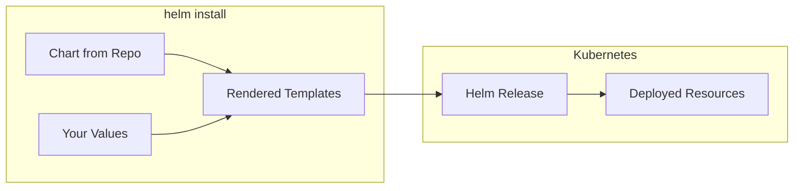

# How to Install Applications Using Helm Charts

Author: [nawazdhandala](https://www.github.com/nawazdhandala)

Tags: Helm, Kubernetes, DevOps, Charts, Deployment

Description: Learn how to install popular applications like nginx-ingress, cert-manager, and Prometheus using Helm charts with customization examples.

> Helm charts turn complex Kubernetes deployments into single commands. This guide shows you how to install real applications with sensible defaults and customizations.

## Understanding Helm Install

The `helm install` command deploys a chart to your cluster. It creates a **release**- a running instance of a chart with a specific configuration. You can have multiple releases of the same chart with different names and settings.



## Basic Installation Syntax

Every Helm installation follows this pattern:

```bash
# Basic syntax: helm install [RELEASE_NAME] [CHART] [FLAGS]
helm install my-release bitnami/nginx

# The release name must be unique within a namespace
# The chart can be: repo/chart, ./local-path, or oci://registry/chart
```

## Installing NGINX Ingress Controller

The NGINX Ingress Controller routes external traffic to your services. It's one of the most commonly deployed Helm charts.

```bash
# Add the ingress-nginx repository
helm repo add ingress-nginx https://kubernetes.github.io/ingress-nginx
helm repo update

# Install with default settings
helm install nginx-ingress ingress-nginx/ingress-nginx \
  --namespace ingress-nginx \
  --create-namespace

# Verify the installation
kubectl get pods -n ingress-nginx
kubectl get svc -n ingress-nginx
```

### Customize NGINX Ingress

Create a values file to customize the deployment. This configuration enables Prometheus metrics, sets resource limits, and configures the replica count.

```yaml
# nginx-values.yaml
controller:
  # Run multiple replicas for high availability
  replicaCount: 2
  
  # Enable Prometheus metrics scraping
  metrics:
    enabled: true
    serviceMonitor:
      enabled: true
  
  # Set resource limits for predictable performance
  resources:
    requests:
      cpu: 100m
      memory: 128Mi
    limits:
      cpu: 500m
      memory: 512Mi
  
  # Use LoadBalancer service type (or NodePort for bare metal without MetalLB)
  service:
    type: LoadBalancer
```

Apply the customized installation:

```bash
# Install with custom values
helm install nginx-ingress ingress-nginx/ingress-nginx \
  --namespace ingress-nginx \
  --create-namespace \
  -f nginx-values.yaml
```

## Installing cert-manager

cert-manager automates TLS certificate management. It integrates with Let's Encrypt for free, auto-renewing certificates.

```bash
# Add the Jetstack repository
helm repo add jetstack https://charts.jetstack.io
helm repo update

# cert-manager requires CRDs installed separately (or use installCRDs flag)
helm install cert-manager jetstack/cert-manager \
  --namespace cert-manager \
  --create-namespace \
  --version v1.14.0 \
  --set installCRDs=true

# Verify the installation
kubectl get pods -n cert-manager
```

### Configure Let's Encrypt Issuer

After installing cert-manager, create a ClusterIssuer for Let's Encrypt. This configuration sets up automatic certificate provisioning for any Ingress that requests it.

```yaml
# letsencrypt-issuer.yaml
apiVersion: cert-manager.io/v1
kind: ClusterIssuer
metadata:
  name: letsencrypt-prod
spec:
  acme:
    # Production Let's Encrypt server
    server: https://acme-v02.api.letsencrypt.org/directory
    email: your-email@example.com
    privateKeySecretRef:
      name: letsencrypt-prod-key
    solvers:
      - http01:
          ingress:
            class: nginx
```

Apply the issuer:

```bash
kubectl apply -f letsencrypt-issuer.yaml
```

## Installing Prometheus Stack

The kube-prometheus-stack chart deploys a complete monitoring solution: Prometheus, Grafana, Alertmanager, and exporters.

```bash
# Add the Prometheus community repository
helm repo add prometheus-community https://prometheus-community.github.io/helm-charts
helm repo update

# Install the full monitoring stack
helm install prometheus prometheus-community/kube-prometheus-stack \
  --namespace monitoring \
  --create-namespace \
  --set grafana.adminPassword=admin123

# Access Grafana (port-forward for testing)
kubectl port-forward svc/prometheus-grafana 3000:80 -n monitoring
```

### Customize Prometheus Stack

For production, configure persistent storage, retention, and alerting rules.

```yaml
# prometheus-values.yaml
prometheus:
  prometheusSpec:
    # Keep 15 days of metrics data
    retention: 15d
    
    # Use persistent storage for metrics
    storageSpec:
      volumeClaimTemplate:
        spec:
          accessModes: ["ReadWriteOnce"]
          resources:
            requests:
              storage: 50Gi

grafana:
  # Set admin credentials
  adminUser: admin
  adminPassword: your-secure-password
  
  # Enable persistent storage for dashboards
  persistence:
    enabled: true
    size: 10Gi

alertmanager:
  alertmanagerSpec:
    # Configure alert receivers
    storage:
      volumeClaimTemplate:
        spec:
          accessModes: ["ReadWriteOnce"]
          resources:
            requests:
              storage: 5Gi
```

Install with these customizations:

```bash
helm install prometheus prometheus-community/kube-prometheus-stack \
  --namespace monitoring \
  --create-namespace \
  -f prometheus-values.yaml
```

## Installing PostgreSQL

Deploy a PostgreSQL database with persistent storage and secure credentials.

```bash
# Add Bitnami repository (if not already added)
helm repo add bitnami https://charts.bitnami.com/bitnami
helm repo update

# Install PostgreSQL with persistence enabled
helm install my-postgresql bitnami/postgresql \
  --namespace databases \
  --create-namespace \
  --set auth.postgresPassword=secretpassword \
  --set auth.database=myapp \
  --set primary.persistence.size=20Gi
```

### Production PostgreSQL Configuration

For production workloads, use a values file with proper resource allocation and backup configuration.

```yaml
# postgresql-values.yaml
auth:
  # Use existing secret in production instead of plain values
  existingSecret: postgresql-credentials
  database: production_db

primary:
  # Resource allocation for the primary instance
  resources:
    requests:
      cpu: 500m
      memory: 512Mi
    limits:
      cpu: 2000m
      memory: 2Gi
  
  # Persistent storage configuration
  persistence:
    enabled: true
    size: 100Gi
    storageClass: "fast-ssd"
  
  # PostgreSQL configuration tuning
  configuration: |-
    max_connections = 200
    shared_buffers = 512MB
    effective_cache_size = 1536MB
    maintenance_work_mem = 128MB
    checkpoint_completion_target = 0.9
    wal_buffers = 16MB
    default_statistics_target = 100
    random_page_cost = 1.1
    effective_io_concurrency = 200

metrics:
  # Enable Prometheus metrics exporter
  enabled: true
  serviceMonitor:
    enabled: true
```

## Using --set for Quick Customizations

For simple overrides, use `--set` flags instead of values files.

```bash
# Override a single value
helm install my-app bitnami/nginx --set replicaCount=3

# Override nested values using dot notation
helm install my-app bitnami/nginx --set service.type=NodePort

# Override multiple values
helm install my-app bitnami/nginx \
  --set replicaCount=3 \
  --set service.type=NodePort \
  --set resources.requests.memory=256Mi

# Set array values
helm install my-app bitnami/nginx \
  --set 'ingress.hosts[0].name=example.com'
```

## Installation Options Reference

| Flag | Description | Example |
| --- | --- | --- |
| `--namespace` | Target namespace for the release | `--namespace production` |
| `--create-namespace` | Create namespace if it doesn't exist | `--create-namespace` |
| `-f, --values` | Specify values file(s) | `-f values.yaml` |
| `--set` | Override individual values | `--set key=value` |
| `--version` | Specify chart version | `--version 1.2.3` |
| `--dry-run` | Simulate install without deploying | `--dry-run` |
| `--debug` | Show rendered templates | `--debug` |
| `--wait` | Wait for resources to be ready | `--wait --timeout 5m` |
| `--atomic` | Rollback on failure | `--atomic` |

## Viewing Chart Values Before Installing

Always inspect available values before installing a chart. This shows what you can customize.

```bash
# Show all configurable values for a chart
helm show values bitnami/postgresql > postgresql-all-values.yaml

# Show chart metadata (description, version, dependencies)
helm show chart bitnami/postgresql

# Show the README with usage instructions
helm show readme bitnami/postgresql

# Show everything
helm show all bitnami/postgresql
```

## Dry Run and Debug

Test your installation before applying it to the cluster.

```bash
# Dry run shows what would be deployed without actually deploying
helm install my-release bitnami/nginx --dry-run

# Debug mode shows the rendered Kubernetes manifests
helm install my-release bitnami/nginx --dry-run --debug

# Combine with values file to validate your customizations
helm install my-release bitnami/nginx -f values.yaml --dry-run --debug
```

## Listing Installed Releases

After installation, manage your releases with these commands.

```bash
# List releases in current namespace
helm list

# List releases across all namespaces
helm list --all-namespaces

# List releases with all statuses (including failed)
helm list --all

# Get detailed info about a specific release
helm status my-release
```

## Common Installation Patterns

### Pattern 1: Production-Ready Defaults

Always use explicit versions and wait for readiness in production.

```bash
helm install my-app bitnami/nginx \
  --namespace production \
  --create-namespace \
  --version 15.4.0 \
  --wait \
  --timeout 10m \
  --atomic \
  -f production-values.yaml
```

### Pattern 2: Development Quick Deploy

For development, use defaults with minimal configuration.

```bash
helm install my-app bitnami/nginx \
  --namespace dev \
  --create-namespace \
  --set replicaCount=1 \
  --set resources.requests.memory=128Mi
```

### Pattern 3: GitOps-Friendly Installation

Store values in Git and apply with explicit versions.

```bash
# values tracked in git: ./helm/myapp/values-production.yaml
helm install myapp bitnami/nginx \
  --namespace production \
  --version 15.4.0 \
  -f ./helm/myapp/values-production.yaml
```

## Troubleshooting Installation Issues

| Issue | Cause | Solution |
| --- | --- | --- |
| `Error: INSTALLATION FAILED: cannot re-use a name` | Release name already exists | Use different name or uninstall existing |
| `Error: timed out waiting for the condition` | Pods not becoming ready | Check pod logs, increase timeout |
| Pods in CrashLoopBackOff | Application configuration issue | Check `kubectl logs` and values |
| PVC stuck in Pending | StorageClass not available | Check `kubectl get sc`, verify storage provisioner |
| ImagePullBackOff | Image not accessible | Verify image name, check registry credentials |

## Wrap-up

Installing applications with Helm is straightforward once you understand the pattern: add a repository, search for charts, customize with values, and install. Always use `--dry-run` to preview changes, specify versions for reproducibility, and use values files for anything beyond trivial customizations. With these fundamentals, you can deploy complex applications like monitoring stacks, databases, and ingress controllers with confidence.
