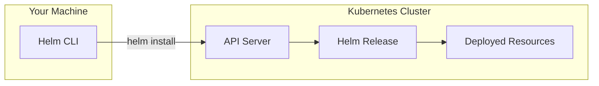

# How to Install Helm on macOS, Linux, and Windows

Author: [nawazdhandala](https://www.github.com/nawazdhandala)

Tags: Helm, Kubernetes, DevOps, Getting Started, Installation

Description: Step-by-step installation guide for Helm on all platforms, including verification steps and common troubleshooting tips for beginners.

> Helm is the package manager for Kubernetes. Before you can deploy charts and manage releases, you need Helm installed on your machine. This guide covers installation on every major platform.

## What is Helm?

Helm is the de facto package manager for Kubernetes. It simplifies deploying and managing applications by packaging Kubernetes manifests into **charts**- versioned, shareable bundles that can be customized via values files.



## Prerequisites

Before installing Helm, ensure you have:

| Requirement | Why |
| --- | --- |
| kubectl installed | Helm uses your kubeconfig to talk to clusters |
| Kubernetes cluster access | Either local (minikube, kind) or remote |
| Terminal / shell access | Needed for all installation methods |

## Installing Helm on macOS

### Method 1: Homebrew (Recommended)

Homebrew is the fastest way to install Helm on macOS. It handles versioning, updates, and dependencies automatically.

```bash
# Install Helm using Homebrew
brew install helm

# Verify the installation succeeded
helm version
```

### Method 2: MacPorts

If you prefer MacPorts over Homebrew, Helm is available in the ports collection.

```bash
# Install Helm via MacPorts
sudo port install helm-3

# Verify installation
helm version
```

### Method 3: Binary Download

For environments where package managers aren't available, download the binary directly.

```bash
# Download the latest Helm release for macOS (Intel or Apple Silicon auto-detected)
curl -fsSL -o get_helm.sh https://raw.githubusercontent.com/helm/helm/main/scripts/get-helm-3

# Make the installer script executable
chmod 700 get_helm.sh

# Run the installer
./get_helm.sh

# Verify installation
helm version
```

## Installing Helm on Linux

### Method 1: Package Manager (Debian/Ubuntu)

Debian-based distributions can use the official Helm apt repository for seamless updates.

```bash
# Install prerequisites for HTTPS repositories
sudo apt-get update
sudo apt-get install -y apt-transport-https gnupg

# Add the Helm GPG signing key
curl https://baltocdn.com/helm/signing.asc | gpg --dearmor | sudo tee /usr/share/keyrings/helm.gpg > /dev/null

# Add the Helm apt repository
echo "deb [arch=$(dpkg --print-architecture) signed-by=/usr/share/keyrings/helm.gpg] https://baltocdn.com/helm/stable/debian/ all main" | sudo tee /etc/apt/sources.list.d/helm-stable-debian.list

# Update package list and install Helm
sudo apt-get update
sudo apt-get install helm

# Verify installation
helm version
```

### Method 2: Package Manager (RHEL/CentOS/Fedora)

Red Hat-based distributions can use dnf or yum with the official repository.

```bash
# Add the Helm yum/dnf repository
sudo dnf install -y dnf-plugins-core
sudo dnf config-manager --add-repo https://baltocdn.com/helm/stable/rpm/

# Install Helm
sudo dnf install helm

# Verify installation
helm version
```

### Method 3: Snap

Snap provides a universal package format that works across most Linux distributions.

```bash
# Install Helm via Snap
sudo snap install helm --classic

# Verify installation
helm version
```

### Method 4: Binary Download Script

The official installer script works on any Linux distribution. It auto-detects your architecture and downloads the appropriate binary.

```bash
# Download the official Helm installer script
curl -fsSL -o get_helm.sh https://raw.githubusercontent.com/helm/helm/main/scripts/get-helm-3

# Make it executable
chmod 700 get_helm.sh

# Run the installer (installs to /usr/local/bin by default)
./get_helm.sh

# Verify installation
helm version
```

### Method 5: Manual Binary Installation

For complete control over the installation process, download and extract the binary manually.

```bash
# Download Helm for Linux AMD64 (adjust version as needed)
wget https://get.helm.sh/helm-v3.14.0-linux-amd64.tar.gz

# Extract the archive
tar -zxvf helm-v3.14.0-linux-amd64.tar.gz

# Move the binary to a location in your PATH
sudo mv linux-amd64/helm /usr/local/bin/helm

# Clean up
rm -rf linux-amd64 helm-v3.14.0-linux-amd64.tar.gz

# Verify installation
helm version
```

## Installing Helm on Windows

### Method 1: Chocolatey (Recommended)

Chocolatey is the most popular package manager for Windows and provides easy Helm installation.

```powershell
# Install Helm using Chocolatey (run as Administrator)
choco install kubernetes-helm

# Verify installation
helm version
```

### Method 2: Winget

Windows Package Manager (winget) is built into Windows 11 and available for Windows 10.

```powershell
# Install Helm using winget
winget install Helm.Helm

# Verify installation
helm version
```

### Method 3: Scoop

Scoop is a command-line installer for Windows that doesn't require admin privileges.

```powershell
# Install Helm using Scoop
scoop install helm

# Verify installation
helm version
```

### Method 4: Binary Download

For manual installation, download the Windows binary directly.

```powershell
# Download Helm for Windows (using PowerShell)
Invoke-WebRequest -Uri https://get.helm.sh/helm-v3.14.0-windows-amd64.zip -OutFile helm.zip

# Extract the archive
Expand-Archive -Path helm.zip -DestinationPath .

# Move helm.exe to a directory in your PATH (e.g., C:\Program Files\Helm)
New-Item -ItemType Directory -Force -Path "C:\Program Files\Helm"
Move-Item -Path .\windows-amd64\helm.exe -Destination "C:\Program Files\Helm\helm.exe"

# Add to PATH (run as Administrator)
[Environment]::SetEnvironmentVariable("Path", $env:Path + ";C:\Program Files\Helm", "Machine")

# Restart your terminal, then verify
helm version
```

## Verifying Your Installation

After installation on any platform, run these commands to confirm everything works:

```bash
# Check Helm version - shows client version info
helm version

# Expected output:
# version.BuildInfo{Version:"v3.14.0", GitCommit:"...", GitTreeState:"clean", GoVersion:"go1.21.5"}

# If you have a Kubernetes cluster configured, list releases
helm list --all-namespaces

# Show Helm environment information
helm env
```

## Post-Installation Setup

### Configure Shell Completion

Enable tab completion for faster command entry. This dramatically improves productivity when working with Helm.

**Bash:**

```bash
# Add to your ~/.bashrc
echo 'source <(helm completion bash)' >> ~/.bashrc
source ~/.bashrc
```

**Zsh:**

```bash
# Add to your ~/.zshrc
echo 'source <(helm completion zsh)' >> ~/.zshrc
source ~/.zshrc
```

**PowerShell:**

```powershell
# Add to your PowerShell profile
helm completion powershell | Out-String | Invoke-Expression
```

### Add Your First Repository

Helm repositories are where charts are hosted. Add the Bitnami repository to access hundreds of production-ready charts.

```bash
# Add the Bitnami repository (one of the largest public chart repos)
helm repo add bitnami https://charts.bitnami.com/bitnami

# Update your local repository cache
helm repo update

# Search for available charts
helm search repo bitnami
```

## Common Issues and Fixes

| Issue | Cause | Solution |
| --- | --- | --- |
| `helm: command not found` | Binary not in PATH | Add installation directory to PATH |
| `Error: Kubernetes cluster unreachable` | No kubeconfig or wrong context | Run `kubectl config current-context` to verify |
| `Error: could not find tiller` | Old Helm 2 documentation | Helm 3 doesn't use Tiller- ignore these references |
| Permission denied errors | Installation needs sudo | Use package manager or install to user directory |
| Version mismatch warnings | Old Helm with new cluster | Upgrade Helm to latest stable version |

## Upgrading Helm

Keep Helm updated to get security fixes and new features.

**macOS (Homebrew):**

```bash
brew upgrade helm
```

**Linux (apt):**

```bash
sudo apt-get update && sudo apt-get upgrade helm
```

**Windows (Chocolatey):**

```powershell
choco upgrade kubernetes-helm
```

## Next Steps

Now that Helm is installed, you're ready to:

- [Add and manage Helm repositories](https://oneuptime.com/blog/post/2026-01-17-helm-add-manage-repositories/view) for finding charts
- Install your first application using Helm charts
- Learn about values files for customizing deployments

## Wrap-up

Installing Helm is straightforward on any platform. Use your system's package manager for the smoothest experience- Homebrew on macOS, apt/dnf on Linux, or Chocolatey on Windows. Once installed, verify with `helm version` and set up shell completion to boost your productivity. With Helm ready, you can start deploying applications to Kubernetes with a single command.
