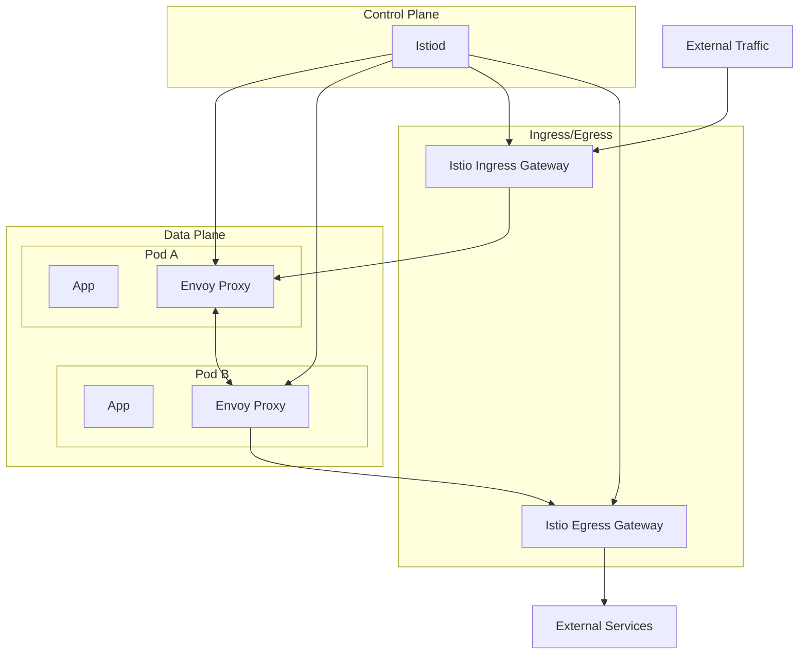

# Deploying Istio Service Mesh with Helm

Author: [nawazdhandala](https://www.github.com/nawazdhandala)

Tags: Helm, Kubernetes, DevOps, Istio, Service Mesh, Security, Observability

Description: Complete guide to deploying Istio service mesh on Kubernetes using Helm charts for traffic management, security, and observability.

> Istio provides a comprehensive service mesh solution for Kubernetes, offering traffic management, security, and observability features. This guide covers deploying Istio using Helm charts with production-ready configurations.

## Istio Architecture



## Prerequisites

```bash
# Verify Kubernetes cluster
kubectl cluster-info

# Check version compatibility
kubectl version --client

# Add Istio Helm repository
helm repo add istio https://istio-release.storage.googleapis.com/charts
helm repo update

# Search available versions
helm search repo istio --versions
```

## Installation Steps

### Step 1: Install Istio Base (CRDs)

```bash
# Create Istio system namespace
kubectl create namespace istio-system

# Install base chart (CRDs)
helm install istio-base istio/base \
  --namespace istio-system \
  --set defaultRevision=default
```

### Step 2: Install Istiod (Control Plane)

```yaml
# istiod-values.yaml
pilot:
  autoscaleEnabled: true
  autoscaleMin: 2
  autoscaleMax: 5
  
  resources:
    requests:
      cpu: 500m
      memory: 2048Mi
    limits:
      cpu: 2000m
      memory: 4096Mi
  
  # Enable access logging
  traceSampling: 100.0

global:
  # Mesh-wide settings
  proxy:
    resources:
      requests:
        cpu: 100m
        memory: 128Mi
      limits:
        cpu: 500m
        memory: 512Mi
    
    # Access log settings
    accessLogFile: /dev/stdout
    accessLogFormat: |
      [%START_TIME%] "%REQ(:METHOD)% %REQ(X-ENVOY-ORIGINAL-PATH?:PATH)% %PROTOCOL%"
      %RESPONSE_CODE% %RESPONSE_FLAGS% %BYTES_RECEIVED% %BYTES_SENT%
      %DURATION% "%REQ(X-FORWARDED-FOR)%" "%REQ(USER-AGENT)%"
      "%REQ(X-REQUEST-ID)%" "%REQ(:AUTHORITY)%" "%UPSTREAM_HOST%"
  
  # mTLS settings
  mtls:
    enabled: true
  
  # Tracing
  tracer:
    zipkin:
      address: zipkin.istio-system:9411

meshConfig:
  # Enable access logging
  accessLogFile: /dev/stdout
  
  # Default mTLS mode
  defaultConfig:
    proxyMetadata:
      ISTIO_META_DNS_CAPTURE: "true"
      ISTIO_META_DNS_AUTO_ALLOCATE: "true"
  
  # Enable auto mTLS
  enableAutoMtls: true
  
  # Outbound traffic policy
  outboundTrafficPolicy:
    mode: REGISTRY_ONLY
```

```bash
# Install Istiod
helm install istiod istio/istiod \
  --namespace istio-system \
  -f istiod-values.yaml \
  --wait
```

### Step 3: Install Ingress Gateway

```yaml
# ingress-gateway-values.yaml
service:
  type: LoadBalancer
  ports:
    - port: 15021
      targetPort: 15021
      name: status-port
    - port: 80
      targetPort: 8080
      name: http2
    - port: 443
      targetPort: 8443
      name: https

autoscaling:
  enabled: true
  minReplicas: 2
  maxReplicas: 5
  targetCPUUtilizationPercentage: 80

resources:
  requests:
    cpu: 100m
    memory: 128Mi
  limits:
    cpu: 500m
    memory: 512Mi

podDisruptionBudget:
  minAvailable: 1

affinity:
  podAntiAffinity:
    preferredDuringSchedulingIgnoredDuringExecution:
    - weight: 100
      podAffinityTerm:
        labelSelector:
          matchLabels:
            app: istio-ingressgateway
        topologyKey: kubernetes.io/hostname

# Service annotations for cloud providers
serviceAnnotations:
  # AWS NLB
  service.beta.kubernetes.io/aws-load-balancer-type: nlb
  # GCP
  # cloud.google.com/load-balancer-type: "External"
```

```bash
# Install Ingress Gateway
helm install istio-ingressgateway istio/gateway \
  --namespace istio-system \
  -f ingress-gateway-values.yaml
```

### Step 4: Install Egress Gateway (Optional)

```yaml
# egress-gateway-values.yaml
service:
  type: ClusterIP

autoscaling:
  enabled: true
  minReplicas: 2
  maxReplicas: 3

resources:
  requests:
    cpu: 100m
    memory: 128Mi
```

```bash
helm install istio-egressgateway istio/gateway \
  --namespace istio-system \
  -f egress-gateway-values.yaml \
  --set name=istio-egressgateway
```

## Verify Installation

```bash
# Check all Istio pods
kubectl get pods -n istio-system

# Check Istiod
kubectl get deployment istiod -n istio-system

# Check gateways
kubectl get svc -n istio-system

# Verify installation
istioctl verify-install
```

## Enable Sidecar Injection

### Namespace-Level Injection

```bash
# Label namespace for auto-injection
kubectl label namespace default istio-injection=enabled

# Verify label
kubectl get namespace -L istio-injection
```

### Deployment-Level Injection

```yaml
# deployment.yaml
apiVersion: apps/v1
kind: Deployment
metadata:
  name: my-app
spec:
  template:
    metadata:
      annotations:
        sidecar.istio.io/inject: "true"
```

## Configure Traffic Management

### Gateway

```yaml
# gateway.yaml
apiVersion: networking.istio.io/v1beta1
kind: Gateway
metadata:
  name: my-gateway
  namespace: default
spec:
  selector:
    istio: ingressgateway
  servers:
    - port:
        number: 80
        name: http
        protocol: HTTP
      hosts:
        - "app.example.com"
    - port:
        number: 443
        name: https
        protocol: HTTPS
      hosts:
        - "app.example.com"
      tls:
        mode: SIMPLE
        credentialName: app-tls-secret
```

### VirtualService

```yaml
# virtualservice.yaml
apiVersion: networking.istio.io/v1beta1
kind: VirtualService
metadata:
  name: my-app
  namespace: default
spec:
  hosts:
    - "app.example.com"
  gateways:
    - my-gateway
  http:
    - match:
        - uri:
            prefix: /api
      route:
        - destination:
            host: api-service
            port:
              number: 8080
    - match:
        - uri:
            prefix: /
      route:
        - destination:
            host: frontend-service
            port:
              number: 80
```

### Traffic Splitting (Canary)

```yaml
# virtualservice-canary.yaml
apiVersion: networking.istio.io/v1beta1
kind: VirtualService
metadata:
  name: my-app
spec:
  hosts:
    - my-app
  http:
    - route:
        - destination:
            host: my-app
            subset: v1
          weight: 90
        - destination:
            host: my-app
            subset: v2
          weight: 10

---
apiVersion: networking.istio.io/v1beta1
kind: DestinationRule
metadata:
  name: my-app
spec:
  host: my-app
  subsets:
    - name: v1
      labels:
        version: v1
    - name: v2
      labels:
        version: v2
```

### Circuit Breaker

```yaml
# destination-rule-circuit-breaker.yaml
apiVersion: networking.istio.io/v1beta1
kind: DestinationRule
metadata:
  name: my-app
spec:
  host: my-app
  trafficPolicy:
    connectionPool:
      tcp:
        maxConnections: 100
      http:
        h2UpgradePolicy: UPGRADE
        http1MaxPendingRequests: 100
        http2MaxRequests: 1000
    outlierDetection:
      consecutive5xxErrors: 5
      interval: 30s
      baseEjectionTime: 30s
      maxEjectionPercent: 50
```

## Security Configuration

### PeerAuthentication (mTLS)

```yaml
# peer-authentication.yaml
apiVersion: security.istio.io/v1beta1
kind: PeerAuthentication
metadata:
  name: default
  namespace: istio-system
spec:
  mtls:
    mode: STRICT
```

### AuthorizationPolicy

```yaml
# authorization-policy.yaml
apiVersion: security.istio.io/v1beta1
kind: AuthorizationPolicy
metadata:
  name: allow-frontend-to-api
  namespace: default
spec:
  selector:
    matchLabels:
      app: api-service
  action: ALLOW
  rules:
    - from:
        - source:
            principals:
              - cluster.local/ns/default/sa/frontend-service
      to:
        - operation:
            methods: ["GET", "POST"]
            paths: ["/api/*"]
```

### RequestAuthentication (JWT)

```yaml
# request-authentication.yaml
apiVersion: security.istio.io/v1beta1
kind: RequestAuthentication
metadata:
  name: jwt-auth
  namespace: default
spec:
  selector:
    matchLabels:
      app: api-service
  jwtRules:
    - issuer: "https://auth.example.com"
      jwksUri: "https://auth.example.com/.well-known/jwks.json"
      audiences:
        - "api.example.com"
```

## Observability

### Install Kiali Dashboard

```bash
# Install Kiali
kubectl apply -f https://raw.githubusercontent.com/istio/istio/release-1.20/samples/addons/kiali.yaml

# Access Kiali
kubectl port-forward svc/kiali -n istio-system 20001:20001
```

### Install Prometheus and Grafana

```bash
# Prometheus
kubectl apply -f https://raw.githubusercontent.com/istio/istio/release-1.20/samples/addons/prometheus.yaml

# Grafana
kubectl apply -f https://raw.githubusercontent.com/istio/istio/release-1.20/samples/addons/grafana.yaml

# Access Grafana
kubectl port-forward svc/grafana -n istio-system 3000:3000
```

### Install Jaeger (Tracing)

```bash
kubectl apply -f https://raw.githubusercontent.com/istio/istio/release-1.20/samples/addons/jaeger.yaml

# Access Jaeger
kubectl port-forward svc/tracing -n istio-system 16686:80
```

## Production Configuration

### Complete Production Values

```yaml
# istio-production-values.yaml
global:
  proxy:
    resources:
      requests:
        cpu: 100m
        memory: 128Mi
      limits:
        cpu: 1000m
        memory: 1Gi
    
    # Production logging
    accessLogFile: /dev/stdout
    
  # Enable proxy protocol
  proxy:
    protocolDetectionTimeout: 100ms

pilot:
  autoscaleEnabled: true
  autoscaleMin: 2
  autoscaleMax: 5
  
  resources:
    requests:
      cpu: 500m
      memory: 2Gi
    limits:
      cpu: 2000m
      memory: 4Gi
  
  # Horizontal pod autoscaler
  hpaSpec:
    minReplicas: 2
    maxReplicas: 5
    metrics:
      - type: Resource
        resource:
          name: cpu
          targetAverageUtilization: 80

meshConfig:
  accessLogFile: /dev/stdout
  
  defaultConfig:
    tracing:
      sampling: 10  # 10% sampling in production
    
    proxyStatsMatcher:
      inclusionPrefixes:
        - "cluster.outbound"
        - "listener"
        - "http.inbound"

  # Enable locality load balancing
  localityLbSetting:
    enabled: true
    failover:
      - from: us-east-1
        to: us-west-2
```

## Upgrade Istio

```bash
# Check current version
kubectl get pods -n istio-system -o jsonpath='{.items[*].spec.containers[*].image}' | tr ' ' '\n' | grep pilot

# Upgrade base
helm upgrade istio-base istio/base -n istio-system

# Upgrade Istiod
helm upgrade istiod istio/istiod -n istio-system -f istiod-values.yaml

# Upgrade gateways
helm upgrade istio-ingressgateway istio/gateway -n istio-system -f ingress-gateway-values.yaml
```

## Uninstall

```bash
# Uninstall gateways
helm uninstall istio-ingressgateway -n istio-system
helm uninstall istio-egressgateway -n istio-system

# Uninstall Istiod
helm uninstall istiod -n istio-system

# Uninstall base (CRDs)
helm uninstall istio-base -n istio-system

# Delete namespace
kubectl delete namespace istio-system
```

## Troubleshooting

```bash
# Check proxy status
istioctl proxy-status

# Analyze configuration
istioctl analyze

# Check proxy config
istioctl proxy-config routes deploy/my-app

# Debug sidecar injection
kubectl get mutatingwebhookconfiguration istio-sidecar-injector -o yaml
```

## Wrap-up

Istio provides powerful service mesh capabilities for Kubernetes. Deploy using Helm charts for easy management, configure traffic routing with VirtualServices and DestinationRules, enable mTLS for security, and set up observability with Kiali, Prometheus, and Jaeger. Use production-ready configurations with appropriate resource limits, autoscaling, and high availability settings.
