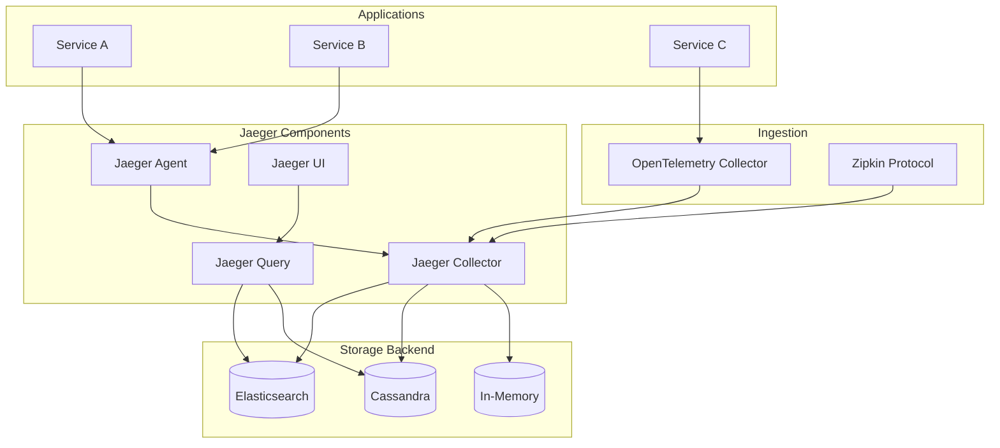

# Deploying Jaeger Distributed Tracing with Helm

Author: [nawazdhandala](https://www.github.com/nawazdhandala)

Tags: Helm, Kubernetes, DevOps, Jaeger, Tracing, Observability, OpenTelemetry

Description: Complete guide to deploying Jaeger distributed tracing platform on Kubernetes using Helm charts for end-to-end request tracking and performance analysis.

> Jaeger is an open-source distributed tracing system for monitoring and troubleshooting microservices-based architectures. This guide covers deploying Jaeger using Helm charts with various storage backends for production environments.

## Jaeger Architecture



## Prerequisites

```bash
# Add Jaeger Helm repository
helm repo add jaegertracing https://jaegertracing.github.io/helm-charts
helm repo update

# Search available versions
helm search repo jaegertracing --versions
```

## Deployment Strategies

| Strategy | Description | Use Case |
|----------|-------------|----------|
| All-in-One | Single pod deployment | Development/testing |
| Production | Separate collector, query, agent | Production workloads |
| Operator | CRD-based management | Enterprise deployments |

## Deploy Jaeger All-in-One (Development)

```yaml
# jaeger-allinone-values.yaml
provisionDataStore:
  cassandra: false
  elasticsearch: false
  kafka: false

allInOne:
  enabled: true
  
  image:
    repository: jaegertracing/all-in-one
    tag: 1.52
    
  resources:
    requests:
      cpu: 100m
      memory: 256Mi
    limits:
      cpu: 500m
      memory: 512Mi
      
  extraEnv:
    - name: COLLECTOR_OTLP_ENABLED
      value: "true"
    - name: SPAN_STORAGE_TYPE
      value: memory
    - name: MEMORY_MAX_TRACES
      value: "10000"

storage:
  type: memory

agent:
  enabled: false

collector:
  enabled: false

query:
  enabled: false

ingress:
  enabled: true
  annotations:
    kubernetes.io/ingress.class: nginx
  hosts:
    - jaeger.example.com
```

```bash
helm install jaeger jaegertracing/jaeger \
  --namespace jaeger \
  --create-namespace \
  -f jaeger-allinone-values.yaml
```

## Deploy Jaeger with Elasticsearch

### Install Elasticsearch First

```yaml
# elasticsearch-values.yaml
replicas: 3
minimumMasterNodes: 2

resources:
  requests:
    cpu: 1000m
    memory: 2Gi
  limits:
    cpu: 2000m
    memory: 4Gi

volumeClaimTemplate:
  accessModes: ["ReadWriteOnce"]
  resources:
    requests:
      storage: 100Gi
  storageClassName: fast-ssd

esConfig:
  elasticsearch.yml: |
    cluster.name: "jaeger-es"
    network.host: 0.0.0.0
    xpack.security.enabled: true
    xpack.security.transport.ssl.enabled: true
```

### Deploy Jaeger Production

```yaml
# jaeger-elasticsearch-values.yaml
provisionDataStore:
  cassandra: false
  elasticsearch: false
  kafka: false

storage:
  type: elasticsearch
  elasticsearch:
    host: elasticsearch-master
    port: 9200
    scheme: https
    user: elastic
    usePassword: true
    existingSecret: elasticsearch-master-credentials
    existingSecretKey: password
    
    # Index configuration
    indexPrefix: jaeger
    createIndexTemplates: true
    
    # Index settings
    numShards: 5
    numReplicas: 1
    
    # Index lifecycle
    useILM: true
    ilmPolicyName: jaeger-ilm
    
    # TLS
    tls:
      enabled: true
      secretName: elasticsearch-tls

collector:
  enabled: true
  replicaCount: 3
  
  image:
    repository: jaegertracing/jaeger-collector
    tag: 1.52
    
  resources:
    requests:
      cpu: 500m
      memory: 512Mi
    limits:
      cpu: 1000m
      memory: 1Gi
      
  autoscaling:
    enabled: true
    minReplicas: 3
    maxReplicas: 10
    targetCPUUtilizationPercentage: 70
    
  service:
    type: ClusterIP
    grpc:
      port: 14250
    http:
      port: 14268
    otlp:
      grpc:
        port: 4317
      http:
        port: 4318
    zipkin:
      port: 9411
      
  extraEnv:
    - name: COLLECTOR_OTLP_ENABLED
      value: "true"
    - name: SPAN_STORAGE_TYPE
      value: elasticsearch
    - name: ES_SERVER_URLS
      value: https://elasticsearch-master:9200
    - name: ES_TLS_ENABLED
      value: "true"

query:
  enabled: true
  replicaCount: 2
  
  image:
    repository: jaegertracing/jaeger-query
    tag: 1.52
    
  resources:
    requests:
      cpu: 200m
      memory: 256Mi
    limits:
      cpu: 500m
      memory: 512Mi
      
  service:
    type: ClusterIP
    port: 16686
    
  extraEnv:
    - name: SPAN_STORAGE_TYPE
      value: elasticsearch
    - name: ES_SERVER_URLS
      value: https://elasticsearch-master:9200

agent:
  enabled: true
  
  image:
    repository: jaegertracing/jaeger-agent
    tag: 1.52
    
  # Deploy as DaemonSet
  daemonset:
    enabled: true
    
  resources:
    requests:
      cpu: 50m
      memory: 64Mi
    limits:
      cpu: 100m
      memory: 128Mi

ingress:
  enabled: true
  annotations:
    kubernetes.io/ingress.class: nginx
    cert-manager.io/cluster-issuer: letsencrypt-prod
  hosts:
    - jaeger.example.com
  tls:
    - secretName: jaeger-tls
      hosts:
        - jaeger.example.com
```

```bash
helm install jaeger jaegertracing/jaeger \
  --namespace jaeger \
  --create-namespace \
  -f jaeger-elasticsearch-values.yaml
```

## Deploy Jaeger with Cassandra

```yaml
# jaeger-cassandra-values.yaml
provisionDataStore:
  cassandra: true
  elasticsearch: false
  kafka: false

storage:
  type: cassandra
  cassandra:
    host: cassandra
    port: 9042
    keyspace: jaeger_v1_dc1
    
    # Authentication
    user: cassandra
    usePassword: true
    existingSecret: cassandra-password
    
    # Replication
    datacenters: dc1
    replicationFactor: 3
    
    # Connection pool
    connectionPerHost: 5

cassandra:
  persistence:
    enabled: true
    size: 100Gi
    storageClass: fast-ssd
    
  resources:
    requests:
      cpu: 2000m
      memory: 8Gi
    limits:
      cpu: 4000m
      memory: 16Gi
      
  cluster:
    replicaCount: 3
    datacenters:
      - name: dc1
        size: 3

collector:
  enabled: true
  replicaCount: 3

query:
  enabled: true
  replicaCount: 2
```

## Deploy Jaeger with Kafka

### For High-Volume Ingestion

```yaml
# jaeger-kafka-values.yaml
provisionDataStore:
  cassandra: false
  elasticsearch: false
  kafka: false

storage:
  type: elasticsearch
  elasticsearch:
    host: elasticsearch-master
    port: 9200

# Kafka for buffering
kafka:
  brokers:
    - kafka-0.kafka.kafka.svc:9092
    - kafka-1.kafka.kafka.svc:9092
    - kafka-2.kafka.kafka.svc:9092
  topic: jaeger-spans
  authentication: none

collector:
  enabled: true
  replicaCount: 3
  
  extraEnv:
    - name: SPAN_STORAGE_TYPE
      value: kafka
    - name: KAFKA_PRODUCER_BROKERS
      value: kafka-0.kafka.kafka.svc:9092,kafka-1.kafka.kafka.svc:9092,kafka-2.kafka.kafka.svc:9092
    - name: KAFKA_PRODUCER_TOPIC
      value: jaeger-spans

# Ingester reads from Kafka and writes to storage
ingester:
  enabled: true
  replicaCount: 3
  
  image:
    repository: jaegertracing/jaeger-ingester
    tag: 1.52
    
  resources:
    requests:
      cpu: 500m
      memory: 512Mi
    limits:
      cpu: 1000m
      memory: 1Gi
      
  extraEnv:
    - name: SPAN_STORAGE_TYPE
      value: elasticsearch
    - name: KAFKA_CONSUMER_BROKERS
      value: kafka-0.kafka.kafka.svc:9092,kafka-1.kafka.kafka.svc:9092,kafka-2.kafka.kafka.svc:9092
    - name: KAFKA_CONSUMER_TOPIC
      value: jaeger-spans
    - name: KAFKA_CONSUMER_GROUP
      value: jaeger-ingester
```

## Jaeger Operator

### Install Operator

```bash
# Install cert-manager first (required)
kubectl apply -f https://github.com/cert-manager/cert-manager/releases/download/v1.13.0/cert-manager.yaml

# Install Jaeger Operator
kubectl create namespace observability
kubectl apply -n observability -f https://github.com/jaegertracing/jaeger-operator/releases/download/v1.52.0/jaeger-operator.yaml
```

### Jaeger CR (Custom Resource)

```yaml
# jaeger-production.yaml
apiVersion: jaegertracing.io/v1
kind: Jaeger
metadata:
  name: jaeger-production
  namespace: observability
spec:
  strategy: production
  
  collector:
    replicas: 3
    maxReplicas: 10
    
    resources:
      requests:
        cpu: 500m
        memory: 512Mi
      limits:
        cpu: 1000m
        memory: 1Gi
        
    options:
      collector:
        num-workers: 100
        queue-size: 10000
        
  query:
    replicas: 2
    
    resources:
      requests:
        cpu: 200m
        memory: 256Mi
      limits:
        cpu: 500m
        memory: 512Mi
        
    options:
      query:
        base-path: /jaeger
        
  storage:
    type: elasticsearch
    
    options:
      es:
        server-urls: https://elasticsearch-master:9200
        index-prefix: jaeger
        num-shards: 5
        num-replicas: 1
        
    esIndexCleaner:
      enabled: true
      numberOfDays: 7
      schedule: "55 23 * * *"
      
    secretName: es-secret
    
  ingress:
    enabled: true
    annotations:
      kubernetes.io/ingress.class: nginx
      
  agent:
    strategy: DaemonSet
```

## OpenTelemetry Integration

### Configure OTel Collector to Send to Jaeger

```yaml
# otel-collector-config.yaml
apiVersion: v1
kind: ConfigMap
metadata:
  name: otel-collector-config
data:
  config.yaml: |
    receivers:
      otlp:
        protocols:
          grpc:
            endpoint: 0.0.0.0:4317
          http:
            endpoint: 0.0.0.0:4318
            
    processors:
      batch:
        timeout: 1s
        send_batch_size: 1024
        
      memory_limiter:
        check_interval: 1s
        limit_mib: 1000
        spike_limit_mib: 200
        
    exporters:
      jaeger:
        endpoint: jaeger-collector.jaeger:14250
        tls:
          insecure: true
          
    service:
      pipelines:
        traces:
          receivers: [otlp]
          processors: [memory_limiter, batch]
          exporters: [jaeger]
```

## Sampling Configuration

### Adaptive Sampling

```yaml
# sampling-config.yaml
apiVersion: v1
kind: ConfigMap
metadata:
  name: jaeger-sampling
data:
  sampling.json: |
    {
      "service_strategies": [
        {
          "service": "api-service",
          "type": "probabilistic",
          "param": 0.5
        },
        {
          "service": "critical-service",
          "type": "probabilistic",
          "param": 1.0
        }
      ],
      "default_strategy": {
        "type": "probabilistic",
        "param": 0.1
      }
    }
```

### Rate Limiting Sampling

```yaml
# rate-limiting-sampling.yaml
sampling.json: |
  {
    "service_strategies": [
      {
        "service": "high-volume-service",
        "type": "ratelimiting",
        "param": 100
      }
    ],
    "default_strategy": {
      "type": "ratelimiting",
      "param": 50
    }
  }
```

## Application Instrumentation

### Python with OpenTelemetry

```python
# app.py
from opentelemetry import trace
from opentelemetry.exporter.jaeger.thrift import JaegerExporter
from opentelemetry.sdk.trace import TracerProvider
from opentelemetry.sdk.trace.export import BatchSpanProcessor
from opentelemetry.sdk.resources import Resource

# Configure tracer
resource = Resource.create({"service.name": "my-python-service"})
trace.set_tracer_provider(TracerProvider(resource=resource))

# Configure Jaeger exporter
jaeger_exporter = JaegerExporter(
    agent_host_name="jaeger-agent",
    agent_port=6831,
)

trace.get_tracer_provider().add_span_processor(
    BatchSpanProcessor(jaeger_exporter)
)

tracer = trace.get_tracer(__name__)

# Use tracer
with tracer.start_as_current_span("my-operation") as span:
    span.set_attribute("key", "value")
    # Your code here
```

### Go with Jaeger Client

```go
// main.go
package main

import (
    "github.com/uber/jaeger-client-go"
    jaegercfg "github.com/uber/jaeger-client-go/config"
)

func initTracer(service string) (opentracing.Tracer, io.Closer, error) {
    cfg := jaegercfg.Configuration{
        ServiceName: service,
        Sampler: &jaegercfg.SamplerConfig{
            Type:  jaeger.SamplerTypeConst,
            Param: 1,
        },
        Reporter: &jaegercfg.ReporterConfig{
            LogSpans:           true,
            LocalAgentHostPort: "jaeger-agent:6831",
        },
    }
    
    tracer, closer, err := cfg.NewTracer()
    if err != nil {
        return nil, nil, err
    }
    
    opentracing.SetGlobalTracer(tracer)
    return tracer, closer, nil
}
```

### Node.js with Jaeger

```javascript
// tracing.js
const { NodeTracerProvider } = require('@opentelemetry/sdk-trace-node');
const { JaegerExporter } = require('@opentelemetry/exporter-jaeger');
const { BatchSpanProcessor } = require('@opentelemetry/sdk-trace-base');
const { Resource } = require('@opentelemetry/resources');
const { SemanticResourceAttributes } = require('@opentelemetry/semantic-conventions');

const provider = new NodeTracerProvider({
  resource: new Resource({
    [SemanticResourceAttributes.SERVICE_NAME]: 'my-node-service',
  }),
});

const exporter = new JaegerExporter({
  endpoint: 'http://jaeger-collector:14268/api/traces',
});

provider.addSpanProcessor(new BatchSpanProcessor(exporter));
provider.register();

const tracer = provider.getTracer('my-node-service');

// Use tracer
const span = tracer.startSpan('my-operation');
// Your code here
span.end();
```

## Index Lifecycle Management

### Elasticsearch ILM Policy

```yaml
# jaeger-ilm-policy.yaml
apiVersion: v1
kind: ConfigMap
metadata:
  name: jaeger-ilm-policy
data:
  policy.json: |
    {
      "policy": {
        "phases": {
          "hot": {
            "min_age": "0ms",
            "actions": {
              "rollover": {
                "max_age": "1d",
                "max_size": "50gb"
              },
              "set_priority": {
                "priority": 100
              }
            }
          },
          "warm": {
            "min_age": "2d",
            "actions": {
              "forcemerge": {
                "max_num_segments": 1
              },
              "shrink": {
                "number_of_shards": 1
              },
              "set_priority": {
                "priority": 50
              }
            }
          },
          "cold": {
            "min_age": "7d",
            "actions": {
              "set_priority": {
                "priority": 0
              }
            }
          },
          "delete": {
            "min_age": "30d",
            "actions": {
              "delete": {}
            }
          }
        }
      }
    }
```

## Monitoring Jaeger

### ServiceMonitor

```yaml
# jaeger-servicemonitor.yaml
apiVersion: monitoring.coreos.com/v1
kind: ServiceMonitor
metadata:
  name: jaeger
  namespace: monitoring
spec:
  selector:
    matchLabels:
      app.kubernetes.io/name: jaeger
  namespaceSelector:
    matchNames:
      - jaeger
  endpoints:
    - port: admin-http
      path: /metrics
      interval: 30s
```

### Prometheus Alerts

```yaml
# jaeger-prometheus-rules.yaml
apiVersion: monitoring.coreos.com/v1
kind: PrometheusRule
metadata:
  name: jaeger-alerts
spec:
  groups:
    - name: jaeger
      rules:
        - alert: JaegerCollectorQueueFull
          expr: |
            jaeger_collector_queue_length / jaeger_collector_queue_capacity > 0.9
          for: 5m
          labels:
            severity: warning
          annotations:
            summary: "Jaeger collector queue is filling up"
            
        - alert: JaegerCollectorDroppedSpans
          expr: |
            increase(jaeger_collector_spans_dropped_total[5m]) > 0
          for: 1m
          labels:
            severity: critical
          annotations:
            summary: "Jaeger is dropping spans"
            
        - alert: JaegerStorageFailures
          expr: |
            increase(jaeger_collector_save_latency_count{result="err"}[5m]) > 0
          for: 5m
          labels:
            severity: critical
          annotations:
            summary: "Jaeger storage write failures"
```

## Troubleshooting

```bash
# Check Jaeger pods
kubectl get pods -n jaeger

# Check collector logs
kubectl logs -n jaeger -l app.kubernetes.io/component=collector

# Check query logs
kubectl logs -n jaeger -l app.kubernetes.io/component=query

# Access Jaeger UI
kubectl port-forward -n jaeger svc/jaeger-query 16686:16686

# Check collector health
kubectl exec -n jaeger deploy/jaeger-collector -- wget -qO- http://localhost:14269/

# Check agent health
kubectl exec -n jaeger ds/jaeger-agent -- wget -qO- http://localhost:14271/

# Verify spans are being received
kubectl exec -n jaeger deploy/jaeger-collector -- wget -qO- http://localhost:14269/metrics | grep jaeger_collector_spans_received

# Check Elasticsearch indices
kubectl exec -n elasticsearch elasticsearch-master-0 -- curl -s http://localhost:9200/_cat/indices?v | grep jaeger
```

## Wrap-up

Jaeger provides comprehensive distributed tracing for microservices architectures. Choose the appropriate storage backend based on your scale and retention requirements - Elasticsearch for production workloads, Cassandra for massive scale, or Kafka for high-volume ingestion. Configure proper sampling strategies to balance observability with storage costs, and integrate with OpenTelemetry for vendor-neutral instrumentation.
