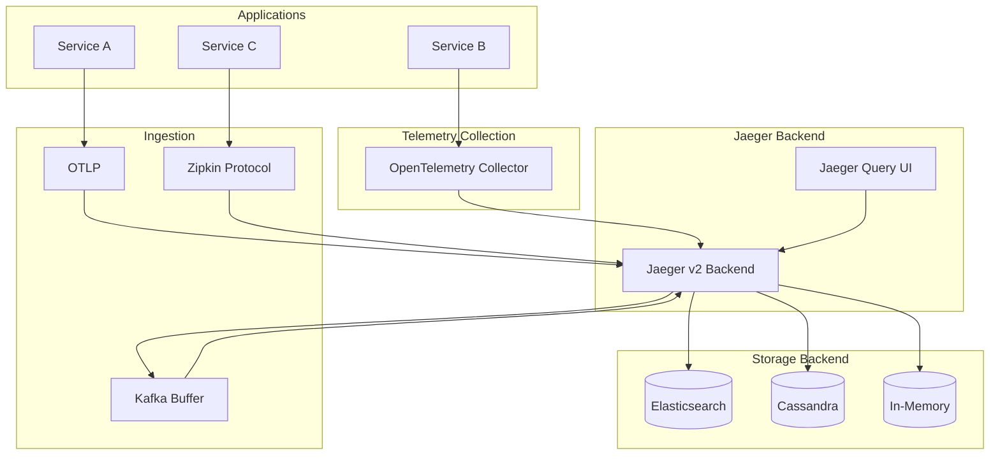

# Deploying Jaeger Distributed Tracing with Helm

Author: [nawazdhandala](https://www.github.com/nawazdhandala)

Tags: Helm, Kubernetes, DevOps, Jaeger, Tracing, Observability, OpenTelemetry

Description: Complete guide to deploying Jaeger distributed tracing platform on Kubernetes using Helm charts for end-to-end request tracking and performance analysis.

> Jaeger is an open-source distributed tracing system for monitoring and troubleshooting microservices-based architectures. This guide covers deploying Jaeger using Helm charts with various storage backends for production environments.

## Jaeger Architecture


```mermaid
flowchart TB
  subgraph "Applications"
    app1[Service A]
    app2[Service B]
    app3[Service C]
  end
  
  subgraph "Telemetry Collection"
    otel[OpenTelemetry Collector]
  end
  
  subgraph "Jaeger Backend"
    jaeger[Jaeger v2 Backend]
    query[Jaeger Query UI]
  end
  
  subgraph "Storage Backend"
    es[(Elasticsearch)]
    cassandra[(Cassandra)]
    memory[(In-Memory)]
  end
  
  subgraph "Ingestion"
    otlp[OTLP]
    zipkin[Zipkin Protocol]
    kafka[Kafka Buffer]
  end
  
  app1 --> otlp
  app2 --> otel
  app3 --> zipkin
  
  otlp --> jaeger
  otel --> jaeger
  zipkin --> jaeger
  jaeger --> kafka
  kafka --> jaeger
  
  jaeger --> es
  jaeger --> cassandra
  jaeger --> memory
  query --> jaeger
```

## Prerequisites

```bash
# Add Jaeger Helm repository

helm repo add jaegertracing https://jaegertracing.github.io/helm-charts
helm repo update

# Search available versions
helm search repo jaegertracing --versions
```

## Deployment Strategies

| Strategy | Description | Use Case |
|----------|-------------|----------|
| All-in-One | Single Jaeger v2 deployment with memory storage | Development/testing |
| External Storage | Jaeger v2 deployment with Elasticsearch or Cassandra | Production workloads |
| Operator | OpenTelemetry Operator-managed collectors and instrumentation | Enterprise deployments |

## Deploy Jaeger All-in-One (Development)

```yaml
# jaeger-allinone-values.yaml
tag: "2.19.0"

jaeger:
  enabled: true
  replicas: 1
  
  image:
    repository: jaegertracing/jaeger
    
  resources:
    requests:
      cpu: 100m
      memory: 256Mi
    limits:
      cpu: 500m
      memory: 512Mi
      
  ingress:
    enabled: true
    ingressClassName: nginx
    hosts:
      - jaeger.example.com

userconfig:
  service:
    extensions: [jaeger_storage, jaeger_query, healthcheckv2]
    pipelines:
      traces:
        receivers: [otlp, zipkin]
        processors: [batch]
        exporters: [jaeger_storage_exporter]
    telemetry:
      metrics:
        level: detailed
        readers:
          - pull:
              exporter:
                prometheus:
                  host: 0.0.0.0
                  port: 8888
  extensions:
    healthcheckv2:
      use_v2: true
      http:
        endpoint: 0.0.0.0:13133
    jaeger_query:
      storage:
        traces: memory_store
    jaeger_storage:
      backends:
        memory_store:
          memory:
            max_traces: 10000
  receivers:
    otlp:
      protocols:
        grpc:
          endpoint: 0.0.0.0:4317
        http:
          endpoint: 0.0.0.0:4318
    zipkin:
      endpoint: 0.0.0.0:9411
  processors:
    batch:
  exporters:
    jaeger_storage_exporter:
      trace_storage: memory_store
```

```bash
helm install jaeger jaegertracing/jaeger \
  --namespace jaeger \
  --create-namespace \
  -f jaeger-allinone-values.yaml
```

## Deploy Jaeger with Elasticsearch

### Install Elasticsearch First

```yaml
# elasticsearch-values.yaml
replicas: 3
minimumMasterNodes: 2

resources:
  requests:
    cpu: 1000m
    memory: 2Gi
  limits:
    cpu: 2000m
    memory: 4Gi

volumeClaimTemplate:
  accessModes: ["ReadWriteOnce"]
  resources:
    requests:
      storage: 100Gi
  storageClassName: fast-ssd

esConfig:
  elasticsearch.yml: |
    cluster.name: "jaeger-es"
    network.host: 0.0.0.0
    xpack.security.enabled: true
    xpack.security.http.ssl.enabled: true
    xpack.security.transport.ssl.enabled: true
```

### Deploy Jaeger Production

```yaml
# jaeger-elasticsearch-values.yaml
tag: "2.19.0"

jaeger:
  enabled: true
  replicas: 3
  
  image:
    repository: jaegertracing/jaeger
    
  resources:
    requests:
      cpu: 500m
      memory: 512Mi
    limits:
      cpu: 1000m
      memory: 1Gi
      
  ingress:
    enabled: true
    ingressClassName: nginx
    annotations:
      cert-manager.io/cluster-issuer: letsencrypt-prod
    hosts:
      - jaeger.example.com
    tls:
      - secretName: jaeger-tls
        hosts:
          - jaeger.example.com

storage:
  type: elasticsearch
  elasticsearch:
    url: https://elasticsearch-master:9200
    tls:
      enabled: true
      secretName: elasticsearch-tls

esIndexCleaner:
  enabled: true
  numberOfDays: 7
  schedule: "55 23 * * *"

userconfig:
  service:
    extensions: [jaeger_storage, jaeger_query, healthcheckv2]
    pipelines:
      traces:
        receivers: [otlp, jaeger, zipkin]
        processors: [batch]
        exporters: [jaeger_storage_exporter]
    telemetry:
      resource:
        service.name: jaeger
      metrics:
        level: detailed
        readers:
          - pull:
              exporter:
                prometheus:
                  host: 0.0.0.0
                  port: 8888
  extensions:
    healthcheckv2:
      use_v2: true
      http:
        endpoint: 0.0.0.0:13133
    jaeger_query:
      storage:
        traces: primary_store
        traces_archive: archive_store
    jaeger_storage:
      backends:
        primary_store:
          elasticsearch:
            server_urls:
              - https://elasticsearch-master:9200
            auth:
              basic:
                username: elastic
                password: "${env:ES_PASSWORD}"
            indices:
              index_prefix: jaeger
              spans:
                date_layout: "2006-01-02"
                rollover_frequency: day
                shards: 5
                replicas: 1
              services:
                date_layout: "2006-01-02"
                rollover_frequency: day
                shards: 5
                replicas: 1
        archive_store:
          elasticsearch:
            server_urls:
              - https://elasticsearch-master:9200
            auth:
              basic:
                username: elastic
                password: "${env:ES_PASSWORD}"
            indices:
              index_prefix: jaeger-archive
  receivers:
    otlp:
      protocols:
        grpc:
          endpoint: 0.0.0.0:4317
        http:
          endpoint: 0.0.0.0:4318
    jaeger:
      protocols:
        grpc:
        thrift_binary:
        thrift_compact:
        thrift_http:
    zipkin:
      endpoint: 0.0.0.0:9411
  processors:
    batch:
  exporters:
    jaeger_storage_exporter:
      trace_storage: primary_store
```

```bash
kubectl create secret generic elasticsearch-credentials \
  --namespace jaeger \
  --from-literal=ES_PASSWORD='change-me'

helm install jaeger jaegertracing/jaeger \
  --namespace jaeger \
  --create-namespace \
  -f jaeger-elasticsearch-values.yaml \
  --set jaeger.extraEnv[0].name=ES_PASSWORD \
  --set jaeger.extraEnv[0].valueFrom.secretKeyRef.name=elasticsearch-credentials \
  --set jaeger.extraEnv[0].valueFrom.secretKeyRef.key=ES_PASSWORD
```

## Deploy Jaeger with Cassandra

```yaml
# jaeger-cassandra-values.yaml
tag: "2.19.0"

jaeger:
  enabled: true
  replicas: 3
  
  resources:
    requests:
      cpu: 500m
      memory: 512Mi
    limits:
      cpu: 1000m
      memory: 1Gi

storage:
  type: cassandra
  cassandra:
    host: cassandra
    port: 9042
    keyspace: jaeger_v1_dc1
    user: cassandra
    usePassword: true
    existingSecret: cassandra-password

userconfig:
  service:
    extensions: [jaeger_storage, jaeger_query, remote_sampling, healthcheckv2]
    pipelines:
      traces:
        receivers: [otlp, jaeger]
        processors: [batch, adaptive_sampling]
        exporters: [jaeger_storage_exporter]
  extensions:
    healthcheckv2:
      use_v2: true
      http:
        endpoint: 0.0.0.0:13133
    jaeger_query:
      storage:
        traces: primary_store
        traces_archive: archive_store
    jaeger_storage:
      backends:
        primary_store:
          cassandra:
            schema:
              keyspace: jaeger_v1_dc1
              create: true
            connection:
              servers: ["cassandra:9042"]
              auth:
                basic:
                  username: cassandra
                  password: "${env:CASSANDRA_PASSWORD}"
        archive_store:
          cassandra:
            schema:
              keyspace: jaeger_v1_dc1_archive
              create: true
            connection:
              servers: ["cassandra:9042"]
              auth:
                basic:
                  username: cassandra
                  password: "${env:CASSANDRA_PASSWORD}"
    remote_sampling:
      adaptive:
        sampling_store: primary_store
        initial_sampling_probability: 0.1
        target_samples_per_second: 1.0
      http:
      grpc:
  receivers:
    otlp:
      protocols:
        grpc:
        http:
    jaeger:
      protocols:
        grpc:
        thrift_binary:
        thrift_compact:
        thrift_http:
  processors:
    batch:
    adaptive_sampling:
  exporters:
    jaeger_storage_exporter:
      trace_storage: primary_store
```

## Deploy Jaeger with Kafka

### For High-Volume Ingestion

```yaml
# jaeger-kafka-values.yaml
tag: "2.19.0"

jaeger:
  enabled: true
  replicas: 3
  
  extraEnv:
    - name: KAFKA_BROKER
      value: kafka-0.kafka.kafka.svc:9092
    - name: KAFKA_TOPIC
      value: jaeger-spans

userconfig:
  service:
    extensions: [jaeger_storage, jaeger_query, healthcheckv2]
    pipelines:
      traces/ingest:
        receivers: [otlp, jaeger]
        processors: [batch]
        exporters: [kafka]
      traces/store:
        receivers: [kafka]
        processors: [batch]
        exporters: [jaeger_storage_exporter]
  extensions:
    healthcheckv2:
      use_v2: true
      http:
        endpoint: 0.0.0.0:13133
    jaeger_query:
      storage:
        traces: primary_store
    jaeger_storage:
      backends:
        primary_store:
          elasticsearch:
            server_urls:
              - http://elasticsearch-master:9200
  receivers:
    otlp:
      protocols:
        grpc:
        http:
    jaeger:
      protocols:
        grpc:
        thrift_binary:
        thrift_compact:
        thrift_http:
    kafka:
      brokers:
        - ${env:KAFKA_BROKER}
      topic: ${env:KAFKA_TOPIC}
      encoding: otlp_proto
  processors:
    batch:
  exporters:
    kafka:
      brokers:
        - ${env:KAFKA_BROKER}
      topic: ${env:KAFKA_TOPIC}
      encoding: otlp_proto
    jaeger_storage_exporter:
      trace_storage: primary_store
```

## Kubernetes Operator

### Install Operator

```bash
# Install the OpenTelemetry Operator
helm repo add open-telemetry https://open-telemetry.github.io/opentelemetry-helm-charts
helm repo update

helm install opentelemetry-operator open-telemetry/opentelemetry-operator \
  --namespace observability \
  --create-namespace \
  --set "manager.collectorImage.repository=otel/opentelemetry-collector-k8s" \
  --set admissionWebhooks.certManager.enabled=false \
  --set admissionWebhooks.autoGenerateCert.enabled=true
```

### OpenTelemetry Collector CR

```yaml
# otel-collector.yaml
apiVersion: opentelemetry.io/v1beta1
kind: OpenTelemetryCollector
metadata:
  name: otel-gateway
  namespace: observability
spec:
  mode: deployment
  replicas: 3
  
  resources:
    requests:
      cpu: 500m
      memory: 512Mi
    limits:
      cpu: 1000m
      memory: 1Gi
      
  config:
    receivers:
      otlp:
        protocols:
          grpc:
            endpoint: 0.0.0.0:4317
          http:
            endpoint: 0.0.0.0:4318
            
    processors:
      batch:
        timeout: 1s
        send_batch_size: 1024
        
      memory_limiter:
        check_interval: 1s
        limit_mib: 1000
        spike_limit_mib: 200
        
    exporters:
      otlp/jaeger:
        endpoint: jaeger.jaeger.svc.cluster.local:4317
        tls:
          insecure: true
          
    service:
      pipelines:
        traces:
          receivers: [otlp]
          processors: [memory_limiter, batch]
          exporters: [otlp/jaeger]
```

## OpenTelemetry Integration

### Configure OTel Collector to Send to Jaeger

```yaml
# otel-collector-config.yaml
apiVersion: v1
kind: ConfigMap
metadata:
  name: otel-collector-config
data:
  config.yaml: |
    receivers:
      otlp:
        protocols:
          grpc:
            endpoint: 0.0.0.0:4317
          http:
            endpoint: 0.0.0.0:4318
            
    processors:
      batch:
        timeout: 1s
        send_batch_size: 1024
        
      memory_limiter:
        check_interval: 1s
        limit_mib: 1000
        spike_limit_mib: 200
        
    exporters:
      otlp/jaeger:
        endpoint: jaeger.jaeger.svc.cluster.local:4317
        tls:
          insecure: true
          
    service:
      pipelines:
        traces:
          receivers: [otlp]
          processors: [memory_limiter, batch]
          exporters: [otlp/jaeger]
```

## Sampling Configuration

### Adaptive Sampling

```yaml
# sampling-config.yaml
apiVersion: v1
kind: ConfigMap
metadata:
  name: jaeger-sampling
data:
  sampling-strategies.json: |
    {
      "service_strategies": [
        {
          "service": "api-service",
          "type": "probabilistic",
          "param": 0.5
        },
        {
          "service": "critical-service",
          "type": "probabilistic",
          "param": 1.0
        }
      ],
      "default_strategy": {
        "type": "probabilistic",
        "param": 0.1
      }
    }
```

### Rate Limiting Sampling

```yaml
# rate-limiting-sampling.yaml
apiVersion: v1
kind: ConfigMap
metadata:
  name: jaeger-rate-limiting-sampling
data:
  sampling-strategies.json: |
    {
      "service_strategies": [
        {
          "service": "high-volume-service",
          "type": "ratelimiting",
          "param": 100
        }
      ],
      "default_strategy": {
        "type": "ratelimiting",
        "param": 50
      }
    }
```

## Application Instrumentation

### Python with OpenTelemetry

```python
# app.py
from opentelemetry import trace
from opentelemetry.exporter.otlp.proto.grpc.trace_exporter import OTLPSpanExporter
from opentelemetry.sdk.resources import Resource
from opentelemetry.sdk.trace import TracerProvider
from opentelemetry.sdk.trace.export import BatchSpanProcessor

# Configure tracer
resource = Resource.create({"service.name": "my-python-service"})
provider = TracerProvider(resource=resource)
trace.set_tracer_provider(provider)

# Configure OTLP exporter
otlp_exporter = OTLPSpanExporter(
    endpoint="jaeger.jaeger.svc.cluster.local:4317",
    insecure=True,
)

provider.add_span_processor(BatchSpanProcessor(otlp_exporter))

tracer = trace.get_tracer(__name__)

# Use tracer
with tracer.start_as_current_span("my-operation") as span:
    span.set_attribute("key", "value")
    # Your code here
```

### Go with OpenTelemetry

```go
// main.go
package main

import (
    "context"

    "go.opentelemetry.io/otel"
    "go.opentelemetry.io/otel/exporters/otlp/otlptrace/otlptracegrpc"
    "go.opentelemetry.io/otel/sdk/resource"
    sdktrace "go.opentelemetry.io/otel/sdk/trace"
    semconv "go.opentelemetry.io/otel/semconv/v1.37.0"
    "google.golang.org/grpc/credentials/insecure"
)

func initTracer(ctx context.Context, service string) (*sdktrace.TracerProvider, error) {
    exporter, err := otlptracegrpc.New(
        ctx,
        otlptracegrpc.WithEndpoint("jaeger.jaeger.svc.cluster.local:4317"),
        otlptracegrpc.WithTLSCredentials(insecure.NewCredentials()),
    )
    if err != nil {
        return nil, err
    }

    provider := sdktrace.NewTracerProvider(
        sdktrace.WithBatcher(exporter),
        sdktrace.WithResource(resource.NewWithAttributes(
            semconv.SchemaURL,
            semconv.ServiceName(service),
        )),
    )

    otel.SetTracerProvider(provider)
    return provider, nil
}
```

### Node.js with OpenTelemetry

```javascript
// tracing.js
const { trace } = require('@opentelemetry/api');
const { OTLPTraceExporter } = require('@opentelemetry/exporter-trace-otlp-grpc');
const { resourceFromAttributes } = require('@opentelemetry/resources');
const { NodeTracerProvider } = require('@opentelemetry/sdk-trace-node');
const { BatchSpanProcessor } = require('@opentelemetry/sdk-trace-base');
const { ATTR_SERVICE_NAME } = require('@opentelemetry/semantic-conventions');

const provider = new NodeTracerProvider({
  resource: resourceFromAttributes({
    [ATTR_SERVICE_NAME]: 'my-node-service',
  }),
  spanProcessors: [
    new BatchSpanProcessor(
      new OTLPTraceExporter({
        url: 'http://jaeger.jaeger.svc.cluster.local:4317',
      })
    ),
  ],
});

provider.register();

const tracer = trace.getTracer('my-node-service');

// Use tracer
const span = tracer.startSpan('my-operation');
// Your code here
span.end();
```

## Index Lifecycle Management

### Elasticsearch ILM Policy

```yaml
# jaeger-ilm-policy.yaml
apiVersion: v1
kind: ConfigMap
metadata:
  name: jaeger-ilm-policy
data:
  policy.json: |
    {
      "policy": {
        "phases": {
          "hot": {
            "min_age": "0ms",
            "actions": {
              "rollover": {
                "max_age": "1d",
                "max_size": "50gb"
              },
              "set_priority": {
                "priority": 100
              }
            }
          },
          "warm": {
            "min_age": "2d",
            "actions": {
              "forcemerge": {
                "max_num_segments": 1
              },
              "shrink": {
                "number_of_shards": 1
              },
              "set_priority": {
                "priority": 50
              }
            }
          },
          "cold": {
            "min_age": "7d",
            "actions": {
              "set_priority": {
                "priority": 0
              }
            }
          },
          "delete": {
            "min_age": "30d",
            "actions": {
              "delete": {}
            }
          }
        }
      }
    }
```

## Monitoring Jaeger

### ServiceMonitor

```yaml
# jaeger-servicemonitor.yaml
apiVersion: monitoring.coreos.com/v1
kind: ServiceMonitor
metadata:
  name: jaeger
  namespace: monitoring
spec:
  selector:
    matchLabels:
      app.kubernetes.io/name: jaeger
  namespaceSelector:
    matchNames:
      - jaeger
  endpoints:
    - port: internal-metrics
      path: /metrics
      interval: 30s
```

### Prometheus Alerts

```yaml
# jaeger-prometheus-rules.yaml
apiVersion: monitoring.coreos.com/v1
kind: PrometheusRule
metadata:
  name: jaeger-alerts
spec:
  groups:
    - name: jaeger
      rules:
        - alert: JaegerPipelineQueueHigh
          expr: |
            otelcol_exporter_queue_size / otelcol_exporter_queue_capacity > 0.9
          for: 5m
          labels:
            severity: warning
          annotations:
            summary: "Jaeger exporter queue is filling up"
            
        - alert: JaegerExporterFailures
          expr: |
            increase(otelcol_exporter_send_failed_spans[5m]) > 0
          for: 1m
          labels:
            severity: critical
          annotations:
            summary: "Jaeger is failing to export spans"
            
        - alert: JaegerReceiverRefusedSpans
          expr: |
            increase(otelcol_receiver_refused_spans[5m]) > 0
          for: 5m
          labels:
            severity: critical
          annotations:
            summary: "Jaeger is refusing incoming spans"
```

## Troubleshooting

```bash
# Check Jaeger pods
kubectl get pods -n jaeger

# Check Jaeger logs
kubectl logs -n jaeger -l app.kubernetes.io/name=jaeger

# Access Jaeger UI
kubectl port-forward -n jaeger svc/jaeger 16686:16686

# Check Jaeger health
kubectl exec -n jaeger deploy/jaeger -- wget -qO- http://localhost:13133/status

# Verify spans are being received
kubectl exec -n jaeger deploy/jaeger -- wget -qO- http://localhost:8888/metrics | grep otelcol_receiver_accepted_spans

# Check Elasticsearch indices
kubectl exec -n elasticsearch elasticsearch-master-0 -- curl -ks https://localhost:9200/_cat/indices?v | grep jaeger
```

## Wrap-up

Jaeger provides comprehensive distributed tracing for microservices architectures. Choose the appropriate storage backend based on your scale and retention requirements - Elasticsearch or OpenSearch for production workloads, Cassandra for large existing Cassandra environments, or Kafka for high-volume buffered ingestion. Configure proper sampling strategies to balance observability with storage costs, and integrate with OpenTelemetry for vendor-neutral instrumentation.
