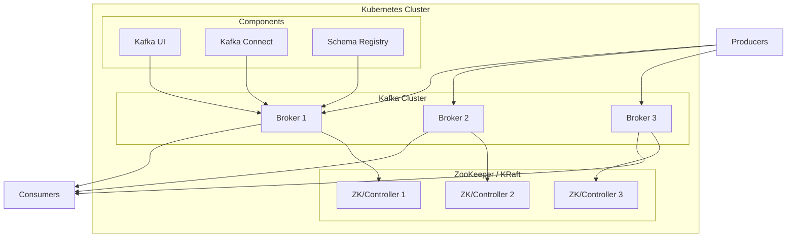

# Deploying Kafka on Kubernetes with Helm

Author: [nawazdhandala](https://www.github.com/nawazdhandala)

Tags: Helm, Kubernetes, DevOps, Kafka, Messaging, Event Streaming

Description: Complete guide to deploying Apache Kafka on Kubernetes using Helm charts, covering single broker setups, multi-broker clusters, and production configurations with Strimzi and Bitnami.

> Apache Kafka is a distributed event streaming platform used for real-time data pipelines and streaming applications. This guide covers deploying Kafka on Kubernetes using Helm, from development setups to production-ready clusters.

## Architecture Overview



## Option 1: Bitnami Kafka Chart

### Add Repository

```bash
# Add Bitnami repository
helm repo add bitnami https://charts.bitnami.com/bitnami

# Update repositories
helm repo update

# Search for available versions
helm search repo bitnami/kafka --versions
```

### Basic Installation

```bash
# Install with default values
helm install kafka bitnami/kafka \
  --namespace kafka \
  --create-namespace
```

### Production Values

```yaml
# kafka-values.yaml
# KRaft mode (no ZooKeeper)
kraft:
  enabled: true
  clusterId: "MkU3OEVBNTcwNTJENDM2Qk"

controller:
  replicaCount: 3
  
  resources:
    requests:
      memory: 1Gi
      cpu: 500m
    limits:
      memory: 2Gi
      cpu: 2000m
  
  persistence:
    enabled: true
    storageClass: "fast-ssd"
    size: 20Gi
  
  affinity:
    podAntiAffinity:
      requiredDuringSchedulingIgnoredDuringExecution:
      - labelSelector:
          matchLabels:
            app.kubernetes.io/component: controller-eligible
        topologyKey: kubernetes.io/hostname

broker:
  replicaCount: 3
  
  resources:
    requests:
      memory: 2Gi
      cpu: 1000m
    limits:
      memory: 4Gi
      cpu: 4000m
  
  persistence:
    enabled: true
    storageClass: "fast-ssd"
    size: 100Gi
  
  # Heap size should be ~50% of memory limit
  heapOpts: "-Xmx2g -Xms2g"
  
  affinity:
    podAntiAffinity:
      requiredDuringSchedulingIgnoredDuringExecution:
      - labelSelector:
          matchLabels:
            app.kubernetes.io/component: broker
        topologyKey: kubernetes.io/hostname

# Kafka configuration
extraConfig: |
  # Replication
  default.replication.factor=3
  min.insync.replicas=2
  
  # Performance
  num.io.threads=8
  num.network.threads=3
  num.partitions=12
  
  # Retention
  log.retention.hours=168
  log.retention.bytes=107374182400
  
  # Segment
  log.segment.bytes=1073741824
  log.cleanup.policy=delete

# Authentication
auth:
  clientProtocol: sasl
  interBrokerProtocol: sasl
  sasl:
    enabledMechanisms: SCRAM-SHA-512

# Listeners
listeners:
  client:
    protocol: SASL_PLAINTEXT
  controller:
    protocol: SASL_PLAINTEXT
  interbroker:
    protocol: SASL_PLAINTEXT
  external:
    protocol: SASL_PLAINTEXT

# External access
externalAccess:
  enabled: true
  service:
    type: LoadBalancer
    ports:
      external: 9094
  autoDiscovery:
    enabled: true

# Metrics
metrics:
  kafka:
    enabled: true
  jmx:
    enabled: true
  serviceMonitor:
    enabled: true
    namespace: monitoring
    labels:
      release: prometheus

# Provisioning - auto-create topics
provisioning:
  enabled: true
  topics:
    - name: events
      partitions: 12
      replicationFactor: 3
      config:
        retention.ms: "604800000"
    - name: logs
      partitions: 6
      replicationFactor: 3
      config:
        retention.ms: "86400000"
```

### Install with Production Values

```bash
helm install kafka bitnami/kafka \
  --namespace kafka \
  --create-namespace \
  -f kafka-values.yaml
```

## Option 2: Strimzi Kafka Operator

Strimzi provides a Kubernetes-native way to run Kafka.

### Install Strimzi Operator

```bash
# Add Strimzi repository
helm repo add strimzi https://strimzi.io/charts/

# Install the operator
helm install strimzi-kafka-operator strimzi/strimzi-kafka-operator \
  --namespace kafka \
  --create-namespace \
  --set watchAnyNamespace=true
```

### Create Kafka Cluster

```yaml
# kafka-cluster.yaml
apiVersion: kafka.strimzi.io/v1beta2
kind: Kafka
metadata:
  name: my-cluster
  namespace: kafka
spec:
  kafka:
    version: 3.6.0
    replicas: 3
    
    listeners:
      - name: plain
        port: 9092
        type: internal
        tls: false
      - name: tls
        port: 9093
        type: internal
        tls: true
      - name: external
        port: 9094
        type: loadbalancer
        tls: true
        authentication:
          type: scram-sha-512
    
    authorization:
      type: simple
    
    config:
      offsets.topic.replication.factor: 3
      transaction.state.log.replication.factor: 3
      transaction.state.log.min.isr: 2
      default.replication.factor: 3
      min.insync.replicas: 2
      num.partitions: 12
      log.retention.hours: 168
    
    storage:
      type: persistent-claim
      size: 100Gi
      class: fast-ssd
      deleteClaim: false
    
    resources:
      requests:
        memory: 2Gi
        cpu: 500m
      limits:
        memory: 4Gi
        cpu: 2000m
    
    metricsConfig:
      type: jmxPrometheusExporter
      valueFrom:
        configMapKeyRef:
          name: kafka-metrics
          key: kafka-metrics-config.yml
    
    template:
      pod:
        affinity:
          podAntiAffinity:
            requiredDuringSchedulingIgnoredDuringExecution:
              - labelSelector:
                  matchLabels:
                    strimzi.io/name: my-cluster-kafka
                topologyKey: kubernetes.io/hostname

  zookeeper:
    replicas: 3
    storage:
      type: persistent-claim
      size: 20Gi
      class: fast-ssd
    resources:
      requests:
        memory: 512Mi
        cpu: 250m
      limits:
        memory: 1Gi
        cpu: 500m
    template:
      pod:
        affinity:
          podAntiAffinity:
            requiredDuringSchedulingIgnoredDuringExecution:
              - labelSelector:
                  matchLabels:
                    strimzi.io/name: my-cluster-zookeeper
                topologyKey: kubernetes.io/hostname

  entityOperator:
    topicOperator:
      resources:
        requests:
          memory: 256Mi
          cpu: 100m
    userOperator:
      resources:
        requests:
          memory: 256Mi
          cpu: 100m
```

### Create Metrics ConfigMap

```yaml
# kafka-metrics-configmap.yaml
apiVersion: v1
kind: ConfigMap
metadata:
  name: kafka-metrics
  namespace: kafka
data:
  kafka-metrics-config.yml: |
    lowercaseOutputName: true
    rules:
    - pattern: kafka.server<type=(.+), name=(.+), clientId=(.+), topic=(.+), partition=(.*)><>Value
      name: kafka_server_$1_$2
      type: GAUGE
      labels:
        clientId: "$3"
        topic: "$4"
        partition: "$5"
    - pattern: kafka.server<type=(.+), name=(.+), clientId=(.+), brokerHost=(.+), brokerPort=(.+)><>Value
      name: kafka_server_$1_$2
      type: GAUGE
      labels:
        clientId: "$3"
        broker: "$4:$5"
```

### Apply Resources

```bash
kubectl apply -f kafka-metrics-configmap.yaml
kubectl apply -f kafka-cluster.yaml
```

### Create Topics with Strimzi

```yaml
# kafka-topic.yaml
apiVersion: kafka.strimzi.io/v1beta2
kind: KafkaTopic
metadata:
  name: events
  namespace: kafka
  labels:
    strimzi.io/cluster: my-cluster
spec:
  partitions: 12
  replicas: 3
  config:
    retention.ms: 604800000
    segment.bytes: 1073741824
```

### Create Users with Strimzi

```yaml
# kafka-user.yaml
apiVersion: kafka.strimzi.io/v1beta2
kind: KafkaUser
metadata:
  name: my-app
  namespace: kafka
  labels:
    strimzi.io/cluster: my-cluster
spec:
  authentication:
    type: scram-sha-512
  authorization:
    type: simple
    acls:
      - resource:
          type: topic
          name: events
          patternType: literal
        operations:
          - Read
          - Write
          - Describe
      - resource:
          type: group
          name: my-app-group
          patternType: literal
        operations:
          - Read
```

## Deploy Kafka UI

```yaml
# kafka-ui-values.yaml
# Using provectus/kafka-ui chart
yamlApplicationConfig:
  kafka:
    clusters:
      - name: local
        bootstrapServers: kafka:9092
        # For SASL authentication
        properties:
          security.protocol: SASL_PLAINTEXT
          sasl.mechanism: SCRAM-SHA-512
          sasl.jaas.config: |
            org.apache.kafka.common.security.scram.ScramLoginModule required
            username="admin"
            password="admin-password";
  auth:
    type: disabled
  management:
    health:
      ldap:
        enabled: false

ingress:
  enabled: true
  ingressClassName: nginx
  hosts:
    - host: kafka-ui.example.com
      paths:
        - path: /
```

### Install Kafka UI

```bash
helm repo add kafka-ui https://provectus.github.io/kafka-ui-charts

helm install kafka-ui kafka-ui/kafka-ui \
  --namespace kafka \
  -f kafka-ui-values.yaml
```

## Deploy Schema Registry

```yaml
# schema-registry-values.yaml
replicaCount: 2

image:
  repository: confluentinc/cp-schema-registry
  tag: 7.5.0

kafka:
  bootstrapServers: kafka:9092

resources:
  requests:
    memory: 512Mi
    cpu: 250m
  limits:
    memory: 1Gi
    cpu: 500m

ingress:
  enabled: true
  hosts:
    - host: schema-registry.example.com
      paths:
        - /
```

## Kafka Connect

### Kafka Connect Values

```yaml
# kafka-connect.yaml
apiVersion: kafka.strimzi.io/v1beta2
kind: KafkaConnect
metadata:
  name: my-connect
  namespace: kafka
  annotations:
    strimzi.io/use-connector-resources: "true"
spec:
  version: 3.6.0
  replicas: 2
  
  bootstrapServers: my-cluster-kafka-bootstrap:9092
  
  config:
    group.id: connect-cluster
    offset.storage.topic: connect-offsets
    config.storage.topic: connect-configs
    status.storage.topic: connect-status
    config.storage.replication.factor: 3
    offset.storage.replication.factor: 3
    status.storage.replication.factor: 3
  
  build:
    output:
      type: docker
      image: my-registry/kafka-connect:latest
    plugins:
      - name: debezium-postgres
        artifacts:
          - type: tgz
            url: https://repo1.maven.org/maven2/io/debezium/debezium-connector-postgres/2.4.0.Final/debezium-connector-postgres-2.4.0.Final-plugin.tar.gz
      - name: elasticsearch-sink
        artifacts:
          - type: zip
            url: https://d1i4a15mxbxib1.cloudfront.net/api/plugins/confluentinc/kafka-connect-elasticsearch/versions/14.0.6/confluentinc-kafka-connect-elasticsearch-14.0.6.zip
  
  resources:
    requests:
      memory: 1Gi
      cpu: 500m
    limits:
      memory: 2Gi
      cpu: 1000m
```

### Create Connector

```yaml
# kafka-connector.yaml
apiVersion: kafka.strimzi.io/v1beta2
kind: KafkaConnector
metadata:
  name: postgres-source
  namespace: kafka
  labels:
    strimzi.io/cluster: my-connect
spec:
  class: io.debezium.connector.postgresql.PostgresConnector
  tasksMax: 1
  config:
    database.hostname: postgresql
    database.port: 5432
    database.user: postgres
    database.password: password
    database.dbname: mydb
    database.server.name: postgres
    topic.prefix: cdc
    slot.name: debezium
    plugin.name: pgoutput
```

## Client Configuration

### Python (confluent-kafka)

```python
from confluent_kafka import Producer, Consumer

# Producer
producer_config = {
    'bootstrap.servers': 'kafka.kafka.svc.cluster.local:9092',
    'security.protocol': 'SASL_PLAINTEXT',
    'sasl.mechanism': 'SCRAM-SHA-512',
    'sasl.username': 'my-app',
    'sasl.password': 'password',
    'acks': 'all',
    'retries': 3
}

producer = Producer(producer_config)
producer.produce('events', key='key', value='value')
producer.flush()

# Consumer
consumer_config = {
    'bootstrap.servers': 'kafka.kafka.svc.cluster.local:9092',
    'security.protocol': 'SASL_PLAINTEXT',
    'sasl.mechanism': 'SCRAM-SHA-512',
    'sasl.username': 'my-app',
    'sasl.password': 'password',
    'group.id': 'my-app-group',
    'auto.offset.reset': 'earliest'
}

consumer = Consumer(consumer_config)
consumer.subscribe(['events'])

while True:
    msg = consumer.poll(1.0)
    if msg is None:
        continue
    print(f'Received: {msg.value()}')
```

### Node.js (kafkajs)

```javascript
const { Kafka } = require('kafkajs');

const kafka = new Kafka({
  clientId: 'my-app',
  brokers: ['kafka.kafka.svc.cluster.local:9092'],
  sasl: {
    mechanism: 'scram-sha-512',
    username: 'my-app',
    password: 'password'
  }
});

// Producer
const producer = kafka.producer();
await producer.connect();
await producer.send({
  topic: 'events',
  messages: [{ key: 'key', value: 'value' }]
});

// Consumer
const consumer = kafka.consumer({ groupId: 'my-app-group' });
await consumer.connect();
await consumer.subscribe({ topic: 'events', fromBeginning: true });
await consumer.run({
  eachMessage: async ({ topic, partition, message }) => {
    console.log(`Received: ${message.value}`);
  }
});
```

## Resource Sizing Guide

| Cluster Size | Brokers | CPU/Broker | Memory/Broker | Storage |
|--------------|---------|------------|---------------|---------|
| Development | 1 | 500m | 1Gi | 10Gi |
| Small | 3 | 1000m | 2Gi | 50Gi |
| Medium | 3-5 | 2000m | 4Gi | 200Gi |
| Large | 5-10 | 4000m | 8Gi | 500Gi |

## Monitoring

### Key Metrics to Watch

```bash
# Connect to broker
kubectl exec -it kafka-0 -n kafka -- kafka-metadata.sh --snapshot /var/lib/kafka/data/__cluster_metadata-0/00000000000000000000.log --command describe

# List topics
kubectl exec -it kafka-0 -n kafka -- kafka-topics.sh --bootstrap-server localhost:9092 --list

# Describe topic
kubectl exec -it kafka-0 -n kafka -- kafka-topics.sh --bootstrap-server localhost:9092 --describe --topic events

# Consumer groups
kubectl exec -it kafka-0 -n kafka -- kafka-consumer-groups.sh --bootstrap-server localhost:9092 --list
kubectl exec -it kafka-0 -n kafka -- kafka-consumer-groups.sh --bootstrap-server localhost:9092 --describe --group my-app-group
```

## Troubleshooting

### Check Logs

```bash
# Kafka broker logs
kubectl logs kafka-0 -n kafka

# Strimzi operator logs
kubectl logs -n kafka deploy/strimzi-cluster-operator
```

### Common Issues

**Under-replicated partitions:**
```bash
kubectl exec -it kafka-0 -n kafka -- kafka-topics.sh --bootstrap-server localhost:9092 --describe --under-replicated-partitions
```

**Consumer lag:**
```bash
kubectl exec -it kafka-0 -n kafka -- kafka-consumer-groups.sh --bootstrap-server localhost:9092 --describe --group my-app-group
```

## Wrap-up

Kafka on Kubernetes can be deployed using Bitnami's Helm chart for simpler setups or Strimzi for production-grade Kubernetes-native management. Configure appropriate replication factors, enable authentication, and monitor with Prometheus metrics. Use Schema Registry for data governance and Kafka Connect for integrations. Size resources appropriately and spread brokers across nodes for high availability.
