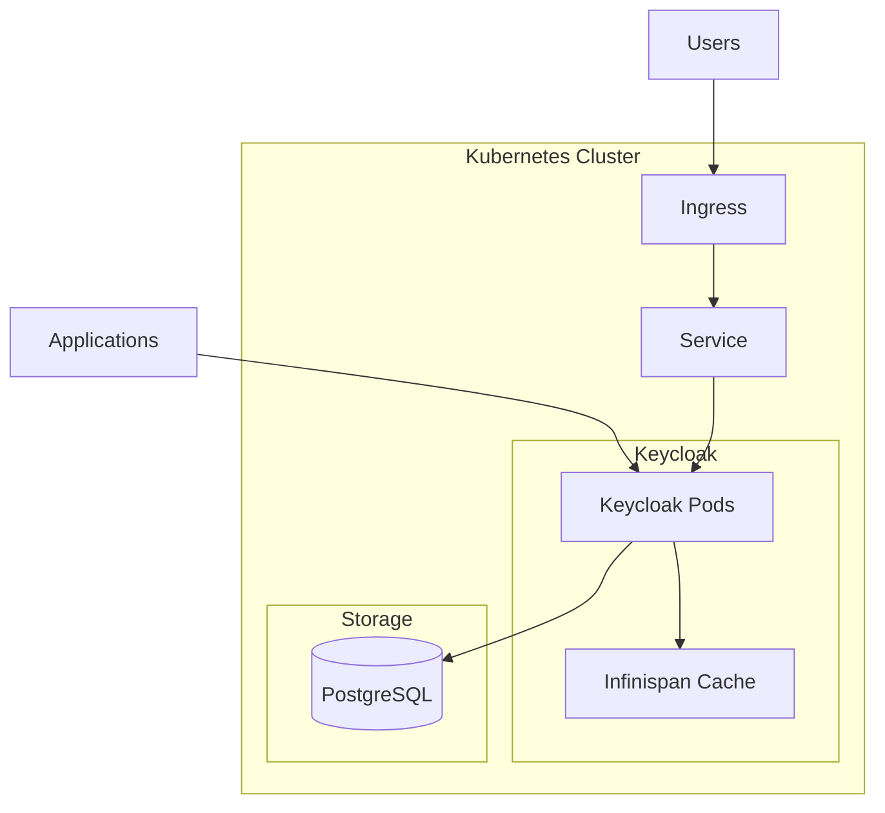

# How to Deploy Keycloak with Helm for Authentication

Author: [nawazdhandala](https://www.github.com/nawazdhandala)

Tags: Helm, Kubernetes, DevOps, Keycloak, Authentication, Identity, SSO

Description: Complete guide to deploying Keycloak identity and access management solution using Helm for centralized authentication and single sign-on.

> Keycloak provides enterprise-grade identity management including SSO, social login, and LDAP integration. This guide covers deploying Keycloak with Helm for production-ready authentication infrastructure.

## Keycloak Architecture



## Prerequisites

```bash
# Add Bitnami repository
helm repo add bitnami https://charts.bitnami.com/bitnami

# Update repositories
helm repo update

# Create namespace
kubectl create namespace keycloak
```

## Basic Installation

```bash
# Install with default settings
helm install keycloak bitnami/keycloak \
  --namespace keycloak \
  --set auth.adminUser=admin \
  --set auth.adminPassword=admin123
```

## Production Configuration

### Complete Values File

```yaml
# keycloak-values.yaml

# Global settings
global:
  storageClass: "standard"

# Keycloak configuration
auth:
  adminUser: admin
  # Use existing secret for admin password
  existingSecret: keycloak-admin-secret
  existingSecretKey: admin-password

# Replicas for high availability
replicaCount: 3

# Container resources
resources:
  requests:
    memory: "1Gi"
    cpu: "500m"
  limits:
    memory: "2Gi"
    cpu: "1000m"

# Pod security context
podSecurityContext:
  enabled: true
  fsGroup: 1001
  runAsUser: 1001
  runAsNonRoot: true

# Container security context
containerSecurityContext:
  enabled: true
  runAsUser: 1001
  runAsNonRoot: true
  allowPrivilegeEscalation: false
  capabilities:
    drop:
      - ALL
  readOnlyRootFilesystem: false

# Keycloak production mode
production: true

# Proxy settings
proxy: edge

# Hostname configuration
httpRelativePath: "/"

# Enable health endpoints
health:
  enabled: true

# Metrics endpoint for Prometheus
metrics:
  enabled: true
  serviceMonitor:
    enabled: true
    namespace: monitoring
    interval: 30s

# Service configuration
service:
  type: ClusterIP
  ports:
    http: 80
    https: 443

# Ingress configuration
ingress:
  enabled: true
  ingressClassName: nginx
  hostname: keycloak.example.com
  path: /
  annotations:
    cert-manager.io/cluster-issuer: "letsencrypt-prod"
    nginx.ingress.kubernetes.io/proxy-buffer-size: "128k"
    nginx.ingress.kubernetes.io/proxy-buffers-number: "4"
  tls: true
  extraTls:
    - hosts:
        - keycloak.example.com
      secretName: keycloak-tls

# PostgreSQL configuration
postgresql:
  enabled: true
  auth:
    username: keycloak
    database: keycloak
    existingSecret: keycloak-postgresql-secret
    secretKeys:
      adminPasswordKey: postgres-password
      userPasswordKey: password
  primary:
    persistence:
      enabled: true
      size: 10Gi
      storageClass: "standard"
    resources:
      requests:
        memory: "512Mi"
        cpu: "250m"
      limits:
        memory: "1Gi"
        cpu: "500m"

# External database (alternative)
# postgresql:
#   enabled: false
# externalDatabase:
#   host: postgresql.example.com
#   port: 5432
#   user: keycloak
#   database: keycloak
#   existingSecret: keycloak-db-secret
#   existingSecretPasswordKey: password

# Keycloak cache settings
cache:
  enabled: true
  # Stack for cluster communication
  stack: kubernetes

# JGroups configuration for clustering
extraEnvVars:
  - name: JAVA_OPTS_APPEND
    value: "-Djgroups.dns.query=keycloak-headless.keycloak.svc.cluster.local"
  - name: KC_LOG_LEVEL
    value: "INFO"
  - name: KC_TRANSACTION_XA_ENABLED
    value: "false"

# Extra start command args
extraStartupArgs: >-
  --spi-theme-static-max-age=-1
  --spi-theme-cache-themes=false

# Node selector
nodeSelector:
  node-type: application

# Pod affinity
affinity:
  podAntiAffinity:
    preferredDuringSchedulingIgnoredDuringExecution:
      - weight: 100
        podAffinityTerm:
          labelSelector:
            matchLabels:
              app.kubernetes.io/name: keycloak
          topologyKey: kubernetes.io/hostname

# Tolerations
tolerations: []

# Pod disruption budget
pdb:
  create: true
  minAvailable: 2

# Autoscaling
autoscaling:
  enabled: true
  minReplicas: 3
  maxReplicas: 10
  targetCPU: 70
  targetMemory: 70

# Init containers for database readiness
initContainers:
  - name: wait-for-database
    image: busybox:1.36
    command:
      - sh
      - -c
      - |
        until nc -z keycloak-postgresql 5432; do
          echo "Waiting for database..."
          sleep 2
        done
```

### Create Secrets

```bash
# Create admin password secret
kubectl create secret generic keycloak-admin-secret \
  --namespace keycloak \
  --from-literal=admin-password='SecurePassword123!'

# Create PostgreSQL secret
kubectl create secret generic keycloak-postgresql-secret \
  --namespace keycloak \
  --from-literal=postgres-password='PostgresRootPassword!' \
  --from-literal=password='KeycloakDBPassword!'
```

## Deploy Keycloak

```bash
# Install with production values
helm install keycloak bitnami/keycloak \
  --namespace keycloak \
  --values keycloak-values.yaml \
  --wait --timeout 10m

# Verify deployment
kubectl get pods -n keycloak
kubectl get svc -n keycloak
kubectl get ingress -n keycloak
```

## Configure Keycloak

### Create Realm

```bash
# Access Keycloak admin console
kubectl port-forward svc/keycloak 8080:80 -n keycloak

# Open http://localhost:8080
# Login with admin credentials
```

### Realm Configuration via API

```bash
# Get admin token
KEYCLOAK_URL=https://keycloak.example.com
TOKEN=$(curl -s -X POST "${KEYCLOAK_URL}/realms/master/protocol/openid-connect/token" \
  -d "client_id=admin-cli" \
  -d "username=admin" \
  -d "password=SecurePassword123!" \
  -d "grant_type=password" | jq -r '.access_token')

# Create realm
curl -X POST "${KEYCLOAK_URL}/admin/realms" \
  -H "Authorization: Bearer ${TOKEN}" \
  -H "Content-Type: application/json" \
  -d '{
    "realm": "myapp",
    "enabled": true,
    "displayName": "My Application",
    "loginTheme": "keycloak",
    "sslRequired": "external",
    "registrationAllowed": false,
    "bruteForceProtected": true,
    "failureFactor": 5,
    "permanentLockout": false,
    "maxFailureWaitSeconds": 900,
    "minimumQuickLoginWaitSeconds": 60,
    "waitIncrementSeconds": 60,
    "quickLoginCheckMilliSeconds": 1000,
    "maxDeltaTimeSeconds": 43200,
    "accessTokenLifespan": 300,
    "accessTokenLifespanForImplicitFlow": 900,
    "ssoSessionIdleTimeout": 1800,
    "ssoSessionMaxLifespan": 36000,
    "offlineSessionIdleTimeout": 2592000
  }'

# Create client
curl -X POST "${KEYCLOAK_URL}/admin/realms/myapp/clients" \
  -H "Authorization: Bearer ${TOKEN}" \
  -H "Content-Type: application/json" \
  -d '{
    "clientId": "myapp-frontend",
    "enabled": true,
    "publicClient": true,
    "redirectUris": [
      "https://myapp.example.com/*"
    ],
    "webOrigins": [
      "https://myapp.example.com"
    ],
    "standardFlowEnabled": true,
    "implicitFlowEnabled": false,
    "directAccessGrantsEnabled": true,
    "attributes": {
      "pkce.code.challenge.method": "S256"
    }
  }'
```

## Realm Import ConfigMap

```yaml
# keycloak-realm-configmap.yaml
apiVersion: v1
kind: ConfigMap
metadata:
  name: keycloak-realm-import
  namespace: keycloak
data:
  myapp-realm.json: |
    {
      "realm": "myapp",
      "enabled": true,
      "displayName": "My Application",
      "sslRequired": "external",
      "registrationAllowed": true,
      "loginWithEmailAllowed": true,
      "duplicateEmailsAllowed": false,
      "resetPasswordAllowed": true,
      "editUsernameAllowed": false,
      "bruteForceProtected": true,
      "clients": [
        {
          "clientId": "myapp-web",
          "enabled": true,
          "publicClient": true,
          "standardFlowEnabled": true,
          "redirectUris": ["https://myapp.example.com/*"],
          "webOrigins": ["https://myapp.example.com"]
        },
        {
          "clientId": "myapp-api",
          "enabled": true,
          "publicClient": false,
          "bearerOnly": true
        }
      ],
      "roles": {
        "realm": [
          {"name": "user"},
          {"name": "admin"}
        ]
      }
    }
```

### Mount Realm Import

```yaml
# Add to keycloak-values.yaml
extraVolumes:
  - name: realm-import
    configMap:
      name: keycloak-realm-import

extraVolumeMounts:
  - name: realm-import
    mountPath: /opt/bitnami/keycloak/data/import
    readOnly: true

extraStartupArgs: "--import-realm"
```

## LDAP Integration

```json
{
  "name": "ldap",
  "providerId": "ldap",
  "providerType": "org.keycloak.storage.UserStorageProvider",
  "parentId": "myapp",
  "config": {
    "enabled": ["true"],
    "vendor": ["ad"],
    "connectionUrl": ["ldap://ldap.example.com:389"],
    "bindDn": ["cn=admin,dc=example,dc=com"],
    "bindCredential": ["ldap-password"],
    "usersDn": ["ou=users,dc=example,dc=com"],
    "usernameLDAPAttribute": ["sAMAccountName"],
    "rdnLDAPAttribute": ["cn"],
    "uuidLDAPAttribute": ["objectGUID"],
    "userObjectClasses": ["person, organizationalPerson, user"],
    "authType": ["simple"],
    "searchScope": ["2"],
    "importEnabled": ["true"],
    "syncRegistrations": ["false"],
    "trustEmail": ["false"],
    "fullSyncPeriod": ["604800"],
    "changedSyncPeriod": ["86400"],
    "cachePolicy": ["DEFAULT"],
    "batchSizeForSync": ["1000"]
  }
}
```

## Monitoring and Observability

### ServiceMonitor

```yaml
# keycloak-servicemonitor.yaml
apiVersion: monitoring.coreos.com/v1
kind: ServiceMonitor
metadata:
  name: keycloak
  namespace: monitoring
spec:
  selector:
    matchLabels:
      app.kubernetes.io/name: keycloak
  namespaceSelector:
    matchNames:
      - keycloak
  endpoints:
    - port: http
      path: /metrics
      interval: 30s
```

### Grafana Dashboard

```json
{
  "dashboard": {
    "title": "Keycloak Metrics",
    "panels": [
      {
        "title": "Login Attempts",
        "targets": [
          {
            "expr": "increase(keycloak_logins_total[5m])",
            "legendFormat": "{{realm}} - {{provider}}"
          }
        ]
      },
      {
        "title": "Failed Logins",
        "targets": [
          {
            "expr": "increase(keycloak_failed_login_attempts_total[5m])",
            "legendFormat": "{{realm}} - {{error}}"
          }
        ]
      },
      {
        "title": "Active Sessions",
        "targets": [
          {
            "expr": "keycloak_sessions",
            "legendFormat": "{{realm}}"
          }
        ]
      }
    ]
  }
}
```

## High Availability Setup

```yaml
# keycloak-ha-values.yaml

# Multi-node cluster
replicaCount: 3

# Distributed cache
cache:
  enabled: true
  stack: kubernetes

# JGroups configuration
extraEnvVars:
  - name: JAVA_OPTS_APPEND
    value: >-
      -Djgroups.dns.query=keycloak-headless.keycloak.svc.cluster.local
      -Djboss.site.name=site1
  - name: KC_CACHE
    value: "ispn"
  - name: KC_CACHE_STACK
    value: "kubernetes"

# Headless service for cluster discovery
service:
  headless:
    annotations:
      service.alpha.kubernetes.io/tolerate-unready-endpoints: "true"

# Session affinity for stickiness
service:
  sessionAffinity: ClientIP
  sessionAffinityConfig:
    clientIP:
      timeoutSeconds: 10800

# PDB for availability
pdb:
  create: true
  minAvailable: 2
```

## Best Practices

| Practice | Description |
|----------|-------------|
| Production Mode | Enable production flag for security |
| External Database | Use managed PostgreSQL for production |
| TLS Everywhere | Terminate TLS at ingress |
| Secret Management | Use external secrets operator |
| Session Clustering | Enable Infinispan clustering |
| Monitoring | Export metrics to Prometheus |

## Troubleshooting

```bash
# Check pod logs
kubectl logs -f deployment/keycloak -n keycloak

# Verify database connectivity
kubectl exec -it keycloak-0 -n keycloak -- \
  nc -zv keycloak-postgresql 5432

# Check cluster formation
kubectl exec -it keycloak-0 -n keycloak -- \
  cat /opt/bitnami/keycloak/standalone/log/server.log | grep -i "infinispan"

# Restart pods
kubectl rollout restart deployment/keycloak -n keycloak

# Access admin console
kubectl port-forward svc/keycloak 8080:80 -n keycloak
```

## Wrap-up

Keycloak provides comprehensive identity management for Kubernetes applications. Deploy with Helm using the Bitnami chart, configure realms and clients, integrate with LDAP if needed, and enable monitoring for production operations. High availability with clustering ensures reliable authentication services.
