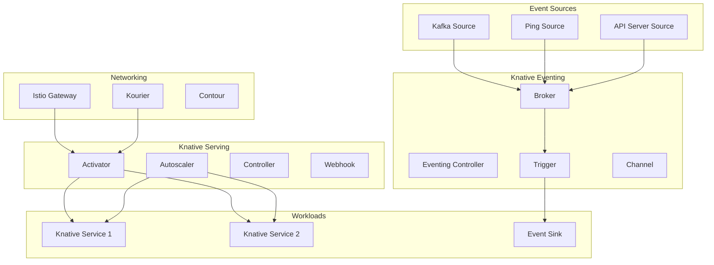

# Deploying Knative Serverless Platform with Helm

Author: [nawazdhandala](https://www.github.com/nawazdhandala)

Tags: Helm, Kubernetes, DevOps, Knative, Serverless, Functions, Event-Driven

Description: Complete guide to deploying Knative serverless platform on Kubernetes using Helm charts for running serverless workloads and event-driven applications.

> Knative provides serverless capabilities on Kubernetes with automatic scaling, traffic management, and event-driven architectures. This guide covers deploying Knative Serving and Eventing components using Helm charts.

## Knative Architecture



## Prerequisites

```bash
# Check Kubernetes version (1.26+)
kubectl version

# Add Knative Helm repository
helm repo add knative https://knative.dev/charts
helm repo update

# Check available charts
helm search repo knative
```

## Install Knative Serving

### Using Operator (Recommended)

```yaml
# knative-operator-values.yaml
operator:
  replicas: 1
  resources:
    limits:
      cpu: 500m
      memory: 512Mi
    requests:
      cpu: 100m
      memory: 128Mi
```

```bash
# Install operator
kubectl apply -f https://github.com/knative/operator/releases/download/knative-v1.12.0/operator.yaml

# Verify operator
kubectl get deployment knative-operator -n default
```

### Configure Knative Serving

```yaml
# knative-serving.yaml
apiVersion: operator.knative.dev/v1beta1
kind: KnativeServing
metadata:
  name: knative-serving
  namespace: knative-serving
spec:
  version: "1.12.0"
  
  # Use Kourier as networking layer
  ingress:
    kourier:
      enabled: true
  
  config:
    network:
      ingress-class: kourier.ingress.networking.knative.dev
      
    autoscaler:
      # Scale to zero
      enable-scale-to-zero: "true"
      scale-to-zero-grace-period: "30s"
      scale-to-zero-pod-retention-period: "0s"
      
      # Scaling bounds
      min-scale: "0"
      max-scale: "100"
      
      # Target utilization
      container-concurrency-target-percentage: "70"
      container-concurrency-target-default: "100"
      
      # Scaling rates
      max-scale-up-rate: "1000"
      max-scale-down-rate: "2"
      
      # Panic mode
      panic-threshold-percentage: "200"
      panic-window-percentage: "10"
      stable-window: "60s"
      
    defaults:
      revision-timeout-seconds: "300"
      max-revision-timeout-seconds: "600"
      revision-cpu-request: "100m"
      revision-memory-request: "128Mi"
      revision-cpu-limit: "1000m"
      revision-memory-limit: "512Mi"
      
    deployment:
      registries-skipping-tag-resolving: "docker.io,gcr.io,ghcr.io"
      
  high-availability:
    replicas: 2
```

```bash
kubectl create namespace knative-serving
kubectl apply -f knative-serving.yaml
```

### Install with Istio Networking

```yaml
# knative-serving-istio.yaml
apiVersion: operator.knative.dev/v1beta1
kind: KnativeServing
metadata:
  name: knative-serving
  namespace: knative-serving
spec:
  version: "1.12.0"
  
  ingress:
    istio:
      enabled: true
      
  config:
    network:
      ingress-class: istio.ingress.networking.knative.dev
      
    istio:
      gateway.knative-serving.knative-ingress-gateway: "istio-ingressgateway.istio-system.svc.cluster.local"
```

## Knative Eventing

### Install Eventing

```yaml
# knative-eventing.yaml
apiVersion: operator.knative.dev/v1beta1
kind: KnativeEventing
metadata:
  name: knative-eventing
  namespace: knative-eventing
spec:
  version: "1.12.0"
  
  config:
    default-ch-webhook:
      default-ch-config: |
        clusterDefault:
          apiVersion: messaging.knative.dev/v1
          kind: InMemoryChannel
          
    config-br-defaults:
      default-br-config: |
        clusterDefault:
          brokerClass: MTChannelBasedBroker
          apiVersion: v1
          kind: ConfigMap
          name: config-br-default-channel
          namespace: knative-eventing
          
  high-availability:
    replicas: 2
```

```bash
kubectl create namespace knative-eventing
kubectl apply -f knative-eventing.yaml
```

## Deploy Knative Services

### Basic Service

```yaml
# hello-service.yaml
apiVersion: serving.knative.dev/v1
kind: Service
metadata:
  name: hello
  namespace: default
spec:
  template:
    metadata:
      annotations:
        # Autoscaling
        autoscaling.knative.dev/min-scale: "0"
        autoscaling.knative.dev/max-scale: "10"
        autoscaling.knative.dev/target: "100"
        
    spec:
      containers:
        - image: gcr.io/knative-samples/helloworld-go
          ports:
            - containerPort: 8080
          env:
            - name: TARGET
              value: "Knative"
          resources:
            requests:
              cpu: 100m
              memory: 128Mi
            limits:
              cpu: 500m
              memory: 256Mi
```

### Service with Traffic Splitting

```yaml
# canary-service.yaml
apiVersion: serving.knative.dev/v1
kind: Service
metadata:
  name: my-app
spec:
  template:
    metadata:
      name: my-app-v2
    spec:
      containers:
        - image: my-app:v2
          
  traffic:
    - revisionName: my-app-v1
      percent: 90
    - revisionName: my-app-v2
      percent: 10
```

### Service with Custom Domain

```yaml
# custom-domain-service.yaml
apiVersion: serving.knative.dev/v1
kind: Service
metadata:
  name: api-service
  annotations:
    # Custom domain mapping
    serving.knative.dev/disableAutoTLS: "true"
spec:
  template:
    spec:
      containers:
        - image: api-service:latest

---
apiVersion: serving.knative.dev/v1beta1
kind: DomainMapping
metadata:
  name: api.example.com
spec:
  ref:
    name: api-service
    kind: Service
    apiVersion: serving.knative.dev/v1
```

## Event Sources

### Kafka Source

```yaml
# kafka-source.yaml
apiVersion: sources.knative.dev/v1beta1
kind: KafkaSource
metadata:
  name: kafka-source
  namespace: default
spec:
  consumerGroup: knative-group
  bootstrapServers:
    - kafka.kafka.svc.cluster.local:9092
  topics:
    - my-topic
  sink:
    ref:
      apiVersion: serving.knative.dev/v1
      kind: Service
      name: event-display
```

### Ping Source (Cron)

```yaml
# ping-source.yaml
apiVersion: sources.knative.dev/v1
kind: PingSource
metadata:
  name: scheduled-job
spec:
  schedule: "*/5 * * * *"  # Every 5 minutes
  contentType: "application/json"
  data: '{"message": "Hello from cron!"}'
  sink:
    ref:
      apiVersion: serving.knative.dev/v1
      kind: Service
      name: job-handler
```

### API Server Source

```yaml
# api-server-source.yaml
apiVersion: sources.knative.dev/v1
kind: ApiServerSource
metadata:
  name: pod-events
spec:
  serviceAccountName: events-sa
  mode: Resource
  resources:
    - apiVersion: v1
      kind: Pod
  sink:
    ref:
      apiVersion: serving.knative.dev/v1
      kind: Service
      name: event-handler
```

## Brokers and Triggers

### Create Broker

```yaml
# broker.yaml
apiVersion: eventing.knative.dev/v1
kind: Broker
metadata:
  name: default
  namespace: default
  annotations:
    eventing.knative.dev/broker.class: MTChannelBasedBroker
spec:
  config:
    apiVersion: v1
    kind: ConfigMap
    name: config-br-default-channel
    namespace: knative-eventing
```

### Create Triggers

```yaml
# triggers.yaml
apiVersion: eventing.knative.dev/v1
kind: Trigger
metadata:
  name: user-created-trigger
spec:
  broker: default
  filter:
    attributes:
      type: user.created
      source: user-service
  subscriber:
    ref:
      apiVersion: serving.knative.dev/v1
      kind: Service
      name: notification-service

---
apiVersion: eventing.knative.dev/v1
kind: Trigger
metadata:
  name: order-completed-trigger
spec:
  broker: default
  filter:
    attributes:
      type: order.completed
  subscriber:
    ref:
      apiVersion: serving.knative.dev/v1
      kind: Service
      name: analytics-service
```

## Kafka Channel

### Install Kafka Channel

```yaml
# kafka-channel.yaml
apiVersion: messaging.knative.dev/v1beta1
kind: KafkaChannel
metadata:
  name: my-kafka-channel
spec:
  numPartitions: 3
  replicationFactor: 3
  retentionDuration: "P7D"

---
# Configure as default channel
apiVersion: v1
kind: ConfigMap
metadata:
  name: config-br-default-channel
  namespace: knative-eventing
data:
  channel-template-spec: |
    apiVersion: messaging.knative.dev/v1beta1
    kind: KafkaChannel
    spec:
      numPartitions: 3
      replicationFactor: 3
```

## Autoscaling Configuration

### Concurrency-Based Scaling

```yaml
# concurrency-scaling.yaml
apiVersion: serving.knative.dev/v1
kind: Service
metadata:
  name: concurrent-service
spec:
  template:
    metadata:
      annotations:
        # Hard limit - max concurrent requests per pod
        autoscaling.knative.dev/target: "50"
        
        # Soft limit - target utilization
        autoscaling.knative.dev/target-utilization-percentage: "70"
        
        # Scale bounds
        autoscaling.knative.dev/min-scale: "1"
        autoscaling.knative.dev/max-scale: "20"
        
        # Scale down delay
        autoscaling.knative.dev/scale-down-delay: "1m"
        
    spec:
      containerConcurrency: 100  # Hard limit per container
      containers:
        - image: my-app:latest
```

### RPS-Based Scaling

```yaml
# rps-scaling.yaml
apiVersion: serving.knative.dev/v1
kind: Service
metadata:
  name: rps-service
spec:
  template:
    metadata:
      annotations:
        autoscaling.knative.dev/class: kpa.autoscaling.knative.dev
        autoscaling.knative.dev/metric: rps
        autoscaling.knative.dev/target: "200"  # 200 RPS per pod
        autoscaling.knative.dev/min-scale: "2"
        autoscaling.knative.dev/max-scale: "50"
    spec:
      containers:
        - image: my-app:latest
```

### CPU-Based Scaling (HPA)

```yaml
# cpu-scaling.yaml
apiVersion: serving.knative.dev/v1
kind: Service
metadata:
  name: cpu-service
spec:
  template:
    metadata:
      annotations:
        autoscaling.knative.dev/class: hpa.autoscaling.knative.dev
        autoscaling.knative.dev/metric: cpu
        autoscaling.knative.dev/target: "70"  # 70% CPU utilization
        autoscaling.knative.dev/min-scale: "1"
        autoscaling.knative.dev/max-scale: "10"
    spec:
      containers:
        - image: my-app:latest
          resources:
            requests:
              cpu: 100m
            limits:
              cpu: 1000m
```

## Helm Chart for Custom Knative Services

### Chart Structure

```
knative-app/
├── Chart.yaml
├── values.yaml
└── templates/
    ├── service.yaml
    ├── triggers.yaml
    └── domain-mapping.yaml
```

### Chart.yaml

```yaml
# Chart.yaml
apiVersion: v2
name: knative-app
version: 1.0.0
description: Knative application deployment
```

### Values

```yaml
# values.yaml
name: my-app
namespace: default

image:
  repository: my-app
  tag: latest
  pullPolicy: Always

autoscaling:
  minScale: 0
  maxScale: 10
  target: 100
  metric: concurrency
  class: kpa.autoscaling.knative.dev

resources:
  requests:
    cpu: 100m
    memory: 128Mi
  limits:
    cpu: 500m
    memory: 256Mi

traffic:
  - revisionName: latest
    percent: 100

env:
  - name: LOG_LEVEL
    value: info

domainMapping:
  enabled: false
  domain: ""

triggers: []
```

### Service Template

```yaml
# templates/service.yaml
apiVersion: serving.knative.dev/v1
kind: Service
metadata:
  name: {{ .Values.name }}
  namespace: {{ .Values.namespace }}
spec:
  template:
    metadata:
      annotations:
        autoscaling.knative.dev/class: {{ .Values.autoscaling.class }}
        autoscaling.knative.dev/metric: {{ .Values.autoscaling.metric }}
        autoscaling.knative.dev/target: {{ .Values.autoscaling.target | quote }}
        autoscaling.knative.dev/min-scale: {{ .Values.autoscaling.minScale | quote }}
        autoscaling.knative.dev/max-scale: {{ .Values.autoscaling.maxScale | quote }}
    spec:
      containers:
        - image: {{ .Values.image.repository }}:{{ .Values.image.tag }}
          imagePullPolicy: {{ .Values.image.pullPolicy }}
          resources:
            {{- toYaml .Values.resources | nindent 12 }}
          {{- with .Values.env }}
          env:
            {{- toYaml . | nindent 12 }}
          {{- end }}
  {{- with .Values.traffic }}
  traffic:
    {{- toYaml . | nindent 4 }}
  {{- end }}
```

## Monitoring

### ServiceMonitor for Knative

```yaml
# knative-servicemonitor.yaml
apiVersion: monitoring.coreos.com/v1
kind: ServiceMonitor
metadata:
  name: knative-serving
  namespace: monitoring
spec:
  selector:
    matchLabels:
      app: activator
  namespaceSelector:
    matchNames:
      - knative-serving
  endpoints:
    - port: http-metrics
      interval: 30s
```

### Prometheus Rules

```yaml
# knative-prometheus-rules.yaml
apiVersion: monitoring.coreos.com/v1
kind: PrometheusRule
metadata:
  name: knative-alerts
spec:
  groups:
    - name: knative
      rules:
        - alert: KnativeServiceScaleToZero
          expr: |
            sum(knative_serving_service_replicas) by (service_name, namespace) == 0
          for: 5m
          labels:
            severity: info
          annotations:
            summary: "Knative service scaled to zero"
            
        - alert: KnativeServiceHighLatency
          expr: |
            histogram_quantile(0.99, 
              sum(rate(revision_request_latencies_bucket[5m])) by (le, service_name)
            ) > 5
          for: 10m
          labels:
            severity: warning
          annotations:
            summary: "Knative service has high latency"
```

## Troubleshooting

```bash
# Check Knative Serving status
kubectl get knativeserving -n knative-serving

# Check services
kubectl get ksvc

# Check revisions
kubectl get revision

# Check routes
kubectl get route

# Check pods
kubectl get pods -n knative-serving

# Check service logs
kubectl logs -l serving.knative.dev/service=my-service -c user-container

# Check activator logs
kubectl logs -n knative-serving -l app=activator

# Describe service
kubectl describe ksvc my-service

# Check events
kubectl get events --sort-by=.metadata.creationTimestamp
```

## Wrap-up

Knative provides a powerful serverless platform on Kubernetes with automatic scaling, traffic management, and event-driven capabilities. Use the operator for simplified installation, configure autoscaling based on your workload patterns, and leverage eventing for building event-driven architectures. Set appropriate scale bounds and resource limits for production deployments.
