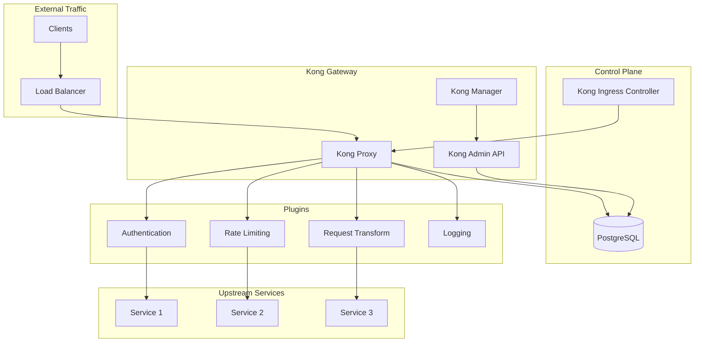

# Deploying Kong API Gateway with Helm

Author: [nawazdhandala](https://www.github.com/nawazdhandala)

Tags: Helm, Kubernetes, DevOps, Kong, API Gateway, Ingress, Traffic Management

Description: Complete guide to deploying Kong API Gateway on Kubernetes using Helm charts for advanced API management, traffic routing, and security.

> Kong is a cloud-native API gateway that provides advanced traffic management, security, and observability for your APIs and microservices. This guide covers deploying Kong using Helm charts with production configurations.

## Kong Architecture



## Prerequisites

```bash
# Add Kong Helm repository
helm repo add kong https://charts.konghq.com
helm repo update

# Search available versions
helm search repo kong/kong --versions
```

## Kong Deployment Modes

| Mode | Description | Use Case |
|------|-------------|----------|
| DB-less | Declarative configuration only | Simple setups, GitOps |
| Traditional | PostgreSQL backend | Full feature set |
| Hybrid | Separate control/data planes | Enterprise scale |
| Ingress Controller | Kubernetes-native | K8s integration |

## Deploy Kong DB-less Mode

### Basic Installation

```yaml
# kong-dbless-values.yaml
image:
  repository: kong
  tag: "3.4"

env:
  database: "off"
  
ingressController:
  enabled: true
  installCRDs: false
  
proxy:
  enabled: true
  type: LoadBalancer
  
  http:
    enabled: true
    servicePort: 80
    containerPort: 8000
    
  tls:
    enabled: true
    servicePort: 443
    containerPort: 8443

admin:
  enabled: false
  
manager:
  enabled: false
  
resources:
  requests:
    cpu: 500m
    memory: 512Mi
  limits:
    cpu: 2000m
    memory: 2Gi
```

```bash
helm install kong kong/kong \
  --namespace kong \
  --create-namespace \
  -f kong-dbless-values.yaml
```

## Deploy Kong with PostgreSQL

### Create PostgreSQL Secret

```bash
kubectl create namespace kong

kubectl create secret generic kong-postgres-password \
  --namespace kong \
  --from-literal=password=$(openssl rand -base64 24)
```

### Full Installation

```yaml
# kong-postgres-values.yaml
image:
  repository: kong
  tag: "3.4"

env:
  database: postgres
  pg_host: kong-postgresql
  pg_user: kong
  pg_database: kong
  pg_password:
    valueFrom:
      secretKeyRef:
        name: kong-postgres-password
        key: password

postgresql:
  enabled: true
  auth:
    username: kong
    database: kong
    existingSecret: kong-postgres-password
    secretKeys:
      userPasswordKey: password
  primary:
    persistence:
      size: 10Gi
      storageClass: fast-ssd

ingressController:
  enabled: true
  installCRDs: false
  
  resources:
    requests:
      cpu: 100m
      memory: 128Mi
    limits:
      cpu: 500m
      memory: 256Mi

proxy:
  enabled: true
  type: LoadBalancer
  
  annotations:
    service.beta.kubernetes.io/aws-load-balancer-type: nlb
    service.beta.kubernetes.io/aws-load-balancer-cross-zone-load-balancing-enabled: "true"
    
  http:
    enabled: true
    servicePort: 80
    containerPort: 8000
    
  tls:
    enabled: true
    servicePort: 443
    containerPort: 8443
    
  ingress:
    enabled: true
    hostname: api.example.com
    annotations:
      cert-manager.io/cluster-issuer: letsencrypt-prod
    tls: api-tls

admin:
  enabled: true
  type: ClusterIP
  http:
    enabled: true
    servicePort: 8001
    containerPort: 8001
    
manager:
  enabled: true
  type: ClusterIP
  http:
    enabled: true
    servicePort: 8002
    containerPort: 8002
  ingress:
    enabled: true
    hostname: kong-manager.example.com
    annotations:
      cert-manager.io/cluster-issuer: letsencrypt-prod
    tls: kong-manager-tls

replicaCount: 3

resources:
  requests:
    cpu: 1000m
    memory: 1Gi
  limits:
    cpu: 4000m
    memory: 4Gi

autoscaling:
  enabled: true
  minReplicas: 3
  maxReplicas: 10
  targetCPUUtilizationPercentage: 70
```

```bash
helm install kong kong/kong \
  --namespace kong \
  -f kong-postgres-values.yaml
```

## Kong Ingress Resources

### Basic Ingress

```yaml
# api-ingress.yaml
apiVersion: networking.k8s.io/v1
kind: Ingress
metadata:
  name: api-ingress
  annotations:
    konghq.com/strip-path: "true"
    konghq.com/plugins: rate-limiting,cors
spec:
  ingressClassName: kong
  rules:
    - host: api.example.com
      http:
        paths:
          - path: /users
            pathType: Prefix
            backend:
              service:
                name: users-service
                port:
                  number: 80
          - path: /orders
            pathType: Prefix
            backend:
              service:
                name: orders-service
                port:
                  number: 80
  tls:
    - hosts:
        - api.example.com
      secretName: api-tls
```

### Kong-Specific Ingress

```yaml
# kong-ingress.yaml
apiVersion: configuration.konghq.com/v1
kind: KongIngress
metadata:
  name: custom-routing
route:
  methods:
    - GET
    - POST
  strip_path: true
  preserve_host: true
  
upstream:
  hash_on: header
  hash_on_header: X-User-ID
  hash_fallback: ip
  
proxy:
  connect_timeout: 10000
  read_timeout: 60000
  write_timeout: 60000
  retries: 5
```

## Kong Plugins

### Rate Limiting

```yaml
# rate-limiting-plugin.yaml
apiVersion: configuration.konghq.com/v1
kind: KongPlugin
metadata:
  name: rate-limiting
  annotations:
    kubernetes.io/ingress.class: kong
config:
  minute: 100
  hour: 1000
  policy: local
  fault_tolerant: true
  hide_client_headers: false
  redis_host: redis.redis.svc.cluster.local
  redis_port: 6379
  redis_database: 0
plugin: rate-limiting
```

### JWT Authentication

```yaml
# jwt-auth-plugin.yaml
apiVersion: configuration.konghq.com/v1
kind: KongPlugin
metadata:
  name: jwt-auth
config:
  key_claim_name: iss
  claims_to_verify:
    - exp
  secret_is_base64: false
  run_on_preflight: true
plugin: jwt

---
# JWT consumer
apiVersion: configuration.konghq.com/v1
kind: KongConsumer
metadata:
  name: api-consumer
  annotations:
    kubernetes.io/ingress.class: kong
username: api-user
credentials:
  - jwt-credential

---
# JWT credential
apiVersion: configuration.konghq.com/v1
kind: KongCredential
metadata:
  name: jwt-credential
consumerRef: api-consumer
type: jwt
config:
  key: "my-jwt-issuer"
  algorithm: "RS256"
  rsa_public_key: |
    -----BEGIN PUBLIC KEY-----
    ...
    -----END PUBLIC KEY-----
```

### Key Authentication

```yaml
# key-auth-plugin.yaml
apiVersion: configuration.konghq.com/v1
kind: KongPlugin
metadata:
  name: key-auth
config:
  key_names:
    - X-API-Key
    - apikey
  key_in_body: false
  key_in_header: true
  key_in_query: true
  hide_credentials: true
plugin: key-auth

---
# API Key consumer
apiVersion: configuration.konghq.com/v1
kind: KongConsumer
metadata:
  name: partner-api
username: partner-api
credentials:
  - partner-api-key

---
# API Key credential
apiVersion: configuration.konghq.com/v1
kind: Secret
metadata:
  name: partner-api-key
  labels:
    konghq.com/credential: key-auth
stringData:
  key: "super-secret-api-key-12345"
  kongCredType: key-auth
```

### OAuth2 Plugin

```yaml
# oauth2-plugin.yaml
apiVersion: configuration.konghq.com/v1
kind: KongPlugin
metadata:
  name: oauth2
config:
  scopes:
    - read
    - write
    - admin
  mandatory_scope: true
  provision_key: "oauth2-provision-key"
  token_expiration: 7200
  enable_authorization_code: true
  enable_client_credentials: true
  enable_implicit_grant: false
  enable_password_grant: false
  accept_http_if_already_terminated: true
plugin: oauth2
```

### CORS Plugin

```yaml
# cors-plugin.yaml
apiVersion: configuration.konghq.com/v1
kind: KongPlugin
metadata:
  name: cors
config:
  origins:
    - "https://example.com"
    - "https://*.example.com"
  methods:
    - GET
    - POST
    - PUT
    - DELETE
    - OPTIONS
  headers:
    - Accept
    - Accept-Version
    - Content-Length
    - Content-Type
    - Authorization
    - X-Requested-With
  exposed_headers:
    - X-Auth-Token
  credentials: true
  max_age: 3600
  preflight_continue: false
plugin: cors
```

### Request Transformer

```yaml
# request-transformer-plugin.yaml
apiVersion: configuration.konghq.com/v1
kind: KongPlugin
metadata:
  name: request-transformer
config:
  add:
    headers:
      - "X-Request-ID:$(uuid)"
      - "X-Forwarded-Proto:https"
    querystring:
      - "version:v1"
  remove:
    headers:
      - "X-Debug"
  rename:
    headers:
      - "X-Old-Header:X-New-Header"
  replace:
    headers:
      - "Host:internal-api.example.com"
plugin: request-transformer
```

### Logging Plugins

```yaml
# http-log-plugin.yaml
apiVersion: configuration.konghq.com/v1
kind: KongPlugin
metadata:
  name: http-log
config:
  http_endpoint: "https://logs.example.com/kong"
  method: POST
  timeout: 10000
  keepalive: 60000
  content_type: application/json
  flush_timeout: 2
  retry_count: 10
plugin: http-log

---
# Prometheus plugin
apiVersion: configuration.konghq.com/v1
kind: KongPlugin
metadata:
  name: prometheus
config:
  per_consumer: true
  status_code_metrics: true
  latency_metrics: true
  bandwidth_metrics: true
  upstream_health_metrics: true
plugin: prometheus
```

## Apply Plugins to Services

### Service-Level Plugin

```yaml
# service-with-plugins.yaml
apiVersion: v1
kind: Service
metadata:
  name: api-service
  annotations:
    konghq.com/plugins: rate-limiting,cors,prometheus
spec:
  ports:
    - port: 80
      targetPort: 8080
  selector:
    app: api
```

### Route-Level Plugin

```yaml
# ingress-with-plugins.yaml
apiVersion: networking.k8s.io/v1
kind: Ingress
metadata:
  name: protected-api
  annotations:
    konghq.com/plugins: jwt-auth,rate-limiting
    konghq.com/strip-path: "true"
spec:
  ingressClassName: kong
  rules:
    - host: api.example.com
      http:
        paths:
          - path: /v1/secure
            pathType: Prefix
            backend:
              service:
                name: secure-api
                port:
                  number: 80
```

## Kong Upstream Configuration

### Load Balancing

```yaml
# upstream-config.yaml
apiVersion: configuration.konghq.com/v1
kind: KongIngress
metadata:
  name: load-balanced-upstream
upstream:
  algorithm: round-robin  # round-robin, consistent-hashing, least-connections
  slots: 10000
  healthchecks:
    active:
      concurrency: 10
      healthy:
        http_statuses:
          - 200
          - 302
        interval: 5
        successes: 2
      http_path: /health
      https_verify_certificate: true
      timeout: 5
      type: http
      unhealthy:
        http_failures: 3
        http_statuses:
          - 429
          - 500
          - 503
        interval: 5
        tcp_failures: 3
        timeouts: 3
    passive:
      healthy:
        http_statuses:
          - 200
          - 201
          - 202
          - 203
          - 204
          - 205
          - 206
          - 207
          - 208
          - 226
          - 300
          - 301
          - 302
          - 303
          - 304
          - 305
          - 306
          - 307
          - 308
        successes: 5
      unhealthy:
        http_failures: 5
        http_statuses:
          - 429
          - 500
          - 503
        tcp_failures: 5
        timeouts: 5
```

## Kong Enterprise Features

### Kong Manager

```yaml
# kong-enterprise-values.yaml
enterprise:
  enabled: true
  license_secret: kong-enterprise-license
  
manager:
  enabled: true
  type: ClusterIP
  http:
    enabled: true
    servicePort: 8002
  ingress:
    enabled: true
    hostname: kong-manager.example.com
    tls: kong-manager-tls

portal:
  enabled: true
  http:
    enabled: true
    servicePort: 8003
  ingress:
    enabled: true
    hostname: developer-portal.example.com
    tls: portal-tls

portalapi:
  enabled: true
  http:
    enabled: true
    servicePort: 8004
```

### RBAC Configuration

```yaml
# rbac-admin.yaml
apiVersion: configuration.konghq.com/v1
kind: KongConsumer
metadata:
  name: admin-user
  annotations:
    kubernetes.io/ingress.class: kong
username: admin
custom_id: admin-001

---
# Admin role
apiVersion: v1
kind: Secret
metadata:
  name: admin-rbac-token
  labels:
    konghq.com/credential: basic-auth
stringData:
  username: admin
  password: "secure-admin-password"
  kongCredType: basic-auth
```

## Monitoring Kong

### ServiceMonitor

```yaml
# kong-servicemonitor.yaml
apiVersion: monitoring.coreos.com/v1
kind: ServiceMonitor
metadata:
  name: kong
  namespace: monitoring
spec:
  selector:
    matchLabels:
      app.kubernetes.io/name: kong
  namespaceSelector:
    matchNames:
      - kong
  endpoints:
    - port: metrics
      interval: 30s
      path: /metrics
```

### Prometheus Alerts

```yaml
# kong-prometheus-rules.yaml
apiVersion: monitoring.coreos.com/v1
kind: PrometheusRule
metadata:
  name: kong-alerts
spec:
  groups:
    - name: kong
      rules:
        - alert: KongHighLatency
          expr: |
            histogram_quantile(0.99, 
              sum(rate(kong_latency_bucket{type="request"}[5m])) by (le, service)
            ) > 5000
          for: 5m
          labels:
            severity: warning
          annotations:
            summary: "Kong high latency on {{ $labels.service }}"
            
        - alert: KongHighErrorRate
          expr: |
            sum(rate(kong_http_status{code=~"5.."}[5m])) by (service)
            / sum(rate(kong_http_status[5m])) by (service) > 0.05
          for: 5m
          labels:
            severity: critical
          annotations:
            summary: "Kong high error rate on {{ $labels.service }}"
            
        - alert: KongUnhealthyUpstream
          expr: |
            kong_upstream_target_health{state="unhealthy"} > 0
          for: 1m
          labels:
            severity: warning
          annotations:
            summary: "Kong upstream target unhealthy"
```

## Troubleshooting

```bash
# Check Kong pods
kubectl get pods -n kong

# Check Kong logs
kubectl logs -n kong -l app.kubernetes.io/name=kong

# Check Kong Ingress Controller logs
kubectl logs -n kong -l app.kubernetes.io/component=ingress-controller

# Validate configuration
kubectl get kongplugins,kongconsumers,kongingresses -A

# Check proxy status
kubectl exec -n kong deploy/kong-kong -- kong health

# List routes
kubectl exec -n kong deploy/kong-kong -- kong routes list

# List services
kubectl exec -n kong deploy/kong-kong -- kong services list

# Check admin API
kubectl port-forward -n kong svc/kong-kong-admin 8001:8001
curl http://localhost:8001/status
```

## Wrap-up

Kong provides a powerful API gateway for Kubernetes with extensive plugin support for authentication, rate limiting, and traffic management. Choose between DB-less mode for simplicity or PostgreSQL mode for full features. Leverage Kong plugins for security and observability, and use Kong Ingress Controller for seamless Kubernetes integration. Monitor your gateway with Prometheus metrics and set up alerts for proactive incident management.
