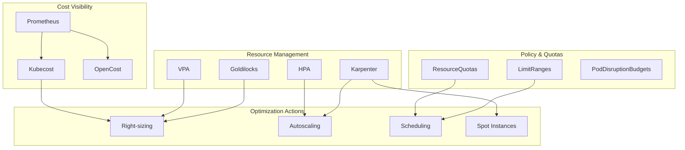

# Kubernetes Cost Optimization with Helm

Author: [nawazdhandala](https://www.github.com/nawazdhandala)

Tags: Helm, Kubernetes, DevOps, Cost Optimization, FinOps, Cloud Native, Resource Management

Description: Complete guide to optimizing Kubernetes costs using Helm charts for resource management, autoscaling, and cost visibility tools.

> Effective cost management is crucial for running Kubernetes at scale. This guide covers deploying cost optimization tools with Helm, implementing resource quotas, and configuring autoscaling for optimal resource utilization.

## Cost Optimization Architecture



## Installing Kubecost

### Add Helm Repository

```bash
helm repo add kubecost https://kubecost.github.io/cost-analyzer
helm repo update
```

### Basic Installation

```bash
helm install kubecost kubecost/cost-analyzer \
  --namespace kubecost \
  --create-namespace \
  --set kubecostToken="YOUR_TOKEN"
```

### Production Configuration

```yaml
# kubecost-values.yaml
# Global settings
global:
  prometheus:
    enabled: true
    fqdn: http://prometheus-server.monitoring.svc

# Kubecost configuration
kubecostToken: "YOUR_KUBECOST_TOKEN"

# Cost analyzer
costAnalyzer:
  resources:
    requests:
      cpu: 200m
      memory: 256Mi
    limits:
      cpu: 1000m
      memory: 1Gi

# Prometheus integration
prometheus:
  server:
    enabled: false  # Use existing Prometheus
  alertmanager:
    enabled: false
  nodeExporter:
    enabled: false
  pushgateway:
    enabled: false

# Network costs
networkCosts:
  enabled: true
  prometheusFQDN: http://prometheus-server.monitoring.svc

# Grafana
grafana:
  enabled: true
  resources:
    requests:
      cpu: 100m
      memory: 128Mi

# Ingress
ingress:
  enabled: true
  className: nginx
  hosts:
    - host: kubecost.example.com
      paths:
        - path: /
          pathType: Prefix

# Cloud provider integration
kubecostProductConfigs:
  cloudIntegrationJSON: |
    {
      "aws": [{
        "athenaBucketName": "s3://kubecost-athena-results",
        "athenaRegion": "us-east-1",
        "athenaDatabase": "athenacurcfn_kubecost",
        "athenaTable": "kubecost",
        "projectID": "123456789012",
        "serviceKeyName": "arn:aws:iam::123456789012:role/kubecost"
      }]
    }

# Savings recommendations
savings:
  enabled: true

# Product configuration
kubecostModel:
  warmCache: true
  warmSavingsCache: true
  etl: true
  maxQueryConcurrency: 5
```

## Installing OpenCost

```yaml
# opencost-values.yaml
opencost:
  exporter:
    defaultClusterId: "my-cluster"
    
    aws:
      service_key_name: ""
      service_key_secret: ""
      spot_data_region: "us-east-1"
      spot_data_bucket: "spot-pricing-bucket"
      
    extraEnv:
      CLOUD_PROVIDER_API_KEY: "YOUR_API_KEY"
      
  ui:
    enabled: true
    ingress:
      enabled: true
      ingressClassName: nginx
      hosts:
        - host: opencost.example.com
          paths:
            - /
            
  prometheus:
    internal:
      enabled: false
    external:
      enabled: true
      url: "http://prometheus-server.monitoring.svc:80"
```

```bash
helm repo add opencost https://opencost.github.io/opencost-helm-chart
helm install opencost opencost/opencost \
  --namespace opencost \
  --create-namespace \
  -f opencost-values.yaml
```

## Vertical Pod Autoscaler (VPA)

### Install VPA

```bash
helm repo add fairwinds-stable https://charts.fairwinds.com/stable
helm install vpa fairwinds-stable/vpa \
  --namespace vpa \
  --create-namespace
```

### VPA Configuration

```yaml
# vpa-values.yaml
admissionController:
  enabled: true
  replicaCount: 2
  
  resources:
    requests:
      cpu: 50m
      memory: 200Mi
    limits:
      cpu: 200m
      memory: 500Mi

recommender:
  enabled: true
  replicaCount: 1
  
  resources:
    requests:
      cpu: 50m
      memory: 500Mi
    limits:
      cpu: 200m
      memory: 1Gi

updater:
  enabled: true
  replicaCount: 1
  
  resources:
    requests:
      cpu: 50m
      memory: 500Mi
    limits:
      cpu: 200m
      memory: 1Gi
```

### VPA Policy

```yaml
# vpa-policy.yaml
apiVersion: autoscaling.k8s.io/v1
kind: VerticalPodAutoscaler
metadata:
  name: myapp-vpa
  namespace: default
spec:
  targetRef:
    apiVersion: "apps/v1"
    kind: Deployment
    name: myapp
    
  updatePolicy:
    updateMode: "Auto"  # Auto, Recreate, Initial, Off
    
  resourcePolicy:
    containerPolicies:
      - containerName: "*"
        minAllowed:
          cpu: 50m
          memory: 64Mi
        maxAllowed:
          cpu: 2000m
          memory: 2Gi
        controlledResources: ["cpu", "memory"]
        controlledValues: RequestsAndLimits
```

## Goldilocks for Right-Sizing

### Install Goldilocks

```yaml
# goldilocks-values.yaml
dashboard:
  enabled: true
  replicaCount: 1
  
  resources:
    requests:
      cpu: 50m
      memory: 64Mi
    limits:
      cpu: 200m
      memory: 256Mi
      
  ingress:
    enabled: true
    ingressClassName: nginx
    hosts:
      - host: goldilocks.example.com
        paths:
          - path: /
            pathType: Prefix

controller:
  enabled: true
  replicaCount: 1
  
  resources:
    requests:
      cpu: 50m
      memory: 64Mi
    limits:
      cpu: 200m
      memory: 256Mi

vpa:
  enabled: false  # Use existing VPA
```

```bash
helm repo add fairwinds-stable https://charts.fairwinds.com/stable
helm install goldilocks fairwinds-stable/goldilocks \
  --namespace goldilocks \
  --create-namespace \
  -f goldilocks-values.yaml
```

### Enable Goldilocks on Namespace

```bash
# Label namespace for Goldilocks
kubectl label namespace production goldilocks.fairwinds.com/enabled=true
```

## Karpenter for Node Autoscaling

### Install Karpenter

```bash
# AWS EKS
export CLUSTER_NAME=my-cluster
export AWS_REGION=us-east-1
export KARPENTER_VERSION=v0.32.0

helm upgrade --install karpenter oci://public.ecr.aws/karpenter/karpenter \
  --version "${KARPENTER_VERSION}" \
  --namespace karpenter \
  --create-namespace \
  --set settings.clusterName=${CLUSTER_NAME} \
  --set settings.interruptionQueue=${CLUSTER_NAME} \
  --set controller.resources.requests.cpu=1 \
  --set controller.resources.requests.memory=1Gi \
  --set controller.resources.limits.cpu=1 \
  --set controller.resources.limits.memory=1Gi \
  --wait
```

### Karpenter NodePool

```yaml
# karpenter-nodepool.yaml
apiVersion: karpenter.sh/v1beta1
kind: NodePool
metadata:
  name: default
spec:
  template:
    spec:
      requirements:
        - key: kubernetes.io/arch
          operator: In
          values: ["amd64"]
        - key: karpenter.sh/capacity-type
          operator: In
          values: ["spot", "on-demand"]
        - key: karpenter.k8s.aws/instance-category
          operator: In
          values: ["c", "m", "r"]
        - key: karpenter.k8s.aws/instance-generation
          operator: Gt
          values: ["2"]
      nodeClassRef:
        name: default
  limits:
    cpu: 1000
    memory: 1000Gi
  disruption:
    consolidationPolicy: WhenUnderutilized
    consolidateAfter: 30s

---
apiVersion: karpenter.k8s.aws/v1beta1
kind: EC2NodeClass
metadata:
  name: default
spec:
  amiFamily: AL2
  subnetSelectorTerms:
    - tags:
        karpenter.sh/discovery: ${CLUSTER_NAME}
  securityGroupSelectorTerms:
    - tags:
        karpenter.sh/discovery: ${CLUSTER_NAME}
  role: KarpenterNodeRole-${CLUSTER_NAME}
  tags:
    Name: karpenter-node
    Environment: production
```

## Resource Quotas and Limits

### ResourceQuota Template

```yaml
# templates/resourcequota.yaml
{{- if .Values.resourceQuota.enabled }}
apiVersion: v1
kind: ResourceQuota
metadata:
  name: {{ include "myapp.fullname" . }}-quota
  namespace: {{ .Release.Namespace }}
spec:
  hard:
    requests.cpu: {{ .Values.resourceQuota.cpu.requests | quote }}
    requests.memory: {{ .Values.resourceQuota.memory.requests | quote }}
    limits.cpu: {{ .Values.resourceQuota.cpu.limits | quote }}
    limits.memory: {{ .Values.resourceQuota.memory.limits | quote }}
    pods: {{ .Values.resourceQuota.pods | quote }}
    services: {{ .Values.resourceQuota.services | quote }}
    persistentvolumeclaims: {{ .Values.resourceQuota.pvcs | quote }}
{{- end }}
```

### LimitRange Template

```yaml
# templates/limitrange.yaml
{{- if .Values.limitRange.enabled }}
apiVersion: v1
kind: LimitRange
metadata:
  name: {{ include "myapp.fullname" . }}-limits
  namespace: {{ .Release.Namespace }}
spec:
  limits:
    - type: Container
      default:
        cpu: {{ .Values.limitRange.default.cpu | quote }}
        memory: {{ .Values.limitRange.default.memory | quote }}
      defaultRequest:
        cpu: {{ .Values.limitRange.defaultRequest.cpu | quote }}
        memory: {{ .Values.limitRange.defaultRequest.memory | quote }}
      max:
        cpu: {{ .Values.limitRange.max.cpu | quote }}
        memory: {{ .Values.limitRange.max.memory | quote }}
      min:
        cpu: {{ .Values.limitRange.min.cpu | quote }}
        memory: {{ .Values.limitRange.min.memory | quote }}
    - type: PersistentVolumeClaim
      max:
        storage: {{ .Values.limitRange.maxStorage | quote }}
      min:
        storage: {{ .Values.limitRange.minStorage | quote }}
{{- end }}
```

### Values Configuration

```yaml
# values.yaml
resourceQuota:
  enabled: true
  cpu:
    requests: "10"
    limits: "20"
  memory:
    requests: "20Gi"
    limits: "40Gi"
  pods: "50"
  services: "20"
  pvcs: "10"

limitRange:
  enabled: true
  default:
    cpu: "500m"
    memory: "512Mi"
  defaultRequest:
    cpu: "100m"
    memory: "128Mi"
  max:
    cpu: "4"
    memory: "8Gi"
  min:
    cpu: "50m"
    memory: "64Mi"
  maxStorage: "100Gi"
  minStorage: "1Gi"
```

## HPA Cost-Optimized Configuration

```yaml
# hpa-optimized.yaml
apiVersion: autoscaling/v2
kind: HorizontalPodAutoscaler
metadata:
  name: myapp-hpa
  namespace: default
spec:
  scaleTargetRef:
    apiVersion: apps/v1
    kind: Deployment
    name: myapp
    
  minReplicas: 2
  maxReplicas: 20
  
  metrics:
    - type: Resource
      resource:
        name: cpu
        target:
          type: Utilization
          averageUtilization: 70  # Higher target for cost efficiency
    - type: Resource
      resource:
        name: memory
        target:
          type: Utilization
          averageUtilization: 80
          
  behavior:
    scaleDown:
      stabilizationWindowSeconds: 300  # 5 minutes
      policies:
        - type: Percent
          value: 10
          periodSeconds: 60
        - type: Pods
          value: 4
          periodSeconds: 60
      selectPolicy: Min  # Conservative scale-down
    scaleUp:
      stabilizationWindowSeconds: 0
      policies:
        - type: Percent
          value: 100
          periodSeconds: 15
        - type: Pods
          value: 4
          periodSeconds: 15
      selectPolicy: Max
```

## Spot Instance Configuration

### Node Affinity for Spot

```yaml
# spot-tolerant-deployment.yaml
apiVersion: apps/v1
kind: Deployment
metadata:
  name: batch-processor
spec:
  replicas: 5
  template:
    spec:
      affinity:
        nodeAffinity:
          preferredDuringSchedulingIgnoredDuringExecution:
            - weight: 100
              preference:
                matchExpressions:
                  - key: karpenter.sh/capacity-type
                    operator: In
                    values:
                      - spot
      tolerations:
        - key: "karpenter.sh/capacity-type"
          operator: "Equal"
          value: "spot"
          effect: "NoSchedule"
      topologySpreadConstraints:
        - maxSkew: 1
          topologyKey: topology.kubernetes.io/zone
          whenUnsatisfiable: ScheduleAnyway
          labelSelector:
            matchLabels:
              app: batch-processor
      containers:
        - name: processor
          resources:
            requests:
              cpu: 500m
              memory: 512Mi
            limits:
              cpu: 1000m
              memory: 1Gi
```

## Cost Allocation Tags

### Helm Chart Labels

```yaml
# templates/_helpers.tpl
{{- define "myapp.costLabels" -}}
app.kubernetes.io/name: {{ include "myapp.name" . }}
app.kubernetes.io/instance: {{ .Release.Name }}
cost-center: {{ .Values.costAllocation.costCenter | default "engineering" }}
team: {{ .Values.costAllocation.team | default "platform" }}
environment: {{ .Values.environment | default "development" }}
service: {{ .Values.costAllocation.service | default .Chart.Name }}
{{- end }}
```

```yaml
# values.yaml
costAllocation:
  costCenter: "engineering"
  team: "platform"
  service: "myapp"
  owner: "team@company.com"
```

## Monitoring Dashboard

### Grafana Dashboard ConfigMap

```yaml
# cost-dashboard.yaml
apiVersion: v1
kind: ConfigMap
metadata:
  name: cost-dashboard
  labels:
    grafana_dashboard: "1"
data:
  cost-dashboard.json: |
    {
      "title": "Kubernetes Cost Overview",
      "panels": [
        {
          "title": "Monthly Cost by Namespace",
          "type": "bargauge",
          "targets": [
            {
              "expr": "sum(kubecost_cluster_costs) by (namespace)"
            }
          ]
        },
        {
          "title": "Resource Utilization",
          "type": "stat",
          "targets": [
            {
              "expr": "avg(container_cpu_usage_seconds_total) / avg(kube_pod_container_resource_requests{resource=\"cpu\"})"
            }
          ]
        },
        {
          "title": "Idle Resources",
          "type": "gauge",
          "targets": [
            {
              "expr": "sum(kube_pod_container_resource_requests{resource=\"cpu\"}) - sum(rate(container_cpu_usage_seconds_total[5m]))"
            }
          ]
        }
      ]
    }
```

## Cost Optimization Checklist

| Category | Action | Impact |
|----------|--------|--------|
| **Right-sizing** | Use VPA recommendations | 20-40% savings |
| **Autoscaling** | Implement HPA/VPA | 15-30% savings |
| **Spot instances** | Use for non-critical workloads | 60-90% savings |
| **Resource quotas** | Prevent over-provisioning | 10-20% savings |
| **Cleanup** | Remove unused resources | 5-15% savings |
| **Reserved capacity** | Commit to steady-state usage | 30-50% savings |
| **Multi-tenancy** | Shared clusters | 20-40% savings |

## Troubleshooting

```bash
# Check Kubecost status
kubectl get pods -n kubecost
kubectl logs -n kubecost deployment/kubecost-cost-analyzer

# View VPA recommendations
kubectl get vpa -A
kubectl describe vpa myapp-vpa

# Check Goldilocks
kubectl get pods -n goldilocks
kubectl get vpa -n production -l goldilocks.fairwinds.com/enabled=true

# View Karpenter logs
kubectl logs -n karpenter deployment/karpenter

# Check resource usage
kubectl top nodes
kubectl top pods -A

# View ResourceQuotas
kubectl get resourcequota -A
kubectl describe resourcequota -n production

# View LimitRanges
kubectl get limitrange -A
```

## Wrap-up

Effective Kubernetes cost optimization requires visibility, automation, and proper resource management. Use Helm to deploy cost monitoring tools like Kubecost and OpenCost, implement VPA and HPA for automatic right-sizing, and leverage Karpenter for efficient node autoscaling. Combine these tools with proper resource quotas and spot instance usage for maximum cost efficiency.
