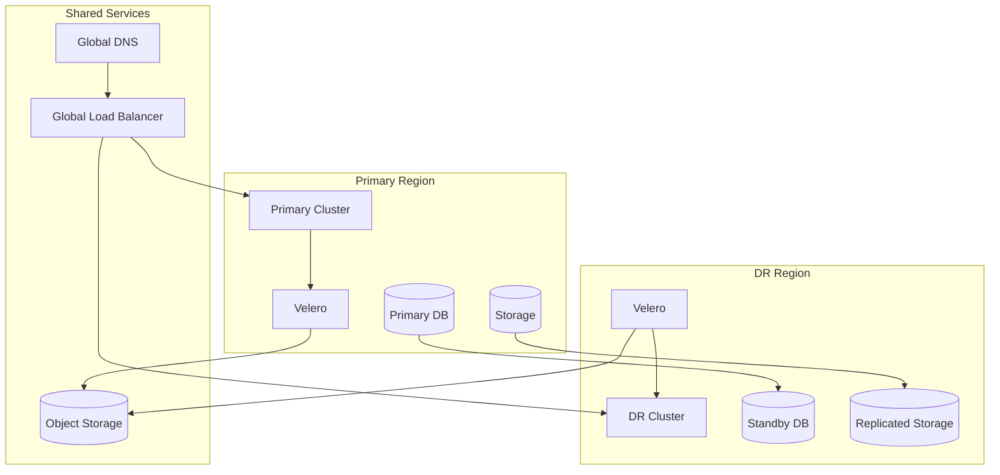

# Disaster Recovery Strategies with Helm

Author: [nawazdhandala](https://www.github.com/nawazdhandala)

Tags: Helm, Kubernetes, DevOps, Disaster Recovery, High Availability, Backup, Business Continuity

Description: Complete guide to implementing disaster recovery strategies for Kubernetes using Helm for backup, replication, and failover automation.

> Disaster recovery ensures business continuity when primary systems fail. This guide covers implementing comprehensive DR strategies for Kubernetes using Helm charts for backup, replication, and automated failover.

## Disaster Recovery Architecture



## DR Strategies Overview

| Strategy | RTO | RPO | Cost | Complexity |
|----------|-----|-----|------|------------|
| **Backup & Restore** | Hours | Hours | Low | Low |
| **Pilot Light** | Minutes | Minutes | Medium | Medium |
| **Warm Standby** | Minutes | Seconds | High | High |
| **Active-Active** | Zero | Zero | Very High | Very High |

## Backup & Restore Strategy

### Velero Configuration

```yaml
# velero-primary-values.yaml
configuration:
  backupStorageLocation:
    - name: primary
      provider: aws
      bucket: dr-backups-primary
      default: true
      config:
        region: us-east-1
        s3ForcePathStyle: "false"
        
  volumeSnapshotLocation:
    - name: primary
      provider: aws
      config:
        region: us-east-1

# Schedule backups
schedules:
  hourly-backup:
    schedule: "0 * * * *"
    template:
      includedNamespaces:
        - production
        - databases
      includeClusterResources: true
      snapshotVolumes: true
      ttl: 168h  # 7 days
      
  daily-backup:
    schedule: "0 2 * * *"
    template:
      includedNamespaces:
        - "*"
      excludedNamespaces:
        - kube-system
      includeClusterResources: true
      snapshotVolumes: true
      ttl: 720h  # 30 days
      storageLocation: primary

deployNodeAgent: true
```

### DR Cluster Velero Configuration

```yaml
# velero-dr-values.yaml
configuration:
  backupStorageLocation:
    - name: primary
      provider: aws
      bucket: dr-backups-primary  # Same bucket as primary
      default: true
      config:
        region: us-east-1
        
  volumeSnapshotLocation:
    - name: dr
      provider: aws
      config:
        region: us-west-2  # DR region

deployNodeAgent: true
```

### Automated Restore Script

```yaml
# dr-restore-job.yaml
apiVersion: batch/v1
kind: Job
metadata:
  name: dr-restore
  namespace: velero
spec:
  template:
    spec:
      serviceAccountName: velero
      containers:
        - name: restore
          image: velero/velero:v1.12.0
          command:
            - /bin/sh
            - -c
            - |
              # Get latest backup
              BACKUP=$(velero backup get --output json | \
                jq -r '.items | sort_by(.metadata.creationTimestamp) | last | .metadata.name')
              
              echo "Restoring from backup: $BACKUP"
              
              # Restore
              velero restore create --from-backup $BACKUP \
                --include-namespaces production,databases \
                --restore-volumes \
                --wait
              
              # Verify
              velero restore describe $BACKUP-restore
      restartPolicy: OnFailure
```

## Pilot Light Strategy

### Minimal DR Infrastructure

```yaml
# dr-pilot-light-values.yaml
# Minimal replicas for pilot light
replicaCount: 1

# Database in standby mode
database:
  enabled: true
  mode: standby
  replication:
    enabled: true
    primaryHost: primary-db.us-east-1.rds.amazonaws.com
    
# Message queue passive
messageQueue:
  enabled: true
  mode: passive
  
# Cache disabled until activation
cache:
  enabled: false
  
# Minimal resource allocation
resources:
  requests:
    cpu: 100m
    memory: 128Mi
  limits:
    cpu: 500m
    memory: 512Mi
```

### DR Activation Helm Chart

```yaml
# dr-activation/Chart.yaml
apiVersion: v2
name: dr-activation
description: Disaster recovery activation chart
version: 1.0.0

---
# dr-activation/values.yaml
activation:
  enabled: false
  
scaling:
  webServers: 5
  workers: 3
  
database:
  promoteStandby: true
  
dns:
  updateRecords: true
  newTarget: dr-cluster.example.com
```

```yaml
# dr-activation/templates/activation-job.yaml
{{- if .Values.activation.enabled }}
apiVersion: batch/v1
kind: Job
metadata:
  name: dr-activation-{{ now | date "20060102-150405" }}
spec:
  template:
    spec:
      containers:
        - name: activate
          image: bitnami/kubectl:latest
          command:
            - /bin/bash
            - -c
            - |
              set -e
              
              echo "Starting DR activation..."
              
              # Scale up applications
              kubectl scale deployment/web-server --replicas={{ .Values.scaling.webServers }}
              kubectl scale deployment/worker --replicas={{ .Values.scaling.workers }}
              
              # Wait for pods
              kubectl rollout status deployment/web-server --timeout=300s
              kubectl rollout status deployment/worker --timeout=300s
              
              {{- if .Values.database.promoteStandby }}
              # Promote database standby
              kubectl exec -n databases statefulset/postgresql -- \
                pg_ctl promote -D /var/lib/postgresql/data
              {{- end }}
              
              echo "DR activation complete"
      restartPolicy: Never
{{- end }}
```

## Warm Standby Strategy

### Cross-Region Database Replication

```yaml
# postgresql-primary-values.yaml
architecture: replication

primary:
  persistence:
    size: 100Gi
  resources:
    requests:
      cpu: 2
      memory: 4Gi
      
readReplicas:
  replicaCount: 2
  persistence:
    size: 100Gi
    
# Streaming replication to DR
replication:
  enabled: true
  synchronousCommit: "remote_apply"
  numSynchronousReplicas: 1
  
# Allow connections from DR region
networkPolicy:
  allowExternal: true
  extraIngress:
    - from:
        - ipBlock:
            cidr: 10.100.0.0/16  # DR VPC CIDR
```

```yaml
# postgresql-dr-values.yaml
architecture: replication

primary:
  # Read replica that can be promoted
  standbyMode: true
  primaryHost: primary-db.us-east-1.internal
  primaryPort: 5432
  
  persistence:
    size: 100Gi
    
  resources:
    requests:
      cpu: 2
      memory: 4Gi
```

### Application Warm Standby

```yaml
# app-dr-warm-values.yaml
# Run reduced replicas in DR
replicaCount: 2

# Read-only mode
config:
  readOnly: true
  primaryEndpoint: https://primary.example.com
  
# Health checks point to primary
healthCheck:
  type: external
  endpoint: https://primary.example.com/health
  
# Auto-failover configuration
failover:
  enabled: true
  checkInterval: 10s
  threshold: 3
  script: |
    # Check primary health
    if ! curl -sf https://primary.example.com/health; then
      # Activate DR mode
      kubectl annotate deployment/myapp dr-mode=active
      kubectl scale deployment/myapp --replicas=5
    fi
```

## Active-Active Strategy

### Global Load Balancing

```yaml
# global-ingress-values.yaml
# Primary cluster ingress
ingress:
  enabled: true
  annotations:
    external-dns.alpha.kubernetes.io/hostname: app.example.com
    external-dns.alpha.kubernetes.io/aws-weight: "100"
    external-dns.alpha.kubernetes.io/set-identifier: primary
    
# DR cluster ingress
# Deploy with different set-identifier
ingressDR:
  enabled: true
  annotations:
    external-dns.alpha.kubernetes.io/hostname: app.example.com
    external-dns.alpha.kubernetes.io/aws-weight: "100"
    external-dns.alpha.kubernetes.io/set-identifier: dr
```

### CockroachDB for Multi-Region

```yaml
# cockroachdb-values.yaml
conf:
  cluster-name: global-cluster
  
# Geo-distributed cluster
statefulset:
  replicas: 3
  
# Node localities
localities:
  - region=us-east-1,zone=us-east-1a
  - region=us-east-1,zone=us-east-1b
  - region=us-west-2,zone=us-west-2a

# Multi-region configuration
geo:
  enabled: true
  regions:
    - name: us-east-1
      nodeCount: 2
    - name: us-west-2
      nodeCount: 1
      
# Network for cross-region
tls:
  enabled: true
  
networkPolicy:
  enabled: true
  ingress:
    - from:
        - podSelector:
            matchLabels:
              app.kubernetes.io/name: cockroachdb
```

## Automated Failover

### Failover Controller

```yaml
# failover-controller/templates/deployment.yaml
apiVersion: apps/v1
kind: Deployment
metadata:
  name: failover-controller
spec:
  replicas: 1
  template:
    spec:
      containers:
        - name: controller
          image: myorg/failover-controller:latest
          env:
            - name: PRIMARY_ENDPOINT
              value: "https://primary.example.com/health"
            - name: CHECK_INTERVAL
              value: "10"
            - name: FAILURE_THRESHOLD
              value: "3"
            - name: DR_ACTIVATION_WEBHOOK
              value: "http://dr-activator.dr-system.svc/activate"
          resources:
            requests:
              cpu: 50m
              memory: 64Mi
```

### Failover ConfigMap

```yaml
# failover-controller/templates/configmap.yaml
apiVersion: v1
kind: ConfigMap
metadata:
  name: failover-config
data:
  config.yaml: |
    primary:
      endpoint: https://primary.example.com
      healthPath: /health
      
    checks:
      - name: api-health
        endpoint: /api/health
        interval: 10s
        timeout: 5s
        threshold: 3
        
      - name: database
        endpoint: /api/db-health
        interval: 30s
        timeout: 10s
        threshold: 2
        
    failover:
      automatic: true
      notifyChannels:
        - slack
        - pagerduty
      actions:
        - promoteDatabase
        - scalePods
        - updateDNS
```

## DNS Failover

### External-DNS Configuration

```yaml
# external-dns-values.yaml
provider: aws

domainFilters:
  - example.com

policy: sync

txtOwnerId: "{{ .Values.cluster.name }}"

# Route53 specific
aws:
  region: us-east-1
  zoneType: public

# Enable health checks
extraArgs:
  - --aws-evaluate-target-health
```

### Health Check Based Failover

```yaml
# route53-health-check.yaml
apiVersion: v1
kind: ConfigMap
metadata:
  name: dns-failover-config
data:
  primary.json: |
    {
      "Name": "primary-health-check",
      "Type": "HTTPS",
      "ResourcePath": "/health",
      "FullyQualifiedDomainName": "primary.example.com",
      "RequestInterval": 10,
      "FailureThreshold": 3
    }
    
  failover-record.json: |
    {
      "Name": "app.example.com",
      "Type": "A",
      "SetIdentifier": "primary",
      "Failover": "PRIMARY",
      "HealthCheckId": "primary-health-check-id",
      "AliasTarget": {
        "DNSName": "primary-lb.us-east-1.elb.amazonaws.com"
      }
    }
```

## DR Testing

### DR Test Helm Chart

```yaml
# dr-test/templates/test-job.yaml
apiVersion: batch/v1
kind: Job
metadata:
  name: dr-test-{{ now | date "20060102" }}
  annotations:
    helm.sh/hook: post-install
spec:
  template:
    spec:
      containers:
        - name: dr-test
          image: myorg/dr-tester:latest
          env:
            - name: TEST_TYPE
              value: {{ .Values.testType | default "read-only" }}
          command:
            - /bin/bash
            - -c
            - |
              echo "Starting DR test..."
              
              # Test 1: Verify backup restoration
              echo "Testing backup restoration..."
              velero backup get | head -5
              
              # Test 2: Verify database connectivity
              echo "Testing database connectivity..."
              psql -h $DB_HOST -U $DB_USER -c "SELECT 1"
              
              # Test 3: Verify application health
              echo "Testing application health..."
              curl -sf http://myapp.dr.svc/health
              
              # Test 4: Verify DNS resolution
              echo "Testing DNS resolution..."
              nslookup app.example.com
              
              {{- if eq .Values.testType "full-failover" }}
              # Full failover test
              echo "Performing full failover test..."
              
              # Simulate primary failure
              kubectl annotate deployment/myapp test-mode=dr-active
              
              # Scale up DR
              kubectl scale deployment/myapp --replicas={{ .Values.app.replicas }}
              
              # Wait and verify
              sleep 60
              curl -sf http://myapp.dr.svc/health
              
              # Restore
              kubectl scale deployment/myapp --replicas=2
              kubectl annotate deployment/myapp test-mode-
              {{- end }}
              
              echo "DR test complete"
      restartPolicy: Never
```

### Scheduled DR Tests

```yaml
# dr-test-cronjob.yaml
apiVersion: batch/v1
kind: CronJob
metadata:
  name: monthly-dr-test
spec:
  schedule: "0 2 1 * *"  # First day of month at 2 AM
  jobTemplate:
    spec:
      template:
        spec:
          containers:
            - name: dr-test
              image: myorg/dr-tester:latest
              args: ["--type", "read-only"]
          restartPolicy: OnFailure
```

## Monitoring DR Readiness

### Prometheus Alerts

```yaml
# dr-alerts.yaml
apiVersion: monitoring.coreos.com/v1
kind: PrometheusRule
metadata:
  name: dr-alerts
spec:
  groups:
    - name: disaster-recovery
      rules:
        - alert: BackupFailed
          expr: |
            increase(velero_backup_failure_total[1h]) > 0
          for: 5m
          labels:
            severity: critical
          annotations:
            summary: Backup failed
            
        - alert: BackupTooOld
          expr: |
            time() - velero_backup_last_successful_timestamp > 86400
          for: 1h
          labels:
            severity: warning
          annotations:
            summary: No successful backup in 24 hours
            
        - alert: DRSiteUnhealthy
          expr: |
            probe_success{job="dr-site-health"} == 0
          for: 5m
          labels:
            severity: critical
          annotations:
            summary: DR site is unhealthy
            
        - alert: ReplicationLag
          expr: |
            pg_replication_lag_seconds > 300
          for: 5m
          labels:
            severity: warning
          annotations:
            summary: Database replication lag exceeds 5 minutes
```

### DR Dashboard

```yaml
# grafana-dr-dashboard.yaml
apiVersion: v1
kind: ConfigMap
metadata:
  name: dr-dashboard
  labels:
    grafana_dashboard: "1"
data:
  dr-dashboard.json: |
    {
      "title": "Disaster Recovery Status",
      "panels": [
        {
          "title": "Last Backup Age",
          "type": "stat",
          "targets": [{
            "expr": "time() - velero_backup_last_successful_timestamp"
          }]
        },
        {
          "title": "Replication Lag",
          "type": "gauge",
          "targets": [{
            "expr": "pg_replication_lag_seconds"
          }]
        },
        {
          "title": "DR Site Health",
          "type": "stat",
          "targets": [{
            "expr": "probe_success{job=\"dr-site-health\"}"
          }]
        }
      ]
    }
```

## Wrap-up

Disaster recovery for Kubernetes requires careful planning and regular testing. Use Helm to deploy backup solutions like Velero, configure cross-region replication for databases, and implement automated failover mechanisms. Choose a DR strategy based on your RTO/RPO requirements and test regularly to ensure readiness. Monitor backup health and replication lag to maintain DR readiness at all times.
