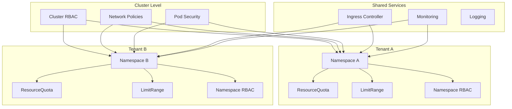

# Multi-Tenancy Patterns with Helm

Author: [nawazdhandala](https://www.github.com/nawazdhandala)

Tags: Helm, Kubernetes, DevOps, Multi-Tenancy, Security, Resource Management, Isolation

Description: Complete guide to implementing multi-tenancy patterns in Kubernetes using Helm for namespace isolation, resource quotas, and tenant management.

> Multi-tenancy enables multiple teams or customers to share a Kubernetes cluster while maintaining isolation. This guide covers implementing multi-tenancy patterns using Helm charts for secure, scalable tenant management.

## Multi-Tenancy Architecture



## Tenant Helm Chart

### Chart Structure

```
tenant-chart/
├── Chart.yaml
├── values.yaml
├── templates/
│   ├── _helpers.tpl
│   ├── namespace.yaml
│   ├── resourcequota.yaml
│   ├── limitrange.yaml
│   ├── networkpolicy.yaml
│   ├── rbac.yaml
│   ├── serviceaccount.yaml
│   └── secrets.yaml
```

### Chart.yaml

```yaml
apiVersion: v2
name: tenant
description: Multi-tenant namespace provisioning chart
version: 1.0.0
appVersion: "1.0.0"
```

### values.yaml

```yaml
# Tenant configuration
tenant:
  name: ""
  displayName: ""
  owner: ""
  contact: ""
  costCenter: ""

# Namespace settings
namespace:
  labels: {}
  annotations: {}

# Resource quotas
resourceQuota:
  enabled: true
  cpu:
    requests: "10"
    limits: "20"
  memory:
    requests: "20Gi"
    limits: "40Gi"
  pods: "50"
  services: "20"
  secrets: "50"
  configmaps: "50"
  persistentvolumeclaims: "10"
  
# Limit ranges
limitRange:
  enabled: true
  container:
    default:
      cpu: "500m"
      memory: "512Mi"
    defaultRequest:
      cpu: "100m"
      memory: "128Mi"
    max:
      cpu: "4"
      memory: "8Gi"
    min:
      cpu: "50m"
      memory: "64Mi"
  pod:
    max:
      cpu: "8"
      memory: "16Gi"
      
# Network policies
networkPolicy:
  enabled: true
  allowIngressFrom:
    - namespaceSelector:
        matchLabels:
          name: ingress-nginx
  allowEgressTo:
    - namespaceSelector: {}
      podSelector:
        matchLabels:
          k8s-app: kube-dns
    - ipBlock:
        cidr: 0.0.0.0/0
        except:
          - 10.0.0.0/8
          - 172.16.0.0/12
          - 192.168.0.0/16

# RBAC
rbac:
  enabled: true
  admins: []
  developers: []
  viewers: []

# Service accounts
serviceAccounts:
  - name: default
    secrets: []
  - name: deployer
    secrets: []
```

### Namespace Template

```yaml
# templates/namespace.yaml
apiVersion: v1
kind: Namespace
metadata:
  name: {{ required "tenant.name is required" .Values.tenant.name }}
  labels:
    {{- include "tenant.labels" . | nindent 4 }}
    tenant: {{ .Values.tenant.name }}
    cost-center: {{ .Values.tenant.costCenter | default "unknown" }}
    {{- with .Values.namespace.labels }}
    {{- toYaml . | nindent 4 }}
    {{- end }}
  annotations:
    tenant.kubernetes.io/owner: {{ .Values.tenant.owner | default "unknown" }}
    tenant.kubernetes.io/contact: {{ .Values.tenant.contact | default "unknown" }}
    tenant.kubernetes.io/display-name: {{ .Values.tenant.displayName | default .Values.tenant.name }}
    {{- with .Values.namespace.annotations }}
    {{- toYaml . | nindent 4 }}
    {{- end }}
```

### ResourceQuota Template

```yaml
# templates/resourcequota.yaml
{{- if .Values.resourceQuota.enabled }}
apiVersion: v1
kind: ResourceQuota
metadata:
  name: {{ .Values.tenant.name }}-quota
  namespace: {{ .Values.tenant.name }}
  labels:
    {{- include "tenant.labels" . | nindent 4 }}
spec:
  hard:
    # Compute resources
    requests.cpu: {{ .Values.resourceQuota.cpu.requests | quote }}
    requests.memory: {{ .Values.resourceQuota.memory.requests | quote }}
    limits.cpu: {{ .Values.resourceQuota.cpu.limits | quote }}
    limits.memory: {{ .Values.resourceQuota.memory.limits | quote }}
    
    # Object counts
    pods: {{ .Values.resourceQuota.pods | quote }}
    services: {{ .Values.resourceQuota.services | quote }}
    secrets: {{ .Values.resourceQuota.secrets | quote }}
    configmaps: {{ .Values.resourceQuota.configmaps | quote }}
    persistentvolumeclaims: {{ .Values.resourceQuota.persistentvolumeclaims | quote }}
    
    # Storage
    {{- if .Values.resourceQuota.storage }}
    requests.storage: {{ .Values.resourceQuota.storage.requests | quote }}
    {{- end }}
{{- end }}
```

### LimitRange Template

```yaml
# templates/limitrange.yaml
{{- if .Values.limitRange.enabled }}
apiVersion: v1
kind: LimitRange
metadata:
  name: {{ .Values.tenant.name }}-limits
  namespace: {{ .Values.tenant.name }}
  labels:
    {{- include "tenant.labels" . | nindent 4 }}
spec:
  limits:
    - type: Container
      default:
        cpu: {{ .Values.limitRange.container.default.cpu }}
        memory: {{ .Values.limitRange.container.default.memory }}
      defaultRequest:
        cpu: {{ .Values.limitRange.container.defaultRequest.cpu }}
        memory: {{ .Values.limitRange.container.defaultRequest.memory }}
      max:
        cpu: {{ .Values.limitRange.container.max.cpu }}
        memory: {{ .Values.limitRange.container.max.memory }}
      min:
        cpu: {{ .Values.limitRange.container.min.cpu }}
        memory: {{ .Values.limitRange.container.min.memory }}
    - type: Pod
      max:
        cpu: {{ .Values.limitRange.pod.max.cpu }}
        memory: {{ .Values.limitRange.pod.max.memory }}
    {{- if .Values.limitRange.pvc }}
    - type: PersistentVolumeClaim
      max:
        storage: {{ .Values.limitRange.pvc.max }}
      min:
        storage: {{ .Values.limitRange.pvc.min }}
    {{- end }}
{{- end }}
```

### NetworkPolicy Template

```yaml
# templates/networkpolicy.yaml
{{- if .Values.networkPolicy.enabled }}
# Default deny all ingress
apiVersion: networking.k8s.io/v1
kind: NetworkPolicy
metadata:
  name: default-deny-ingress
  namespace: {{ .Values.tenant.name }}
  labels:
    {{- include "tenant.labels" . | nindent 4 }}
spec:
  podSelector: {}
  policyTypes:
    - Ingress

---
# Default deny all egress
apiVersion: networking.k8s.io/v1
kind: NetworkPolicy
metadata:
  name: default-deny-egress
  namespace: {{ .Values.tenant.name }}
  labels:
    {{- include "tenant.labels" . | nindent 4 }}
spec:
  podSelector: {}
  policyTypes:
    - Egress

---
# Allow ingress from specific namespaces
apiVersion: networking.k8s.io/v1
kind: NetworkPolicy
metadata:
  name: allow-ingress
  namespace: {{ .Values.tenant.name }}
  labels:
    {{- include "tenant.labels" . | nindent 4 }}
spec:
  podSelector: {}
  policyTypes:
    - Ingress
  ingress:
    # Allow from same namespace
    - from:
        - podSelector: {}
    {{- with .Values.networkPolicy.allowIngressFrom }}
    # Allow from specified namespaces
    - from:
        {{- toYaml . | nindent 8 }}
    {{- end }}

---
# Allow egress to DNS and external
apiVersion: networking.k8s.io/v1
kind: NetworkPolicy
metadata:
  name: allow-egress
  namespace: {{ .Values.tenant.name }}
  labels:
    {{- include "tenant.labels" . | nindent 4 }}
spec:
  podSelector: {}
  policyTypes:
    - Egress
  egress:
    # Allow to same namespace
    - to:
        - podSelector: {}
    {{- with .Values.networkPolicy.allowEgressTo }}
    # Allow to specified destinations
    {{- range . }}
    - to:
        {{- if .namespaceSelector }}
        - namespaceSelector:
            {{- toYaml .namespaceSelector | nindent 12 }}
          {{- if .podSelector }}
          podSelector:
            {{- toYaml .podSelector | nindent 12 }}
          {{- end }}
        {{- end }}
        {{- if .ipBlock }}
        - ipBlock:
            {{- toYaml .ipBlock | nindent 12 }}
        {{- end }}
      {{- if .ports }}
      ports:
        {{- toYaml .ports | nindent 8 }}
      {{- end }}
    {{- end }}
    {{- end }}
{{- end }}
```

### RBAC Template

```yaml
# templates/rbac.yaml
{{- if .Values.rbac.enabled }}
# Admin role
apiVersion: rbac.authorization.k8s.io/v1
kind: Role
metadata:
  name: tenant-admin
  namespace: {{ .Values.tenant.name }}
  labels:
    {{- include "tenant.labels" . | nindent 4 }}
rules:
  - apiGroups: ["*"]
    resources: ["*"]
    verbs: ["*"]

---
# Developer role
apiVersion: rbac.authorization.k8s.io/v1
kind: Role
metadata:
  name: tenant-developer
  namespace: {{ .Values.tenant.name }}
  labels:
    {{- include "tenant.labels" . | nindent 4 }}
rules:
  - apiGroups: ["", "apps", "batch", "extensions"]
    resources: ["deployments", "replicasets", "pods", "services", "configmaps", "secrets", "jobs", "cronjobs"]
    verbs: ["get", "list", "watch", "create", "update", "patch", "delete"]
  - apiGroups: [""]
    resources: ["pods/log", "pods/exec", "pods/portforward"]
    verbs: ["get", "list", "create"]

---
# Viewer role
apiVersion: rbac.authorization.k8s.io/v1
kind: Role
metadata:
  name: tenant-viewer
  namespace: {{ .Values.tenant.name }}
  labels:
    {{- include "tenant.labels" . | nindent 4 }}
rules:
  - apiGroups: ["*"]
    resources: ["*"]
    verbs: ["get", "list", "watch"]

---
# Admin RoleBindings
{{- range .Values.rbac.admins }}
apiVersion: rbac.authorization.k8s.io/v1
kind: RoleBinding
metadata:
  name: tenant-admin-{{ . | replace "@" "-at-" | replace "." "-" }}
  namespace: {{ $.Values.tenant.name }}
  labels:
    {{- include "tenant.labels" $ | nindent 4 }}
roleRef:
  apiGroup: rbac.authorization.k8s.io
  kind: Role
  name: tenant-admin
subjects:
  - kind: User
    name: {{ . }}
    apiGroup: rbac.authorization.k8s.io
---
{{- end }}

# Developer RoleBindings
{{- range .Values.rbac.developers }}
apiVersion: rbac.authorization.k8s.io/v1
kind: RoleBinding
metadata:
  name: tenant-developer-{{ . | replace "@" "-at-" | replace "." "-" }}
  namespace: {{ $.Values.tenant.name }}
  labels:
    {{- include "tenant.labels" $ | nindent 4 }}
roleRef:
  apiGroup: rbac.authorization.k8s.io
  kind: Role
  name: tenant-developer
subjects:
  - kind: User
    name: {{ . }}
    apiGroup: rbac.authorization.k8s.io
---
{{- end }}

# Viewer RoleBindings
{{- range .Values.rbac.viewers }}
apiVersion: rbac.authorization.k8s.io/v1
kind: RoleBinding
metadata:
  name: tenant-viewer-{{ . | replace "@" "-at-" | replace "." "-" }}
  namespace: {{ $.Values.tenant.name }}
  labels:
    {{- include "tenant.labels" $ | nindent 4 }}
roleRef:
  apiGroup: rbac.authorization.k8s.io
  kind: Role
  name: tenant-viewer
subjects:
  - kind: User
    name: {{ . }}
    apiGroup: rbac.authorization.k8s.io
---
{{- end }}
{{- end }}
```

## Pod Security Standards

### Pod Security Admission

```yaml
# templates/namespace.yaml (updated)
apiVersion: v1
kind: Namespace
metadata:
  name: {{ .Values.tenant.name }}
  labels:
    {{- include "tenant.labels" . | nindent 4 }}
    tenant: {{ .Values.tenant.name }}
    # Pod Security Standards
    pod-security.kubernetes.io/enforce: {{ .Values.podSecurity.enforce | default "restricted" }}
    pod-security.kubernetes.io/audit: {{ .Values.podSecurity.audit | default "restricted" }}
    pod-security.kubernetes.io/warn: {{ .Values.podSecurity.warn | default "restricted" }}
```

### Values for Pod Security

```yaml
# values.yaml (addition)
podSecurity:
  enforce: restricted  # privileged, baseline, restricted
  audit: restricted
  warn: restricted
```

## Tenant Tiers

### Tiered Configuration

```yaml
# values-small.yaml
tenant:
  tier: small

resourceQuota:
  enabled: true
  cpu:
    requests: "4"
    limits: "8"
  memory:
    requests: "8Gi"
    limits: "16Gi"
  pods: "20"
  services: "10"
```

```yaml
# values-medium.yaml
tenant:
  tier: medium

resourceQuota:
  enabled: true
  cpu:
    requests: "16"
    limits: "32"
  memory:
    requests: "32Gi"
    limits: "64Gi"
  pods: "50"
  services: "25"
```

```yaml
# values-large.yaml
tenant:
  tier: large

resourceQuota:
  enabled: true
  cpu:
    requests: "64"
    limits: "128"
  memory:
    requests: "128Gi"
    limits: "256Gi"
  pods: "200"
  services: "100"
```

### Deploy with Tier

```bash
# Deploy small tenant
helm install tenant-teamA ./tenant-chart \
  --set tenant.name=team-a \
  --set tenant.owner=admin@teama.com \
  -f values-small.yaml

# Deploy large tenant
helm install tenant-enterprise ./tenant-chart \
  --set tenant.name=enterprise \
  --set tenant.owner=admin@enterprise.com \
  -f values-large.yaml
```

## Hierarchical Namespaces

### HNC Installation

```bash
kubectl apply -f https://github.com/kubernetes-sigs/hierarchical-namespaces/releases/download/v1.1.0/default.yaml
```

### Parent-Child Tenant Structure

```yaml
# parent-tenant.yaml
apiVersion: v1
kind: Namespace
metadata:
  name: org-acme
  labels:
    tenant-type: organization

---
apiVersion: hnc.x-k8s.io/v1alpha2
kind: HierarchyConfiguration
metadata:
  name: hierarchy
  namespace: org-acme
spec:
  allowCascadingDeletion: true
```

```yaml
# child-tenant.yaml
apiVersion: v1
kind: Namespace
metadata:
  name: org-acme-team-a
  labels:
    tenant-type: team

---
apiVersion: hnc.x-k8s.io/v1alpha2
kind: SubnamespaceAnchor
metadata:
  name: team-a
  namespace: org-acme
```

## Tenant Onboarding Automation

### GitOps Tenant Configuration

```yaml
# tenants/team-a/kustomization.yaml
apiVersion: kustomize.config.k8s.io/v1beta1
kind: Kustomization
resources:
  - ../../base/tenant
helmCharts:
  - name: tenant
    releaseName: tenant-team-a
    namespace: flux-system
    valuesFile: values.yaml
```

```yaml
# tenants/team-a/values.yaml
tenant:
  name: team-a
  displayName: "Team A"
  owner: "team-a-admin@company.com"
  contact: "team-a@company.com"
  costCenter: "CC-1001"

resourceQuota:
  cpu:
    requests: "10"
    limits: "20"

rbac:
  admins:
    - alice@company.com
  developers:
    - bob@company.com
    - carol@company.com
  viewers:
    - david@company.com
```

### Tenant Provisioning Script

```bash
#!/bin/bash
# provision-tenant.sh

TENANT_NAME=$1
TENANT_TIER=${2:-small}
TENANT_OWNER=$3

if [ -z "$TENANT_NAME" ] || [ -z "$TENANT_OWNER" ]; then
  echo "Usage: $0 <tenant-name> [tier] <owner-email>"
  exit 1
fi

# Create tenant directory
mkdir -p tenants/${TENANT_NAME}

# Generate values
cat > tenants/${TENANT_NAME}/values.yaml <<EOF
tenant:
  name: ${TENANT_NAME}
  owner: ${TENANT_OWNER}
  tier: ${TENANT_TIER}
EOF

# Deploy tenant
helm install tenant-${TENANT_NAME} ./tenant-chart \
  -f values-${TENANT_TIER}.yaml \
  -f tenants/${TENANT_NAME}/values.yaml

echo "Tenant ${TENANT_NAME} provisioned successfully"
```

## Monitoring Multi-Tenant Clusters

### ServiceMonitor for Tenants

```yaml
# templates/servicemonitor.yaml
{{- if .Values.monitoring.enabled }}
apiVersion: monitoring.coreos.com/v1
kind: ServiceMonitor
metadata:
  name: {{ .Values.tenant.name }}-apps
  namespace: {{ .Values.tenant.name }}
  labels:
    {{- include "tenant.labels" . | nindent 4 }}
spec:
  selector:
    matchLabels:
      tenant: {{ .Values.tenant.name }}
  endpoints:
    - port: metrics
      interval: 30s
{{- end }}
```

### Tenant-Scoped Grafana Dashboards

```yaml
# templates/grafana-dashboard.yaml
{{- if .Values.monitoring.dashboards.enabled }}
apiVersion: v1
kind: ConfigMap
metadata:
  name: {{ .Values.tenant.name }}-dashboard
  namespace: {{ .Values.monitoring.namespace | default "monitoring" }}
  labels:
    grafana_dashboard: "1"
data:
  {{ .Values.tenant.name }}.json: |
    {
      "title": "{{ .Values.tenant.displayName | default .Values.tenant.name }} Dashboard",
      "templating": {
        "list": [
          {
            "name": "namespace",
            "query": "{{ .Values.tenant.name }}",
            "hide": 2
          }
        ]
      }
    }
{{- end }}
```

## Troubleshooting

```bash
# List all tenant namespaces
kubectl get ns -l tenant

# Check resource usage
kubectl top pods -n tenant-a
kubectl describe resourcequota -n tenant-a

# Check network policies
kubectl get networkpolicy -n tenant-a

# Verify RBAC
kubectl auth can-i --list -n tenant-a --as=user@company.com

# Check PodSecurityStandard violations
kubectl get events -n tenant-a --field-selector reason=FailedCreate

# List tenant resources
kubectl get all -n tenant-a
```

## Best Practices

| Practice | Recommendation |
|----------|----------------|
| **Isolation** | Use NetworkPolicies for network isolation |
| **Quotas** | Always set ResourceQuotas and LimitRanges |
| **RBAC** | Implement least-privilege access |
| **Pod Security** | Enforce restricted pod security standards |
| **Monitoring** | Provide tenant-specific dashboards |
| **Automation** | Use GitOps for tenant provisioning |
| **Audit** | Enable audit logging for all tenants |

## Wrap-up

Multi-tenancy in Kubernetes requires careful consideration of isolation, resource management, and security. Use Helm charts to standardize tenant provisioning with namespaces, ResourceQuotas, LimitRanges, NetworkPolicies, and RBAC. Implement tiered configurations for different tenant sizes and automate provisioning through GitOps workflows.
