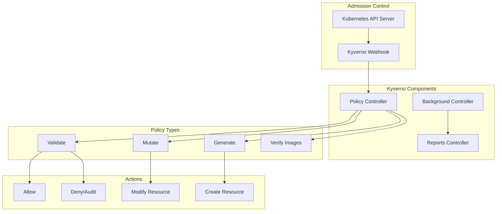

# Kubernetes Policy Management with Helm and Kyverno

Author: [nawazdhandala](https://www.github.com/nawazdhandala)

Tags: Helm, Kubernetes, DevOps, Security, Kyverno, Policy, Compliance

Description: Complete guide to deploying Kyverno with Helm for Kubernetes-native policy management, validation, mutation, and generation.

> Kyverno is a Kubernetes-native policy engine that uses Kubernetes resources for policies. This guide covers deploying Kyverno with Helm and implementing validation, mutation, and generation policies.

## Kyverno Architecture



## Installing Kyverno

### Add Helm Repository

```bash
# Add Kyverno Helm repository
helm repo add kyverno https://kyverno.github.io/kyverno
helm repo update

# Create namespace
kubectl create namespace kyverno
```

### Basic Installation

```bash
helm install kyverno kyverno/kyverno \
  --namespace kyverno \
  --wait
```

### Production Configuration

```yaml
# kyverno-values.yaml
# Global settings
crds:
  install: true

# Admission controller
admissionController:
  replicas: 3
  
  resources:
    limits:
      cpu: 1000m
      memory: 512Mi
    requests:
      cpu: 100m
      memory: 128Mi
      
  affinity:
    podAntiAffinity:
      preferredDuringSchedulingIgnoredDuringExecution:
        - weight: 100
          podAffinityTerm:
            labelSelector:
              matchExpressions:
                - key: app.kubernetes.io/component
                  operator: In
                  values:
                    - admission-controller
            topologyKey: kubernetes.io/hostname
            
  podDisruptionBudget:
    enabled: true
    minAvailable: 1

# Background controller
backgroundController:
  replicas: 2
  
  resources:
    limits:
      cpu: 500m
      memory: 256Mi
    requests:
      cpu: 100m
      memory: 64Mi

# Reports controller
reportsController:
  replicas: 2
  
  resources:
    limits:
      cpu: 500m
      memory: 256Mi
    requests:
      cpu: 100m
      memory: 64Mi

# Cleanup controller
cleanupController:
  replicas: 1
  
  resources:
    limits:
      cpu: 200m
      memory: 128Mi
    requests:
      cpu: 50m
      memory: 64Mi

# Webhook configuration
config:
  webhooks:
    - objectSelector:
        matchExpressions:
          - key: kyverno.io/policy-validation
            operator: DoesNotExist
            
  # Exclude namespaces
  excludeGroups:
    - system:nodes
  excludeUsernames:
    - system:kube-scheduler
  excludeRoles: []
  excludeClusterRoles: []
  
  # Resource filters
  resourceFilters:
    - "[Event,*,*]"
    - "[*,kube-system,*]"
    - "[*,kube-public,*]"
    - "[*,kube-node-lease,*]"
    - "[*,kyverno,*]"

# Metrics
metricsConfig:
  metricsExposure:
    enabled: true

# Service monitor
serviceMonitor:
  enabled: true
  additionalLabels:
    release: prometheus

# Feature flags
features:
  logging:
    format: text
    verbosity: 2
  policyExceptions:
    enabled: true
  admissionReports:
    enabled: true
  backgroundScan:
    enabled: true
    backgroundScanWorkers: 2
    backgroundScanInterval: 1h
```

```bash
# Install with production values
helm install kyverno kyverno/kyverno \
  --namespace kyverno \
  -f kyverno-values.yaml
```

## Validation Policies

### Require Labels

```yaml
# require-labels-policy.yaml
apiVersion: kyverno.io/v1
kind: ClusterPolicy
metadata:
  name: require-labels
  annotations:
    policies.kyverno.io/title: Require Labels
    policies.kyverno.io/category: Best Practices
    policies.kyverno.io/severity: medium
    policies.kyverno.io/subject: Pod, Label
    policies.kyverno.io/description: >-
      Define labels to ensure proper resource management.
spec:
  validationFailureAction: Enforce  # or Audit
  background: true
  rules:
    - name: require-team-label
      match:
        any:
          - resources:
              kinds:
                - Deployment
                - StatefulSet
                - DaemonSet
      validate:
        message: "Label 'team' is required"
        pattern:
          metadata:
            labels:
              team: "?*"
              
    - name: require-environment-label
      match:
        any:
          - resources:
              kinds:
                - Deployment
                - StatefulSet
      exclude:
        any:
          - resources:
              namespaces:
                - kube-system
      validate:
        message: "Label 'environment' is required and must be dev, staging, or production"
        pattern:
          metadata:
            labels:
              environment: "dev | staging | production"
```

### Container Resource Limits

```yaml
# require-resource-limits.yaml
apiVersion: kyverno.io/v1
kind: ClusterPolicy
metadata:
  name: require-resource-limits
  annotations:
    policies.kyverno.io/title: Require Resource Limits
    policies.kyverno.io/severity: medium
spec:
  validationFailureAction: Enforce
  background: true
  rules:
    - name: require-cpu-limit
      match:
        any:
          - resources:
              kinds:
                - Pod
      validate:
        message: "CPU limit is required for all containers"
        pattern:
          spec:
            containers:
              - resources:
                  limits:
                    cpu: "?*"
                    
    - name: require-memory-limit
      match:
        any:
          - resources:
              kinds:
                - Pod
      validate:
        message: "Memory limit is required for all containers"
        pattern:
          spec:
            containers:
              - resources:
                  limits:
                    memory: "?*"
                    
    - name: validate-resource-ratio
      match:
        any:
          - resources:
              kinds:
                - Pod
      preconditions:
        all:
          - key: "{{ request.object.spec.containers[].resources.requests.memory || '' }}"
            operator: NotEquals
            value: ""
      validate:
        message: "Memory limit should not exceed 4x the memory request"
        foreach:
          - list: "request.object.spec.containers"
            deny:
              conditions:
                all:
                  - key: "{{ divide(`{{ element.resources.limits.memory }}`, `{{ element.resources.requests.memory }}`) }}"
                    operator: GreaterThan
                    value: 4
```

### Allowed Image Registries

```yaml
# allowed-registries.yaml
apiVersion: kyverno.io/v1
kind: ClusterPolicy
metadata:
  name: allowed-image-registries
  annotations:
    policies.kyverno.io/title: Restrict Image Registries
    policies.kyverno.io/severity: high
spec:
  validationFailureAction: Enforce
  background: true
  rules:
    - name: validate-registries
      match:
        any:
          - resources:
              kinds:
                - Pod
      validate:
        message: "Images must be from approved registries"
        pattern:
          spec:
            containers:
              - image: "gcr.io/myorg/* | ghcr.io/myorg/* | docker.io/myorg/*"
            =(initContainers):
              - image: "gcr.io/myorg/* | ghcr.io/myorg/* | docker.io/myorg/*"
```

### Block Privileged Containers

```yaml
# disallow-privileged.yaml
apiVersion: kyverno.io/v1
kind: ClusterPolicy
metadata:
  name: disallow-privileged-containers
  annotations:
    policies.kyverno.io/title: Disallow Privileged Containers
    policies.kyverno.io/severity: high
spec:
  validationFailureAction: Enforce
  background: true
  rules:
    - name: deny-privileged
      match:
        any:
          - resources:
              kinds:
                - Pod
      validate:
        message: "Privileged containers are not allowed"
        pattern:
          spec:
            containers:
              - =(securityContext):
                  =(privileged): false
            =(initContainers):
              - =(securityContext):
                  =(privileged): false
                  
    - name: deny-privilege-escalation
      match:
        any:
          - resources:
              kinds:
                - Pod
      validate:
        message: "Privilege escalation is not allowed"
        pattern:
          spec:
            containers:
              - securityContext:
                  allowPrivilegeEscalation: false
```

### Require Probes

```yaml
# require-probes.yaml
apiVersion: kyverno.io/v1
kind: ClusterPolicy
metadata:
  name: require-probes
  annotations:
    policies.kyverno.io/title: Require Health Probes
    policies.kyverno.io/severity: medium
spec:
  validationFailureAction: Audit
  background: true
  rules:
    - name: require-readiness-probe
      match:
        any:
          - resources:
              kinds:
                - Deployment
                - StatefulSet
      validate:
        message: "Readiness probe is required"
        pattern:
          spec:
            template:
              spec:
                containers:
                  - readinessProbe:
                      httpGet:
                        path: "?*"
                        port: "?*"
                        
    - name: require-liveness-probe
      match:
        any:
          - resources:
              kinds:
                - Deployment
                - StatefulSet
      validate:
        message: "Liveness probe is required"
        pattern:
          spec:
            template:
              spec:
                containers:
                  - livenessProbe:
                      httpGet:
                        path: "?*"
                        port: "?*"
```

## Mutation Policies

### Add Default Labels

```yaml
# add-default-labels.yaml
apiVersion: kyverno.io/v1
kind: ClusterPolicy
metadata:
  name: add-default-labels
  annotations:
    policies.kyverno.io/title: Add Default Labels
spec:
  rules:
    - name: add-labels
      match:
        any:
          - resources:
              kinds:
                - Deployment
                - StatefulSet
                - DaemonSet
      mutate:
        patchStrategicMerge:
          metadata:
            labels:
              +(managed-by): kyverno
              +(created-at): "{{ time_now_utc() }}"
          spec:
            template:
              metadata:
                labels:
                  +(managed-by): kyverno
```

### Add Default Resource Limits

```yaml
# add-default-limits.yaml
apiVersion: kyverno.io/v1
kind: ClusterPolicy
metadata:
  name: add-default-resource-limits
spec:
  rules:
    - name: add-default-limits
      match:
        any:
          - resources:
              kinds:
                - Pod
      mutate:
        foreach:
          - list: "request.object.spec.containers"
            patchStrategicMerge:
              spec:
                containers:
                  - name: "{{ element.name }}"
                    resources:
                      limits:
                        +(memory): "512Mi"
                        +(cpu): "500m"
                      requests:
                        +(memory): "128Mi"
                        +(cpu): "100m"
```

### Add Sidecar Container

```yaml
# inject-sidecar.yaml
apiVersion: kyverno.io/v1
kind: ClusterPolicy
metadata:
  name: inject-logging-sidecar
spec:
  rules:
    - name: inject-fluentbit
      match:
        any:
          - resources:
              kinds:
                - Pod
              selector:
                matchLabels:
                  inject-logging: "true"
      mutate:
        patchStrategicMerge:
          spec:
            containers:
              - name: fluent-bit
                image: fluent/fluent-bit:latest
                resources:
                  limits:
                    memory: 100Mi
                    cpu: 100m
                volumeMounts:
                  - name: varlog
                    mountPath: /var/log
            volumes:
              - name: varlog
                emptyDir: {}
```

### Add Image Pull Secrets

```yaml
# add-imagepullsecrets.yaml
apiVersion: kyverno.io/v1
kind: ClusterPolicy
metadata:
  name: add-image-pull-secrets
spec:
  rules:
    - name: add-pull-secret
      match:
        any:
          - resources:
              kinds:
                - Pod
      mutate:
        patchStrategicMerge:
          spec:
            imagePullSecrets:
              - name: registry-credentials
```

## Generation Policies

### Generate NetworkPolicy

```yaml
# generate-networkpolicy.yaml
apiVersion: kyverno.io/v1
kind: ClusterPolicy
metadata:
  name: generate-default-networkpolicy
spec:
  rules:
    - name: generate-deny-all
      match:
        any:
          - resources:
              kinds:
                - Namespace
              selector:
                matchLabels:
                  network-policy: "enabled"
      generate:
        apiVersion: networking.k8s.io/v1
        kind: NetworkPolicy
        name: deny-all
        namespace: "{{ request.object.metadata.name }}"
        data:
          spec:
            podSelector: {}
            policyTypes:
              - Ingress
              - Egress
```

### Generate ResourceQuota

```yaml
# generate-resourcequota.yaml
apiVersion: kyverno.io/v1
kind: ClusterPolicy
metadata:
  name: generate-resource-quota
spec:
  rules:
    - name: generate-quota
      match:
        any:
          - resources:
              kinds:
                - Namespace
              selector:
                matchLabels:
                  quota: "enabled"
      generate:
        apiVersion: v1
        kind: ResourceQuota
        name: default-quota
        namespace: "{{ request.object.metadata.name }}"
        synchronize: true
        data:
          spec:
            hard:
              requests.cpu: "4"
              requests.memory: "8Gi"
              limits.cpu: "8"
              limits.memory: "16Gi"
              pods: "20"
              services: "10"
              secrets: "20"
              configmaps: "20"
```

### Generate LimitRange

```yaml
# generate-limitrange.yaml
apiVersion: kyverno.io/v1
kind: ClusterPolicy
metadata:
  name: generate-limitrange
spec:
  rules:
    - name: generate-limitrange
      match:
        any:
          - resources:
              kinds:
                - Namespace
      exclude:
        any:
          - resources:
              namespaces:
                - kube-system
                - kyverno
      generate:
        apiVersion: v1
        kind: LimitRange
        name: default-limitrange
        namespace: "{{ request.object.metadata.name }}"
        synchronize: true
        data:
          spec:
            limits:
              - type: Container
                default:
                  cpu: 500m
                  memory: 512Mi
                defaultRequest:
                  cpu: 100m
                  memory: 128Mi
                max:
                  cpu: 2000m
                  memory: 2Gi
                min:
                  cpu: 50m
                  memory: 64Mi
```

## Helm Chart for Policies

### Chart Structure

```
kyverno-policies/
├── Chart.yaml
├── values.yaml
├── templates/
│   ├── _helpers.tpl
│   ├── validation/
│   │   ├── require-labels.yaml
│   │   ├── require-limits.yaml
│   │   └── disallow-privileged.yaml
│   ├── mutation/
│   │   ├── add-labels.yaml
│   │   └── add-limits.yaml
│   └── generation/
│       ├── networkpolicy.yaml
│       └── resourcequota.yaml
```

### values.yaml

```yaml
# values.yaml
global:
  enforcementAction: Audit  # Audit or Enforce
  excludedNamespaces:
    - kube-system
    - kube-public
    - kyverno

validation:
  requireLabels:
    enabled: true
    labels:
      - team
      - environment
      
  requireResourceLimits:
    enabled: true
    exemptImages:
      - "k8s.gcr.io/*"
      
  disallowPrivileged:
    enabled: true
    
  allowedRegistries:
    enabled: true
    registries:
      - "gcr.io/myorg/*"
      - "ghcr.io/myorg/*"

mutation:
  addDefaultLabels:
    enabled: true
    labels:
      managed-by: kyverno
      
  addDefaultLimits:
    enabled: true
    cpu: "500m"
    memory: "512Mi"

generation:
  defaultNetworkPolicy:
    enabled: true
    
  defaultResourceQuota:
    enabled: true
    cpu: "4"
    memory: "8Gi"
```

### Template Example

```yaml
# templates/validation/require-labels.yaml
{{- if .Values.validation.requireLabels.enabled }}
apiVersion: kyverno.io/v1
kind: ClusterPolicy
metadata:
  name: {{ include "kyverno-policies.fullname" . }}-require-labels
  labels:
    {{- include "kyverno-policies.labels" . | nindent 4 }}
spec:
  validationFailureAction: {{ .Values.global.enforcementAction }}
  background: true
  rules:
    {{- range .Values.validation.requireLabels.labels }}
    - name: require-{{ . }}-label
      match:
        any:
          - resources:
              kinds:
                - Deployment
                - StatefulSet
      exclude:
        any:
          - resources:
              namespaces:
                {{- toYaml $.Values.global.excludedNamespaces | nindent 16 }}
      validate:
        message: "Label '{{ . }}' is required"
        pattern:
          metadata:
            labels:
              {{ . }}: "?*"
    {{- end }}
{{- end }}
```

## Monitoring

### ServiceMonitor

```yaml
# kyverno-servicemonitor.yaml
apiVersion: monitoring.coreos.com/v1
kind: ServiceMonitor
metadata:
  name: kyverno
  namespace: monitoring
spec:
  selector:
    matchLabels:
      app.kubernetes.io/name: kyverno
  namespaceSelector:
    matchNames:
      - kyverno
  endpoints:
    - port: metrics
      interval: 30s
```

### Alerts

```yaml
# kyverno-alerts.yaml
apiVersion: monitoring.coreos.com/v1
kind: PrometheusRule
metadata:
  name: kyverno-alerts
  namespace: monitoring
spec:
  groups:
    - name: kyverno
      rules:
        - alert: KyvernoPolicyViolation
          expr: |
            sum(increase(kyverno_policy_results_total{rule_result="fail"}[1h])) > 0
          for: 5m
          labels:
            severity: warning
          annotations:
            summary: Kyverno policy violations detected
            
        - alert: KyvernoWebhookErrors
          expr: |
            sum(rate(kyverno_admission_requests_total{admitted="false"}[5m])) > 0.1
          for: 5m
          labels:
            severity: warning
          annotations:
            summary: Kyverno webhook rejecting requests
```

## Troubleshooting

```bash
# Check Kyverno pods
kubectl get pods -n kyverno

# List cluster policies
kubectl get clusterpolicy

# List policies in namespace
kubectl get policy -A

# Describe policy
kubectl describe clusterpolicy require-labels

# Check policy reports
kubectl get policyreport -A
kubectl get clusterpolicyreport

# View detailed report
kubectl describe policyreport -n default

# Test policy
kubectl apply -f deployment.yaml --dry-run=server

# View Kyverno logs
kubectl logs -n kyverno -l app.kubernetes.io/component=admission-controller

# Check webhooks
kubectl get validatingwebhookconfigurations
kubectl get mutatingwebhookconfigurations
```

## Best Practices

| Practice | Recommendation |
|----------|----------------|
| **Start with Audit** | Use `validationFailureAction: Audit` before `Enforce` |
| **Use policy reports** | Enable reporting to track violations |
| **Exclude system namespaces** | Always exclude kube-system and kyverno |
| **Test in dry-run** | Use `--dry-run=server` to test policies |
| **Use background scan** | Enable background scanning for existing resources |
| **Version policies** | Store policies in version control |

## Wrap-up

Kyverno provides Kubernetes-native policy management using familiar YAML syntax. Use Helm to deploy Kyverno with production settings, implement validation policies for security and compliance, mutation policies for consistency, and generation policies for automation. Monitor policy violations and gradually enforce policies after initial audit periods.
