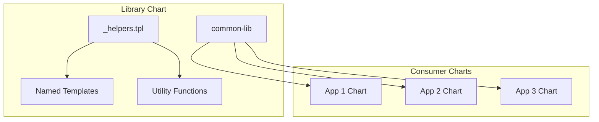

# How to Create a Helm Library Chart for Reusable Templates

Author: [nawazdhandala](https://www.github.com/nawazdhandala)

Tags: Helm, Kubernetes, DevOps, Templates, DRY, Reusable, Best Practices

Description: Complete guide to creating Helm library charts for sharing reusable templates and functions across multiple charts for consistent Kubernetes deployments.

> Library charts provide reusable templates that can be shared across multiple Helm charts. This guide covers creating, publishing, and consuming library charts to enforce consistency and reduce duplication.

## Library Chart Concept



## Creating a Library Chart

### Chart Structure

```
common-lib/
├── Chart.yaml
├── values.yaml
├── README.md
└── templates/
    ├── _helpers.tpl
    ├── _deployment.tpl
    ├── _service.tpl
    ├── _ingress.tpl
    ├── _configmap.tpl
    ├── _secret.tpl
    ├── _hpa.tpl
    ├── _pdb.tpl
    ├── _serviceaccount.tpl
    └── _servicemonitor.tpl
```

### Chart.yaml

```yaml
# Chart.yaml
apiVersion: v2
name: common-lib
description: A Helm library chart for common templates
type: library  # Important: must be "library"
version: 1.0.0
maintainers:
  - name: Platform Team
    email: platform@example.com
keywords:
  - library
  - common
  - templates
```

### Core Helpers Template

```yaml
# templates/_helpers.tpl

{{/*
Expand the name of the chart.
*/}}
{{- define "common-lib.name" -}}
{{- default .Chart.Name .Values.nameOverride | trunc 63 | trimSuffix "-" }}
{{- end }}

{{/*
Create a default fully qualified app name.
*/}}
{{- define "common-lib.fullname" -}}
{{- if .Values.fullnameOverride }}
{{- .Values.fullnameOverride | trunc 63 | trimSuffix "-" }}
{{- else }}
{{- $name := default .Chart.Name .Values.nameOverride }}
{{- if contains $name .Release.Name }}
{{- .Release.Name | trunc 63 | trimSuffix "-" }}
{{- else }}
{{- printf "%s-%s" .Release.Name $name | trunc 63 | trimSuffix "-" }}
{{- end }}
{{- end }}
{{- end }}

{{/*
Create chart name and version as used by the chart label.
*/}}
{{- define "common-lib.chart" -}}
{{- printf "%s-%s" .Chart.Name .Chart.Version | replace "+" "_" | trunc 63 | trimSuffix "-" }}
{{- end }}

{{/*
Common labels
*/}}
{{- define "common-lib.labels" -}}
helm.sh/chart: {{ include "common-lib.chart" . }}
{{ include "common-lib.selectorLabels" . }}
{{- if .Chart.AppVersion }}
app.kubernetes.io/version: {{ .Chart.AppVersion | quote }}
{{- end }}
app.kubernetes.io/managed-by: {{ .Release.Service }}
{{- with .Values.commonLabels }}
{{ toYaml . }}
{{- end }}
{{- end }}

{{/*
Selector labels
*/}}
{{- define "common-lib.selectorLabels" -}}
app.kubernetes.io/name: {{ include "common-lib.name" . }}
app.kubernetes.io/instance: {{ .Release.Name }}
{{- end }}

{{/*
Create the name of the service account to use
*/}}
{{- define "common-lib.serviceAccountName" -}}
{{- if .Values.serviceAccount.create }}
{{- default (include "common-lib.fullname" .) .Values.serviceAccount.name }}
{{- else }}
{{- default "default" .Values.serviceAccount.name }}
{{- end }}
{{- end }}

{{/*
Create image reference
*/}}
{{- define "common-lib.image" -}}
{{- $registry := .Values.image.registry | default .Values.global.imageRegistry | default "" -}}
{{- $repository := .Values.image.repository -}}
{{- $tag := .Values.image.tag | default .Chart.AppVersion -}}
{{- if $registry }}
{{- printf "%s/%s:%s" $registry $repository $tag -}}
{{- else }}
{{- printf "%s:%s" $repository $tag -}}
{{- end }}
{{- end }}

{{/*
Return the proper image pull secrets
*/}}
{{- define "common-lib.imagePullSecrets" -}}
{{- $pullSecrets := list }}
{{- if .Values.global }}
{{- range .Values.global.imagePullSecrets }}
{{- $pullSecrets = append $pullSecrets . }}
{{- end }}
{{- end }}
{{- range .Values.image.pullSecrets }}
{{- $pullSecrets = append $pullSecrets . }}
{{- end }}
{{- if $pullSecrets }}
imagePullSecrets:
{{- range $pullSecrets }}
  - name: {{ . }}
{{- end }}
{{- end }}
{{- end }}
```

### Deployment Template

```yaml
# templates/_deployment.tpl

{{/*
Generate a standard deployment
Usage:
{{ include "common-lib.deployment" (dict "root" . "component" "api") }}
*/}}
{{- define "common-lib.deployment" -}}
{{- $root := .root -}}
{{- $component := .component | default "" -}}
{{- $fullname := include "common-lib.fullname" $root -}}
{{- if $component }}
{{- $fullname = printf "%s-%s" $fullname $component -}}
{{- end }}
apiVersion: apps/v1
kind: Deployment
metadata:
  name: {{ $fullname }}
  labels:
    {{- include "common-lib.labels" $root | nindent 4 }}
    {{- if $component }}
    app.kubernetes.io/component: {{ $component }}
    {{- end }}
  {{- with $root.Values.deployment.annotations }}
  annotations:
    {{- toYaml . | nindent 4 }}
  {{- end }}
spec:
  {{- if not $root.Values.autoscaling.enabled }}
  replicas: {{ $root.Values.replicaCount }}
  {{- end }}
  selector:
    matchLabels:
      {{- include "common-lib.selectorLabels" $root | nindent 6 }}
      {{- if $component }}
      app.kubernetes.io/component: {{ $component }}
      {{- end }}
  template:
    metadata:
      annotations:
        {{- with $root.Values.podAnnotations }}
        {{- toYaml . | nindent 8 }}
        {{- end }}
        {{- if $root.Values.configChecksum }}
        checksum/config: {{ $root.Values.configChecksum }}
        {{- end }}
      labels:
        {{- include "common-lib.labels" $root | nindent 8 }}
        {{- if $component }}
        app.kubernetes.io/component: {{ $component }}
        {{- end }}
        {{- with $root.Values.podLabels }}
        {{- toYaml . | nindent 8 }}
        {{- end }}
    spec:
      {{- include "common-lib.imagePullSecrets" $root | nindent 6 }}
      serviceAccountName: {{ include "common-lib.serviceAccountName" $root }}
      {{- with $root.Values.podSecurityContext }}
      securityContext:
        {{- toYaml . | nindent 8 }}
      {{- end }}
      containers:
        - name: {{ $root.Chart.Name }}
          {{- with $root.Values.securityContext }}
          securityContext:
            {{- toYaml . | nindent 12 }}
          {{- end }}
          image: {{ include "common-lib.image" $root | quote }}
          imagePullPolicy: {{ $root.Values.image.pullPolicy }}
          {{- with $root.Values.command }}
          command:
            {{- toYaml . | nindent 12 }}
          {{- end }}
          {{- with $root.Values.args }}
          args:
            {{- toYaml . | nindent 12 }}
          {{- end }}
          ports:
            - name: http
              containerPort: {{ $root.Values.containerPort | default 8080 }}
              protocol: TCP
            {{- with $root.Values.extraPorts }}
            {{- toYaml . | nindent 12 }}
            {{- end }}
          {{- if $root.Values.livenessProbe.enabled }}
          livenessProbe:
            {{- omit $root.Values.livenessProbe "enabled" | toYaml | nindent 12 }}
          {{- end }}
          {{- if $root.Values.readinessProbe.enabled }}
          readinessProbe:
            {{- omit $root.Values.readinessProbe "enabled" | toYaml | nindent 12 }}
          {{- end }}
          {{- if $root.Values.startupProbe.enabled }}
          startupProbe:
            {{- omit $root.Values.startupProbe "enabled" | toYaml | nindent 12 }}
          {{- end }}
          {{- with $root.Values.resources }}
          resources:
            {{- toYaml . | nindent 12 }}
          {{- end }}
          {{- with $root.Values.env }}
          env:
            {{- toYaml . | nindent 12 }}
          {{- end }}
          {{- with $root.Values.envFrom }}
          envFrom:
            {{- toYaml . | nindent 12 }}
          {{- end }}
          {{- with $root.Values.volumeMounts }}
          volumeMounts:
            {{- toYaml . | nindent 12 }}
          {{- end }}
      {{- with $root.Values.volumes }}
      volumes:
        {{- toYaml . | nindent 8 }}
      {{- end }}
      {{- with $root.Values.nodeSelector }}
      nodeSelector:
        {{- toYaml . | nindent 8 }}
      {{- end }}
      {{- with $root.Values.affinity }}
      affinity:
        {{- toYaml . | nindent 8 }}
      {{- end }}
      {{- with $root.Values.tolerations }}
      tolerations:
        {{- toYaml . | nindent 8 }}
      {{- end }}
      {{- with $root.Values.topologySpreadConstraints }}
      topologySpreadConstraints:
        {{- toYaml . | nindent 8 }}
      {{- end }}
{{- end }}
```

### Service Template

```yaml
# templates/_service.tpl

{{/*
Generate a standard service
*/}}
{{- define "common-lib.service" -}}
{{- $root := .root -}}
{{- $component := .component | default "" -}}
{{- $fullname := include "common-lib.fullname" $root -}}
{{- if $component }}
{{- $fullname = printf "%s-%s" $fullname $component -}}
{{- end }}
apiVersion: v1
kind: Service
metadata:
  name: {{ $fullname }}
  labels:
    {{- include "common-lib.labels" $root | nindent 4 }}
    {{- if $component }}
    app.kubernetes.io/component: {{ $component }}
    {{- end }}
  {{- with $root.Values.service.annotations }}
  annotations:
    {{- toYaml . | nindent 4 }}
  {{- end }}
spec:
  type: {{ $root.Values.service.type | default "ClusterIP" }}
  ports:
    - port: {{ $root.Values.service.port | default 80 }}
      targetPort: http
      protocol: TCP
      name: http
    {{- with $root.Values.service.extraPorts }}
    {{- toYaml . | nindent 4 }}
    {{- end }}
  selector:
    {{- include "common-lib.selectorLabels" $root | nindent 4 }}
    {{- if $component }}
    app.kubernetes.io/component: {{ $component }}
    {{- end }}
{{- end }}
```

### Ingress Template

```yaml
# templates/_ingress.tpl

{{/*
Generate a standard ingress
*/}}
{{- define "common-lib.ingress" -}}
{{- $root := .root -}}
{{- if $root.Values.ingress.enabled }}
{{- $fullname := include "common-lib.fullname" $root -}}
apiVersion: networking.k8s.io/v1
kind: Ingress
metadata:
  name: {{ $fullname }}
  labels:
    {{- include "common-lib.labels" $root | nindent 4 }}
  {{- with $root.Values.ingress.annotations }}
  annotations:
    {{- toYaml . | nindent 4 }}
  {{- end }}
spec:
  {{- if $root.Values.ingress.className }}
  ingressClassName: {{ $root.Values.ingress.className }}
  {{- end }}
  {{- if $root.Values.ingress.tls }}
  tls:
    {{- range $root.Values.ingress.tls }}
    - hosts:
        {{- range .hosts }}
        - {{ . | quote }}
        {{- end }}
      secretName: {{ .secretName }}
    {{- end }}
  {{- end }}
  rules:
    {{- range $root.Values.ingress.hosts }}
    - host: {{ .host | quote }}
      http:
        paths:
          {{- range .paths }}
          - path: {{ .path }}
            pathType: {{ .pathType | default "Prefix" }}
            backend:
              service:
                name: {{ $fullname }}
                port:
                  number: {{ $root.Values.service.port | default 80 }}
          {{- end }}
    {{- end }}
{{- end }}
{{- end }}
```

### HPA Template

```yaml
# templates/_hpa.tpl

{{/*
Generate HorizontalPodAutoscaler
*/}}
{{- define "common-lib.hpa" -}}
{{- $root := .root -}}
{{- if $root.Values.autoscaling.enabled }}
{{- $fullname := include "common-lib.fullname" $root -}}
apiVersion: autoscaling/v2
kind: HorizontalPodAutoscaler
metadata:
  name: {{ $fullname }}
  labels:
    {{- include "common-lib.labels" $root | nindent 4 }}
spec:
  scaleTargetRef:
    apiVersion: apps/v1
    kind: Deployment
    name: {{ $fullname }}
  minReplicas: {{ $root.Values.autoscaling.minReplicas }}
  maxReplicas: {{ $root.Values.autoscaling.maxReplicas }}
  metrics:
    {{- if $root.Values.autoscaling.targetCPUUtilizationPercentage }}
    - type: Resource
      resource:
        name: cpu
        target:
          type: Utilization
          averageUtilization: {{ $root.Values.autoscaling.targetCPUUtilizationPercentage }}
    {{- end }}
    {{- if $root.Values.autoscaling.targetMemoryUtilizationPercentage }}
    - type: Resource
      resource:
        name: memory
        target:
          type: Utilization
          averageUtilization: {{ $root.Values.autoscaling.targetMemoryUtilizationPercentage }}
    {{- end }}
    {{- with $root.Values.autoscaling.customMetrics }}
    {{- toYaml . | nindent 4 }}
    {{- end }}
  {{- with $root.Values.autoscaling.behavior }}
  behavior:
    {{- toYaml . | nindent 4 }}
  {{- end }}
{{- end }}
{{- end }}
```

### PodDisruptionBudget Template

```yaml
# templates/_pdb.tpl

{{/*
Generate PodDisruptionBudget
*/}}
{{- define "common-lib.pdb" -}}
{{- $root := .root -}}
{{- if $root.Values.pdb.enabled }}
{{- $fullname := include "common-lib.fullname" $root -}}
apiVersion: policy/v1
kind: PodDisruptionBudget
metadata:
  name: {{ $fullname }}
  labels:
    {{- include "common-lib.labels" $root | nindent 4 }}
spec:
  {{- if $root.Values.pdb.minAvailable }}
  minAvailable: {{ $root.Values.pdb.minAvailable }}
  {{- end }}
  {{- if $root.Values.pdb.maxUnavailable }}
  maxUnavailable: {{ $root.Values.pdb.maxUnavailable }}
  {{- end }}
  selector:
    matchLabels:
      {{- include "common-lib.selectorLabels" $root | nindent 6 }}
{{- end }}
{{- end }}
```

## Consuming Library Charts

### Add as Dependency

```yaml
# myapp/Chart.yaml
apiVersion: v2
name: myapp
version: 1.0.0

dependencies:
  - name: common-lib
    version: "1.x.x"
    repository: https://charts.example.com
    # Or local
    # repository: file://../common-lib
```

### Use Templates

```yaml
# myapp/templates/deployment.yaml
{{- include "common-lib.deployment" (dict "root" .) -}}

# myapp/templates/service.yaml
{{- include "common-lib.service" (dict "root" .) -}}

# myapp/templates/ingress.yaml
{{- include "common-lib.ingress" (dict "root" .) -}}

# myapp/templates/hpa.yaml
{{- include "common-lib.hpa" (dict "root" .) -}}

# myapp/templates/pdb.yaml
{{- include "common-lib.pdb" (dict "root" .) -}}
```

### Override Template Names

```yaml
# myapp/templates/_helpers.tpl

{{/*
Override the fullname template
*/}}
{{- define "common-lib.fullname" -}}
{{- printf "myapp-%s" .Release.Name | trunc 63 | trimSuffix "-" }}
{{- end }}
```

## Publishing Library Charts

### OCI Registry

```bash
# Package the library
helm package common-lib/

# Login to registry
helm registry login registry.example.com

# Push to OCI registry
helm push common-lib-1.0.0.tgz oci://registry.example.com/charts
```

### Chart Museum

```bash
# Upload to ChartMuseum
curl --data-binary "@common-lib-1.0.0.tgz" \
  https://chartmuseum.example.com/api/charts
```

## Best Practices

| Practice | Description |
|----------|-------------|
| Pass Context | Use `dict` to pass root context |
| Default Values | Provide sensible defaults |
| Semantic Versioning | Follow SemVer for versions |
| Document Templates | Add usage comments |
| Test Templates | Validate with consumer charts |
| Minimal Logic | Keep templates focused |

## Troubleshooting

```bash
# Update dependencies
helm dependency update myapp/

# Debug template rendering
helm template myapp ./myapp --debug

# Check if library is loaded
helm template myapp ./myapp --show-only templates/deployment.yaml

# Verify library templates
helm template common-lib ./common-lib
# Should produce no output (library charts don't render)
```

## Wrap-up

Library charts enable code reuse across Helm charts by providing shared templates. Create a library chart with common patterns, publish it to a chart repository, and consume it via dependencies. This enforces consistency and reduces maintenance across your chart portfolio.
