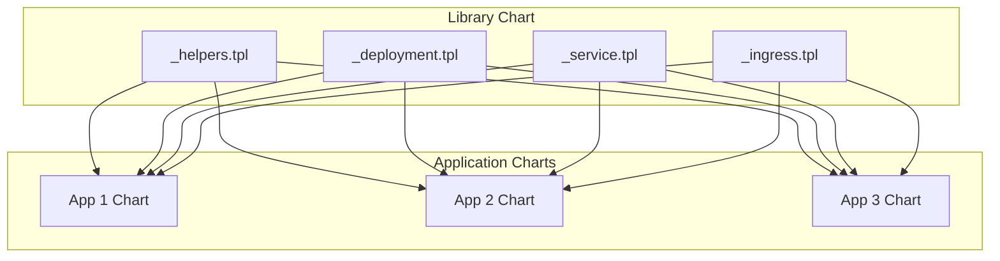

# Helm Library Charts: Creating Reusable Templates

Author: [nawazdhandala](https://www.github.com/nawazdhandala)

Tags: Helm, Kubernetes, DevOps, Library Charts, Templates, DRY

Description: Learn how to create Helm library charts to share common templates and reduce duplication across multiple Helm charts in your organization.

> As organizations grow their Kubernetes deployments, duplicating template code across charts becomes a maintenance burden. Library charts provide a way to create reusable template functions and patterns that can be shared across multiple application charts.

## What Are Library Charts?



Library charts:
- Have `type: library` in Chart.yaml
- Cannot be installed directly
- Only contain template files (prefixed with `_`)
- Are included as dependencies in application charts

## Create a Library Chart

### Directory Structure

```
my-library/
├── Chart.yaml
├── templates/
│   ├── _helpers.tpl
│   ├── _deployment.tpl
│   ├── _service.tpl
│   ├── _ingress.tpl
│   ├── _configmap.tpl
│   ├── _secret.tpl
│   ├── _hpa.tpl
│   └── _pdb.tpl
└── values.yaml
```

### Chart.yaml

```yaml
# Chart.yaml
apiVersion: v2
name: my-library
description: Common Helm library chart
type: library
version: 1.0.0
appVersion: "1.0.0"
```

### _helpers.tpl

```yaml
# templates/_helpers.tpl

{{/*
Create chart name and version for labels
*/}}
{{- define "library.chart" -}}
{{- printf "%s-%s" .Chart.Name .Chart.Version | replace "+" "_" | trunc 63 | trimSuffix "-" -}}
{{- end -}}

{{/*
Common labels
*/}}
{{- define "library.labels" -}}
helm.sh/chart: {{ include "library.chart" . }}
app.kubernetes.io/name: {{ .Values.name | default .Chart.Name }}
app.kubernetes.io/instance: {{ .Release.Name }}
app.kubernetes.io/version: {{ .Values.image.tag | default .Chart.AppVersion | quote }}
app.kubernetes.io/managed-by: {{ .Release.Service }}
{{- if .Values.labels }}
{{ toYaml .Values.labels }}
{{- end }}
{{- end -}}

{{/*
Selector labels
*/}}
{{- define "library.selectorLabels" -}}
app.kubernetes.io/name: {{ .Values.name | default .Chart.Name }}
app.kubernetes.io/instance: {{ .Release.Name }}
{{- end -}}

{{/*
Create the name of the service account
*/}}
{{- define "library.serviceAccountName" -}}
{{- if .Values.serviceAccount.create -}}
    {{ default (printf "%s-%s" .Release.Name .Chart.Name) .Values.serviceAccount.name }}
{{- else -}}
    {{ default "default" .Values.serviceAccount.name }}
{{- end -}}
{{- end -}}

{{/*
Create image pull secret name
*/}}
{{- define "library.imagePullSecrets" -}}
{{- if .Values.image.pullSecrets -}}
imagePullSecrets:
{{- range .Values.image.pullSecrets }}
  - name: {{ . }}
{{- end }}
{{- end -}}
{{- end -}}

{{/*
Full image name with registry and tag
*/}}
{{- define "library.image" -}}
{{- $registry := .Values.image.registry | default "" -}}
{{- $repository := .Values.image.repository -}}
{{- $tag := .Values.image.tag | default .Chart.AppVersion -}}
{{- if $registry -}}
{{ printf "%s/%s:%s" $registry $repository $tag }}
{{- else -}}
{{ printf "%s:%s" $repository $tag }}
{{- end -}}
{{- end -}}
```

### _deployment.tpl

```yaml
# templates/_deployment.tpl

{{/*
Deployment template
Usage: {{ include "library.deployment" (dict "root" . "component" "web") }}
*/}}
{{- define "library.deployment" -}}
{{- $root := .root -}}
{{- $component := .component | default "" -}}
apiVersion: apps/v1
kind: Deployment
metadata:
  name: {{ $root.Release.Name }}{{ if $component }}-{{ $component }}{{ end }}
  namespace: {{ $root.Release.Namespace }}
  labels:
    {{- include "library.labels" $root | nindent 4 }}
    {{- if $component }}
    app.kubernetes.io/component: {{ $component }}
    {{- end }}
spec:
  {{- if not $root.Values.autoscaling.enabled }}
  replicas: {{ $root.Values.replicaCount | default 1 }}
  {{- end }}
  selector:
    matchLabels:
      {{- include "library.selectorLabels" $root | nindent 6 }}
      {{- if $component }}
      app.kubernetes.io/component: {{ $component }}
      {{- end }}
  template:
    metadata:
      annotations:
        {{- if $root.Values.podAnnotations }}
        {{- toYaml $root.Values.podAnnotations | nindent 8 }}
        {{- end }}
        checksum/config: {{ include (print $root.Template.BasePath "/configmap.yaml") $root | sha256sum }}
      labels:
        {{- include "library.labels" $root | nindent 8 }}
        {{- if $component }}
        app.kubernetes.io/component: {{ $component }}
        {{- end }}
    spec:
      {{- include "library.imagePullSecrets" $root | nindent 6 }}
      serviceAccountName: {{ include "library.serviceAccountName" $root }}
      securityContext:
        {{- toYaml $root.Values.podSecurityContext | nindent 8 }}
      containers:
        - name: {{ $root.Chart.Name }}
          securityContext:
            {{- toYaml $root.Values.securityContext | nindent 12 }}
          image: {{ include "library.image" $root }}
          imagePullPolicy: {{ $root.Values.image.pullPolicy | default "IfNotPresent" }}
          {{- if $root.Values.command }}
          command:
            {{- toYaml $root.Values.command | nindent 12 }}
          {{- end }}
          {{- if $root.Values.args }}
          args:
            {{- toYaml $root.Values.args | nindent 12 }}
          {{- end }}
          ports:
            - name: http
              containerPort: {{ $root.Values.containerPort | default 8080 }}
              protocol: TCP
          {{- if $root.Values.env }}
          env:
            {{- toYaml $root.Values.env | nindent 12 }}
          {{- end }}
          {{- if $root.Values.envFrom }}
          envFrom:
            {{- toYaml $root.Values.envFrom | nindent 12 }}
          {{- end }}
          {{- if $root.Values.livenessProbe }}
          livenessProbe:
            {{- toYaml $root.Values.livenessProbe | nindent 12 }}
          {{- end }}
          {{- if $root.Values.readinessProbe }}
          readinessProbe:
            {{- toYaml $root.Values.readinessProbe | nindent 12 }}
          {{- end }}
          resources:
            {{- toYaml $root.Values.resources | nindent 12 }}
          {{- if $root.Values.volumeMounts }}
          volumeMounts:
            {{- toYaml $root.Values.volumeMounts | nindent 12 }}
          {{- end }}
      {{- if $root.Values.volumes }}
      volumes:
        {{- toYaml $root.Values.volumes | nindent 8 }}
      {{- end }}
      {{- with $root.Values.nodeSelector }}
      nodeSelector:
        {{- toYaml . | nindent 8 }}
      {{- end }}
      {{- with $root.Values.affinity }}
      affinity:
        {{- toYaml . | nindent 8 }}
      {{- end }}
      {{- with $root.Values.tolerations }}
      tolerations:
        {{- toYaml . | nindent 8 }}
      {{- end }}
{{- end -}}
```

### _service.tpl

```yaml
# templates/_service.tpl

{{/*
Service template
Usage: {{ include "library.service" . }}
*/}}
{{- define "library.service" -}}
apiVersion: v1
kind: Service
metadata:
  name: {{ .Release.Name }}
  namespace: {{ .Release.Namespace }}
  labels:
    {{- include "library.labels" . | nindent 4 }}
  {{- if .Values.service.annotations }}
  annotations:
    {{- toYaml .Values.service.annotations | nindent 4 }}
  {{- end }}
spec:
  type: {{ .Values.service.type | default "ClusterIP" }}
  ports:
    - port: {{ .Values.service.port | default 80 }}
      targetPort: {{ .Values.containerPort | default 8080 }}
      protocol: TCP
      name: http
      {{- if and (eq .Values.service.type "NodePort") .Values.service.nodePort }}
      nodePort: {{ .Values.service.nodePort }}
      {{- end }}
  selector:
    {{- include "library.selectorLabels" . | nindent 4 }}
{{- end -}}
```

### _ingress.tpl

```yaml
# templates/_ingress.tpl

{{/*
Ingress template
Usage: {{ include "library.ingress" . }}
*/}}
{{- define "library.ingress" -}}
{{- if .Values.ingress.enabled -}}
apiVersion: networking.k8s.io/v1
kind: Ingress
metadata:
  name: {{ .Release.Name }}
  namespace: {{ .Release.Namespace }}
  labels:
    {{- include "library.labels" . | nindent 4 }}
  {{- with .Values.ingress.annotations }}
  annotations:
    {{- toYaml . | nindent 4 }}
  {{- end }}
spec:
  {{- if .Values.ingress.className }}
  ingressClassName: {{ .Values.ingress.className }}
  {{- end }}
  {{- if .Values.ingress.tls }}
  tls:
    {{- range .Values.ingress.tls }}
    - hosts:
        {{- range .hosts }}
        - {{ . | quote }}
        {{- end }}
      secretName: {{ .secretName }}
    {{- end }}
  {{- end }}
  rules:
    {{- range .Values.ingress.hosts }}
    - host: {{ .host | quote }}
      http:
        paths:
          {{- range .paths }}
          - path: {{ .path }}
            pathType: {{ .pathType | default "Prefix" }}
            backend:
              service:
                name: {{ $.Release.Name }}
                port:
                  number: {{ $.Values.service.port | default 80 }}
          {{- end }}
    {{- end }}
{{- end -}}
{{- end -}}
```

### _configmap.tpl

```yaml
# templates/_configmap.tpl

{{/*
ConfigMap template
Usage: {{ include "library.configmap" . }}
*/}}
{{- define "library.configmap" -}}
{{- if .Values.config -}}
apiVersion: v1
kind: ConfigMap
metadata:
  name: {{ .Release.Name }}-config
  namespace: {{ .Release.Namespace }}
  labels:
    {{- include "library.labels" . | nindent 4 }}
data:
  {{- range $key, $value := .Values.config }}
  {{ $key }}: {{ $value | quote }}
  {{- end }}
{{- end -}}
{{- end -}}
```

### _hpa.tpl

```yaml
# templates/_hpa.tpl

{{/*
HorizontalPodAutoscaler template
Usage: {{ include "library.hpa" . }}
*/}}
{{- define "library.hpa" -}}
{{- if .Values.autoscaling.enabled -}}
apiVersion: autoscaling/v2
kind: HorizontalPodAutoscaler
metadata:
  name: {{ .Release.Name }}
  namespace: {{ .Release.Namespace }}
  labels:
    {{- include "library.labels" . | nindent 4 }}
spec:
  scaleTargetRef:
    apiVersion: apps/v1
    kind: Deployment
    name: {{ .Release.Name }}
  minReplicas: {{ .Values.autoscaling.minReplicas | default 1 }}
  maxReplicas: {{ .Values.autoscaling.maxReplicas | default 10 }}
  metrics:
    {{- if .Values.autoscaling.targetCPUUtilizationPercentage }}
    - type: Resource
      resource:
        name: cpu
        target:
          type: Utilization
          averageUtilization: {{ .Values.autoscaling.targetCPUUtilizationPercentage }}
    {{- end }}
    {{- if .Values.autoscaling.targetMemoryUtilizationPercentage }}
    - type: Resource
      resource:
        name: memory
        target:
          type: Utilization
          averageUtilization: {{ .Values.autoscaling.targetMemoryUtilizationPercentage }}
    {{- end }}
{{- end -}}
{{- end -}}
```

### _pdb.tpl

```yaml
# templates/_pdb.tpl

{{/*
PodDisruptionBudget template
Usage: {{ include "library.pdb" . }}
*/}}
{{- define "library.pdb" -}}
{{- if .Values.pdb.enabled -}}
apiVersion: policy/v1
kind: PodDisruptionBudget
metadata:
  name: {{ .Release.Name }}
  namespace: {{ .Release.Namespace }}
  labels:
    {{- include "library.labels" . | nindent 4 }}
spec:
  {{- if .Values.pdb.minAvailable }}
  minAvailable: {{ .Values.pdb.minAvailable }}
  {{- end }}
  {{- if .Values.pdb.maxUnavailable }}
  maxUnavailable: {{ .Values.pdb.maxUnavailable }}
  {{- end }}
  selector:
    matchLabels:
      {{- include "library.selectorLabels" . | nindent 6 }}
{{- end -}}
{{- end -}}
```

## Use Library Chart in Applications

### Application Chart.yaml

```yaml
# my-app/Chart.yaml
apiVersion: v2
name: my-app
description: My application
type: application
version: 1.0.0
appVersion: "1.0.0"

dependencies:
  - name: my-library
    version: "1.0.0"
    repository: "https://charts.example.com"
    # Or local path
    # repository: "file://../my-library"
```

### Application Templates

```yaml
# my-app/templates/deployment.yaml
{{- include "library.deployment" (dict "root" . "component" "") }}
```

```yaml
# my-app/templates/service.yaml
{{- include "library.service" . }}
```

```yaml
# my-app/templates/ingress.yaml
{{- include "library.ingress" . }}
```

```yaml
# my-app/templates/configmap.yaml
{{- include "library.configmap" . }}
```

```yaml
# my-app/templates/hpa.yaml
{{- include "library.hpa" . }}
```

```yaml
# my-app/templates/pdb.yaml
{{- include "library.pdb" . }}
```

### Application Values

```yaml
# my-app/values.yaml
name: my-app

replicaCount: 3

image:
  repository: myregistry/my-app
  tag: "1.0.0"
  pullPolicy: IfNotPresent

containerPort: 8080

service:
  type: ClusterIP
  port: 80

ingress:
  enabled: true
  className: nginx
  annotations:
    cert-manager.io/cluster-issuer: letsencrypt-prod
  hosts:
    - host: my-app.example.com
      paths:
        - path: /
          pathType: Prefix
  tls:
    - secretName: my-app-tls
      hosts:
        - my-app.example.com

resources:
  limits:
    cpu: 500m
    memory: 512Mi
  requests:
    cpu: 100m
    memory: 128Mi

autoscaling:
  enabled: true
  minReplicas: 3
  maxReplicas: 10
  targetCPUUtilizationPercentage: 80

pdb:
  enabled: true
  minAvailable: 2

livenessProbe:
  httpGet:
    path: /health
    port: http
  initialDelaySeconds: 30
  periodSeconds: 10

readinessProbe:
  httpGet:
    path: /ready
    port: http
  initialDelaySeconds: 5
  periodSeconds: 5

config:
  LOG_LEVEL: "info"
  ENV: "production"

env:
  - name: DATABASE_URL
    valueFrom:
      secretKeyRef:
        name: my-app-secrets
        key: database-url
```

## Build and Install

```bash
# Update dependencies
cd my-app
helm dependency update

# Template to verify
helm template my-release .

# Install
helm install my-release . -n my-namespace --create-namespace
```

## Publish Library Chart

### Package and Push to Repository

```bash
# Package the library chart
cd my-library
helm package .

# Push to ChartMuseum
curl --data-binary "@my-library-1.0.0.tgz" https://chartmuseum.example.com/api/charts

# Or push to OCI registry
helm push my-library-1.0.0.tgz oci://ghcr.io/myorg/charts
```

## Advanced Pattern: Multi-Component Library

For applications with multiple components:

```yaml
# templates/_deployment.tpl (extended)

{{/*
Multi-component deployment
Usage: 
{{ include "library.deployment" (dict "root" . "component" "api") }}
{{ include "library.deployment" (dict "root" . "component" "worker") }}
*/}}
{{- define "library.deployment" -}}
{{- $root := .root -}}
{{- $component := .component -}}
{{- $values := index $root.Values.components $component -}}
apiVersion: apps/v1
kind: Deployment
metadata:
  name: {{ $root.Release.Name }}-{{ $component }}
  labels:
    {{- include "library.labels" $root | nindent 4 }}
    app.kubernetes.io/component: {{ $component }}
spec:
  replicas: {{ $values.replicaCount | default 1 }}
  selector:
    matchLabels:
      {{- include "library.selectorLabels" $root | nindent 6 }}
      app.kubernetes.io/component: {{ $component }}
  template:
    # ... rest of template using $values
{{- end -}}
```

### Multi-Component Values

```yaml
# values.yaml
components:
  api:
    replicaCount: 3
    image:
      repository: myapp/api
      tag: "1.0.0"
    containerPort: 8080
    resources:
      limits:
        cpu: 500m
        memory: 512Mi
  
  worker:
    replicaCount: 2
    image:
      repository: myapp/worker
      tag: "1.0.0"
    resources:
      limits:
        cpu: 1000m
        memory: 1Gi
```

## Best Practices

| Practice | Description |
|----------|-------------|
| Version carefully | Semantic versioning for library charts |
| Document templates | Add comments explaining usage |
| Provide defaults | Use default values in templates |
| Test thoroughly | Test library with multiple apps |
| Keep it simple | Don't over-abstract |
| Use dict for context | Pass context via dict for flexibility |

## Wrap-up

Library charts enable code reuse across Helm charts, reducing duplication and ensuring consistency. Create templates for common resources like Deployments, Services, and Ingresses. Use the `type: library` designation, prefix templates with underscore, and include the library as a dependency in application charts. Version and publish library charts to shared repositories for organization-wide use.
