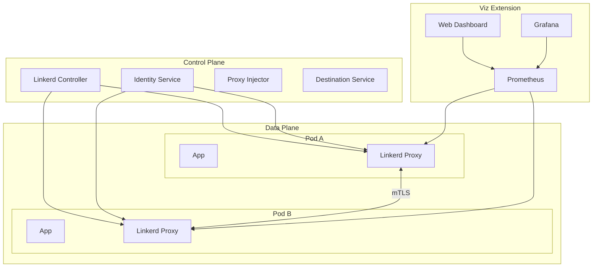

# Deploying Linkerd Service Mesh with Helm

Author: [nawazdhandala](https://www.github.com/nawazdhandala)

Tags: Helm, Kubernetes, DevOps, Linkerd, Service Mesh, Security, mTLS

Description: Complete guide to deploying Linkerd service mesh on Kubernetes using Helm charts for lightweight, secure service-to-service communication.

> Linkerd is a lightweight, security-focused service mesh that's easy to install and operate. This guide covers deploying Linkerd using Helm charts with production configurations for mTLS, observability, and traffic management.

## Linkerd Architecture



## Prerequisites

```bash
# Check Kubernetes version (1.21+)
kubectl version --client

# Validate cluster
linkerd check --pre

# Add Linkerd Helm repository
helm repo add linkerd https://helm.linkerd.io/stable
helm repo add linkerd-edge https://helm.linkerd.io/edge
helm repo update

# Search available versions
helm search repo linkerd --versions
```

## Generate Certificates

Linkerd requires TLS certificates for identity.

### Using step CLI

```bash
# Install step CLI
brew install step

# Create CA certificate
step certificate create root.linkerd.cluster.local ca.crt ca.key \
  --profile root-ca \
  --no-password \
  --insecure \
  --not-after=87600h

# Create issuer certificate
step certificate create identity.linkerd.cluster.local issuer.crt issuer.key \
  --profile intermediate-ca \
  --not-after=8760h \
  --no-password \
  --insecure \
  --ca ca.crt \
  --ca-key ca.key
```

### Store Certificates in Kubernetes

```bash
# Create namespace
kubectl create namespace linkerd

# Create trust anchor secret
kubectl create secret generic linkerd-trust-anchor \
  --namespace linkerd \
  --from-file=ca-bundle.crt=ca.crt

# Create issuer secret
kubectl create secret tls linkerd-identity-issuer \
  --namespace linkerd \
  --cert=issuer.crt \
  --key=issuer.key
```

## Installation

### Step 1: Install Linkerd CRDs

```bash
# Install CRDs
helm install linkerd-crds linkerd/linkerd-crds \
  --namespace linkerd \
  --create-namespace
```

### Step 2: Install Control Plane

```yaml
# linkerd-control-plane-values.yaml
identityTrustAnchorsPEM: |
  -----BEGIN CERTIFICATE-----
  # Your CA certificate content here
  -----END CERTIFICATE-----

identity:
  issuer:
    scheme: kubernetes.io/tls
    
controllerReplicas: 2

proxy:
  resources:
    cpu:
      request: 100m
      limit: 500m
    memory:
      request: 20Mi
      limit: 250Mi

# High availability
enablePodDisruptionBudget: true
enablePodAntiAffinity: true

# Prometheus
prometheusUrl: ""  # Use built-in with viz

# Controller resources
resources:
  cpu:
    request: 100m
    limit: 500m
  memory:
    request: 50Mi
    limit: 250Mi
```

```bash
# Install control plane
helm install linkerd-control-plane linkerd/linkerd-control-plane \
  --namespace linkerd \
  -f linkerd-control-plane-values.yaml \
  --set-file identityTrustAnchorsPEM=ca.crt
```

### Step 3: Install Viz Extension (Dashboard)

```yaml
# linkerd-viz-values.yaml
dashboard:
  replicas: 1
  resources:
    cpu:
      request: 100m
      limit: 500m
    memory:
      request: 50Mi
      limit: 256Mi

prometheus:
  enabled: true
  resources:
    cpu:
      request: 300m
      limit: 1000m
    memory:
      request: 300Mi
      limit: 1Gi

grafana:
  enabled: true
  resources:
    cpu:
      request: 100m
    memory:
      request: 50Mi
      limit: 256Mi

# Metrics retention
prometheusRetention: 6h
```

```bash
# Install viz extension
helm install linkerd-viz linkerd/linkerd-viz \
  --namespace linkerd-viz \
  --create-namespace \
  -f linkerd-viz-values.yaml
```

### Verify Installation

```bash
# Check installation
linkerd check

# Check control plane
kubectl get pods -n linkerd

# Check viz
kubectl get pods -n linkerd-viz

# Access dashboard
linkerd viz dashboard &
```

## Inject Linkerd Proxy

### Namespace-Level Injection

```bash
# Annotate namespace for auto-injection
kubectl annotate namespace default linkerd.io/inject=enabled

# Verify annotation
kubectl get namespace default -o yaml | grep linkerd
```

### Deployment-Level Injection

```yaml
# deployment.yaml
apiVersion: apps/v1
kind: Deployment
metadata:
  name: my-app
spec:
  template:
    metadata:
      annotations:
        linkerd.io/inject: enabled
```

### Inject Existing Deployments

```bash
# Inject existing deployment
kubectl get deploy my-app -o yaml | linkerd inject - | kubectl apply -f -

# Inject entire namespace
kubectl get -n my-namespace deploy -o yaml | linkerd inject - | kubectl apply -f -
```

## Traffic Management

### Service Profiles

```yaml
# service-profile.yaml
apiVersion: linkerd.io/v1alpha2
kind: ServiceProfile
metadata:
  name: api-service.default.svc.cluster.local
  namespace: default
spec:
  routes:
    - name: GET /api/users
      condition:
        method: GET
        pathRegex: /api/users
      responseClasses:
        - condition:
            status:
              min: 500
              max: 599
          isFailure: true
    
    - name: POST /api/users
      condition:
        method: POST
        pathRegex: /api/users
      timeout: 10s
      
    - name: GET /api/users/{id}
      condition:
        method: GET
        pathRegex: /api/users/[^/]*
```

### Retries

```yaml
# service-profile with retries
apiVersion: linkerd.io/v1alpha2
kind: ServiceProfile
metadata:
  name: api-service.default.svc.cluster.local
spec:
  routes:
    - name: GET /api/users
      condition:
        method: GET
        pathRegex: /api/users
      isRetryable: true
  retryBudget:
    retryRatio: 0.2
    minRetriesPerSecond: 10
    ttl: 10s
```

### Timeouts

```yaml
# Per-route timeout
spec:
  routes:
    - name: slow-endpoint
      condition:
        pathRegex: /api/slow
      timeout: 30s
```

## Traffic Splitting (Canary)

### Install SMI Extension

```bash
helm install linkerd-smi linkerd/linkerd-smi \
  --namespace linkerd-smi \
  --create-namespace
```

### TrafficSplit Resource

```yaml
# traffic-split.yaml
apiVersion: split.smi-spec.io/v1alpha1
kind: TrafficSplit
metadata:
  name: my-app-split
  namespace: default
spec:
  service: my-app
  backends:
    - service: my-app-v1
      weight: 900
    - service: my-app-v2
      weight: 100
```

Gradual rollout:

```bash
# 90/10 split
kubectl patch trafficsplit my-app-split --type=merge -p '{"spec":{"backends":[{"service":"my-app-v1","weight":900},{"service":"my-app-v2","weight":100}]}}'

# 50/50 split
kubectl patch trafficsplit my-app-split --type=merge -p '{"spec":{"backends":[{"service":"my-app-v1","weight":500},{"service":"my-app-v2","weight":500}]}}'

# Full rollout to v2
kubectl patch trafficsplit my-app-split --type=merge -p '{"spec":{"backends":[{"service":"my-app-v1","weight":0},{"service":"my-app-v2","weight":1000}]}}'
```

## Security

### Server Authorization

```yaml
# server-authorization.yaml
apiVersion: policy.linkerd.io/v1beta1
kind: Server
metadata:
  name: api-server
  namespace: default
spec:
  podSelector:
    matchLabels:
      app: api-service
  port: http
  proxyProtocol: HTTP/1

---
apiVersion: policy.linkerd.io/v1beta1
kind: ServerAuthorization
metadata:
  name: allow-frontend
  namespace: default
spec:
  server:
    name: api-server
  client:
    meshTLS:
      serviceAccounts:
        - name: frontend
          namespace: default
```

### Network Authentication Policy

```yaml
# network-authentication.yaml
apiVersion: policy.linkerd.io/v1alpha1
kind: MeshTLSAuthentication
metadata:
  name: require-mtls
  namespace: default
spec:
  identities:
    - "*.default.serviceaccount.identity.linkerd.cluster.local"
```

### Authorization Policy

```yaml
# authorization-policy.yaml
apiVersion: policy.linkerd.io/v1alpha1
kind: AuthorizationPolicy
metadata:
  name: api-authz
  namespace: default
spec:
  targetRef:
    group: policy.linkerd.io
    kind: Server
    name: api-server
  requiredAuthenticationRefs:
    - name: require-mtls
      kind: MeshTLSAuthentication
      group: policy.linkerd.io
```

## Observability

### View Metrics

```bash
# Top deployments
linkerd viz top deploy

# Per-route metrics
linkerd viz routes deploy/my-app

# Traffic statistics
linkerd viz stat deploy -n default

# Live traffic
linkerd viz tap deploy/my-app
```

### Grafana Dashboards

Access pre-built dashboards:

```bash
# Access Grafana
kubectl port-forward -n linkerd-viz svc/grafana 3000:3000
```

Available dashboards:
- Linkerd Deployments
- Linkerd Namespace
- Linkerd Pod
- Linkerd Route
- Linkerd Top Line

### Custom Prometheus Integration

```yaml
# prometheus-linkerd-scrape.yaml
# Add to your Prometheus config
scrape_configs:
  - job_name: 'linkerd-proxy'
    kubernetes_sd_configs:
      - role: pod
    relabel_configs:
      - source_labels: [__meta_kubernetes_pod_container_name]
        regex: linkerd-proxy
        action: keep
      - source_labels: [__meta_kubernetes_pod_annotation_linkerd_io_proxy_admin_port]
        action: keep
        regex: 4191
      - source_labels: [__meta_kubernetes_namespace]
        target_label: namespace
      - source_labels: [__meta_kubernetes_pod_name]
        target_label: pod
```

## Production Configuration

### High Availability Values

```yaml
# linkerd-ha-values.yaml
controllerReplicas: 3

enablePodDisruptionBudget: true
enablePodAntiAffinity: true

proxy:
  resources:
    cpu:
      request: 100m
      limit: 1000m
    memory:
      request: 50Mi
      limit: 500Mi

# Identity
identity:
  issuer:
    clockSkewAllowance: 20s
    issuanceLifetime: 24h

# Destination
destination:
  resources:
    cpu:
      request: 100m
      limit: 500m
    memory:
      request: 50Mi
      limit: 250Mi

# Policy controller
policyController:
  resources:
    cpu:
      request: 20m
      limit: 500m
    memory:
      request: 50Mi
      limit: 250Mi

# Proxy injector
proxyInjector:
  resources:
    cpu:
      request: 100m
      limit: 500m
    memory:
      request: 50Mi
      limit: 250Mi

# Node selector for control plane
nodeSelector:
  kubernetes.io/os: linux

# Tolerations
tolerations:
  - key: "node-role.kubernetes.io/control-plane"
    operator: "Exists"
    effect: "NoSchedule"
```

### Install with HA

```bash
helm install linkerd-control-plane linkerd/linkerd-control-plane \
  --namespace linkerd \
  -f linkerd-ha-values.yaml \
  --set-file identityTrustAnchorsPEM=ca.crt
```

## Multicluster Setup

### Install Multicluster Extension

```bash
# On both clusters
helm install linkerd-multicluster linkerd/linkerd-multicluster \
  --namespace linkerd-multicluster \
  --create-namespace
```

### Link Clusters

```bash
# Get credentials from cluster-west
linkerd --context=cluster-west multicluster link --cluster-name west | \
  kubectl --context=cluster-east apply -f -

# Get credentials from cluster-east
linkerd --context=cluster-east multicluster link --cluster-name east | \
  kubectl --context=cluster-west apply -f -
```

### Export Services

```yaml
# On cluster-west
apiVersion: v1
kind: Service
metadata:
  name: api-service
  namespace: default
  labels:
    mirror.linkerd.io/exported: "true"
```

## Upgrade Linkerd

```bash
# Update Helm repo
helm repo update

# Upgrade CRDs
helm upgrade linkerd-crds linkerd/linkerd-crds

# Upgrade control plane
helm upgrade linkerd-control-plane linkerd/linkerd-control-plane \
  --namespace linkerd \
  -f linkerd-control-plane-values.yaml \
  --set-file identityTrustAnchorsPEM=ca.crt

# Upgrade viz
helm upgrade linkerd-viz linkerd/linkerd-viz \
  --namespace linkerd-viz \
  -f linkerd-viz-values.yaml

# Verify upgrade
linkerd check
```

## Uninstall

```bash
# Uninstall viz
helm uninstall linkerd-viz -n linkerd-viz
kubectl delete namespace linkerd-viz

# Uninstall control plane
helm uninstall linkerd-control-plane -n linkerd

# Uninstall CRDs
helm uninstall linkerd-crds -n linkerd
kubectl delete namespace linkerd
```

## Troubleshooting

```bash
# Check overall health
linkerd check

# Check proxy status
linkerd viz stat deploy -n default

# Debug specific pod
linkerd viz tap pod/my-app-xxx

# Check proxy logs
kubectl logs my-app-xxx -c linkerd-proxy

# Diagnose injection issues
linkerd inject --manual deploy.yaml | kubectl apply -f -
```

## Wrap-up

Linkerd provides a lightweight, secure service mesh for Kubernetes with easy installation via Helm. Configure mTLS for automatic encryption, use ServiceProfiles for traffic management, and leverage the viz extension for observability. Use high availability configurations in production with multiple control plane replicas and appropriate resource limits.
