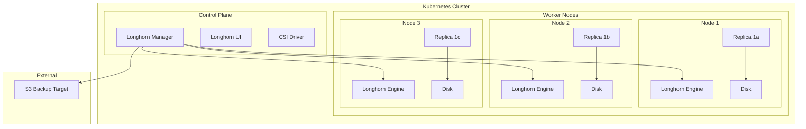

# How to Deploy Longhorn Distributed Storage with Helm on Kubernetes

Author: [nawazdhandala](https://www.github.com/nawazdhandala)

Tags: Helm, Kubernetes, Longhorn, Storage, Persistent Volumes, DevOps, Rancher

Description: Complete guide to deploying Longhorn distributed storage using Helm including replication, snapshots, backups, and disaster recovery configuration.

> Longhorn provides cloud-native distributed block storage for Kubernetes with built-in replication and backup. This guide covers deploying and configuring Longhorn via Helm for reliable persistent storage.

## Longhorn Architecture



## Prerequisites

### System Requirements

```bash
# Check requirements
# Longhorn requires open-iscsi on all nodes

# Ubuntu/Debian
apt-get install -y open-iscsi
systemctl enable --now iscsid

# RHEL/CentOS
yum install -y iscsi-initiator-utils
systemctl enable --now iscsid

# Verify
systemctl status iscsid
```

### Longhorn Environment Check

```bash
# Run environment check
curl -sSfL https://raw.githubusercontent.com/longhorn/longhorn/master/scripts/environment_check.sh | bash
```

## Installation

### Add Helm Repository

```bash
# Add Longhorn repository
helm repo add longhorn https://charts.longhorn.io
helm repo update

# Search available versions
helm search repo longhorn/longhorn --versions
```

### Basic Installation

```bash
# Install Longhorn
helm install longhorn longhorn/longhorn \
  --namespace longhorn-system \
  --create-namespace

# Verify installation
kubectl -n longhorn-system get pods
```

## Production Configuration

### Complete Values File

```yaml
# longhorn-values.yaml

# Longhorn Manager
longhornManager:
  priorityClass: system-cluster-critical
  tolerations:
    - key: "node-role.kubernetes.io/master"
      operator: "Exists"
      effect: "NoSchedule"

# Longhorn Driver
longhornDriver:
  priorityClass: system-cluster-critical
  tolerations:
    - key: "node-role.kubernetes.io/master"
      operator: "Exists"
      effect: "NoSchedule"

# UI Configuration
longhornUI:
  replicas: 2
  priorityClass: system-cluster-critical

# Default Settings
defaultSettings:
  # Backup target (S3, NFS, etc.)
  backupTarget: "s3://longhorn-backups@us-east-1/"
  backupTargetCredentialSecret: longhorn-backup-secret
  
  # Default replica count
  defaultReplicaCount: 3
  
  # Storage over-provisioning
  storageOverProvisioningPercentage: 200
  storageMinimalAvailablePercentage: 10
  
  # Replica soft anti-affinity
  replicaSoftAntiAffinity: true
  replicaAutoBalance: best-effort
  
  # Default data locality
  defaultDataLocality: best-effort
  
  # Node drain policy
  nodeDrainPolicy: block-if-contains-last-replica
  
  # Automatic salvage
  autoSalvage: true
  
  # Guaranteed engine manager CPU
  guaranteedEngineManagerCPU: 12
  guaranteedReplicaManagerCPU: 12
  
  # Snapshot data integrity
  snapshotDataIntegrity: fast-check
  
  # Recurring job settings
  recurringSuccessfulJobsHistoryLimit: 1
  recurringFailedJobsHistoryLimit: 1

# Default Storage Class
persistence:
  defaultClass: true
  defaultClassReplicaCount: 3
  defaultFsType: ext4
  defaultMkfsParams: ""
  defaultDataLocality: best-effort
  reclaimPolicy: Delete
  migratable: false

# CSI Configuration
csi:
  attacherReplicaCount: 3
  provisionerReplicaCount: 3
  resizerReplicaCount: 3
  snapshotterReplicaCount: 3

# Ingress for UI
ingress:
  enabled: true
  ingressClassName: nginx
  host: longhorn.example.com
  tls: true
  tlsSecret: longhorn-tls
  annotations:
    cert-manager.io/cluster-issuer: letsencrypt-prod
    nginx.ingress.kubernetes.io/auth-type: basic
    nginx.ingress.kubernetes.io/auth-secret: longhorn-basic-auth

# Service Monitor for Prometheus
serviceMonitor:
  enabled: true
```

### Create Backup Secret

```bash
# Create S3 backup credentials
kubectl create namespace longhorn-system

kubectl create secret generic longhorn-backup-secret \
  --namespace longhorn-system \
  --from-literal=AWS_ACCESS_KEY_ID=YOUR_ACCESS_KEY \
  --from-literal=AWS_SECRET_ACCESS_KEY=YOUR_SECRET_KEY \
  --from-literal=AWS_ENDPOINTS=https://s3.amazonaws.com
```

### Create UI Auth Secret

```bash
# Create basic auth for UI
USER=admin
PASSWORD=$(openssl rand -base64 12)
htpasswd -bc auth $USER $PASSWORD

kubectl create secret generic longhorn-basic-auth \
  --namespace longhorn-system \
  --from-file=auth

echo "UI Credentials: $USER / $PASSWORD"
```

### Deploy Longhorn

```bash
helm install longhorn longhorn/longhorn \
  -f longhorn-values.yaml \
  --namespace longhorn-system \
  --create-namespace
```

## Storage Classes

### Default Storage Class

```yaml
# Longhorn creates this automatically
apiVersion: storage.k8s.io/v1
kind: StorageClass
metadata:
  name: longhorn
  annotations:
    storageclass.kubernetes.io/is-default-class: "true"
provisioner: driver.longhorn.io
allowVolumeExpansion: true
reclaimPolicy: Delete
volumeBindingMode: Immediate
parameters:
  numberOfReplicas: "3"
  staleReplicaTimeout: "2880"
  fromBackup: ""
  fsType: "ext4"
```

### High Performance Storage Class

```yaml
# longhorn-fast.yaml
apiVersion: storage.k8s.io/v1
kind: StorageClass
metadata:
  name: longhorn-fast
provisioner: driver.longhorn.io
allowVolumeExpansion: true
reclaimPolicy: Delete
volumeBindingMode: Immediate
parameters:
  numberOfReplicas: "2"
  dataLocality: "strict-local"
  diskSelector: "ssd"
  nodeSelector: "storage=fast"
```

### Backup-Enabled Storage Class

```yaml
# longhorn-backup.yaml
apiVersion: storage.k8s.io/v1
kind: StorageClass
metadata:
  name: longhorn-backup
provisioner: driver.longhorn.io
allowVolumeExpansion: true
reclaimPolicy: Retain
volumeBindingMode: Immediate
parameters:
  numberOfReplicas: "3"
  recurringJobSelector: '[{"name":"backup-daily", "isGroup":false}]'
```

## Volume Operations

### Create Volume

```yaml
# pvc.yaml
apiVersion: v1
kind: PersistentVolumeClaim
metadata:
  name: myapp-data
spec:
  accessModes:
    - ReadWriteOnce
  storageClassName: longhorn
  resources:
    requests:
      storage: 10Gi
```

### Volume with Backup Source

```yaml
# pvc-from-backup.yaml
apiVersion: v1
kind: PersistentVolumeClaim
metadata:
  name: myapp-restored
  annotations:
    # Restore from specific backup
    longhorn.io/backup-url: "s3://longhorn-backups@us-east-1/?backup=backup-123&volume=myapp-data"
spec:
  accessModes:
    - ReadWriteOnce
  storageClassName: longhorn
  resources:
    requests:
      storage: 10Gi
```

### Clone Volume

```yaml
# pvc-clone.yaml
apiVersion: v1
kind: PersistentVolumeClaim
metadata:
  name: myapp-clone
spec:
  accessModes:
    - ReadWriteOnce
  storageClassName: longhorn
  resources:
    requests:
      storage: 10Gi
  dataSource:
    kind: PersistentVolumeClaim
    name: myapp-data
```

## Backup Configuration

### Recurring Backup Job

```yaml
# recurring-backup.yaml
apiVersion: longhorn.io/v1beta2
kind: RecurringJob
metadata:
  name: backup-daily
  namespace: longhorn-system
spec:
  cron: "0 2 * * *"
  task: backup
  groups:
    - default
  retain: 7
  concurrency: 1
  labels:
    backup-type: daily
```

### Recurring Snapshot Job

```yaml
# recurring-snapshot.yaml
apiVersion: longhorn.io/v1beta2
kind: RecurringJob
metadata:
  name: snapshot-hourly
  namespace: longhorn-system
spec:
  cron: "0 * * * *"
  task: snapshot
  groups:
    - default
  retain: 24
  concurrency: 2
```

### Apply to Volumes

```yaml
# Apply recurring jobs to volume
apiVersion: v1
kind: PersistentVolumeClaim
metadata:
  name: myapp-data
  labels:
    # Associate with recurring job group
    recurring-job-group.longhorn.io/default: enabled
    recurring-job.longhorn.io/backup-daily: enabled
spec:
  accessModes:
    - ReadWriteOnce
  storageClassName: longhorn
  resources:
    requests:
      storage: 10Gi
```

## Disaster Recovery

### Standby Volume

```yaml
# standby-volume.yaml
apiVersion: longhorn.io/v1beta2
kind: Volume
metadata:
  name: dr-volume
  namespace: longhorn-system
spec:
  # Create from backup
  fromBackup: "s3://longhorn-backups@us-east-1/?backup=backup-123&volume=myapp-data"
  # Mark as standby (read-only)
  standby: true
  numberOfReplicas: 3
```

### Activate Standby Volume

```bash
# Activate for read-write (when primary fails)
kubectl -n longhorn-system patch volume dr-volume \
  --type merge \
  -p '{"spec":{"standby":false}}'
```

## Node Configuration

### Configure Disk Tags

```yaml
# Label nodes for disk selection
kubectl label nodes node1 node.longhorn.io/disk-ssd=true
kubectl label nodes node2 node.longhorn.io/disk-ssd=true
```

### Reserve Disk Space

```yaml
# node-disk-config.yaml
# Via Longhorn UI or kubectl
apiVersion: longhorn.io/v1beta2
kind: Node
metadata:
  name: node1
  namespace: longhorn-system
spec:
  disks:
    default-disk:
      path: /var/lib/longhorn
      allowScheduling: true
      storageReserved: 10737418240  # 10Gi reserved
      tags:
        - ssd
        - fast
```

## Monitoring

### Prometheus Metrics

```yaml
# ServiceMonitor included in values
serviceMonitor:
  enabled: true
```

### Key Metrics

```promql
# Volume size
longhorn_volume_actual_size_bytes

# Volume state
longhorn_volume_state

# Node storage
longhorn_node_storage_capacity_bytes
longhorn_node_storage_usage_bytes

# Replica count
longhorn_volume_robustness

# Backup status
longhorn_backup_state
```

### Grafana Dashboard

```json
{
  "panels": [
    {
      "title": "Volume State",
      "type": "stat",
      "targets": [
        {
          "expr": "count(longhorn_volume_state{state=\"attached\"})",
          "legendFormat": "Attached"
        }
      ]
    },
    {
      "title": "Storage Usage",
      "type": "gauge",
      "targets": [
        {
          "expr": "sum(longhorn_node_storage_usage_bytes) / sum(longhorn_node_storage_capacity_bytes) * 100",
          "legendFormat": "Usage %"
        }
      ]
    }
  ]
}
```

## Troubleshooting

```bash
# Check Longhorn pods
kubectl -n longhorn-system get pods

# View manager logs
kubectl -n longhorn-system logs -l app=longhorn-manager -f

# Check volume status
kubectl -n longhorn-system get volumes.longhorn.io

# View volume details
kubectl -n longhorn-system describe volume myapp-data

# Check replicas
kubectl -n longhorn-system get replicas.longhorn.io

# Check engine status
kubectl -n longhorn-system get engines.longhorn.io

# Verify node status
kubectl -n longhorn-system get nodes.longhorn.io

# Check backup status
kubectl -n longhorn-system get backups.longhorn.io

# Debug CSI
kubectl -n longhorn-system logs -l app=longhorn-csi-plugin -c longhorn-csi-plugin
```

### Common Issues

| Issue | Solution |
|-------|----------|
| Volume stuck attaching | Check iscsid service |
| Replica scheduling failed | Verify node disk space |
| Backup failed | Check S3 credentials |
| Volume degraded | Check replica health |
| Node not schedulable | Check node conditions |

## Best Practices

| Practice | Description |
|----------|-------------|
| 3 Replicas | Default for production |
| Regular Backups | S3/NFS backup target |
| Reserve Storage | 10% minimum available |
| Node Anti-Affinity | Spread replicas |
| Monitor Capacity | Alert before full |
| Test Recovery | Validate backups work |

## Wrap-up

Longhorn provides reliable distributed storage for Kubernetes with built-in replication and backup capabilities. Configure appropriate replica counts for resilience, set up automated backups to S3 or NFS, and use recurring jobs for consistent data protection. Monitor storage capacity and volume health to ensure reliable persistent storage for your applications.
